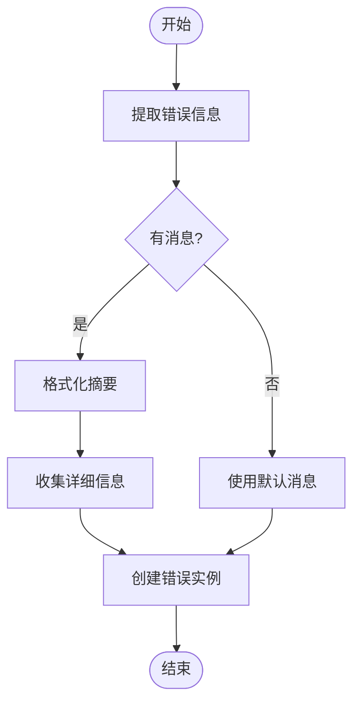
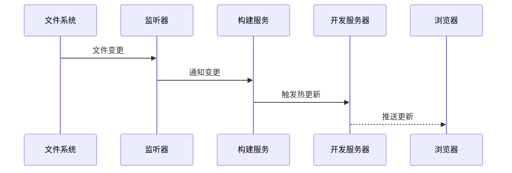
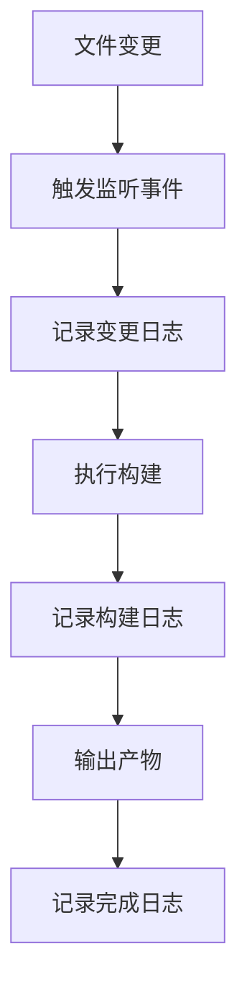

# 调试指南

<cite>
**本文档中引用的文件**  
- [debugger.ts](file://packages/weapp-vite/src/debugger.ts)
- [independentError.ts](file://packages/weapp-vite/src/runtime/independentError.ts)
- [logger.ts](file://packages/weapp-vite/src/logger.ts)
- [watcherPlugin.ts](file://packages/weapp-vite/src/runtime/watcherPlugin.ts)
- [buildPlugin.ts](file://packages/weapp-vite/src/runtime/buildPlugin.ts)
- [autoRoutes.ts](file://packages/weapp-vite/src/plugins/autoRoutes.ts)
- [addModulesHot.ts](file://packages/weapp-vite/src/plugins/utils/addModulesHot.ts)
- [invalidateEntry.ts](file://packages/weapp-vite/src/plugins/utils/invalidateEntry.ts)
- [vite-plugin-performance](file://packages/vite-plugin-performance)
- [website/troubleshoot/index.md](file://website/troubleshoot/index.md)
- [website/guide/debug.md](file://website/guide/debug.md)
</cite>

## 目录
1. [常见错误类型与解决方案](#常见错误类型与解决方案)
2. [调试工具使用方法](#调试工具使用方法)
3. [特定场景调试技巧](#特定场景调试技巧)
4. [内置调试功能与日志记录](#内置调试功能与日志记录)
5. [调试检查清单](#调试检查清单)

## 常见错误类型与解决方案

### 配置错误
配置错误是使用weapp-vite时最常见的问题之一。主要表现为构建产物不完整或运行时行为异常。

**症状**：`dist/` 目录中只有 `.wxml` 文件，缺失 `.js`、`.wxss`、`.json` 等文件。

**可能原因**：
- 页面未在 `app.json.pages` 中注册
- 组件缺少 `json.component = true` 配置
- `custom-tab-bar` 目录位置不正确或 `app.json.tabBar.custom` 未设置为 `true`

**解决方案**：
1. 检查 `app.json` 是否包含相关页面路径
2. 确认组件是否在 `usingComponents` 中声明，并具备同名 `.json` 文件
3. 确保 `custom-tab-bar/` 文件夹与 `app.json` 位于同级目录
4. 使用 `weapp.debug.watchFiles` 输出监听列表确认扫描情况

**预防措施**：在项目初始化时使用官方模板，确保基础配置正确。

### 构建失败
构建失败通常由依赖问题或文件处理异常引起。

**症状**：构建过程中出现错误，无法生成完整的产物。

**可能原因**：
- 引入了不兼容的 UMD/CJS 模块
- 微信开发者工具缓存问题
- 文件路径或命名不符合规范

**解决方案**：
1. 对于 UMD/CJS 模块，将其重命名为 `.cjs` 或使用显式 `require()`
2. 清除微信开发者工具缓存：临时开启「将 JS 编译成 ES5」后关闭并重启工具
3. 删除项目目录下的 `miniprogram_npm` 和 `dist` 目录后重新执行 `pnpm build`

**预防措施**：在引入第三方库时检查其模块格式，优先使用 ESM 格式的库。

### 运行时异常
运行时异常通常在小程序运行过程中出现。

**症状**：小程序运行时崩溃或功能异常。

**可能原因**：
- 独立分包构建失败
- 热更新失效
- 依赖冲突

**解决方案**：
1. 检查独立分包配置是否正确
2. 重启开发服务器
3. 检查依赖版本是否兼容

**Section sources**
- [website/troubleshoot/index.md](file://website/troubleshoot/index.md#L1-L50)

## 调试工具使用方法

### 日志系统
weapp-vite 使用 `@weapp-core/logger` 作为日志系统，基于 `consola` 实现。

**日志类型**：
- `error`：错误信息
- `warn`：警告信息
- `info`：普通信息
- `success`：成功信息

**使用方法**：
```typescript
import logger from '@weapp-core/logger'

logger.info('构建开始')
logger.success('构建完成')
logger.warn('发现潜在问题')
logger.error('构建失败')
```

**日志级别**：可通过配置控制日志输出级别，支持 `silent` 模式完全关闭日志。

**Section sources**
- [logger.ts](file://packages/weapp-vite/src/logger.ts#L1-L6)
- [@weapp-core/logger/src/index.ts](file://@weapp-core/logger/src/index.ts#L1-L4)

### 错误追踪
weapp-vite 提供了完善的错误追踪机制，能够捕获和处理各种构建错误。

**核心功能**：
- 创建独立的构建错误实例
- 提取错误信息和堆栈
- 格式化错误输出



**Diagram sources**
- [independentError.ts](file://packages/weapp-vite/src/runtime/independentError.ts#L1-L159)

**Section sources**
- [independentError.ts](file://packages/weapp-vite/src/runtime/independentError.ts#L1-L159)

### 性能分析
通过 `vite-plugin-performance` 插件可以进行性能分析，测量各个生命周期钩子的执行时间。

**主要特性**：
- 包裹单个或多个 Vite 插件
- 测量生命周期钩子耗时
- 阈值过滤，只显示耗时较长的钩子
- 支持异步钩子

**配置选项**：
| 选项 | 类型 | 默认值 | 说明 |
|------|------|--------|------|
| `hooks` | `PluginHookName[] \| 'all'` | `DEFAULT_PLUGIN_HOOKS` | 指定需要包裹的钩子 |
| `threshold` | `number` | `0` | 耗时阈值（毫秒） |
| `silent` | `boolean` | `false` | 是否关闭日志输出 |
| `logger` | `(message, context) => void` | `console.log` | 自定义日志函数 |
| `formatter` | `(context) => string` | 默认格式 | 自定义日志格式 |
| `onHookExecution` | `(context) => void` | `undefined` | 钩子执行后回调 |

**使用示例**：
```typescript
import { wrapPlugin } from 'vite-plugin-performance'

export default defineConfig({
  plugins: [
    wrapPlugin(Inspect(), {
      threshold: 50,
      onHookExecution({ pluginName, hookName, duration }) {
        reportToAPM({ pluginName, hookName, duration })
      },
    }),
  ],
})
```

**Section sources**
- [vite-plugin-performance/README.md](file://packages/vite-plugin-performance/README.md#L1-L124)
- [vite-plugin-performance/README.zh-CN.md](file://packages/vite-plugin-performance/README.zh-CN.md#L1-L80)

## 特定场景调试技巧

### 分包问题
分包是小程序开发中的常见需求，但也容易出现各种问题。

**常见问题**：
- 分包无法正确加载
- 独立分包构建失败
- 公共代码共享异常

**诊断步骤**：
1. 检查 `app.json` 中的分包配置是否正确
2. 确认分包根目录是否存在
3. 检查分包内的页面是否正确注册

**解决方案**：
- 使用 `weapp.debug.watchFiles` 查看分包文件的监听情况
- 检查独立分包的构建输出
- 确保公共代码的路径引用正确

**预防措施**：在分包配置中明确指定 `independent` 属性，并合理规划公共代码。

### 依赖冲突
依赖冲突可能导致构建失败或运行时异常。

**诊断方法**：
1. 检查 `package.json` 中的依赖版本
2. 使用 `pnpm why` 命令分析依赖关系
3. 查看构建日志中的错误信息

**解决方案**：
- 升级或降级冲突的依赖版本
- 使用 `resolutions` 字段强制指定版本
- 移除不必要的依赖

**预防措施**：定期更新依赖，避免使用过时的库版本。

### 热更新失效
热更新失效会影响开发效率。

**可能原因**：
- 文件监听器未正确工作
- 缓存问题
- 配置错误

**解决方案**：
1. 检查文件监听器状态
2. 清除缓存并重启开发服务器
3. 检查热更新相关配置



**Diagram sources**
- [watcherPlugin.ts](file://packages/weapp-vite/src/runtime/watcherPlugin.ts#L19-L75)
- [buildPlugin.ts](file://packages/weapp-vite/src/runtime/buildPlugin.ts#L176-L232)

**Section sources**
- [watcherPlugin.ts](file://packages/weapp-vite/src/runtime/watcherPlugin.ts#L19-L75)
- [buildPlugin.ts](file://packages/weapp-vite/src/runtime/buildPlugin.ts#L176-L232)

## 内置调试功能与日志记录

### 调试器
weapp-vite 提供了基于 `debug` 库的调试器功能。

**创建调试器**：
```typescript
import { createDebugger } from 'weapp-vite'

const debug = createDebugger('weapp-vite:build')
debug('构建开始')
```

**启用调试**：通过设置环境变量 `DEBUG=weapp-vite:*` 启用所有调试信息。

**Section sources**
- [debugger.ts](file://packages/weapp-vite/src/debugger.ts#L1-L13)

### 日志记录
weapp-vite 在关键流程中都添加了日志记录。

**日志类型**：
- 构建开始/结束
- 文件变更
- 插件执行
- 错误信息

**日志输出**：
- 控制台输出
- 文件记录（可配置）
- 自定义处理器

**示例**：


**Diagram sources**
- [invalidateEntry.ts](file://packages/weapp-vite/src/plugins/utils/invalidateEntry.ts#L426-L456)
- [autoRoutes.ts](file://packages/weapp-vite/src/plugins/autoRoutes.ts#L61-L84)

**Section sources**
- [invalidateEntry.ts](file://packages/weapp-vite/src/plugins/utils/invalidateEntry.ts#L426-L456)
- [autoRoutes.ts](file://packages/weapp-vite/src/plugins/autoRoutes.ts#L61-L84)

## 调试检查清单

### 配置检查
- [ ] `app.json` 页面注册正确
- [ ] 组件配置完整
- [ ] 分包配置正确
- [ ] 环境变量设置正确

### 构建检查
- [ ] 依赖安装完整
- [ ] 构建命令正确
- [ ] 输出目录权限正常
- [ ] 缓存清理

### 运行时检查
- [ ] 小程序基础库版本兼容
- [ ] API 权限配置正确
- [ ] 网络请求域名配置
- [ ] 本地存储使用正常

### 调试工具检查
- [ ] 日志级别设置正确
- [ ] 调试器已启用
- [ ] 性能分析已配置
- [ ] 错误追踪已开启

**Section sources**
- [website/guide/debug.md](file://website/guide/debug.md#L1-L63)
- [website/troubleshoot/index.md](file://website/troubleshoot/index.md#L1-L50)