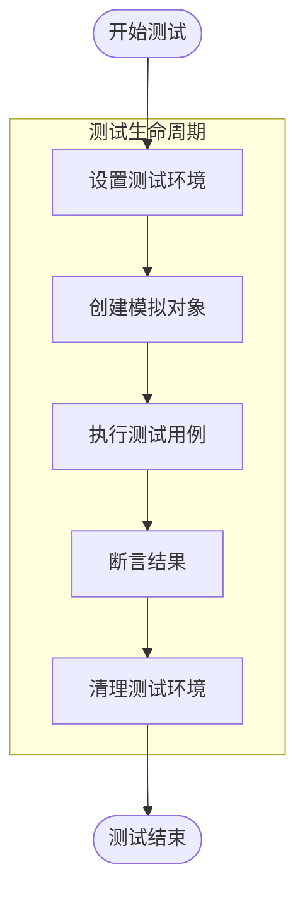
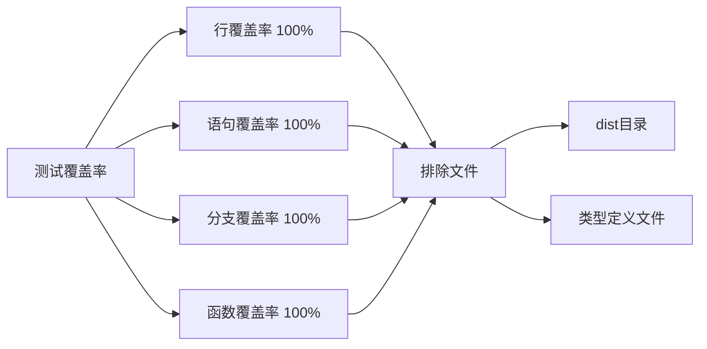
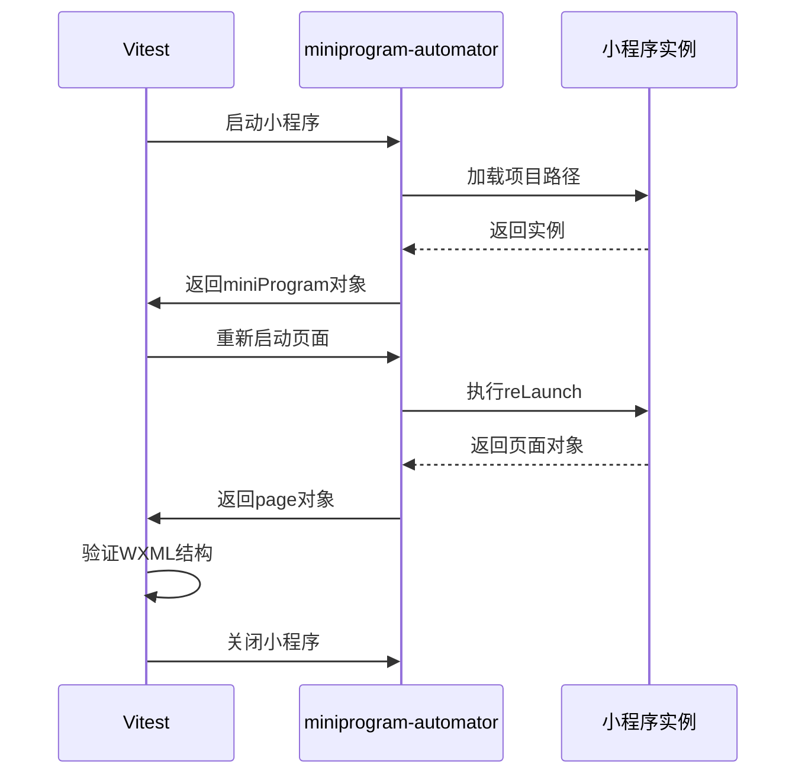
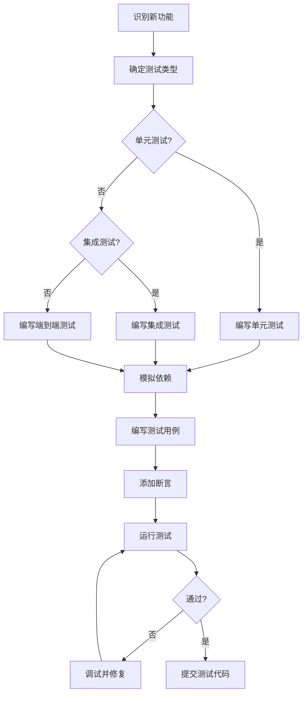
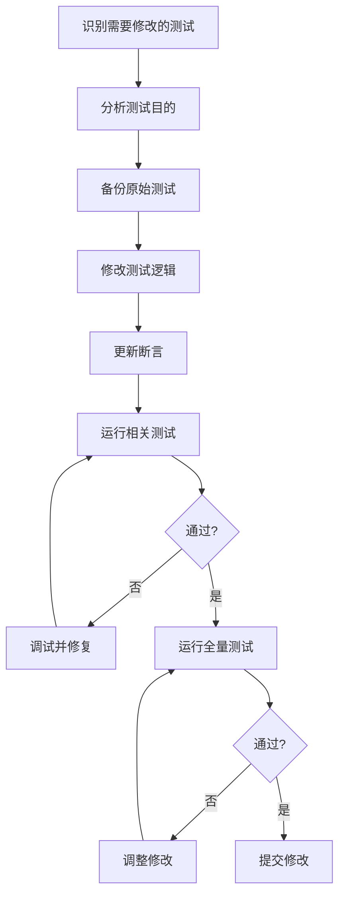
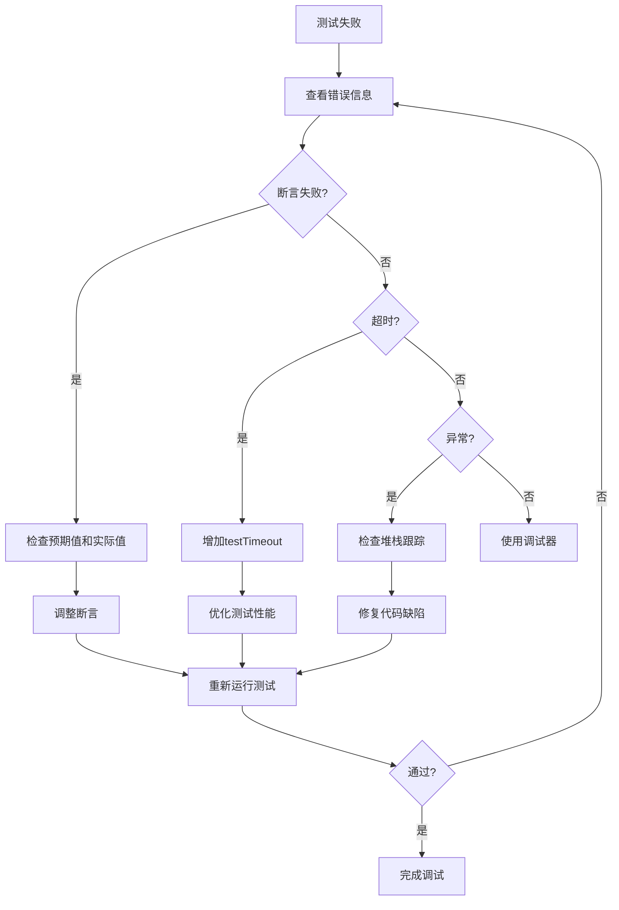
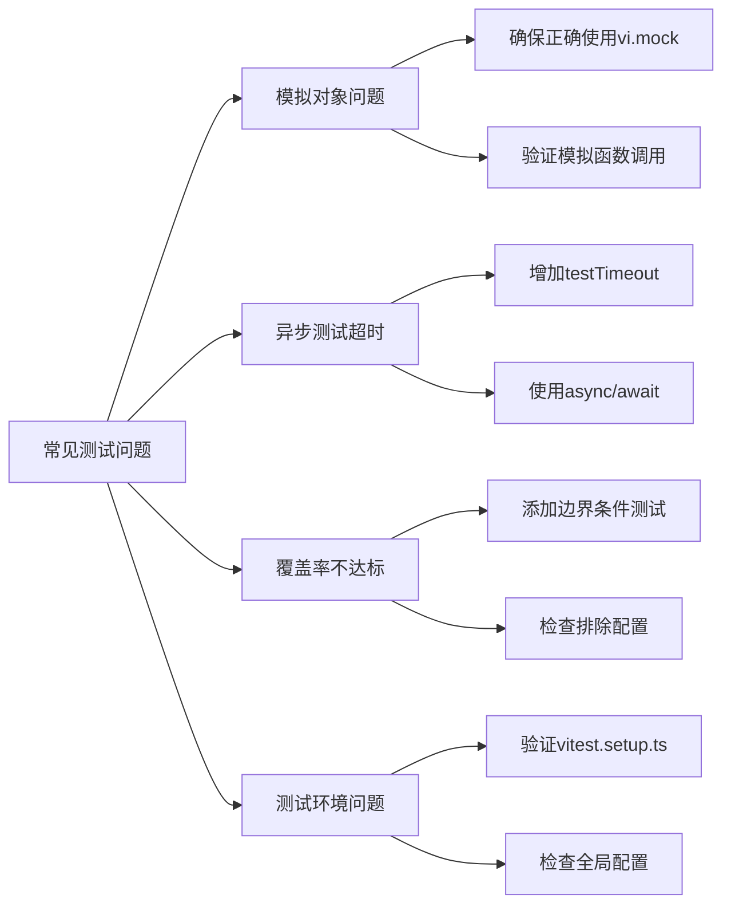
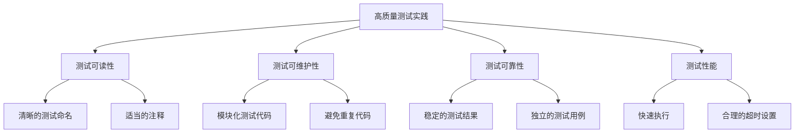

# 测试策略

<cite>
**本文档引用的文件**
- [vitest.config.ts](file://vitest.config.ts)
- [@weapp-core/init/vitest.config.ts](file://@weapp-core/init/vitest.config.ts)
- [@weapp-core/init/vitest.setup.ts](file://@weapp-core/init/vitest.setup.ts)
- [e2e/vitest.e2e.config.ts](file://e2e/vitest.e2e.config.ts)
- [@weapp-core/init/test/index.test.ts](file://@weapp-core/init/test/index.test.ts)
- [@weapp-core/init/test/utils.test.ts](file://@weapp-core/init/test/utils.test.ts)
- [e2e/index.test.ts](file://e2e/index.test.ts)
- [packages/weapp-vite/vitest.config.ts](file://packages/weapp-vite/vitest.config.ts)
- [packages/weapp-vite/test/index.test.ts](file://packages/weapp-vite/test/index.test.ts)
- [@weapp-core/shared/test/index.test.ts](file://@weapp-core/shared/test/index.test.ts)
</cite>

## 目录
1. [引言](#引言)
2. [测试框架概述](#测试框架概述)
3. [测试文件组织结构](#测试文件组织结构)
4. [单元测试与集成测试](#单元测试与集成测试)
5. [测试覆盖率要求](#测试覆盖率要求)
6. [端到端测试](#端到端测试)
7. [为新功能添加测试](#为新功能添加测试)
8. [修改现有测试](#修改现有测试)
9. [测试调试技巧](#测试调试技巧)
10. [常见测试问题解决方案](#常见测试问题解决方案)
11. [高质量测试实践标准](#高质量测试实践标准)

## 引言
本测试策略文档旨在为weapp-vite项目的贡献者提供全面的测试指导。文档详细介绍了Vitest测试框架的使用方法，涵盖了从单元测试到端到端测试的各个方面。通过遵循本文档中的实践标准，贡献者可以确保代码质量和稳定性，同时提高开发效率。

## 测试框架概述
weapp-vite项目采用Vitest作为主要的测试框架，这是一个专为Vite构建的极速单元测试框架。项目中的测试配置通过`vitest.config.ts`文件进行管理，该文件定义了全局的测试设置和项目范围。

```mermaid
graph TD
A[Vitest测试框架] --> B[单元测试]
A --> C[集成测试]
A --> D[端到端测试]
B --> E[@weapp-core模块]
C --> F[packages模块]
D --> G[e2e测试]
```

**Diagram sources**
- [vitest.config.ts](file://vitest.config.ts#L1-L124)

**Section sources**
- [vitest.config.ts](file://vitest.config.ts#L1-L124)

## 测试文件组织结构
测试文件遵循清晰的组织结构，每个模块的测试文件都位于其`test`目录下。测试文件的命名遵循`*.test.ts`或`*.spec.ts`模式，确保测试文件易于识别。

```mermaid
graph TD
A[项目根目录] --> B[@weapp-core]
A --> C[packages]
A --> D[e2e]
B --> E[init]
E --> F[test]
F --> G[*.test.ts]
C --> H[weapp-vite]
H --> I[test]
I --> J[*.test.ts]
D --> K[index.test.ts]
```

**Diagram sources**
- [@weapp-core/init/test/index.test.ts](file://@weapp-core/init/test/index.test.ts#L1-L60)
- [packages/weapp-vite/test/index.test.ts](file://packages/weapp-vite/test/index.test.ts#L1-L13)

**Section sources**
- [@weapp-core/init/test/index.test.ts](file://@weapp-core/init/test/index.test.ts#L1-L60)
- [packages/weapp-vite/test/index.test.ts](file://packages/weapp-vite/test/index.test.ts#L1-L13)

## 单元测试与集成测试
单元测试和集成测试是weapp-vite项目质量保证的核心。测试使用Vitest提供的`describe`、`it`、`expect`等API来组织和断言测试用例。



**Diagram sources**
- [@weapp-core/init/test/index.test.ts](file://@weapp-core/init/test/index.test.ts#L1-L60)
- [@weapp-core/init/test/utils.test.ts](file://@weapp-core/init/test/utils.test.ts#L1-L91)

**Section sources**
- [@weapp-core/init/test/index.test.ts](file://@weapp-core/init/test/index.test.ts#L1-L60)
- [@weapp-core/init/test/utils.test.ts](file://@weapp-core/init/test/utils.test.ts#L1-L91)

## 测试覆盖率要求
weapp-vite项目对测试覆盖率有严格的要求，确保代码的稳定性和可靠性。覆盖率配置在各个模块的`vitest.config.ts`文件中定义。



**Diagram sources**
- [@weapp-core/init/vitest.config.ts](file://@weapp-core/init/vitest.config.ts#L1-L32)
- [packages/weapp-vite/vitest.config.ts](file://packages/weapp-vite/vitest.config.ts#L1-L28)

**Section sources**
- [@weapp-core/init/vitest.config.ts](file://@weapp-core/init/vitest.config.ts#L1-L32)
- [packages/weapp-vite/vitest.config.ts](file://packages/weapp-vite/vitest.config.ts#L1-L28)

## 端到端测试
端到端测试使用miniprogram-automator工具来模拟小程序的运行环境，确保应用在真实环境中的行为符合预期。



**Diagram sources**
- [e2e/index.test.ts](file://e2e/index.test.ts#L1-L41)
- [e2e/vitest.e2e.config.ts](file://e2e/vitest.e2e.config.ts#L1-L21)

**Section sources**
- [e2e/index.test.ts](file://e2e/index.test.ts#L1-L41)
- [e2e/vitest.e2e.config.ts](file://e2e/vitest.e2e.config.ts#L1-L21)

## 为新功能添加测试
为新功能添加测试时，应遵循以下步骤确保测试的完整性和有效性。



**Section sources**
- [@weapp-core/init/test/index.test.ts](file://@weapp-core/init/test/index.test.ts#L1-L60)
- [packages/weapp-vite/test/index.test.ts](file://packages/weapp-vite/test/index.test.ts#L1-L13)

## 修改现有测试
当需要修改现有测试时，应遵循特定的流程来确保修改的正确性和兼容性。



**Section sources**
- [@weapp-core/init/test/utils.test.ts](file://@weapp-core/init/test/utils.test.ts#L1-L91)
- [@weapp-core/shared/test/index.test.ts](file://@weapp-core/shared/test/index.test.ts#L1-L63)

## 测试调试技巧
有效的测试调试技巧可以帮助开发者快速定位和解决问题。



**Section sources**
- [@weapp-core/init/vitest.setup.ts](file://@weapp-core/init/vitest.setup.ts#L1-L19)
- [packages/weapp-vite/vitest.config.ts](file://packages/weapp-vite/vitest.config.ts#L1-L28)

## 常见测试问题解决方案
本节提供了一些常见测试问题的解决方案，帮助开发者快速应对挑战。



**Section sources**
- [@weapp-core/init/vitest.setup.ts](file://@weapp-core/init/vitest.setup.ts#L1-L19)
- [@weapp-core/init/vitest.config.ts](file://@weapp-core/init/vitest.config.ts#L1-L32)

## 高质量测试实践标准
为了确保weapp-vite项目的测试质量，所有贡献者应遵循以下实践标准。



**Section sources**
- [@weapp-core/init/test/index.test.ts](file://@weapp-core/init/test/index.test.ts#L1-L60)
- [packages/weapp-vite/test/index.test.ts](file://packages/weapp-vite/test/index.test.ts#L1-L13)
- [@weapp-core/shared/test/index.test.ts](file://@weapp-core/shared/test/index.test.ts#L1-L63)