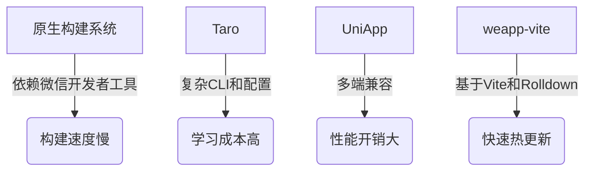

# 从其他工具迁移

<cite>
**本文档中引用的文件**  
- [vite.config.ts](file://vite.config.ts)
- [package.json](file://package.json)
- [project.config.json](file://project.config.json)
- [tsconfig.json](file://tsconfig.json)
- [weapp-vite-template/vite.config.ts](file://templates/weapp-vite-template/vite.config.ts)
- [manual-integration.md](file://website/guide/manual-integration.md)
- [directory-structure.md](file://website/guide/directory-structure.md)
- [migration/v5.md](file://website/migration/v5.md)
</cite>

## 目录
1. [引言](#引言)
2. [主流小程序构建工具与weapp-vite的架构差异](#主流小程序构建工具与weapp-vite的架构差异)
3. [从原生构建系统迁移](#从原生构建系统迁移)
4. [从Taro迁移](#从taro迁移)
5. [从UniApp迁移](#从uniapp迁移)
6. [从其他Vite小程序插件迁移](#从其他vite小程序插件迁移)
7. [迁移检查清单](#迁移检查清单)
8. [最佳实践与常见陷阱](#最佳实践与常见陷阱)

## 引言
weapp-vite 是一个现代化的小程序打包工具，旨在为小程序开发提供更快的构建速度和更流畅的开发体验。本文档旨在为开发者提供从其他主流构建工具迁移到 weapp-vite 的详细指南，涵盖架构差异分析、具体迁移路径、配置转换、代码调整以及迁移过程中的最佳实践。

## 主流小程序构建工具与weapp-vite的架构差异
weapp-vite 与其他小程序构建工具在架构上存在显著差异。它基于 Vite 和 Rolldown 生态，提供了更快的热更新和构建速度。weapp-vite 通过 `vite.config.ts` 进行配置，支持 TypeScript，并提供了丰富的插件系统。相比之下，原生构建系统依赖微信开发者工具，构建速度较慢；Taro 和 UniApp 则通过各自的 CLI 和配置文件进行管理，架构更为复杂。



**Diagram sources**
- [vite.config.ts](file://vite.config.ts)
- [migration/v5.md](file://website/migration/v5.md)

## 从原生构建系统迁移
从原生构建系统迁移到 weapp-vite 需要进行项目结构转换、配置文件迁移和依赖管理调整。

### 项目结构转换
将原生小程序的源码移动到 `src/` 目录下，并按照 weapp-vite 的目录结构进行组织。确保 `app.*`、`pages/`、`components/` 等文件位于 `src/` 目录下。

### 配置文件迁移
创建 `vite.config.ts` 文件，并配置 `weapp.srcRoot` 指向 `src/` 目录。更新 `project.config.json` 中的 `miniprogramRoot` 指向 `dist/` 目录。

```ts
import { defineConfig } from 'weapp-vite/config'

export default defineConfig({
  weapp: {
    srcRoot: 'src',
  },
})
```

**Section sources**
- [vite.config.ts](file://vite.config.ts)
- [project.config.json](file://project.config.json)

## 从Taro迁移
从 Taro 迁移到 weapp-vite 需要处理 Taro 特有的语法和 API，并替换相应的插件和依赖。

### 处理Taro特有语法
Taro 使用 `@tarojs/components` 和 `@tarojs/taro` 等特有 API。在迁移过程中，需要将这些 API 替换为原生小程序的 API 或 weapp-vite 支持的等效实现。

### 替换插件和依赖
移除 Taro 相关的依赖，如 `@tarojs/cli`、`@tarojs/components` 等，并安装 weapp-vite 相关的依赖，如 `weapp-vite`、`vite` 等。

**Section sources**
- [package.json](file://package.json)
- [vite.config.ts](file://vite.config.ts)

## 从UniApp迁移
从 UniApp 迁移到 weapp-vite 需要处理 UniApp 特有的语法和 API，并调整项目结构。

### 处理UniApp特有语法
UniApp 使用 `uni.xxx` API 和 `pages.json` 配置文件。在迁移过程中，需要将 `uni.xxx` API 替换为原生小程序的 API，并将 `pages.json` 的配置迁移到 `app.json` 中。

### 调整项目结构
将 UniApp 项目的源码移动到 `src/` 目录下，并按照 weapp-vite 的目录结构进行组织。

**Section sources**
- [app.json](file://src/app.json)
- [vite.config.ts](file://vite.config.ts)

## 从其他Vite小程序插件迁移
从其他 Vite 小程序插件迁移到 weapp-vite 需要注意配置兼容性和插件替换方案。

### 配置兼容性
检查现有 Vite 配置文件的兼容性，确保 `vite.config.ts` 中的配置项与 weapp-vite 兼容。特别是 `weapp` 配置项，需要按照 weapp-vite 的规范进行调整。

### 插件替换方案
替换不兼容的 Vite 插件，使用 weapp-vite 支持的插件。例如，使用 `weapp-tailwindcss` 替代其他 Tailwind CSS 插件。

**Section sources**
- [vite.config.ts](file://vite.config.ts)
- [package.json](file://package.json)

## 迁移检查清单
- [ ] 确认 Node.js 版本 ≥ 20.19.0
- [ ] 安装 pnpm 并全局配置
- [ ] 创建 `vite.config.ts` 文件并配置 `weapp.srcRoot`
- [ ] 更新 `project.config.json` 中的 `miniprogramRoot`
- [ ] 安装 weapp-vite 相关依赖
- [ ] 调整项目结构，将源码移动到 `src/` 目录
- [ ] 处理特有语法和 API
- [ ] 替换不兼容的插件和依赖
- [ ] 验证开发和构建命令

**Section sources**
- [vite.config.ts](file://vite.config.ts)
- [package.json](file://package.json)
- [project.config.json](file://project.config.json)

## 最佳实践与常见陷阱
- **最佳实践**：使用 `weapp-vite generate` 命令快速生成页面和组件，保持项目结构清晰。
- **常见陷阱**：忽略 `weapp.srcRoot` 配置，导致构建失败；未正确处理特有语法，导致运行时错误。

**Section sources**
- [vite.config.ts](file://vite.config.ts)
- [manual-integration.md](file://website/guide/manual-integration.md)