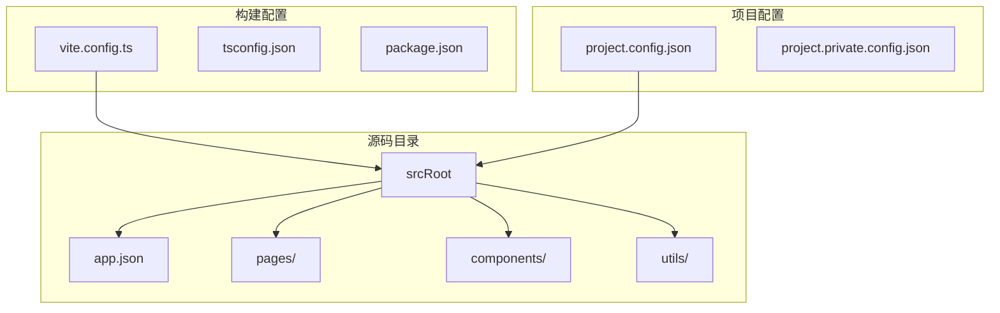
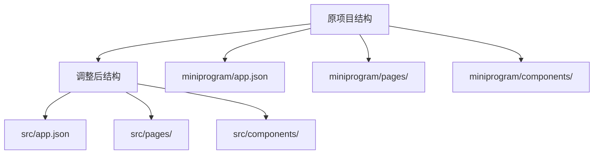
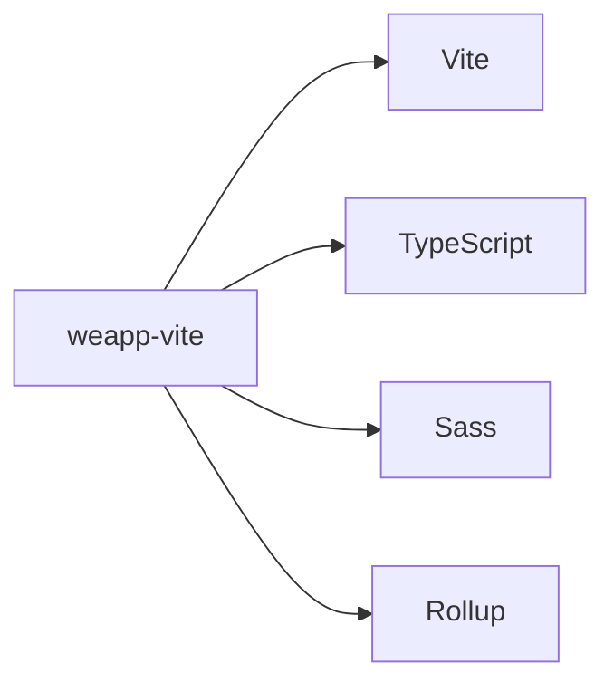

# 从原生迁移

<cite>
**本文档中引用的文件**  
- [vite.config.ts](file://vite.config.ts)
- [project.config.json](file://project.config.json)
- [app.json](file://app.json)
- [app.ts](file://app.ts)
- [app.wxss](file://app.wxss)
- [index.ts](file://miniprogram/pages/index/index.ts)
- [HelloWorld.json](file://miniprogram/components/HelloWorld/HelloWorld.json)
- [manual-integration.md](file://website/guide/manual-integration.md)
- [index.md](file://website/guide/index.md)
- [config/index.md](file://website/config/index.md)
</cite>

## 目录
1. [介绍](#介绍)
2. [项目结构](#项目结构)
3. [核心组件](#核心组件)
4. [架构概述](#架构概述)
5. [详细组件分析](#详细组件分析)
6. [依赖分析](#依赖分析)
7. [性能考虑](#性能考虑)
8. [故障排除指南](#故障排除指南)
9. [结论](#结论)

## 介绍
本文档旨在为从原生微信小程序开发环境迁移到 weapp-vite 提供详细的迁移指南。weapp-vite 是一个现代化的小程序打包工具，它通过集成 Vite 构建系统，提供了更快的开发构建速度、热模块替换（HMR）、TypeScript 支持以及更灵活的配置选项。本指南将涵盖迁移的整体流程、配置文件转换、代码结构调整、构建流程变更以及常见问题的解决方案。

## 项目结构
weapp-vite 项目遵循模块化和现代化的前端工程结构，支持 TypeScript、SCSS 等现代开发技术，并通过 Vite 实现高效的开发构建体验。项目通常包含源码目录（如 `src` 或 `miniprogram`）、构建配置文件（`vite.config.ts`）、项目配置文件（`project.config.json`）以及必要的依赖管理文件。



**Diagram sources**
- [vite.config.ts](file://vite.config.ts#L1-L52)
- [project.config.json](file://project.config.json#L1-L44)

**Section sources**
- [vite.config.ts](file://vite.config.ts#L1-L52)
- [project.config.json](file://project.config.json#L1-L44)

## 核心组件
weapp-vite 的核心组件包括构建配置系统、源码根目录管理、自动组件导入、分包支持、Worker 支持等。这些功能通过 `vite.config.ts` 中的 `weapp` 配置项进行定义和控制，允许开发者灵活地定制构建流程。

**Section sources**
- [vite.config.ts](file://vite.config.ts#L1-L52)
- [config/index.md](file://website/config/index.md#L1-L48)

## 架构概述
weapp-vite 的架构基于 Vite 构建系统，利用其原生 ES 模块支持和依赖预构建能力，实现了快速的开发服务器启动和热更新。在小程序环境中，weapp-vite 通过自定义插件和配置，将小程序特有的文件结构（如 WXML、WXSS、JSON 配置）与现代前端工具链无缝集成。


**Diagram sources**
- [vite.config.ts](file://vite.config.ts#L1-L52)
- [index.md](file://website/guide/index.md#L1-L269)

## 详细组件分析

### 配置文件迁移
在从原生小程序迁移到 weapp-vite 时，关键的配置文件需要进行转换和调整。主要包括 `project.config.json` 和 `app.json` 等文件的迁移。

#### project.config.json 迁移
原生小程序的 `project.config.json` 文件用于定义项目的基本信息和构建设置。在 weapp-vite 中，该文件仍然保留，但部分构建相关的配置将由 `vite.config.ts` 管理。

```json
{
  "miniprogramRoot": "dist/",
  "compileType": "miniprogram",
  "appid": "tour-app-id",
  "setting": {
    "es6": true,
    "minified": true
  }
}
```

**Diagram sources**
- [project.config.json](file://project.config.json#L1-L44)

#### app.json 迁移
`app.json` 是小程序的全局配置文件，定义了页面路径、窗口样式、网络超时时间等。在 weapp-vite 中，该文件的位置可能需要调整到 `src` 目录下，并通过 `vite.config.ts` 中的 `srcRoot` 指定源码根目录。

```json
{
  "pages": [
    "pages/index/index",
    "pages/test/require"
  ],
  "window": {
    "navigationBarTextStyle": "black",
    "navigationBarTitleText": "Weixin",
    "navigationBarBackgroundColor": "#ffffff"
  }
}
```

**Diagram sources**
- [app.json](file://app.json#L1-L21)

#### vite.config.ts 配置
`vite.config.ts` 是 weapp-vite 的核心配置文件，替代了原生构建系统中的大部分配置功能。通过 `defineConfig` 函数，可以定义 `weapp` 专属配置项，如 `srcRoot`、`autoImportComponents`、`generate` 等。

```ts
import { defineConfig } from 'weapp-vite/config'

export default defineConfig({
  weapp: {
    srcRoot: './miniprogram',
    autoImportComponents: {
      globs: ['components/**/*'],
    },
    generate: {
      dirs: {
        component: './miniprogram/components',
      },
    },
  },
})
```

**Diagram sources**
- [vite.config.ts](file://vite.config.ts#L1-L52)

**Section sources**
- [vite.config.ts](file://vite.config.ts#L1-L52)
- [app.json](file://app.json#L1-L21)
- [project.config.json](file://project.config.json#L1-L44)

### 代码结构调整
迁移过程中，代码结构需要进行调整以适应 weapp-vite 的构建流程。通常建议将源码集中到 `src` 目录下，并通过 `vite.config.ts` 中的 `srcRoot` 指定该目录。

#### 源码目录迁移
将原生小程序的 `app.*`、`pages/`、`components/` 等文件移动到 `src` 目录下，并更新 `vite.config.ts` 中的 `srcRoot` 配置。



**Diagram sources**
- [vite.config.ts](file://vite.config.ts#L1-L52)

#### 自动组件导入
weapp-vite 支持自动导入组件，无需手动在每个页面的 JSON 文件中声明 `usingComponents`。通过配置 `autoImportComponents`，可以指定扫描组件的 glob 模式。

```ts
weapp: {
  autoImportComponents: {
    globs: ['components/**/*'],
  },
}
```

**Diagram sources**
- [vite.config.ts](file://vite.config.ts#L1-L52)
- [HelloWorld.json](file://miniprogram/components/HelloWorld/HelloWorld.json#L1-L6)

**Section sources**
- [vite.config.ts](file://vite.config.ts#L1-L52)
- [HelloWorld.json](file://miniprogram/components/HelloWorld/HelloWorld.json#L1-L6)

## 依赖分析
weapp-vite 项目依赖于 Vite 构建系统及其生态系统，同时需要安装 `weapp-vite` 核心包和其他开发依赖。



**Diagram sources**
- [package.json](file://package.json#L1-L10)

**Section sources**
- [package.json](file://package.json#L1-L10)
- [vite.config.ts](file://vite.config.ts#L1-L52)

## 性能考虑
weapp-vite 通过 Vite 的依赖预构建和原生 ES 模块支持，显著提升了开发构建速度。在生产构建中，建议启用代码压缩和 Tree Shaking 以优化包大小。

## 故障排除指南
在迁移过程中，可能会遇到路径别名、静态资源引用、分包配置等问题。建议参考官方文档中的 [手动集成指南](file://website/guide/manual-integration.md) 和 [配置索引](file://website/config/index.md) 进行排查和解决。

**Section sources**
- [manual-integration.md](file://website/guide/manual-integration.md#L1-L134)
- [config/index.md](file://website/config/index.md#L1-L48)

## 结论
通过本文档的指导，开发者可以顺利地将原生小程序项目迁移到 weapp-vite，享受现代化的开发体验和高效的构建流程。建议在迁移前充分阅读相关文档，并在测试环境中验证迁移效果。