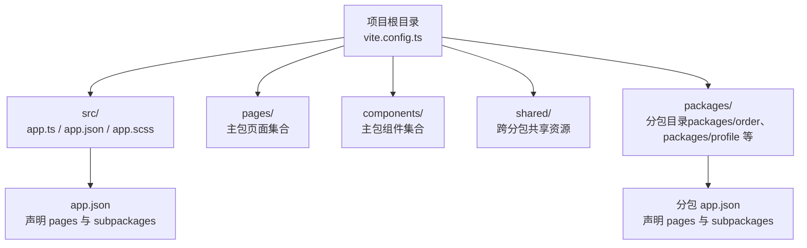
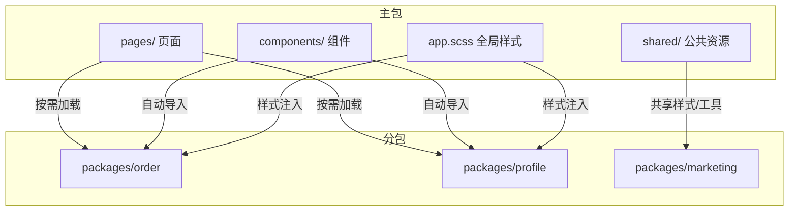
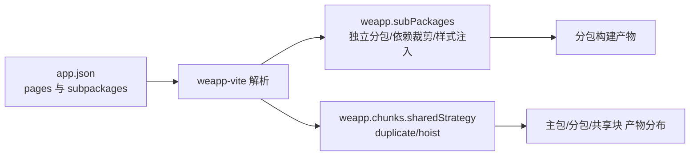

# 主包配置

<cite>
**本文引用的文件**
- [apps/vite-native/vite.config.ts](file://apps/vite-native/vite.config.ts)
- [apps/subpackage-shared-chunks/vite.config.ts](file://apps/subpackage-shared-chunks/vite.config.ts)
- [apps/vite-native/src/app.json](file://apps/vite-native/src/app.json)
- [apps/subpackage-shared-chunks/src/app.json](file://apps/subpackage-shared-chunks/src/app.json)
- [website/guide/directory-structure.md](file://website/guide/directory-structure.md)
- [website/guide/subpackage.md](file://website/guide/subpackage.md)
- [website/config/subpackages.md](file://website/config/subpackages.md)
- [docs/subpackages.md](file://docs/subpackages.md)
</cite>

## 目录
1. [简介](#简介)
2. [项目结构](#项目结构)
3. [核心组件](#核心组件)
4. [架构总览](#架构总览)
5. [详细组件分析](#详细组件分析)
6. [依赖分析](#依赖分析)
7. [性能考量](#性能考量)
8. [故障排查指南](#故障排查指南)
9. [结论](#结论)
10. [附录](#附录)

## 简介
本章节围绕 weapp-vite 中“主包”的配置方法与最佳实践展开，重点说明主包在分包架构中的角色与职责，包括主包页面、公共组件、基础样式与静态资源的组织方式；并结合配置文件定义主包页面、组件与静态资源的方法，给出优化主包体积以提升小程序启动性能的策略。文档同时覆盖主包与子包之间的依赖关系管理、公共资源的提取与共享策略，并解释这些配置对小程序启动时间与首屏加载性能的影响及优化建议。

## 项目结构
weapp-vite 建议将主包的核心资源置于 src/ 根目录下，遵循原生小程序的 app.*、pages/、components/、shared/ 等约定，辅以 packages/ 作为分包容器。主包的页面与组件默认由框架自动路由与自动导入组件能力支撑，分包通过 app.json 的 subpackages 字段声明，再在 weapp-vite 的 weapp.subPackages 中进行精细化编译与共享配置。

图表来源
- [website/guide/directory-structure.md](file://website/guide/directory-structure.md#L1-L85)

章节来源
- [website/guide/directory-structure.md](file://website/guide/directory-structure.md#L1-L85)

## 核心组件
- 主包页面与组件
  - 主包页面位于 pages/，每个页面目录包含页面脚本、WXML、JSON、样式等文件；默认自动路由策略会把 pages/**/index 视为主包页面入口。
  - 主包组件位于 components/，所有 .wxml 组件默认自动导入，无需手写 usingComponents；推荐将复用组件放于此处，框架也为每个分包生成 subPackages/<root>/components/**/*.wxml 的默认扫描规则。
- 主包基础样式与全局样式
  - app.scss 作为全局样式入口，支持多种预处理器；主包样式可与分包共享，也可通过 weapp.subPackages[].styles 为分包注入共享样式。
- 主包静态资源
  - public/ 目录下的静态资源会直接拷贝到 dist 输出目录，适合存放 sitemap.json、theme.json 等模板文件。

章节来源
- [website/guide/directory-structure.md](file://website/guide/directory-structure.md#L37-L85)

## 架构总览
主包在分包架构中的职责：
- 保持最小化：首屏只保留必要页面与基座逻辑，其余业务模块放入分包。
- 提供公共能力：公共组件、工具模块、基础样式与设计令牌集中于主包或 shared/，通过 weapp-vite 的共享策略与样式注入能力实现跨分包复用。
- 依赖治理：通过 weapp.subPackages[].dependencies 精确裁剪 miniprogram_npm 依赖，避免主包依赖泄漏到分包。
- 首屏优化：结合 preloadRule、lazyCodeLoading 与 chunks.sharedStrategy，控制首屏体积与加载路径。

图表来源
- [website/guide/directory-structure.md](file://website/guide/directory-structure.md#L49-L85)
- [website/guide/subpackage.md](file://website/guide/subpackage.md#L1-L244)
- [website/config/subpackages.md](file://website/config/subpackages.md#L1-L112)

章节来源
- [website/guide/subpackage.md](file://website/guide/subpackage.md#L1-L244)
- [website/config/subpackages.md](file://website/config/subpackages.md#L1-L112)
- [docs/subpackages.md](file://docs/subpackages.md#L1-L151)

## 详细组件分析

### 主包页面与组件的配置与组织
- 页面组织
  - 主包页面采用 pages/**/index 结构，框架默认自动路由策略会把 pages/**/index 视为主包页面入口，并同步生成路由类型。
- 组件组织
  - 主包组件 components/**/ 下的 .wxml 组件默认自动导入，无需手写 usingComponents；分包侧也具备 subPackages/<root>/components/**/*.wxml 的默认扫描规则，便于跨分包复用。
- 自动导入组件
  - 可通过 weapp.autoImportComponents 配置组件扫描范围与解析器，主包与分包可分别定制自动导入策略，避免相互干扰。

章节来源
- [website/guide/directory-structure.md](file://website/guide/directory-structure.md#L49-L85)

### 主包基础样式与公共资源的提取与共享
- 全局样式
  - app.scss 作为全局样式入口，支持多种预处理器；主包样式可与分包共享，也可通过 weapp.subPackages[].styles 为分包注入共享样式。
- 样式共享
  - 通过 weapp.subPackages[].styles 可声明共享样式入口（支持 .wxss/.css/.scss/.sass/.less/.styl(us)），并可使用 scope/include/exclude 精准控制注入范围。
  - 普通分包与主包共享 Rolldown 上下文，样式产物只生成一次并在分包页面/组件头部自动注入 @import；独立分包会在专属上下文重新编译同一份源文件，保持样式同步。

章节来源
- [website/guide/directory-structure.md](file://website/guide/directory-structure.md#L65-L85)
- [website/guide/subpackage.md](file://website/guide/subpackage.md#L160-L200)
- [website/config/subpackages.md](file://website/config/subpackages.md#L81-L112)

### 主包静态资源与生成配置
- 静态资源
  - public/ 目录下的静态资源会直接拷贝到 dist 输出目录，适合存放 sitemap.json、theme.json 等模板文件。
- 生成配置
  - 可通过 weapp.generate 配置生成的文件扩展名、目录与文件名，主包与分包可分别定制生成策略，确保输出结构清晰、可维护。

章节来源
- [website/guide/directory-structure.md](file://website/guide/directory-structure.md#L28-L46)
- [website/guide/directory-structure.md](file://website/guide/directory-structure.md#L80-L85)

### 主包与子包之间的依赖关系管理
- 依赖裁剪
  - 通过 weapp.subPackages[].dependencies 精确控制分包打包到 miniprogram_npm 的依赖列表，未匹配的依赖会被剔除，避免主包依赖泄漏到分包。
- 独立分包
  - 独立分包运行在独立上下文，无法直接访问主包全局数据；独立分包中不能依赖主包或其他分包的内容（使用分包异步化时 js 文件、自定义组件、插件不受此条限制）。
- 分包预加载与异步化
  - 在 app.json 的 preloadRule 中声明触发页、目标分包、网络条件与超时时间；启用 lazyCodeLoading: "requiredComponents"，避免一次性加载所有自定义组件代码，按需拉取非首屏模块。

章节来源
- [website/guide/subpackage.md](file://website/guide/subpackage.md#L151-L207)
- [website/config/subpackages.md](file://website/config/subpackages.md#L81-L112)
- [docs/subpackages.md](file://docs/subpackages.md#L18-L142)

### 主包体积优化与启动性能提升
- 保持主包最小化
  - 首屏只保留必要页面与基座逻辑，其余业务模块放入分包；通过 weapp.chunks.sharedStrategy 控制跨包共享代码策略，兼顾首屏性能与整体包体控制。
- 共享策略
  - duplicate 策略：跨分包共享模块复制到各自分包的 __shared__/common.js，降低首开时回主包拉取的开销；hoist 策略：统一提炼到主包 common.js，减少重复体积，但可能增加首开时的依赖拉取。
- 预加载与异步化
  - 结合 preloadRule 与 lazyCodeLoading，缩短首屏等待时间并降低非首屏模块的初始加载压力。
- 分析与监控
  - 使用 weapp-vite analyze 脚本输出分包报告，定位共享依赖与重复模块，指导后续优化。

章节来源
- [website/guide/subpackage.md](file://website/guide/subpackage.md#L28-L113)
- [docs/subpackages.md](file://docs/subpackages.md#L18-L142)

## 依赖分析
主包与分包的依赖关系主要通过 app.json 与 weapp-vite 的配置共同决定。app.json 决定页面与分包结构，weapp-vite 的 weapp.subPackages 与 weapp.chunks 则负责编译期的依赖裁剪、共享策略与产物分布。

图表来源
- [website/guide/subpackage.md](file://website/guide/subpackage.md#L1-L244)
- [website/config/subpackages.md](file://website/config/subpackages.md#L1-L112)
- [docs/subpackages.md](file://docs/subpackages.md#L1-L151)

章节来源
- [website/guide/subpackage.md](file://website/guide/subpackage.md#L1-L244)
- [website/config/subpackages.md](file://website/config/subpackages.md#L1-L112)
- [docs/subpackages.md](file://docs/subpackages.md#L1-L151)

## 性能考量
- 启动时间与首屏加载
  - 主包体积直接影响小程序启动时间与首屏加载性能；通过将非首屏业务放入分包、裁剪依赖、启用懒加载与预加载策略，可有效缩短首屏等待时间。
- 共享策略权衡
  - duplicate 策略在首屏性能上更有优势，hoist 策略在整体包体控制上更优；可根据项目实际情况选择合适的策略，并结合 duplicateWarningBytes 设置冗余体积告警阈值。
- 样式注入与按需加载
  - 通过 weapp.subPackages[].styles 为分包注入共享样式，避免重复 @import；结合 lazyCodeLoading 与动态组件，减少不必要的资源加载。

章节来源
- [website/guide/subpackage.md](file://website/guide/subpackage.md#L28-L113)
- [website/guide/subpackage.md](file://website/guide/subpackage.md#L160-L200)
- [website/config/subpackages.md](file://website/config/subpackages.md#L81-L112)
- [docs/subpackages.md](file://docs/subpackages.md#L18-L142)

## 故障排查指南
- 本地运行时报路径错误
  - 检查页面是否引用了其他分包的资源，或在 weapp.chunks 中启用了与项目不符的策略。
- 产物体积过大
  - 使用 weapp.subPackages[].dependencies 精确声明每个独立分包需要的 npm 依赖，剩余依赖保持在主包。
- 分包样式缺失
  - 确认 styles 定义的文件是否存在，以及 include/exclude 是否匹配实际路径。
- 独立分包调试
  - 确认 app.json 中的 independent: true 与 vite.config.ts 中的 weapp.subPackages 保持一致；利用 weapp.debug.watchFiles 查看产物位置，确认独立分包是否生成独立的 miniprogram_npm。
- 产物分析
  - 执行 weapp-vite analyze 查看每个（子）包的产物结构与共享模块，定位体积膨胀原因。

章节来源
- [website/guide/subpackage.md](file://website/guide/subpackage.md#L201-L244)
- [website/config/subpackages.md](file://website/config/subpackages.md#L103-L112)

## 结论
主包在 weapp-vite 的分包架构中承担着“最小化首屏、提供公共能力、治理依赖与优化性能”的关键职责。通过合理的目录组织、自动路由与自动导入组件、样式共享与依赖裁剪，以及按需加载与预加载策略，可以显著提升小程序的启动速度与首屏加载体验。建议在项目初期就明确主包与分包的边界，结合 weapp-vite 的分析工具持续优化产物结构与体积。

## 附录

### 主包配置示例与最佳实践
- 主包页面与组件
  - 将复用组件放置于 components/，启用自动导入组件；主包页面位于 pages/，采用 pages/**/index 结构。
- 主包样式与公共资源
  - 在 app.scss 中维护全局样式；通过 weapp.subPackages[].styles 为分包注入共享样式，并使用 scope/include/exclude 精准控制注入范围。
- 依赖关系管理
  - 使用 weapp.subPackages[].dependencies 精确裁剪 miniprogram_npm 依赖；对需要独立上下文的分包启用 independent: true。
- 体积优化与性能提升
  - 选择合适的 sharedStrategy（duplicate/hoist）；结合 preloadRule 与 lazyCodeLoading；使用 weapp-vite analyze 持续监控与优化。

章节来源
- [website/guide/directory-structure.md](file://website/guide/directory-structure.md#L49-L85)
- [website/guide/subpackage.md](file://website/guide/subpackage.md#L28-L113)
- [website/config/subpackages.md](file://website/config/subpackages.md#L81-L112)
- [docs/subpackages.md](file://docs/subpackages.md#L18-L142)