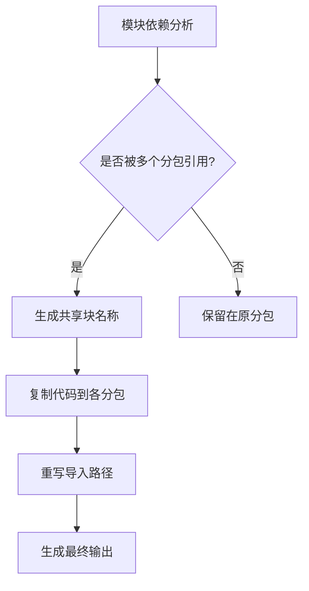
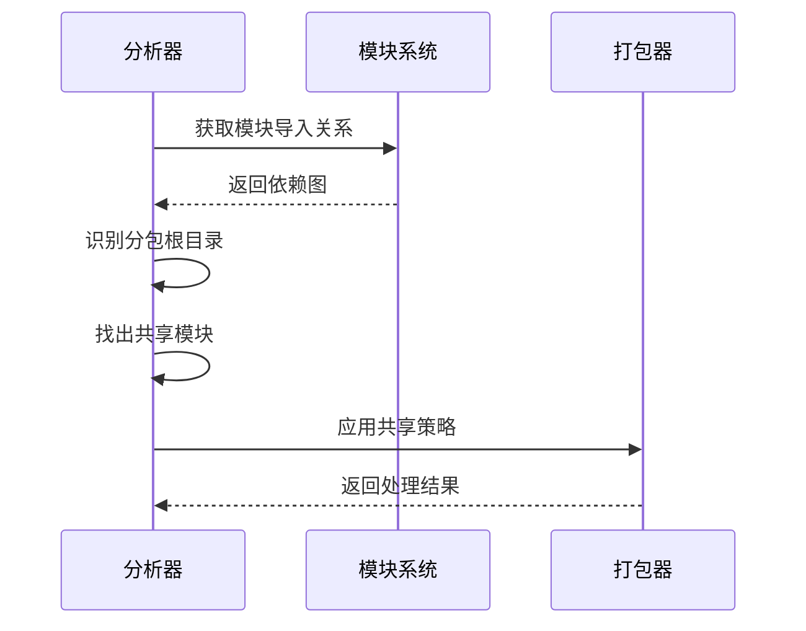
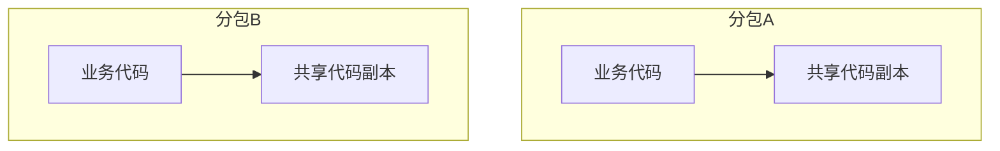
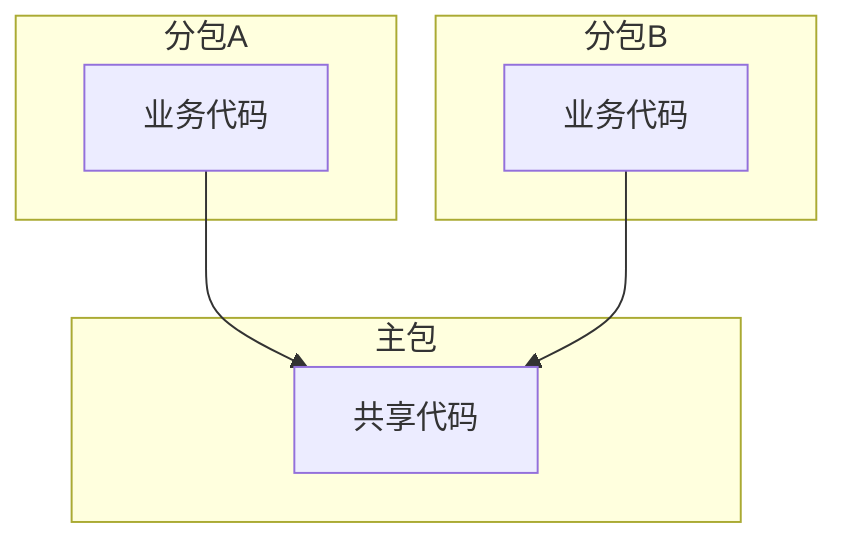
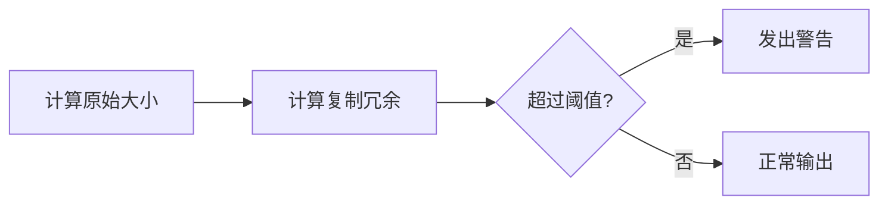

# 共享代码管理

<cite>
**本文档引用文件**   
- [chunkStrategy.ts](file://packages/weapp-vite/src/runtime/chunkStrategy.ts)
- [chunkStrategy.test.ts](file://packages/weapp-vite/src/runtime/chunkStrategy.test.ts)
- [core.ts](file://packages/weapp-vite/src/plugins/core.ts)
- [subpackage-shared-chunks/vite.config.ts](file://apps/subpackage-shared-chunks/vite.config.ts)
- [analyze/subpackages.ts](file://packages/weapp-vite/src/analyze/subpackages.ts)
</cite>

## 目录
1. [简介](#简介)
2. [共享代码提取机制](#共享代码提取机制)
3. [sharedChunks配置详解](#sharedchunks配置详解)
4. [代码分割算法原理](#代码分割算法原理)
5. [跨分包代码复用策略](#跨分包代码复用策略)
6. [最佳实践建议](#最佳实践建议)
7. [性能优化与监控](#性能优化与监控)

## 简介
weapp-vite框架提供了一套完整的共享代码管理机制，通过智能的代码分割和模块提取策略，优化小程序分包架构下的代码复用。该机制基于Rollup打包工具的插件系统，实现了对公共代码的自动识别、提取和优化，有效减少代码冗余，提升加载性能。

**Section sources**
- [chunkStrategy.ts](file://packages/weapp-vite/src/runtime/chunkStrategy.ts#L1-L50)

## 共享代码提取机制
weapp-vite的共享代码提取机制基于模块依赖分析和分包结构识别。系统通过静态分析模块间的引用关系，识别出被多个分包共同引用的模块，并将其提取为共享代码块。

核心机制包含三个关键组件：
1. **模块作用域验证**：确保分包内模块不被其他分包直接引用
2. **共享块命名策略**：根据引用关系生成唯一的共享块名称
3. **代码复制与重写**：将共享代码复制到各分包并更新导入路径



**Diagram sources **
- [chunkStrategy.ts](file://packages/weapp-vite/src/runtime/chunkStrategy.ts#L76-L162)

## sharedChunks配置详解
sharedChunks配置项提供了对共享代码行为的精细控制，主要包含以下配置选项：

### 配置项说明
| 配置项 | 类型 | 默认值 | 说明 |
|-------|------|--------|------|
| sharedStrategy | 'duplicate' \| 'hoist' | 'duplicate' | 共享策略：复制或提升到主包 |
| duplicateWarningBytes | number | 256 * 1024 | 复制冗余警告阈值（字节） |

### 配置示例
```typescript
export default defineConfig({
  weapp: {
    chunks: {
      sharedStrategy: 'duplicate',
      duplicateWarningBytes: 256 * 1024,
    },
  },
})
```

**Section sources**
- [subpackage-shared-chunks/vite.config.ts](file://apps/subpackage-shared-chunks/vite.config.ts#L60-L63)

## 代码分割算法原理
weapp-vite的代码分割算法采用基于引用关系的智能分析策略，其工作原理如下：

### 算法流程
1. **依赖图构建**：收集所有模块的导入关系
2. **分包根目录识别**：确定各分包的根路径
3. **共享模块识别**：找出被多个分包引用的模块
4. **策略应用**：根据配置策略处理共享模块

### 核心算法实现


**Diagram sources **
- [chunkStrategy.ts](file://packages/weapp-vite/src/runtime/chunkStrategy.ts#L164-L219)

## 跨分包代码复用策略
weapp-vite支持多种跨分包代码复用策略，满足不同场景需求。

### 复制策略 (duplicate)
将共享代码复制到每个引用它的分包中，适用于：
- 小型工具函数
- 频繁使用的常量
- 状态管理模块



**Diagram sources **
- [chunkStrategy.ts](file://packages/weapp-vite/src/runtime/chunkStrategy.ts#L475-L577)

### 提升策略 (hoist)
将共享代码提升到主包中，由主包统一管理，适用于：
- 大型第三方库
- 核心业务逻辑
- 全局状态管理



**Diagram sources **
- [chunkStrategy.ts](file://packages/weapp-vite/src/runtime/chunkStrategy.ts#L541-L576)

## 最佳实践建议
### 第三方库共享
将常用的第三方库（如lodash、dayjs等）配置为共享模块，避免在每个分包中重复打包。

```typescript
// 推荐做法
import chunk from 'lodash-es/chunk'
```

### 工具函数提取
将通用的工具函数集中管理，创建专门的utils目录存放共享工具。

```typescript
// utils/shared.ts
export function formatDate(date: Date) {
  // 实现
}
```

### 状态管理模块共用
使用统一的状态管理方案，确保各分包访问相同的状态实例。

```typescript
// store/index.ts
import { createStore } from 'vuex'
export const store = createStore({
  // 状态定义
})
```

**Section sources**
- [chunkStrategy.ts](file://packages/weapp-vite/src/runtime/chunkStrategy.ts#L394-L403)

## 性能优化与监控
weapp-vite提供了完善的性能监控机制，帮助开发者优化共享代码策略。

### 冗余体积监控
系统会计算因代码复制产生的冗余字节数，并在超过阈值时发出警告。



**Diagram sources **
- [core.ts](file://packages/weapp-vite/src/plugins/core.ts#L452-L454)

### 分析工具
使用`weapp-vite analyze`命令可以生成详细的分包分析报告，定位共享代码问题。

**Section sources**
- [analyze/subpackages.ts](file://packages/weapp-vite/src/analyze/subpackages.ts#L538-L601)