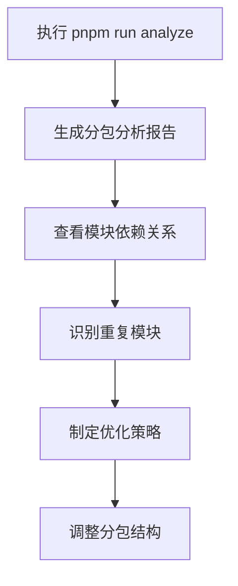
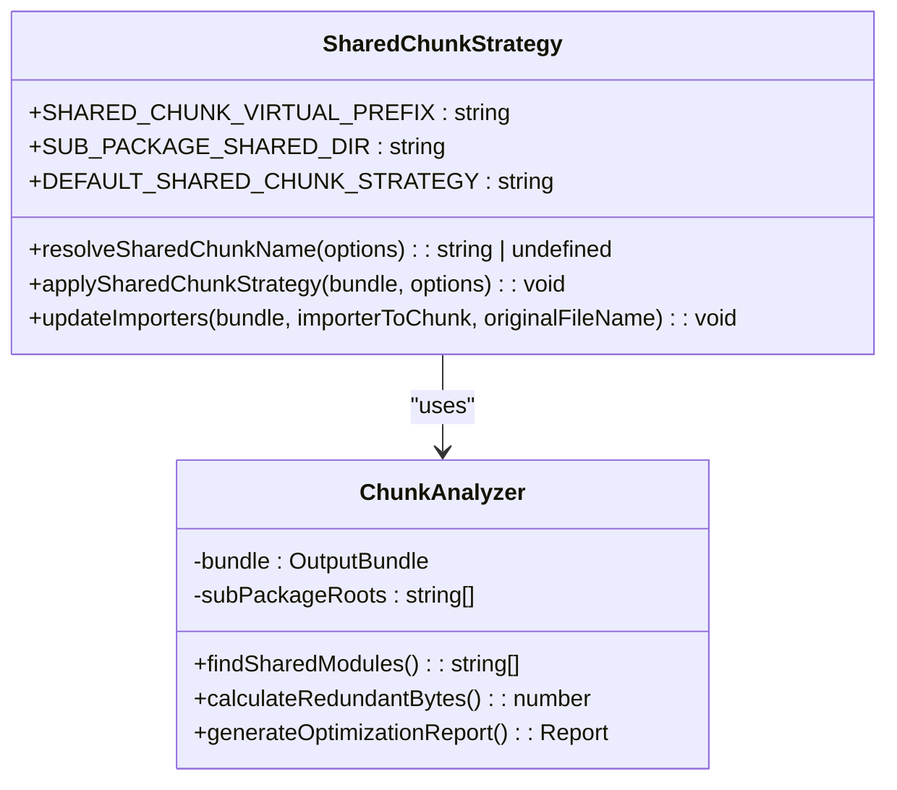
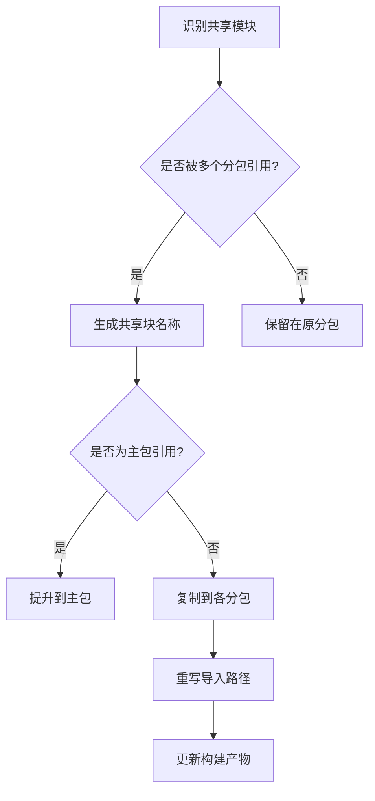
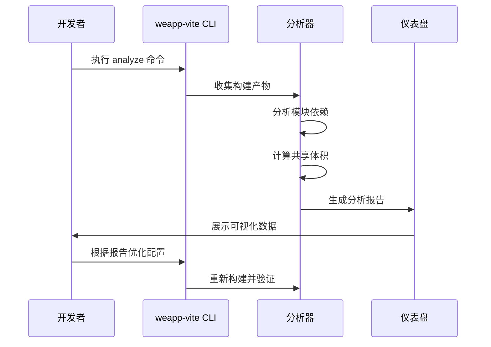
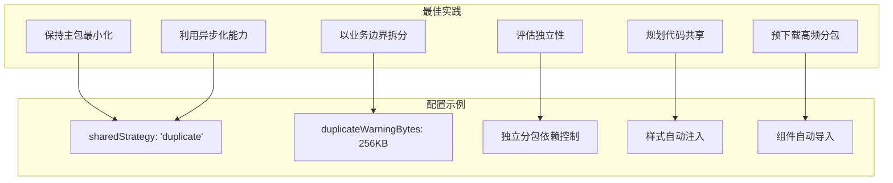

# 分包优化

<cite>
**本文档引用文件**  
- [subpackages.md](file://docs/subpackages.md)
- [chunkStrategy.ts](file://packages/weapp-vite/src/runtime/chunkStrategy.ts)
- [chunkStrategy.test.ts](file://packages/weapp-vite/src/runtime/chunkStrategy.test.ts)
- [advancedChunks.ts](file://packages/weapp-vite/src/runtime/advancedChunks.ts)
- [core.ts](file://packages/weapp-vite/src/plugins/core.ts)
- [dashboard.ts](file://packages/weapp-vite/src/cli/analyze/dashboard.ts)
- [vite.config.ts](file://apps/subpackage-shared-chunks/vite.config.ts)
- [vite.config.ts](file://apps/vite-native/vite.config.ts)
- [analyze-dashboard/App.vue](file://packages/weapp-vite/analyze-dashboard/App.vue)
- [useTreemapData.ts](file://packages/weapp-vite/analyze-dashboard/useTreemapData.ts)
- [mock-data.ts](file://packages/weapp-vite/analyze-dashboard/mock-data.ts)
- [README.zh-CN.md](file://packages/vite-plugin-performance/README.zh-CN.md)
</cite>

## 目录
1. [分包体积分析](#分包体积分析)
2. [公共资源提取策略](#公共资源提取策略)
3. [按需加载与共享代码管理](#按需加载与共享代码管理)
4. [性能监控与优化工作流](#性能监控与优化工作流)
5. [配置示例与最佳实践](#配置示例与最佳实践)

## 分包体积分析

weapp-vite 提供了强大的分包体积分析能力，通过内置的分析仪表盘帮助开发者识别体积过大的子包并提供优化建议。开发者可以通过在 `package.json` 中添加 `"analyze": "weapp-vite analyze"` 脚本来启动分析功能。

分析工具会生成详细的分包报告，展示每个子包的产物结构、共享模块和重复依赖。仪表盘界面提供了直观的可视化数据，包括模块数量、跨包复用次数和总产物大小等关键指标。通过这些数据，开发者可以快速定位体积异常的子包，并针对性地进行拆分和优化。

**Diagram sources**
- [subpackages.md](file://docs/subpackages.md#L139)
- [analyze-dashboard/App.vue](file://packages/weapp-vite/analyze-dashboard/App.vue#L99-L116)
- [useTreemapData.ts](file://packages/weapp-vite/analyze-dashboard/useTreemapData.ts#L164-L265)

**Section sources**
- [subpackages.md](file://docs/subpackages.md#L139-L142)
- [useTreemapData.ts](file://packages/weapp-vite/analyze-dashboard/useTreemapData.ts#L164-L265)

## 公共资源提取策略

weapp-vite 通过 `chunks.sharedStrategy` 配置项控制跨包共享模块的输出策略，有效避免主包和分包的体积异常。该策略支持多种模式，其中 `duplicate` 模式会将共享代码复制到每个引用它的分包中。

在实现上，系统通过 `resolveSharedChunkName` 函数识别需要共享的模块，并根据其导入关系确定最佳的共享策略。对于被多个分包引用的公共模块，构建器会生成一个虚拟的共享块前缀 `weapp_shared_virtual`，然后根据策略将其分配到合适的输出位置。

当启用 `duplicate` 策略时，构建器会为每个分包创建独立的共享代码副本，并自动重写导入路径。这一过程通过 `applySharedChunkStrategy` 函数实现，确保所有引用都能正确指向新的共享文件位置。

**Diagram sources**
- [chunkStrategy.ts](file://packages/weapp-vite/src/runtime/chunkStrategy.ts#L7-L162)
- [chunkStrategy.test.ts](file://packages/weapp-vite/src/runtime/chunkStrategy.test.ts#L196-L329)

**Section sources**
- [chunkStrategy.ts](file://packages/weapp-vite/src/runtime/chunkStrategy.ts#L7-L162)
- [chunkStrategy.test.ts](file://packages/weapp-vite/src/runtime/chunkStrategy.test.ts#L196-L329)

## 按需加载与共享代码管理

weapp-vite 提供了精细的共享代码管理机制，通过 `sharedStrategy` 配置和 `forceDuplicateTester` 函数实现灵活的代码复用策略。开发者可以配置 `sharedStrategy: 'duplicate'` 来启用共享代码复制策略，并通过 `duplicateWarningBytes` 设置冗余体积警告阈值。

系统通过 `createAdvancedChunkNameResolver` 函数实现高级分块解析，能够识别第三方库（如 node_modules 中的模块）并将其归类到专门的 `vendors` 块中。这种策略有效减少了主包体积，同时确保了跨分包的代码复用。

对于需要强制复制的共享模块，可以通过 `markForceDuplicateSharedChunk` 函数标记，确保这些模块即使被主包引用也会在每个分包中保留副本。这种机制特别适用于那些具有全局状态或副作用的模块，避免因共享导致的运行时问题。

**Diagram sources**
- [advancedChunks.ts](file://packages/weapp-vite/src/runtime/advancedChunks.ts#L25-L57)
- [chunkStrategy.ts](file://packages/weapp-vite/src/runtime/chunkStrategy.ts#L475-L657)

**Section sources**
- [advancedChunks.ts](file://packages/weapp-vite/src/runtime/advancedChunks.ts#L25-L57)
- [chunkStrategy.ts](file://packages/weapp-vite/src/runtime/chunkStrategy.ts#L475-L657)

## 性能监控与优化工作流

weapp-vite 集成了完整的性能监控和优化工作流，帮助开发者持续改进分包架构。通过 `vite-plugin-performance` 插件，可以包裹 Vite 插件并统计各生命周期钩子的执行耗时，快速定位构建链路中的性能瓶颈。

分析工作流从执行 `pnpm run analyze` 开始，生成详细的分包报告。报告中包含每个子包的文件列表、模块大小和引用关系，开发者可以据此识别体积过大的子包并进行拆分。当检测到共享模块产生的冗余体积超过 `duplicateWarningBytes` 阈值时，系统会发出警告，建议调整分包划分。

构建过程中，系统会自动处理隐式页面预加载，并通过 `removeImplicitPagePreloads` 函数优化加载顺序。对于独立分包，构建器会单独处理其依赖关系，确保不会将主包依赖泄漏到独立分包中。

**Diagram sources**
- [core.ts](file://packages/weapp-vite/src/plugins/core.ts#L442-L454)
- [dashboard.ts](file://packages/weapp-vite/src/cli/analyze/dashboard.ts#L88-L173)
- [README.zh-CN.md](file://packages/vite-plugin-performance/README.zh-CN.md#L1-L46)

**Section sources**
- [core.ts](file://packages/weapp-vite/src/plugins/core.ts#L442-L454)
- [dashboard.ts](file://packages/weapp-vite/src/cli/analyze/dashboard.ts#L88-L173)

## 配置示例与最佳实践

在 `vite.config.ts` 中，可以通过 `weapp.subPackages` 配置为每个分包添加独立的编译选项。例如，可以为订单分包配置独立的依赖项、样式注入和组件自动导入规则。通过 `chunks.sharedStrategy: 'duplicate'` 启用共享代码复制策略，并设置 `duplicateWarningBytes` 警告阈值。

最佳实践包括：保持主包最小化，只保留必要页面和基座逻辑；以业务边界拆分分包，便于团队协作；评估独立性，需要自定义 TabBar 或插件能力的模块优先考虑独立分包；同步规划代码共享，将公共工具和样式放在主包或公共目录。

**Diagram sources**
- [vite.config.ts](file://apps/subpackage-shared-chunks/vite.config.ts#L60-L63)
- [vite.config.ts](file://apps/vite-native/vite.config.ts#L89-L99)
- [subpackages.md](file://docs/subpackages.md#L18-L26)

**Section sources**
- [vite.config.ts](file://apps/subpackage-shared-chunks/vite.config.ts#L60-L63)
- [subpackages.md](file://docs/subpackages.md#L18-L26)