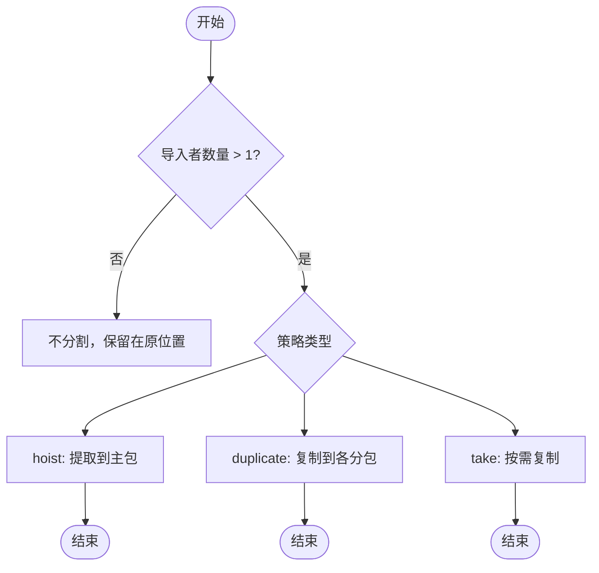
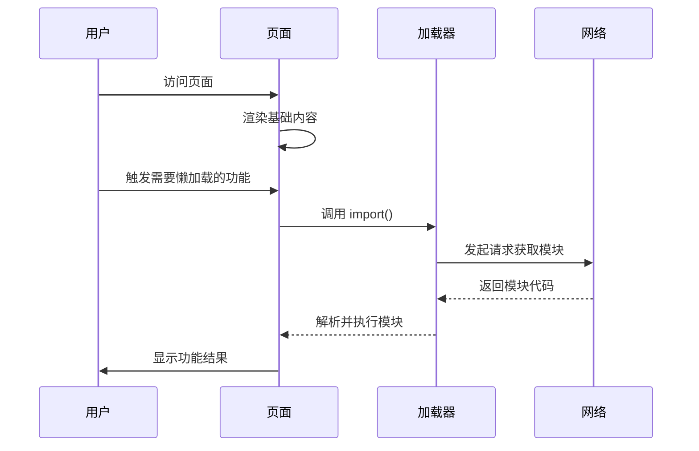
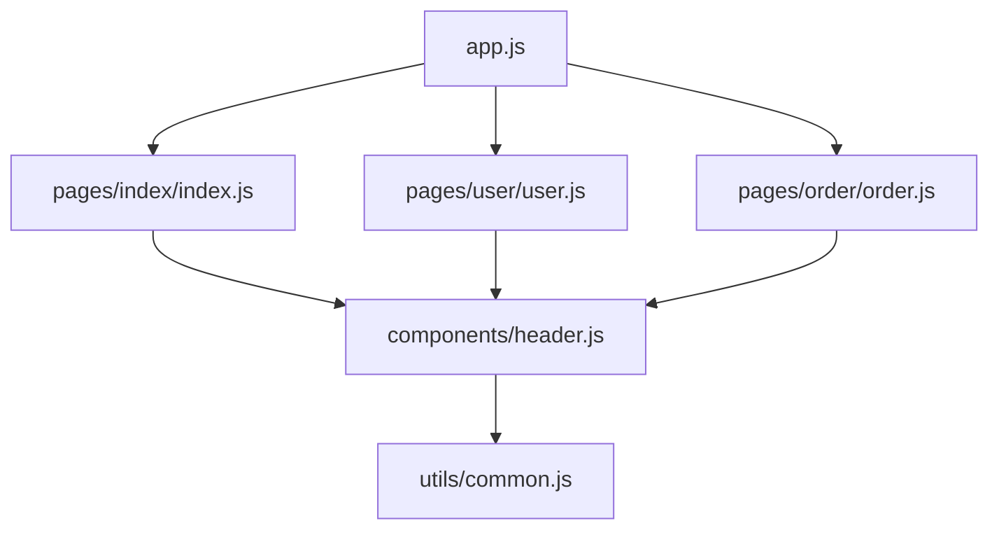
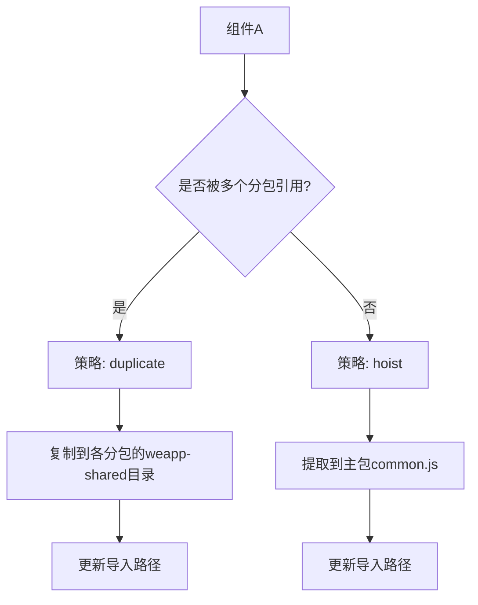
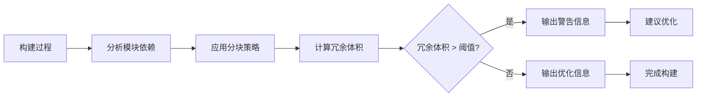

# 按需加载策略

<cite>
**本文档引用文件**   
- [chunkStrategy.ts](file://packages/weapp-vite/src/runtime/chunkStrategy.ts)
- [advancedChunks.ts](file://packages/weapp-vite/src/runtime/advancedChunks.ts)
- [core.ts](file://packages/weapp-vite/src/plugins/core.ts)
- [autoRoutesPlugin.ts](file://packages/weapp-vite/src/runtime/autoRoutesPlugin.ts)
- [autoImport.ts](file://packages/weapp-vite/src/plugins/autoImport.ts)
</cite>

## 目录
1. [引言](#引言)
2. [动态导入支持](#动态导入支持)
3. [代码分割与懒加载实现](#代码分割与懒加载实现)
4. [分块策略配置](#分块策略配置)
5. [实际使用示例](#实际使用示例)
6. [性能监控与优化](#性能监控与优化)
7. [结论](#结论)

## 引言
weapp-vite 提供了完整的按需加载机制，通过动态导入、代码分割和懒加载技术优化小程序的首屏加载性能。本文档系统性地介绍其按需加载的实现机制，包括动态导入的支持情况、代码分割和懒加载的实现原理，以及如何配置分块策略来优化性能。

## 动态导入支持
weapp-vite 完全支持 ES2020 的动态导入（Dynamic Import）语法，允许在运行时按需加载模块。这种机制对于延迟加载非关键功能、实现路由级懒加载和组件级懒加载非常有用。

动态导入通过 `import()` 函数实现，返回一个 Promise，可以使用 async/await 语法进行调用。在 weapp-vite 中，动态导入不仅支持标准的模块导入，还支持特定于小程序的导入方式，如 `require.async`。

**Section sources**
- [chunkStrategy.ts](file://packages/weapp-vite/src/runtime/chunkStrategy.ts#L1-L999)
- [core.ts](file://packages/weapp-vite/src/plugins/core.ts#L1-L776)

## 代码分割与懒加载实现
weapp-vite 的代码分割和懒加载机制基于 Rollup 的打包能力，并通过自定义插件进行增强。核心实现位于 `chunkStrategy.ts` 和 `core.ts` 文件中。

### 分块策略实现
weapp-vite 通过 `resolveSharedChunkName` 函数决定模块的分块策略。该函数根据模块的导入关系和配置策略，决定模块是应该被提取到共享块、主包还是分包中。



**Diagram sources**
- [chunkStrategy.ts](file://packages/weapp-vite/src/runtime/chunkStrategy.ts#L76-L162)

### 懒加载实现
懒加载通过动态导入实现，weapp-vite 在构建时会识别 `import()` 语法，并将对应的模块打包成独立的 chunk。在运行时，只有当执行到动态导入语句时，才会发起网络请求加载对应的模块。



**Diagram sources**
- [core.ts](file://packages/weapp-vite/src/plugins/core.ts#L486-L546)

## 分块策略配置
weapp-vite 提供了灵活的分块策略配置，可以通过 `vite.config.ts` 中的 `chunks` 选项进行设置。

### 路由级分割
路由级分割是默认的分割策略，每个页面会被打包成独立的 chunk。weapp-vite 通过 `autoRoutesPlugin` 自动扫描 `pages` 目录下的页面文件，并为每个页面创建独立的入口。



**Diagram sources**
- [autoRoutesPlugin.ts](file://packages/weapp-vite/src/runtime/autoRoutesPlugin.ts#L1-L906)

### 组件级分割
组件级分割允许将公共组件提取到共享块中，避免在多个页面中重复打包。可以通过配置 `chunks.sharedStrategy` 来控制共享块的处理策略。



**Diagram sources**
- [chunkStrategy.ts](file://packages/weapp-vite/src/runtime/chunkStrategy.ts#L475-L657)

## 实际使用示例
以下是一些按需加载的实际使用示例：

### 动态导入组件
```typescript
// 在需要时才加载 HeavyComponent 组件
async function loadHeavyComponent() {
  const { HeavyComponent } = await import('@/components/HeavyComponent')
  // 使用组件
}
```

### 路由级懒加载
```typescript
// 路由配置中使用动态导入
const routes = [
  { path: '/', component: () => import('@/pages/Home') },
  { path: '/user', component: () => import('@/pages/User') },
  { path: '/order', component: () => import('@/pages/Order') }
]
```

### 配置分块策略
```typescript
// vite.config.ts
export default defineConfig({
  weappVite: {
    chunks: {
      sharedStrategy: 'duplicate', // 或 'hoist'
      logOptimization: true,
      duplicateWarningBytes: 102400 // 100KB 警告阈值
    }
  }
})
```

**Section sources**
- [chunkStrategy.ts](file://packages/weapp-vite/src/runtime/chunkStrategy.ts#L475-L657)
- [core.ts](file://packages/weapp-vite/src/plugins/core.ts#L313-L317)

## 性能监控与优化
weapp-vite 提供了多种性能监控和优化手段，帮助开发者优化按需加载的性能。

### 构建时性能提示
weapp-vite 在构建时会输出详细的分块优化信息，包括共享模块的复制情况、冗余体积等。当冗余体积超过配置的阈值时，会发出警告。



**Diagram sources**
- [core.ts](file://packages/weapp-vite/src/plugins/core.ts#L318-L322)

### 分析工具
weapp-vite 提供了 `analyze` 命令，可以生成详细的打包分析报告，帮助定位性能瓶颈。

```bash
# 运行分析工具
weapp-vite analyze
```

该工具会生成可视化报告，显示各个模块的大小、依赖关系和加载路径，帮助开发者优化代码分割策略。

**Section sources**
- [core.ts](file://packages/weapp-vite/src/plugins/core.ts#L452-L454)

## 结论
weapp-vite 的按需加载机制通过动态导入、代码分割和懒加载技术，有效优化了小程序的首屏加载性能。通过灵活的分块策略配置，开发者可以根据应用特点选择最适合的优化方案。路由级分割和组件级分割的结合使用，既能保证首屏快速加载，又能避免代码重复，提高整体性能。