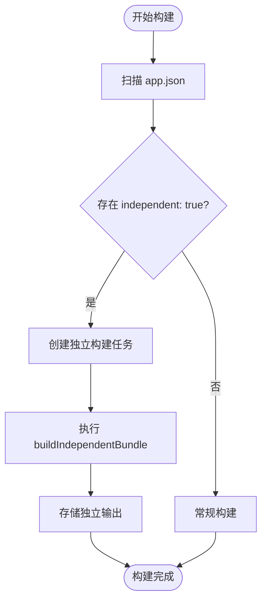
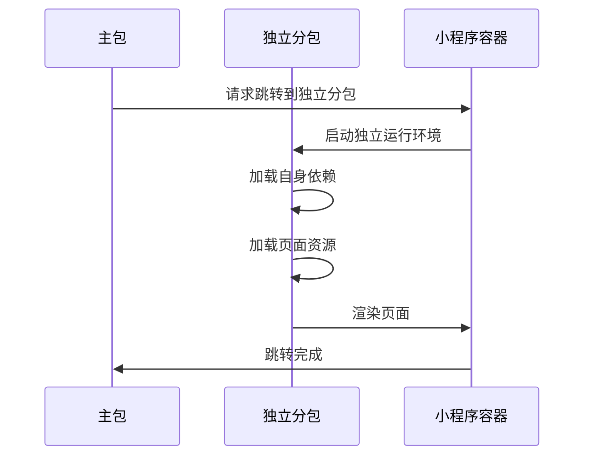
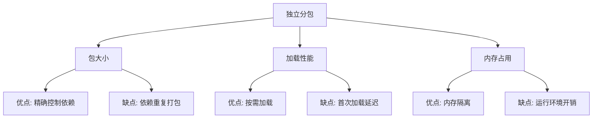

# independent参数

<cite>
**本文档引用的文件**  
- [subpackages.md](file://website/config/subpackages.md)
- [buildPlugin.ts](file://packages/weapp-vite/src/runtime/buildPlugin.ts)
- [core.ts](file://packages/weapp-vite/src/plugins/core.ts)
- [scanPlugin.ts](file://packages/weapp-vite/src/runtime/scanPlugin.ts)
- [vite.config.ts](file://apps/vite-native/vite.config.ts)
- [independent-subpackage.ts](file://apps/vite-native/subpackage-demos/independent-subpackage.ts)
- [app.json](file://packages/weapp-vite/test/fixtures/independent-subpackage/src/app.json)
</cite>

## 目录
1. [简介](#简介)
2. [配置定义与语法](#配置定义与语法)
3. [独立分包的构建机制](#独立分包的构建机制)
4. [运行时行为与资源加载](#运行时行为与资源加载)
5. [实际应用场景](#实际应用场景)
6. [性能影响分析](#性能影响分析)
7. [最佳实践与配置建议](#最佳实践与配置建议)

## 简介

在大型小程序项目中，合理使用分包机制能够显著提升首屏加载速度并有效控制主包体积。`independent` 参数是微信小程序分包体系中的核心配置之一，用于控制子包是否作为独立上下文运行。当设置为 `true` 时，该分包将被视为独立分包，拥有独立的运行环境和依赖体系，不共享主包或其他分包的基础库和依赖模块。

本文档将深入解析 `independent` 参数的作用机制，详细说明其如何影响子包的独立性、运行时行为和资源加载策略，并通过实际示例展示其在不同场景下的应用。

## 配置定义与语法

`independent` 参数可以在 `app.json` 文件的 `subPackages` 或 `subpackages` 字段中直接定义，也可以通过 `weapp-vite` 的构建配置进行精细化管理。其基本语法如下：

```json
{
  "subPackages": [
    {
      "root": "packageB",
      "name": "independent",
      "pages": [
        "pages/dead-end/index"
      ],
      "independent": true
    }
  ]
}
```

在 `weapp-vite` 的构建配置中，可以通过 `weapp.subPackages` 进行更灵活的控制：

```ts
export default defineConfig({
  weapp: {
    subPackages: {
      packageB: {
        independent: true,
        dependencies: ['buffer', /gm-crypto/],
        inlineConfig: {
          define: {
            'import.meta.env.PACKAGE_B': JSON.stringify(true),
          },
        },
      },
    },
  },
})
```

**字段说明**：
- `independent`: 布尔值，控制分包是否为独立上下文。
- `dependencies`: 精确控制该分包需要的 `miniprogram_npm` 依赖列表，避免主包依赖泄漏。
- `inlineConfig`: 为该分包注入额外的 Vite/Rolldown 构建配置，不影响其他分包。

**Section sources**
- [subpackages.md](file://website/config/subpackages.md#L1-L112)
- [app.json](file://packages/weapp-vite/test/fixtures/independent-subpackage/src/app.json#L1-L16)

## 独立分包的构建机制

当 `independent` 参数设置为 `true` 时，构建系统会为该分包创建独立的构建上下文，确保其依赖和资源与其他分包隔离。

### 构建流程

1. **扫描与标记**：构建系统在扫描 `app.json` 时，会识别所有标记为 `independent: true` 的分包，并将其根路径加入 `independentSubPackageMap`。
2. **独立构建任务**：对于每个独立分包，系统会创建一个独立的构建任务，使用 `buildIndependentBundle` 函数进行编译。
3. **输出管理**：独立分包的构建输出会被单独存储，避免与主包或其他分包的输出混淆。



**Diagram sources**
- [scanPlugin.ts](file://packages/weapp-vite/src/runtime/scanPlugin.ts#L407-L635)
- [buildPlugin.ts](file://packages/weapp-vite/src/runtime/buildPlugin.ts#L59-L105)

### 核心实现

`buildIndependentBundle` 函数是独立分包构建的核心，它会为每个独立分包创建一个独立的构建配置，并调用 `build` 函数进行编译：

```ts
async function buildIndependentBundle(root: string, meta: SubPackageMetaValue): Promise<RolldownOutput> {
  const existingTask = independentBuildTasks.get(root)
  if (existingTask) {
    return existingTask
  }

  const task = (async () => {
    try {
      const chunkRoot = meta.subPackage.root ?? root
      const inlineConfig = configService.merge(meta, meta.subPackage.inlineConfig, {
        build: {
          write: false,
          watch: null,
          rolldownOptions: {
            output: {
              chunkFileNames() {
                return `${chunkRoot}/[name].js`
              },
            },
          },
        },
      })
      const result = await build(inlineConfig) as RolldownOutput | RolldownOutput[]
      const output = Array.isArray(result) ? result[0] : result
      if (!output) {
        throw new Error(`独立分包 ${root} 未产生输出`)
      }
      storeIndependentOutput(root, output)
      return output
    }
    catch (error) {
      const normalized = createIndependentBuildError(root, error)
      invalidateIndependentOutput(root)
      logger.error(`[independent] ${root} 构建失败: ${normalized.message}`)
      throw normalized
    }
    finally {
      independentBuildTasks.delete(root)
    }
  })()

  independentBuildTasks.set(root, task)
  return task
}
```

**Section sources**
- [buildPlugin.ts](file://packages/weapp-vite/src/runtime/buildPlugin.ts#L59-L105)

## 运行时行为与资源加载

`independent` 参数不仅影响构建过程，还深刻影响运行时的行为和资源加载策略。

### 依赖隔离

独立分包不共享主包的 `node_modules` 依赖，必须显式声明自身所需的依赖。这有助于：
- 防止主包依赖泄漏到分包
- 精确控制分包体积
- 避免版本冲突

### 页面跳转行为

当从主包跳转到独立分包时，小程序会启动独立的运行环境，加载独立分包的依赖和资源。这种机制确保了独立分包的运行不受主包状态的影响。

### 资源加载策略

独立分包的资源加载遵循以下策略：
- **独立加载**：独立分包的 JS、WXML、WXSS 等资源独立加载，不与主包共享。
- **按需加载**：只有在访问独立分包页面时才会加载其资源，提升首屏加载速度。
- **缓存隔离**：独立分包的缓存与主包隔离，避免相互干扰。



**Diagram sources**
- [core.ts](file://packages/weapp-vite/src/plugins/core.ts#L197-L225)
- [independent-subpackage.ts](file://apps/vite-native/subpackage-demos/independent-subpackage.ts#L1-L3)

## 实际应用场景

### 独立小程序包

对于功能相对独立、用户使用频率较低的功能模块，可以将其打包为独立分包。例如：
- **设置页面**：用户不常访问，但可能包含大量第三方库
- **帮助中心**：内容较多，但更新频率低
- **隐私政策**：法律要求必须存在，但用户很少查看

### 插件式架构

在插件式架构中，每个插件可以作为一个独立分包，确保插件之间的依赖隔离，避免相互影响。

### 热更新模块

对于需要频繁更新的模块，可以将其作为独立分包，通过热更新机制单独更新，无需重新发布整个小程序。

**Section sources**
- [vite.config.ts](file://apps/vite-native/vite.config.ts#L89-L100)
- [independent-subpackage.ts](file://apps/vite-native/subpackage-demos/independent-subpackage.ts#L1-L3)

## 性能影响分析

### 包大小

- **优点**：独立分包可以精确控制依赖，避免不必要的依赖打包，减小分包体积。
- **缺点**：如果多个独立分包使用相同的依赖，这些依赖会被重复打包，增加总体积。

### 加载性能

- **优点**：独立分包按需加载，提升主包首屏加载速度。
- **缺点**：首次访问独立分包时需要额外的加载时间。

### 内存占用

- **优点**：独立分包的内存空间与主包隔离，避免内存泄漏相互影响。
- **缺点**：每个独立分包都需要维护自己的运行环境，可能增加总体内存占用。



**Diagram sources**
- [buildPlugin.ts](file://packages/weapp-vite/src/runtime/buildPlugin.ts#L59-L105)
- [core.ts](file://packages/weapp-vite/src/plugins/core.ts#L197-L225)

## 最佳实践与配置建议

1. **合理划分**：将功能独立、使用频率低的模块作为独立分包。
2. **精确依赖**：为独立分包精确声明所需依赖，避免依赖泄漏。
3. **性能监控**：定期分析独立分包的体积和加载性能，优化依赖配置。
4. **测试验证**：在真实环境中测试独立分包的加载和运行表现，确保用户体验。

**Section sources**
- [subpackages.md](file://website/config/subpackages.md#L1-L112)
- [vite.config.ts](file://apps/vite-native/vite.config.ts#L89-L100)