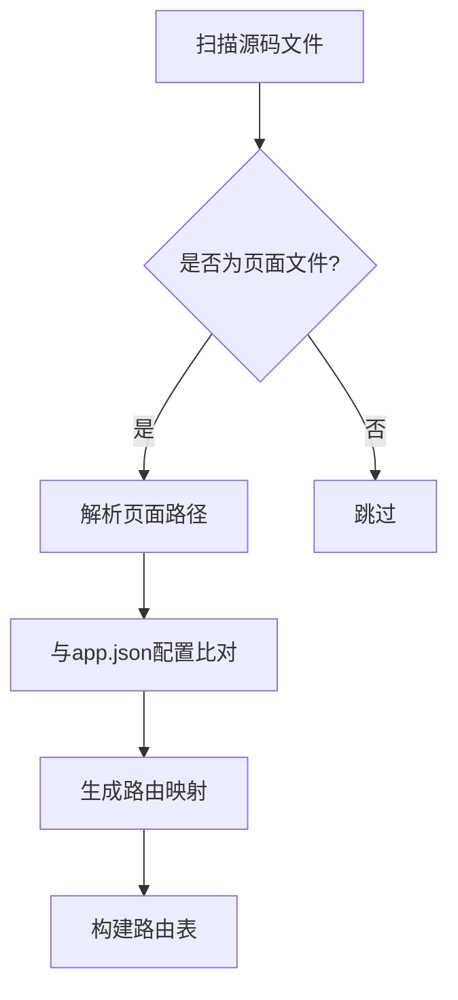

# pages参数

<cite>
**本文档中引用的文件**  
- [subpackageSchema](file://@weapp-core/schematics/scripts/json.ts#L84-L90)
- [app.json](file://apps/subpackage-shared-chunks/src/app.json#L1-L39)
- [autoRoutesPlugin.ts](file://packages/weapp-vite/src/runtime/autoRoutesPlugin.ts#L1-L906)
- [subpackages.md](file://docs/subpackages.md#L1-L151)
- [subpackage-dayjs](file://test/fixtures/subpackage-dayjs)
</cite>

## 目录
1. [pages参数配置详解](#pages参数配置详解)
2. [路径匹配模式](#路径匹配模式)
3. [页面路径规范化处理](#页面路径规范化处理)
4. [配置示例](#配置示例)
5. [与路由系统关联机制](#与路由系统关联机制)
6. [预加载与按需加载](#预加载与按需加载)
7. [常见问题](#常见问题)

## pages参数配置详解

`pages`参数用于声明小程序包含的页面路径，支持通过数组形式配置。在`app.json`文件中，`pages`字段定义了小程序的页面路径列表，每个路径对应一个页面。

`subpackages`配置中的`pages`参数用于声明分包包含的页面路径。每个分包可以独立配置其包含的页面，通过`root`字段指定分包根目录，`pages`数组声明该分包下的页面路径。

**Section sources**
- [app.json](file://apps/subpackage-shared-chunks/src/app.json#L1-L39)
- [subpackageSchema](file://@weapp-core/schematics/scripts/json.ts#L84-L90)

## 路径匹配模式

`pages`参数支持多种路径匹配模式：

1. **精确匹配**：直接指定页面路径，如`"pages/index/index"`。
2. **相对路径**：在分包中可使用相对路径，如`["index", "detail"]`，实际路径为`分包根目录/pages/页面路径`。
3. **通配符**：不支持通配符匹配，必须精确指定页面路径。

```json
{
  "subpackages": [
    {
      "root": "packages/order",
      "name": "订单中心",
      "pages": ["index", "detail"]
    }
  ]
}
```

**Section sources**
- [app.json](file://apps/subpackage-shared-chunks/src/app.json#L1-L39)

## 页面路径规范化处理

系统会对页面路径进行规范化处理，确保路径格式统一。处理规则包括：

1. 路径统一转换为POSIX格式（使用正斜杠`/`）。
2. 移除多余的路径分隔符。
3. 确保路径以`pages/`开头（对于主包）或`分包根目录/pages/`开头（对于分包）。
4. 处理路径中的`.`和`..`相对引用。

路径规范化由`toPosix`函数和路径解析逻辑共同完成，确保不同操作系统下的路径一致性。

**Section sources**
- [autoRoutesPlugin.ts](file://packages/weapp-vite/src/runtime/autoRoutesPlugin.ts#L43-L45)
- [autoRoutesPlugin.ts](file://packages/weapp-vite/src/runtime/autoRoutesPlugin.ts#L117-L132)

## 配置示例

### 单个页面配置
```json
{
  "pages": [
    "pages/index/index"
  ]
}
```

### 批量页面配置
```json
{
  "subpackages": [
    {
      "root": "packages/profile",
      "name": "个人中心",
      "pages": ["index", "settings", "account", "security"]
    }
  ]
}
```

### 嵌套页面结构
```json
{
  "subpackages": [
    {
      "root": "packages/order",
      "name": "订单中心",
      "pages": [
        "index",
        "list",
        "detail/index",
        "detail/logistics",
        "refund/index",
        "refund/apply"
      ],
      "independent": true
    }
  ]
}
```

**Section sources**
- [app.json](file://apps/subpackage-shared-chunks/src/app.json#L1-L39)

## 与路由系统关联机制

`pages`配置与路由系统紧密关联，构建工具会根据`pages`配置自动生成路由信息。系统通过扫描源码中的页面文件，结合`app.json`中的`pages`配置，构建完整的路由映射。

路由解析逻辑：
1. 扫描`src`目录下的所有页面文件。
2. 根据文件路径解析出对应的路由。
3. 将路由信息与`app.json`中的`pages`配置进行比对和整合。
4. 生成最终的路由表，用于页面跳转和导航。



**Diagram sources**
- [autoRoutesPlugin.ts](file://packages/weapp-vite/src/runtime/autoRoutesPlugin.ts#L143-L200)

## 预加载与按需加载

### 预加载配置
通过`preloadRule`配置预加载规则，可以提前加载分包，提升用户体验。

```json
{
  "preloadRule": {
    "pages/index/index": {
      "packages": ["packages/profile"],
      "network": "all",
      "timeout": 2000
    }
  }
}
```

### 按需加载
启用`lazyCodeLoading`配置，实现代码的按需加载，减少首屏加载时间。

```json
{
  "lazyCodeLoading": "requiredComponents"
}
```

预加载和按需加载机制可以有效平衡首屏加载速度和后续页面的响应速度。

**Section sources**
- [app.json](file://apps/subpackage-shared-chunks/src/app.json#L1-L39)

## 常见问题

### 页面找不到
可能原因：
1. `pages`配置中的路径与实际文件路径不匹配。
2. 路径大小写不一致。
3. 分包`root`配置错误。

### 重复加载
可能原因：
1. 相同页面在主包和分包中重复声明。
2. 路由配置冲突。
3. 构建缓存未清理。

建议使用`weapp-vite analyze`命令分析构建产物，检查页面加载情况。

**Section sources**
- [subpackages.md](file://docs/subpackages.md#L1-L151)