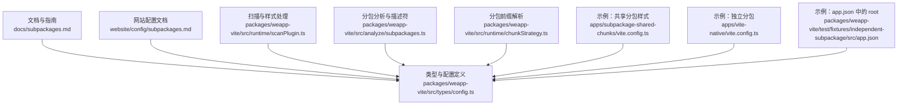
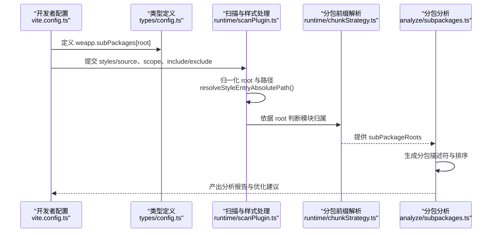
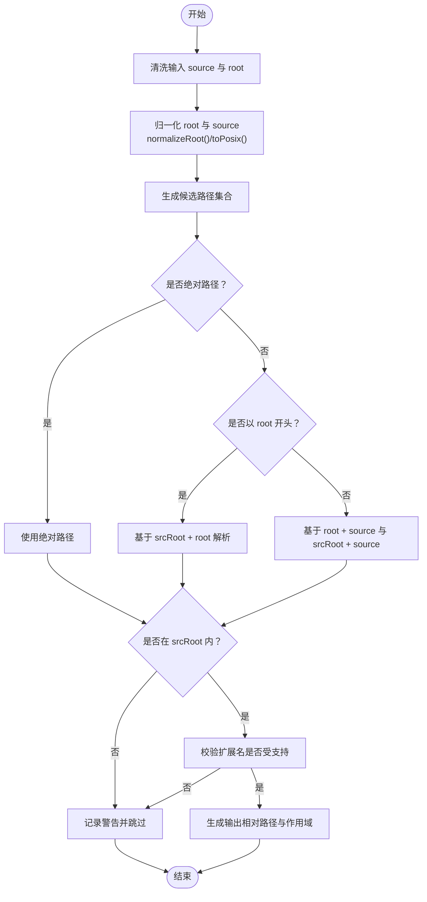
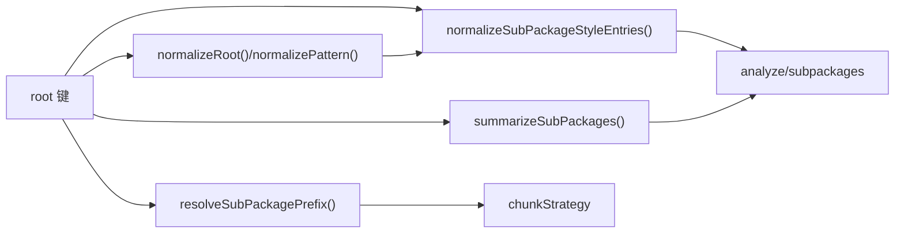

# root参数

<cite>
**本文引用的文件**
- [docs/subpackages.md](file://docs/subpackages.md)
- [website/config/subpackages.md](file://website/config/subpackages.md)
- [packages/weapp-vite/src/types/config.ts](file://packages/weapp-vite/src/types/config.ts)
- [packages/weapp-vite/src/runtime/scanPlugin.ts](file://packages/weapp-vite/src/runtime/scanPlugin.ts)
- [packages/weapp-vite/src/runtime/chunkStrategy.ts](file://packages/weapp-vite/src/runtime/chunkStrategy.ts)
- [packages/weapp-vite/src/analyze/subpackages.ts](file://packages/weapp-vite/src/analyze/subpackages.ts)
- [apps/subpackage-shared-chunks/vite.config.ts](file://apps/subpackage-shared-chunks/vite.config.ts)
- [apps/vite-native/vite.config.ts](file://apps/vite-native/vite.config.ts)
- [apps/wevu-runtime-demo/src/subpackages/perf/pages/chunk/index.ts](file://apps/wevu-runtime-demo/src/subpackages/perf/pages/chunk/index.ts)
- [packages/weapp-vite/test/fixtures/independent-subpackage/src/app.json](file://packages/weapp-vite/test/fixtures/independent-subpackage/src/app.json)
</cite>

## 目录
1. [简介](#简介)
2. [项目结构](#项目结构)
3. [核心组件](#核心组件)
4. [架构总览](#架构总览)
5. [详细组件分析](#详细组件分析)
6. [依赖分析](#依赖分析)
7. [性能考量](#性能考量)
8. [故障排查指南](#故障排查指南)
9. [结论](#结论)
10. [附录](#附录)

## 简介
本篇文档围绕 subpackages 配置中的 root 参数展开，系统阐述其作用、路径解析规则、支持的路径格式（相对路径、绝对路径）、路径别名的使用方式，以及对资源引用、组件导入和样式作用域的影响。同时提供多类项目结构下的实际配置示例与常见错误及解决方案，帮助你在不同工程形态中正确设置 root 路径，获得稳定可靠的分包构建体验。

## 项目结构
- 仓库采用 monorepo 结构，包含核心包、示例应用与文档。与 root 参数最相关的实现分布在 weapp-vite 核心包的类型定义、扫描与分析逻辑中，示例应用展示了多种 root 使用场景。

图表来源
- [docs/subpackages.md](file://docs/subpackages.md#L1-L151)
- [website/config/subpackages.md](file://website/config/subpackages.md#L1-L32)
- [packages/weapp-vite/src/types/config.ts](file://packages/weapp-vite/src/types/config.ts#L53-L68)
- [packages/weapp-vite/src/runtime/scanPlugin.ts](file://packages/weapp-vite/src/runtime/scanPlugin.ts#L1-L200)
- [packages/weapp-vite/src/analyze/subpackages.ts](file://packages/weapp-vite/src/analyze/subpackages.ts#L523-L537)
- [packages/weapp-vite/src/runtime/chunkStrategy.ts](file://packages/weapp-vite/src/runtime/chunkStrategy.ts#L345-L355)
- [apps/subpackage-shared-chunks/vite.config.ts](file://apps/subpackage-shared-chunks/vite.config.ts#L1-L83)
- [apps/vite-native/vite.config.ts](file://apps/vite-native/vite.config.ts#L1-L138)
- [packages/weapp-vite/test/fixtures/independent-subpackage/src/app.json](file://packages/weapp-vite/test/fixtures/independent-subpackage/src/app.json#L1-L15)

章节来源
- [docs/subpackages.md](file://docs/subpackages.md#L1-L151)
- [website/config/subpackages.md](file://website/config/subpackages.md#L1-L32)

## 核心组件
- SubPackage 类型与 root 字段
  - SubPackage 定义了分包的核心元信息，其中 root 是分包根目录标识，作为 weapp.subPackages 的键名使用。
  - root 字段在类型定义中明确为 string 类型，且 entry 等其他字段均基于 root 进行相对定位。
- weapp.subPackages 配置
  - 以 root 为键，支持独立分包、依赖裁剪、样式注入、组件自动导入等增强能力。
  - styles 支持相对分包 root、相对 srcRoot 或绝对路径三种形式，且可结合 scope/include/exclude 精准控制注入范围。

章节来源
- [packages/weapp-vite/src/types/config.ts](file://packages/weapp-vite/src/types/config.ts#L53-L68)
- [packages/weapp-vite/src/types/config.ts](file://packages/weapp-vite/src/types/config.ts#L390-L401)
- [website/config/subpackages.md](file://website/config/subpackages.md#L1-L32)

## 架构总览
root 参数贯穿“配置解析—路径归一—样式注入—分包分析—构建策略”全流程。

图表来源
- [packages/weapp-vite/src/types/config.ts](file://packages/weapp-vite/src/types/config.ts#L390-L401)
- [packages/weapp-vite/src/runtime/scanPlugin.ts](file://packages/weapp-vite/src/runtime/scanPlugin.ts#L154-L179)
- [packages/weapp-vite/src/runtime/scanPlugin.ts](file://packages/weapp-vite/src/runtime/scanPlugin.ts#L56-L93)
- [packages/weapp-vite/src/runtime/chunkStrategy.ts](file://packages/weapp-vite/src/runtime/chunkStrategy.ts#L345-L355)
- [packages/weapp-vite/src/analyze/subpackages.ts](file://packages/weapp-vite/src/analyze/subpackages.ts#L523-L537)

## 详细组件分析

### 1) root 的作用与语义
- 作为 weapp.subPackages 的键名，root 标识分包的根目录路径，用于：
  - 定位分包内的 pages、entry、插件导出等资源；
  - 作为 styles 的相对基准，决定 styles.source 的解析优先级；
  - 作为模块归属判断的前缀，影响跨包共享策略与产物组织。
- root 必须与 app.json 中 subPackages[].root 保持一致，否则会导致资源找不到或样式注入失效。

章节来源
- [packages/weapp-vite/src/types/config.ts](file://packages/weapp-vite/src/types/config.ts#L53-L68)
- [packages/weapp-vite/src/analyze/subpackages.ts](file://packages/weapp-vite/src/analyze/subpackages.ts#L523-L537)

### 2) 路径解析规则与支持格式
- styles.source 支持三类路径：
  - 绝对路径：直接使用，要求位于 srcRoot 下；
  - 相对分包 root：以分包根为基准解析；
  - 相对 srcRoot：以项目源码根为基准解析。
- 归一化与校验流程：
  - normalizeRoot：去除多余斜杠，统一为 POSIX 风格；
  - normalizePattern：将 include/exclude 转换为标准 glob；
  - resolveStyleEntryAbsolutePath：按优先级尝试候选路径，并校验是否在 srcRoot 内。
- 作用域推断：
  - 若未显式 scope，则根据相对路径推断 pages/components/all；
  - 支持 include/exclude 精细化控制生效范围。

图表来源
- [packages/weapp-vite/src/runtime/scanPlugin.ts](file://packages/weapp-vite/src/runtime/scanPlugin.ts#L154-L179)
- [packages/weapp-vite/src/runtime/scanPlugin.ts](file://packages/weapp-vite/src/runtime/scanPlugin.ts#L56-L93)
- [packages/weapp-vite/src/runtime/scanPlugin.ts](file://packages/weapp-vite/src/runtime/scanPlugin.ts#L1-L31)

章节来源
- [packages/weapp-vite/src/runtime/scanPlugin.ts](file://packages/weapp-vite/src/runtime/scanPlugin.ts#L1-L31)
- [packages/weapp-vite/src/runtime/scanPlugin.ts](file://packages/weapp-vite/src/runtime/scanPlugin.ts#L154-L179)
- [packages/weapp-vite/src/runtime/scanPlugin.ts](file://packages/weapp-vite/src/runtime/scanPlugin.ts#L56-L93)

### 3) 路径别名与 JSON 别名
- JSON 别名（jsonAlias.entries）可用于在 app.json/usingComponents 等 JSON 中使用别名路径，从而简化引用。
- 与 root 的关系：
  - jsonAlias 主要影响 JSON 层面的路径解析；
  - root 决定分包资源的物理位置与构建上下文；
  - 两者协同工作，确保从 JSON 到文件系统的路径映射正确。

章节来源
- [packages/weapp-vite/src/types/config.ts](file://packages/weapp-vite/src/types/config.ts#L16-L49)
- [apps/vite-native/vite.config.ts](file://apps/vite-native/vite.config.ts#L60-L67)

### 4) 对资源引用、组件导入与样式作用域的影响
- 资源引用
  - pages、entry 等路径均基于 root 解析，确保分包内资源定位准确。
- 组件导入
  - autoImportComponents 支持按分包粒度配置，结合 root 可精确控制扫描范围与输出。
- 样式作用域
  - styles 支持 all/pages/components 三种作用域，结合 include/exclude 实现精细化注入；
  - 未显式 scope 时，会基于相对路径推断，避免遗漏或误注入。

章节来源
- [packages/weapp-vite/src/types/config.ts](file://packages/weapp-vite/src/types/config.ts#L390-L401)
- [packages/weapp-vite/src/runtime/scanPlugin.ts](file://packages/weapp-vite/src/runtime/scanPlugin.ts#L181-L191)
- [packages/weapp-vite/src/runtime/scanPlugin.ts](file://packages/weapp-vite/src/runtime/scanPlugin.ts#L340-L409)

### 5) 实际代码示例与项目结构

#### 示例一：相对分包 root 的多分包配置
- 在 vite.config.ts 中以字符串形式配置 root 键，如 'packages/order'、'packages/profile'、'packages/marketing'，并为各分包设置 styles、autoImportComponents、dependencies 等。
- 对应 app.json 中 subPackages[].root 与之保持一致，确保 pages 与 entry 能被正确识别。

章节来源
- [apps/subpackage-shared-chunks/vite.config.ts](file://apps/subpackage-shared-chunks/vite.config.ts#L27-L60)
- [docs/subpackages.md](file://docs/subpackages.md#L29-L67)

#### 示例二：独立分包与 JSON 别名
- 在 weapp.subPackages.<root> 中设置 independent: true，使分包运行在独立上下文；
- 使用 jsonAlias.entries 为 JSON 中的组件路径提供别名，简化引用。

章节来源
- [apps/vite-native/vite.config.ts](file://apps/vite-native/vite.config.ts#L89-L100)
- [apps/vite-native/vite.config.ts](file://apps/vite-native/vite.config.ts#L60-L67)

#### 示例三：app.json 中的 root
- 在测试夹具中，app.json 的 subPackages[].root 明确为 'packageB'，并与分包构建配置保持一致。

章节来源
- [packages/weapp-vite/test/fixtures/independent-subpackage/src/app.json](file://packages/weapp-vite/test/fixtures/independent-subpackage/src/app.json#L1-L15)

#### 示例四：动态导入与分包边界
- 在分包页面中使用动态导入，构建器会生成独立 chunk，并结合 sharedStrategy 控制重复落盘。

章节来源
- [apps/wevu-runtime-demo/src/subpackages/perf/pages/chunk/index.ts](file://apps/wevu-runtime-demo/src/subpackages/perf/pages/chunk/index.ts#L1-L21)
- [packages/weapp-vite/src/runtime/chunkStrategy.ts](file://packages/weapp-vite/src/runtime/chunkStrategy.ts#L345-L355)

### 6) 常见配置错误与解决方案
- 错误：root 与 app.json 不一致
  - 现象：页面或入口找不到、构建报错或样式注入失败。
  - 解决：确保 weapp.subPackages.<root> 与 app.json 中 subPackages[].root 完全一致。
- 错误：styles.source 路径不在 srcRoot 内
  - 现象：样式入口被忽略并打印警告。
  - 解决：改为相对 srcRoot 或绝对路径，并确保路径在 srcRoot 下。
- 错误：样式扩展名不受支持
  - 现象：样式入口被忽略并打印支持格式列表。
  - 解决：使用受支持的扩展名（如 .wxss、.css、.scss 等）。
- 错误：include/exclude 为空导致作用域不明确
  - 现象：自动按 all 处理，可能注入过多样式。
  - 解决：显式设置 scope 并补充 include/exclude，缩小生效范围。

章节来源
- [packages/weapp-vite/src/runtime/scanPlugin.ts](file://packages/weapp-vite/src/runtime/scanPlugin.ts#L270-L304)
- [packages/weapp-vite/src/runtime/scanPlugin.ts](file://packages/weapp-vite/src/runtime/scanPlugin.ts#L340-L409)

## 依赖分析
- root 与模块归属
  - 通过 resolveSubPackagePrefix(fileName, subPackageRoots) 判断模块属于哪个 root，从而影响共享策略与产物组织。
- root 与样式注入
  - normalizeSubPackageStyleEntries 会遍历 styles 配置，逐条校验并归一化，最终生成注入清单。
- root 与分包描述符
  - summarizeSubPackages 从元数据中提取 root、independent、name，并进行排序，便于分析与报告。

图表来源
- [packages/weapp-vite/src/runtime/chunkStrategy.ts](file://packages/weapp-vite/src/runtime/chunkStrategy.ts#L345-L355)
- [packages/weapp-vite/src/runtime/scanPlugin.ts](file://packages/weapp-vite/src/runtime/scanPlugin.ts#L154-L179)
- [packages/weapp-vite/src/runtime/scanPlugin.ts](file://packages/weapp-vite/src/runtime/scanPlugin.ts#L340-L409)
- [packages/weapp-vite/src/analyze/subpackages.ts](file://packages/weapp-vite/src/analyze/subpackages.ts#L523-L537)

章节来源
- [packages/weapp-vite/src/runtime/chunkStrategy.ts](file://packages/weapp-vite/src/runtime/chunkStrategy.ts#L345-L355)
- [packages/weapp-vite/src/runtime/scanPlugin.ts](file://packages/weapp-vite/src/runtime/scanPlugin.ts#L154-L179)
- [packages/weapp-vite/src/runtime/scanPlugin.ts](file://packages/weapp-vite/src/runtime/scanPlugin.ts#L340-L409)
- [packages/weapp-vite/src/analyze/subpackages.ts](file://packages/weapp-vite/src/analyze/subpackages.ts#L523-L537)

## 性能考量
- 共享策略
  - chunks.sharedStrategy 控制跨分包共享代码的输出策略（hoist/duplicate），结合 forceDuplicatePatterns 与 duplicateWarningBytes，避免主包/分包体积异常。
- 预加载与异步化
  - 配合 app.json preloadRule 与 lazyCodeLoading，减少首屏负担，提升用户体验。

章节来源
- [packages/weapp-vite/src/types/config.ts](file://packages/weapp-vite/src/types/config.ts#L301-L327)
- [docs/subpackages.md](file://docs/subpackages.md#L118-L151)

## 故障排查指南
- 使用 analyze 脚本生成分包报告，定位共享依赖与重复模块；
- 关注构建日志中的 [subpackages] 警告，检查路径是否超出 srcRoot、格式是否受支持、是否重复注册；
- 检查微信开发者工具的包体积面板，确保主包与分包体积符合限制。

章节来源
- [docs/subpackages.md](file://docs/subpackages.md#L137-L151)

## 结论
root 参数是分包配置的“根”，它决定了分包的物理边界、资源定位、样式注入范围与构建上下文。正确理解并使用 root，结合 styles 的作用域控制与依赖裁剪，能够在大型小程序项目中实现更清晰的模块边界与更优的性能表现。建议在团队内统一约定 root 命名规范，并在 CI 中加入分析报告校验，持续优化分包结构。

## 附录
- 更多示例与最佳实践可参考：
  - 分包配置文档与示例：[docs/subpackages.md](file://docs/subpackages.md#L29-L111)
  - 网站配置文档：[website/config/subpackages.md](file://website/config/subpackages.md#L1-L32)