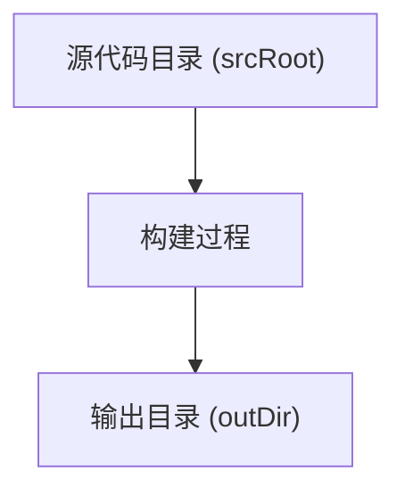
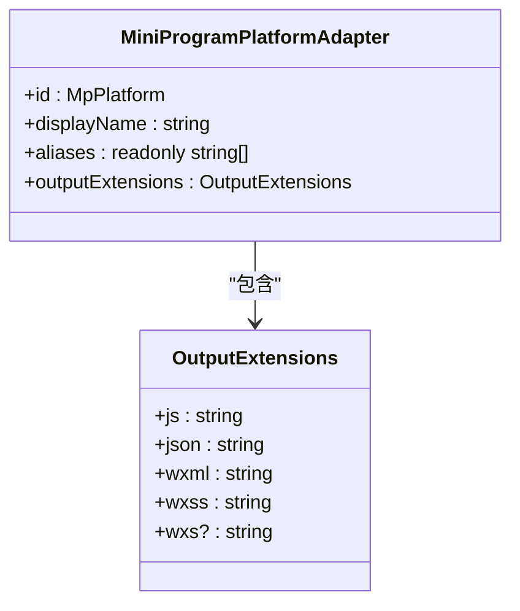

# 基本配置

<cite>
**本文档中引用的文件**  
- [vite.config.ts](file://@weapp-core/init/templates/default/vite.config.ts)
- [vite.config.ts](file://@weapp-core/init/templates/tailwindcss/vite.config.ts)
- [vite.config.mts](file://apps/plugin-demo/vite.config.mts)
- [vite.config.ts](file://apps/subpackage-shared-chunks/vite.config.ts)
- [types.ts](file://packages/weapp-vite/src/types/external.ts)
- [adapters.ts](file://packages/weapp-vite/src/platforms/adapters.ts)
- [platform.ts](file://packages/weapp-vite/src/platform.ts)
- [types.ts](file://packages/weapp-vite/src/platforms/types.ts)
- [viteConfig.ts](file://@weapp-core/init/src/viteConfig.ts)
</cite>

## 目录
1. [简介](#简介)
2. [项目结构](#项目结构)
3. [核心配置项详解](#核心配置项详解)
4. [环境变量处理](#环境变量处理)
5. [基础构建选项](#基础构建选项)
6. [项目元数据配置](#项目元数据配置)
7. [文件类型处理配置](#文件类型处理配置)
8. [实际配置示例](#实际配置示例)
9. [最佳实践](#最佳实践)
10. [结论](#结论)

## 简介
weapp-vite 是一个专为小程序开发设计的现代化构建工具，基于 Vite 构建，提供了快速的开发服务器启动和高效的热更新机制。本文档详细说明了 weapp-vite 的核心配置选项，重点介绍输入输出路径配置、环境变量处理、基础构建选项和项目元数据配置。通过本文档，开发者可以全面了解如何配置 weapp-vite 以满足不同项目的需求。

## 项目结构
weapp-vite 项目的典型结构包括源代码目录、配置文件、资源文件和构建输出目录。源代码通常位于 `src` 目录下，包含页面、组件、工具函数等。配置文件如 `vite.config.ts` 位于项目根目录，用于定义构建和开发服务器的行为。资源文件如图片、样式表等位于 `assets` 目录下。构建输出目录默认为 `dist`，包含编译后的小程序代码。

**Section sources**
- [vite.config.ts](file://@weapp-core/init/templates/default/vite.config.ts#L1-L40)
- [vite.config.ts](file://@weapp-core/init/templates/tailwindcss/vite.config.ts#L1-L38)

## 核心配置项详解
weapp-vite 的核心配置项主要位于 `vite.config.ts` 文件中的 `weapp` 字段下。这些配置项控制着项目的源代码根目录、生成选项、自动路由、组件自动导入等关键功能。

### 输入输出路径配置
输入输出路径配置决定了源代码和构建输出的目录结构。`srcRoot` 配置项指定源代码的根目录，默认为 `src`。`outDir` 配置项指定构建输出的目录，默认为 `dist`。通过合理配置这些路径，可以适应不同的项目结构需求。



**Diagram sources**
- [vite.config.ts](file://@weapp-core/init/templates/default/vite.config.ts#L8)
- [vite.config.ts](file://apps/subpackage-shared-chunks/vite.config.ts#L5)

**Section sources**
- [vite.config.ts](file://@weapp-core/init/templates/default/vite.config.ts#L8)
- [vite.config.ts](file://apps/subpackage-shared-chunks/vite.config.ts#L5)

### 环境变量处理
weapp-vite 支持通过 `.env` 文件定义环境变量。环境变量可以用于区分开发、测试和生产环境的配置。例如，`VITE_ENV` 变量可以用于指定当前环境。环境变量在构建过程中会被注入到代码中，通过 `import.meta.env` 访问。

**Section sources**
- [.env](file://apps/vite-native/envDir/.env#L1)
- [.env](file://apps/vite-native/.env#L1)

## 基础构建选项
基础构建选项包括构建模式、平台适配、插件配置等。`mode` 配置项指定当前构建模式，通常为 `development` 或 `production`。`platform` 配置项指定目标小程序平台，支持微信、支付宝、百度等多种平台。

### 平台适配
weapp-vite 通过 `MINI_PROGRAM_PLATFORM_ADAPTERS` 配置不同小程序平台的文件扩展名映射。例如，微信小程序使用 `.wxml` 和 `.wxss` 扩展名，而支付宝小程序使用 `.axml` 和 `.acss` 扩展名。这种适配机制使得同一套代码可以轻松迁移到不同平台。



**Diagram sources**
- [adapters.ts](file://packages/weapp-vite/src/platforms/adapters.ts#L3-L75)
- [types.ts](file://packages/weapp-vite/src/platforms/types.ts#L3-L28)

**Section sources**
- [adapters.ts](file://packages/weapp-vite/src/platforms/adapters.ts#L3-L75)
- [platform.ts](file://packages/weapp-vite/src/platform.ts#L1-L46)

## 项目元数据配置
项目元数据配置包括项目名称、版本号、依赖管理器等信息。这些信息通常从 `package.json` 文件中读取，并在构建过程中使用。`packageManager` 配置项指定项目使用的包管理器，如 npm、yarn 或 pnpm。

**Section sources**
- [types.ts](file://packages/weapp-vite/src/runtime/config/types.ts#L35-L41)

## 文件类型处理配置
weapp-vite 支持多种文件类型的处理，包括 JavaScript、TypeScript、JSON、WXML、WXSS 等。通过 `generate.extensions` 配置项，可以指定源代码文件的扩展名。例如，将 `js` 映射为 `ts`，实现 TypeScript 开发。

### JavaScript 和 JSON 文件处理
JavaScript 文件可以通过 `jsFormat` 配置项指定输出格式，支持 `esm`（ES 模块）和 `cjs`（CommonJS）两种格式。JSON 文件处理支持动态导入和类型推断，提高开发效率。

**Section sources**
- [vite.config.ts](file://apps/subpackage-shared-chunks/vite.config.ts#L27)
- [vite.config.ts](file://@weapp-core/init/templates/default/vite.config.ts#L13-L14)

## 实际配置示例
以下是一个典型的 weapp-vite 配置文件示例，展示了如何配置多子包、自动导入组件和样式共享。

```typescript
import { defineConfig } from 'weapp-vite/config'

export default defineConfig({
  weapp: {
    srcRoot: 'src',
    autoRoutes: true,
    autoImportComponents: {
      globs: [
        'components/**/*.wxml',
        'shared/**/*.wxml',
      ],
      typedComponents: 'typed-components.d.ts',
      htmlCustomData: 'mini-program.html-data.json',
    },
    generate: {
      extensions: {
        js: 'ts',
        wxss: 'scss',
      },
      dirs: {
        component: 'src/components',
        page: 'src/pages',
      },
    },
    subPackages: {
      'packages/order': {
        independent: true,
        dependencies: ['crypto-es'],
        autoImportComponents: {
          globs: [
            'packages/order/components/**/*.wxml',
          ],
        },
        styles: [
          'styles/theme.scss',
          {
            source: '../shared/styles/components.scss',
            scope: 'components',
            include: ['components/**'],
          },
        ],
      },
    },
  },
  css: {
    preprocessorOptions: {
      scss: {
        silenceDeprecations: ['legacy-js-api', 'import'],
      },
    },
  },
})
```

**Section sources**
- [vite.config.ts](file://apps/subpackage-shared-chunks/vite.config.ts#L1-L83)

## 最佳实践
1. **合理组织项目结构**：将源代码、资源文件和配置文件分开存放，便于管理和维护。
2. **使用环境变量**：通过 `.env` 文件管理不同环境的配置，避免硬编码。
3. **启用自动导入组件**：减少手动导入组件的繁琐操作，提高开发效率。
4. **配置样式共享**：在多子包项目中，通过 `styles` 配置共享样式，避免重复代码。
5. **选择合适的构建模式**：开发环境使用 `development` 模式，生产环境使用 `production` 模式，确保构建输出的优化。

**Section sources**
- [vite.config.ts](file://apps/subpackage-shared-chunks/vite.config.ts#L7-L14)
- [vite.config.ts](file://apps/subpackage-shared-chunks/vite.config.ts#L41-L47)

## 结论
weapp-vite 提供了丰富而灵活的配置选项，能够满足从小型项目到大型复杂项目的各种需求。通过合理配置输入输出路径、环境变量、构建选项和项目元数据，开发者可以充分发挥 weapp-vite 的优势，提高开发效率和代码质量。本文档详细介绍了核心配置项的使用方法和最佳实践，为开发者提供了全面的指导。