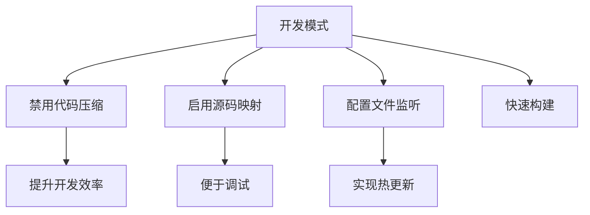
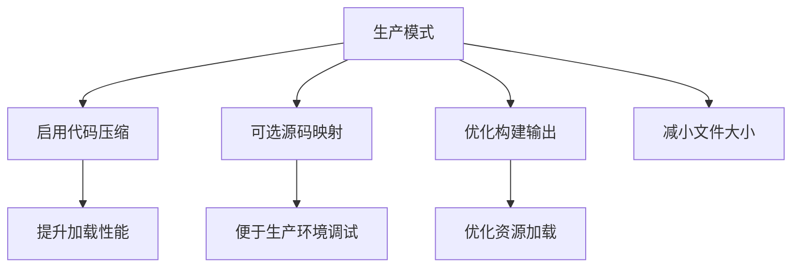
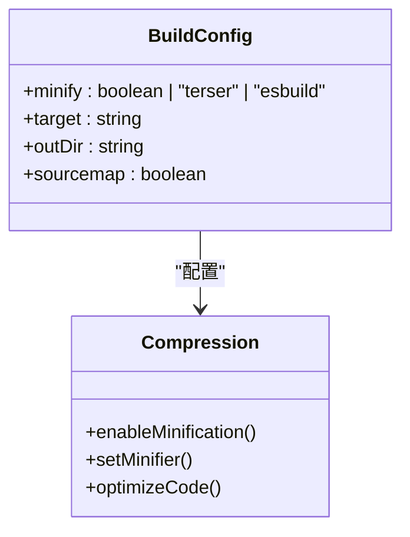
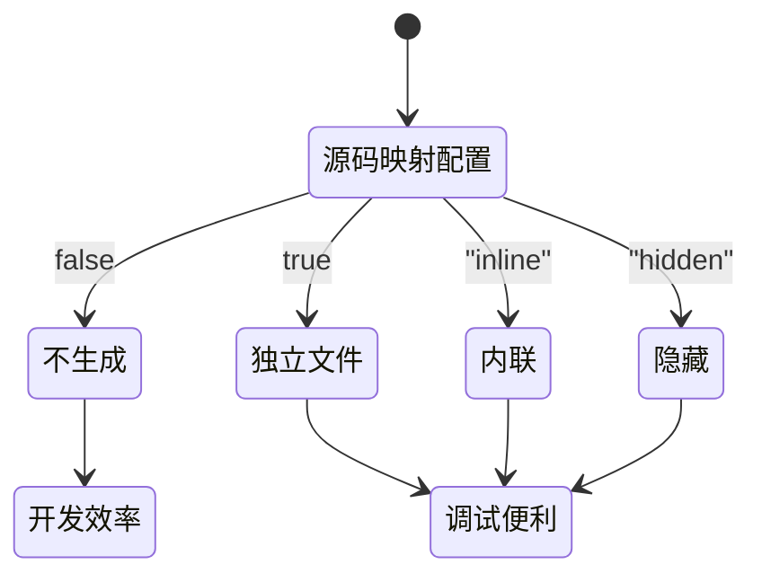
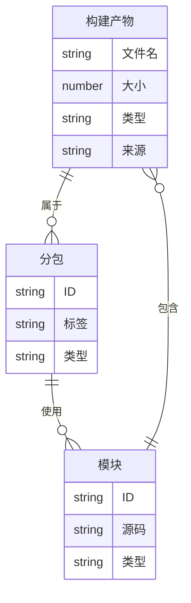

# 基础构建选项

<cite>
**本文档引用文件**   
- [merge.ts](file://packages/weapp-vite/src/runtime/config/internal/merge.ts)
- [build.ts](file://packages/weapp-vite/src/cli/commands/build.ts)
- [serve.ts](file://packages/weapp-vite/src/cli/commands/serve.ts)
- [sharedBuildConfig.ts](file://packages/weapp-vite/src/runtime/sharedBuildConfig.ts)
- [subpackages.ts](file://packages/weapp-vite/src/analyze/subpackages.ts)
- [buildPlugin.ts](file://packages/weapp-vite/src/runtime/buildPlugin.ts)
- [vite.config.ts](file://apps/vite-native/vite.config.ts)
</cite>

## 目录
1. [简介](#简介)
2. [构建模式](#构建模式)
3. [压缩选项](#压缩选项)
4. [源码映射生成](#源码映射生成)
5. [构建报告生成](#构建报告生成)
6. [构建性能优化](#构建性能优化)
7. [常见构建问题解决方案](#常见构建问题解决方案)
8. [配置建议](#配置建议)

## 简介
weapp-vite 是一个专为微信小程序设计的构建工具，基于 Vite 和 Rolldown 构建。本文档详细介绍了 weapp-vite 的核心构建配置选项，包括构建模式、压缩选项、源码映射生成、构建报告生成等关键配置项。通过合理配置这些选项，可以显著提升开发效率和生产环境性能。

**Section sources**
- [merge.ts](file://packages/weapp-vite/src/runtime/config/internal/merge.ts#L1-L319)
- [build.ts](file://packages/weapp-vite/src/cli/commands/build.ts#L1-L81)

## 构建模式
weapp-vite 支持两种主要的构建模式：开发模式（development）和生产模式（production）。这两种模式在配置上有显著差异，以满足不同场景的需求。

### 开发模式
开发模式注重快速构建和调试便利性。在开发模式下，weapp-vite 会禁用代码压缩，启用源码映射，并配置文件监听以实现热更新。



**Diagram sources**
- [merge.ts](file://packages/weapp-vite/src/runtime/config/internal/merge.ts#L170-L196)

### 生产模式
生产模式注重性能优化和代码压缩。在生产模式下，weapp-vite 会启用代码压缩，可选择性生成源码映射，并优化构建输出。



**Diagram sources**
- [merge.ts](file://packages/weapp-vite/src/runtime/config/internal/merge.ts#L202-L220)

## 压缩选项
weapp-vite 提供了灵活的压缩选项，允许开发者根据需求启用或禁用代码压缩，并选择不同的压缩工具。

### 压缩配置
通过 `--minify` 命令行选项或在配置文件中设置 `build.minify`，可以控制代码压缩行为。支持的值包括：
- `true` 或 `false`：启用或禁用压缩
- `"terser"`：使用 Terser 进行压缩
- `"esbuild"`：使用 esbuild 进行压缩（默认）



**Diagram sources**
- [build.ts](file://packages/weapp-vite/src/cli/commands/build.ts#L24-L27)
- [merge.ts](file://packages/weapp-vite/src/runtime/config/internal/merge.ts#L187)

## 源码映射生成
源码映射（source map）是开发调试的重要工具，它能够将压缩后的代码映射回原始源代码，便于开发者定位问题。

### 源码映射配置
weapp-vite 通过 `--sourcemap` 命令行选项或 `build.sourcemap` 配置项来控制源码映射的生成。支持的值包括：
- `false`：不生成源码映射（默认生产模式）
- `true`：生成独立的源码映射文件
- `"inline"`：将源码映射内联到构建产物中
- `"hidden"`：生成源码映射但不在源文件中添加引用



**Diagram sources**
- [build.ts](file://packages/weapp-vite/src/cli/commands/build.ts#L20-L22)
- [merge.ts](file://packages/weapp-vite/src/runtime/config/internal/merge.ts#L193)

## 构建报告生成
weapp-vite 提供了构建报告生成功能，帮助开发者分析构建结果，优化项目结构。

### 分包分析仪表盘
通过 `--analyze` 选项可以启动分包分析仪表盘，可视化展示构建产物的分布情况。



**Diagram sources**
- [subpackages.ts](file://packages/weapp-vite/src/analyze/subpackages.ts#L1-L601)
- [serve.ts](file://packages/weapp-vite/src/cli/commands/serve.ts#L52-L55)

## 构建性能优化
weapp-vite 提供了多种构建性能优化选项，帮助解决构建速度慢、文件过大等问题。

### 构建性能监控
通过 `vite-plugin-performance` 插件，可以监控各个构建钩子的执行时间，识别性能瓶颈。


**Diagram sources**
- [buildPlugin.ts](file://packages/weapp-vite/src/runtime/buildPlugin.ts#L261-L275)
- [sharedBuildConfig.ts](file://packages/weapp-vite/src/runtime/sharedBuildConfig.ts#L49-L85)

## 常见构建问题解决方案
### 构建速度慢
- **问题原因**：依赖扫描耗时、文件监听范围过大
- **解决方案**：
  - 优化 `watch.include` 和 `watch.exclude` 配置
  - 使用 `--emptyOutDir` 选项控制输出目录清理
  - 启用缓存机制

### 文件过大
- **问题原因**：未启用压缩、第三方库体积过大
- **解决方案**：
  - 确保生产模式下启用压缩
  - 使用 `optimizeDeps.include` 预构建大型依赖
  - 实施代码分割策略

### 源码映射不准确
- **问题原因**：源码映射配置不当、构建过程中的代码转换
- **解决方案**：
  - 检查 `build.sourcemap` 配置
  - 确保构建过程中的代码转换保持源码映射完整性
  - 使用正确的源码映射生成模式

**Section sources**
- [merge.ts](file://packages/weapp-vite/src/runtime/config/internal/merge.ts#L178-L186)
- [build.ts](file://packages/weapp-vite/src/cli/commands/build.ts#L29-L31)

## 配置建议
### 开发环境配置
开发环境应优先考虑构建速度和调试便利性：

```typescript
// vite.config.ts
export default {
  build: {
    minify: false,
    sourcemap: true,
    watch: {
      exclude: ['**/dist/**'],
      include: ['src/**']
    }
  }
}
```

### 生产环境配置
生产环境应优先考虑性能优化和代码压缩：

```typescript
// vite.config.ts
export default {
  build: {
    minify: 'esbuild',
    sourcemap: false,
    emptyOutDir: true
  }
}
```

### 不同场景下的配置策略
| 场景 | 构建模式 | 压缩 | 源码映射 | 构建报告 |
|------|---------|------|---------|---------|
| 本地开发 | development | 禁用 | 启用 | 禁用 |
| 预发布 | production | 启用 | "hidden" | 启用 |
| 正式发布 | production | 启用 | 禁用 | 启用 |

**Section sources**
- [vite.config.ts](file://apps/vite-native/vite.config.ts#L1-L50)
- [merge.ts](file://packages/weapp-vite/src/runtime/config/internal/merge.ts#L170-L220)