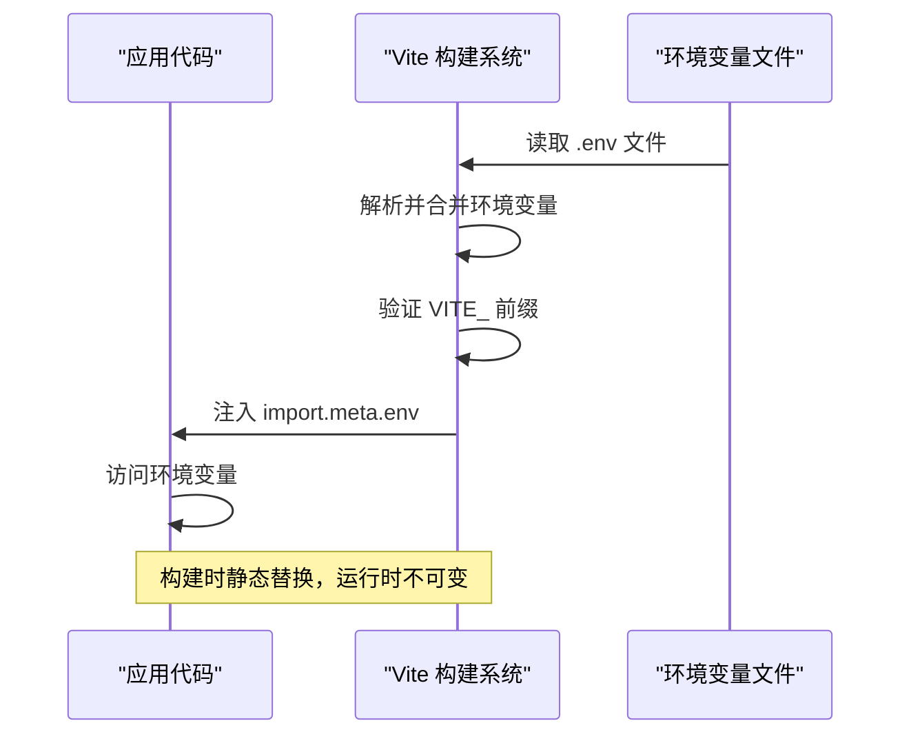

# 环境变量处理

<cite>
**本文档中引用的文件**  
- [vite.config.ts](file://apps/vite-native/vite.config.ts)
- [.env](file://apps/vite-native/.env)
- [.env.development](file://apps/vite-native/.env.development)
- [.env.prod](file://apps/vite-native/envDir/.env.prod)
- [config.ts](file://packages/weapp-vite/src/config.ts)
- [index.ts](file://apps/vite-native/pages/features/runtime/index.ts)
- [platform.ts](file://apps/weapp-vite-web-demo/src/utils/platform.ts)
- [gitignore.ts](file://@weapp-core/init/src/gitignore.ts)
</cite>

## 目录
1. [简介](#简介)
2. [环境变量文件配置](#环境变量文件配置)
3. [环境变量加载机制](#环境变量加载机制)
4. [代码中访问环境变量](#代码中访问环境变量)
5. [实际应用场景](#实际应用场景)
6. [安全性最佳实践](#安全性最佳实践)
7. [常见问题与解决方案](#常见问题与解决方案)
8. [总结](#总结)

## 简介
weapp-vite 提供了一套完整的环境变量处理机制，支持多环境配置、安全注入和灵活的变量管理。本文档详细介绍了环境变量的配置方式、加载优先级、使用方法以及最佳实践，帮助开发者高效地管理不同环境下的应用配置。

## 环境变量文件配置
weapp-vite 支持标准的 `.env` 文件格式来定义环境变量。项目中可以创建多个环境变量文件以支持不同的部署环境。

### 支持的环境变量文件
- `.env`：所有环境下都会加载的基础环境变量
- `.env.local`：本地环境变量，通常不提交到版本控制系统
- `.env.development`：开发环境专用变量
- `.env.test`：测试环境专用变量
- `.env.production`：生产环境专用变量
- `.env.[mode]`：特定模式下的环境变量文件

### 示例配置文件
```env
# .env - 基础环境变量
VITE_APP_NAME=MyApp
VITE_API_BASE_URL=https://api.example.com

# .env.development - 开发环境变量
VITE_API_BASE_URL=http://localhost:3000
VITE_DEBUG_MODE=true

# .env.prod - 生产环境变量
VITE_API_BASE_URL=https://api.production.com
VITE_SENTRY_DSN=your-sentry-dsn-here
```

**Section sources**
- [.env](file://apps/vite-native/.env#L1)
- [.env.development](file://apps/vite-native/.env.development#L1)
- [.env.prod](file://apps/vite-native/envDir/.env.prod#L1)

## 环境变量加载机制
weapp-vite 的环境变量加载遵循特定的优先级规则，确保正确的变量被应用。

### 加载优先级
1. `.env` 文件中的变量（所有环境通用）
2. `.env.${NODE_ENV}` 文件中的变量（特定环境）
3. `.env.local` 文件中的变量（本地覆盖）
4. `.env.${NODE_ENV}.local` 文件中的变量（特定环境的本地覆盖）
5. 系统环境变量（最高优先级）

### 自定义环境变量目录
通过 `envDir` 配置项可以指定环境变量文件的存放目录：

```ts
// vite.config.ts
export default {
  envDir: 'envDir', // 指定环境变量文件目录
  // 其他配置...
}
```

这种配置允许将所有环境变量文件集中管理在特定目录中，提高项目组织的清晰度。

```mermaid
flowchart TD
A[开始] --> B{加载 .env 文件}
B --> C[加载 .env.${NODE_ENV} 文件]
C --> D[加载 .env.local 文件]
D --> E[加载 .env.${NODE_ENV}.local 文件]
E --> F[合并系统环境变量]
F --> G[最终环境变量对象]
G --> H[注入到构建过程]
```

**Diagram sources**
- [vite.config.ts](file://apps/vite-native/vite.config.ts#L50)
- [.env](file://apps/vite-native/.env#L1)

**Section sources**
- [vite.config.ts](file://apps/vite-native/vite.config.ts#L50-L50)

## 代码中访问环境变量
在 weapp-vite 项目中，可以通过 `import.meta.env` 对象安全地访问环境变量。

### 访问方式
```ts
// 访问自定义环境变量
const apiUrl = import.meta.env.VITE_API_BASE_URL;

// 访问内置环境变量
const isDev = import.meta.env.DEV;
const isProd = import.meta.env.PROD;
const mode = import.meta.env.MODE;

// 类型安全的访问
interface ImportMetaEnv {
  VITE_API_BASE_URL: string;
  VITE_DEBUG_MODE: string;
  PLATFORM: string;
}

interface ImportMeta {
  readonly env: ImportMetaEnv;
}
```

### 运行时环境检测
```ts
// platform.ts
export const platform = import.meta.env.PLATFORM as RuntimePlatform;
export const isWeb = import.meta.env.IS_WEB;
export const isMiniProgram = import.meta.env.IS_MINIPROGRAM;
```

这些变量在构建时被静态替换，确保不会将敏感信息暴露在客户端代码中。



**Diagram sources**
- [platform.ts](file://apps/weapp-vite-web-demo/src/utils/platform.ts#L22-L24)
- [index.ts](file://apps/vite-native/pages/features/runtime/index.ts#L34)

**Section sources**
- [platform.ts](file://apps/weapp-vite-web-demo/src/utils/platform.ts#L22-L24)
- [index.ts](file://apps/vite-native/pages/features/runtime/index.ts#L34-L36)

## 实际应用场景
环境变量在实际开发中有多种重要应用场景。

### API 地址配置
根据不同环境使用不同的 API 地址：

```env
# .env.development
VITE_API_BASE_URL=http://localhost:3000

# .env.production  
VITE_API_BASE_URL=https://api.production.com
```

```ts
const apiClient = new APIClient({
  baseURL: import.meta.env.VITE_API_BASE_URL,
});
```

### 功能开关控制
通过环境变量控制功能的启用状态：

```env
VITE_FEATURE_NEW_DASHBOARD=true
VITE_FEATURE_USER_ANALYTICS=false
```

```ts
if (import.meta.env.VITE_FEATURE_NEW_DASHBOARD === 'true') {
  renderNewDashboard();
} else {
  renderLegacyDashboard();
}
```

### 调试模式
启用调试工具和日志：

```env
VITE_DEBUG_MODE=true
VITE_SENTRY_DSN=your-dsn-here
```

```ts
if (import.meta.env.VITE_DEBUG_MODE === 'true') {
  enableDebugTools();
  console.log('调试模式已启用');
}
```

**Section sources**
- [.env](file://apps/vite-native/.env#L1)
- [.env.development](file://apps/vite-native/.env.development#L1)
- [platform.ts](file://apps/weapp-vite-web-demo/src/utils/platform.ts#L22-L24)

## 安全性最佳实践
正确管理环境变量对于应用安全至关重要。

### 敏感信息保护
- 所有环境变量必须以 `VITE_` 前缀开头才能暴露给客户端代码
- 敏感信息（如数据库密码、私钥）不应包含在 `.env` 文件中
- 使用 `.env.local` 文件存储本地敏感信息，并将其添加到 `.gitignore`

```ts
// .gitignore
.env.local
.env.development.local
.env.test.local
.env.production.local
```

### 变量命名规范
- 使用大写字母和下划线命名变量：`VITE_API_BASE_URL`
- 使用一致的命名空间：`VITE_FEATURE_`, `VITE_ANALYTICS_`
- 避免使用缩写，确保变量名具有描述性

### 类型安全
为环境变量定义 TypeScript 类型，提高代码安全性：

```ts
// vite-env.d.ts
interface ImportMetaEnv {
  VITE_API_BASE_URL: string;
  VITE_APP_VERSION: string;
  VITE_SENTRY_DSN?: string;
  VITE_FEATURE_FLAGS: string;
}

interface ImportMeta {
  readonly env: ImportMetaEnv;
}
```

**Section sources**
- [gitignore.ts](file://@weapp-core/init/src/gitignore.ts#L24-L27)
- [vite-env.d.ts](file://apps/vite-native/vite-env.d.ts)

## 常见问题与解决方案
### 环境变量未生效
**问题**：修改环境变量后，前端代码中获取的值没有更新。

**解决方案**：
1. 重启开发服务器
2. 确保变量名以 `VITE_` 开头
3. 检查文件编码是否为 UTF-8
4. 清理构建缓存

### 类型转换错误
**问题**：环境变量总是字符串类型，需要进行类型转换。

**解决方案**：
```ts
// 字符串转布尔值
const isDebug = import.meta.env.VITE_DEBUG_MODE === 'true';

// 字符串转数字
const port = Number(import.meta.env.VITE_PORT);

// JSON 字符串解析
const featureFlags = JSON.parse(import.meta.env.VITE_FEATURE_FLAGS || '{}');
```

### 环境变量泄露
**问题**：不小心将敏感信息暴露给客户端。

**预防措施**：
- 严格遵守 `VITE_` 前缀规则
- 使用 CI/CD 工具扫描代码中的敏感信息
- 定期审查 `.env` 文件内容

**Section sources**
- [config.ts](file://packages/weapp-vite/src/config.ts)
- [gitignore.ts](file://@weapp-core/init/src/gitignore.ts#L24-L27)

## 总结
weapp-vite 的环境变量处理机制提供了灵活、安全的配置管理方案。通过合理的文件组织、正确的加载优先级和类型安全的访问方式，开发者可以轻松管理不同环境下的应用配置。遵循最佳实践，特别是关于敏感信息保护和变量命名规范，能够确保应用的安全性和可维护性。