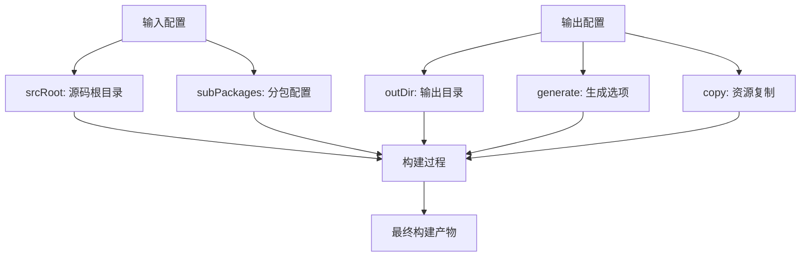
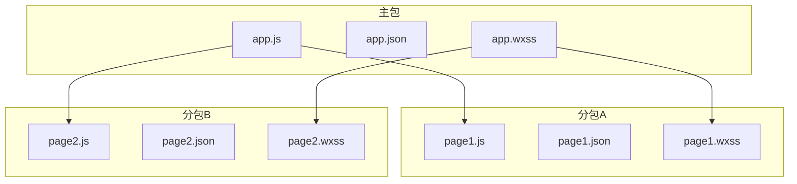

# 输入输出配置

<cite>
**本文档引用文件**  
- [vite.config.ts](file://templates/weapp-vite-template/vite.config.ts)
- [config.ts](file://packages/weapp-vite/src/types/config.ts)
- [weappConfig.ts](file://packages/weapp-vite/src/utils/weappConfig.ts)
- [viteConfig.ts](file://@weapp-core/init/src/viteConfig.ts)
</cite>

## 目录
1. [输入配置详解](#输入配置详解)
2. [输出配置详解](#输出配置详解)
3. [构建与开发服务器行为](#构建与开发服务器行为)
4. [常见配置错误及解决方案](#常见配置错误及解决方案)
5. [初学者配置示例](#初学者配置示例)
6. [高级多页面应用配置](#高级多页面应用配置)

## 输入配置详解

在weapp-vite中，输入配置主要通过`weapp`对象中的`srcRoot`字段来指定项目入口文件路径。该配置项定义了应用源码的根目录，通常包含`app.json`文件。

支持的路径模式包括：
- 绝对路径：如`/Users/icebreaker/project/src`
- 相对路径：如`src`或`./src`
- 当前目录：使用`.`表示项目根目录

多入口配置方法通过分包机制实现，可以在`subPackages`配置项中定义多个分包，每个分包都有独立的`root`和`pages`配置。

**Section sources**
- [config.ts](file://packages/weapp-vite/src/types/config.ts#L335-L336)
- [vite.config.ts](file://templates/weapp-vite-template/vite.config.ts#L8)

## 输出配置详解

输出配置主要涉及构建产物的目录结构和文件命名规则。核心配置项包括：

- **输出目录**：通过`outDir`参数控制，可自定义构建产物的输出路径
- **文件命名规则**：支持通过`generate`配置项中的`filenames`字段自定义生成文件的名称
- **资源文件处理**：通过`copy`选项配置需要额外复制的资源文件，支持glob模式匹配

资源文件处理还支持预处理器选项配置，例如SCSS的`silenceDeprecations`设置，确保构建过程中的兼容性。



**Diagram sources**
- [config.ts](file://packages/weapp-vite/src/types/config.ts#L378-L407)
- [vite.config.ts](file://templates/weapp-vite-template/vite.config.ts#L11-L25)

**Section sources**
- [config.ts](file://packages/weapp-vite/src/types/config.ts#L378-L407)
- [vite.config.ts](file://templates/weapp-vite-template/vite.config.ts#L11-L25)

## 构建与开发服务器行为

输入输出配置直接影响构建结果和开发服务器的文件监听行为。当`srcRoot`发生变化时，开发服务器会重新建立文件监听关系。

构建过程中，系统会根据`srcRoot`定位入口文件，并基于分包配置生成相应的构建任务。开发服务器会监听所有相关源文件的变化，包括：
- 主包页面文件
- 分包页面文件
- 样式文件
- 配置文件

文件监听范围由`watchFiles`调试选项控制，可通过`debug.watchFiles`钩子函数进行自定义。

**Section sources**
- [config.ts](file://packages/weapp-vite/src/types/config.ts#L459)
- [weappConfig.ts](file://packages/weapp-vite/src/utils/weappConfig.ts#L21-L30)

## 常见配置错误及解决方案

### 路径解析问题
**问题描述**：相对路径解析错误导致找不到入口文件  
**解决方案**：使用绝对路径或确保相对路径相对于项目根目录正确

### 文件遗漏
**问题描述**：某些资源文件未包含在构建产物中  
**解决方案**：在`copy`配置中添加相应的glob模式，如`**/*.png`包含所有PNG文件

### 分包配置错误
**问题描述**：分包页面无法正确加载  
**解决方案**：检查`subPackages`中`root`和`pages`路径的相对关系，确保路径正确

**Section sources**
- [config.ts](file://packages/weapp-vite/src/types/config.ts#L390-L401)
- [weappConfig.ts](file://packages/weapp-vite/src/utils/weappConfig.ts#L40-L44)

## 初学者配置示例

对于初学者，推荐使用简单的单入口配置：

```typescript
export default defineConfig({
  weapp: {
    srcRoot: 'src',
    generate: {
      extensions: {
        js: 'ts',
        wxss: 'scss'
      }
    }
  }
})
```

此配置将源码根目录设为`src`，并启用TypeScript和SCSS预处理器支持。

**Section sources**
- [vite.config.ts](file://templates/weapp-vite-template/vite.config.ts#L3-L26)

## 高级多页面应用配置

对于复杂的多页面应用，可以使用以下高级配置：

```typescript
export default defineConfig({
  weapp: {
    srcRoot: 'src',
    subPackages: {
      'packageA': {
        independent: true,
        styles: ['styles/global.wxss'],
        watchSharedStyles: true
      },
      'packageB': {
        independent: false,
        dependencies: [/^lodash/]
      }
    },
    chunks: {
      sharedStrategy: 'hoist',
      logOptimization: true
    }
  }
})
```

该配置实现了：
- 多分包管理
- 共享代码提升策略
- 分包样式注入
- 依赖关系控制



**Diagram sources**
- [config.ts](file://packages/weapp-vite/src/types/config.ts#L390-L401)
- [vite.config.ts](file://templates/weapp-vite-template/vite.config.ts#L3-L26)

**Section sources**
- [config.ts](file://packages/weapp-vite/src/types/config.ts#L390-L401)
- [vite.config.ts](file://templates/weapp-vite-template/vite.config.ts#L3-L26)