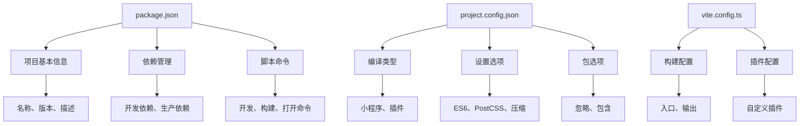
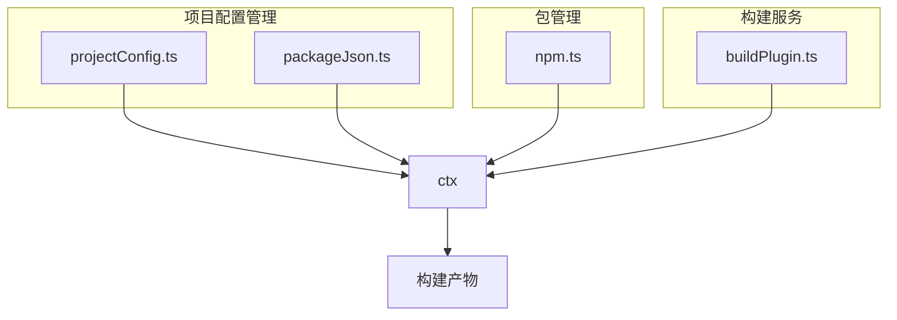
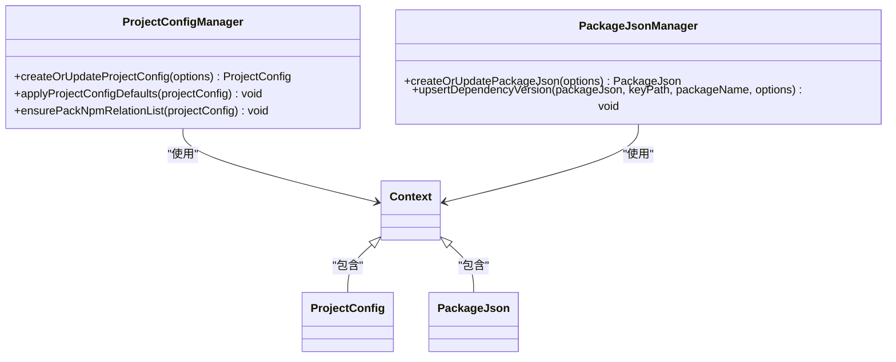
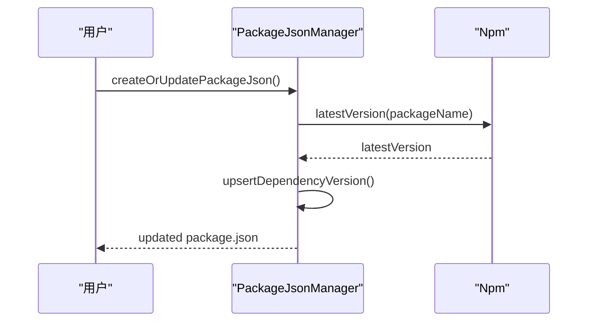
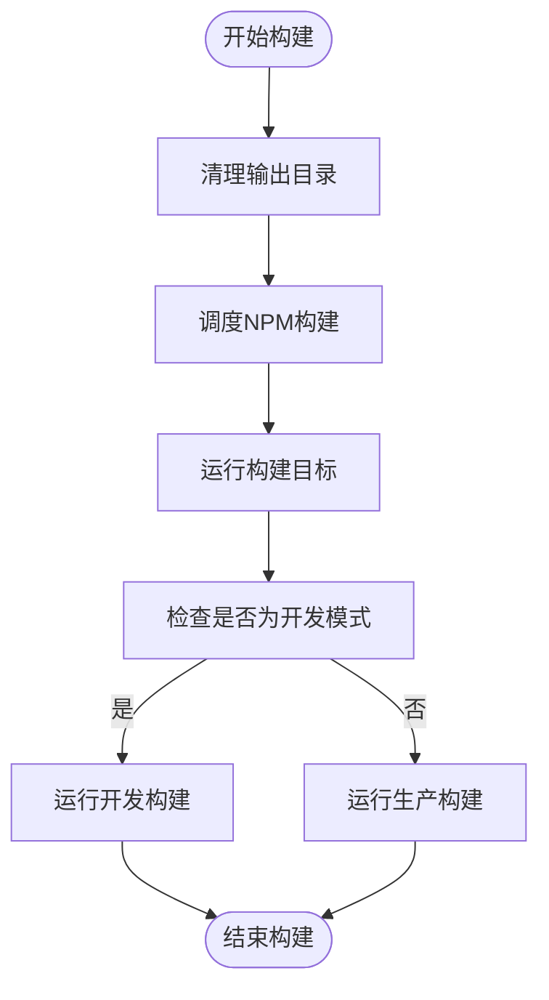
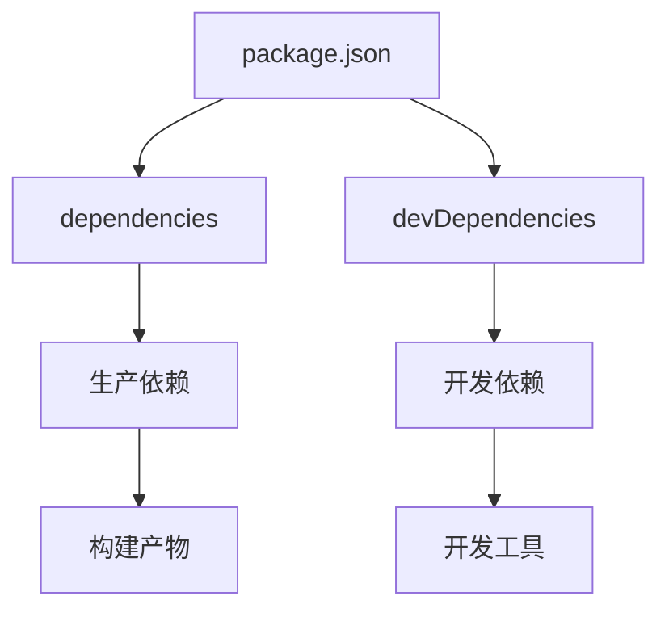

# 项目元数据配置

<cite>
**本文档引用的文件**
- [package.json](file://packages/weapp-vite/package.json)
- [projectConfig.ts](file://@weapp-core/init/src/projectConfig.ts)
- [packageJson.ts](file://@weapp-core/init/src/packageJson.ts)
- [project.config.json](file://apps/plugin-demo/project.config.json)
- [project.config.json](file://templates/weapp-vite-template/project.config.json)
- [types.ts](file://@weapp-core/init/src/types.ts)
- [context.ts](file://@weapp-core/init/src/context.ts)
- [createProject.ts](file://@weapp-core/init/src/createProject.ts)
- [viteConfig.ts](file://@weapp-core/init/src/viteConfig.ts)
- [website/guide/index.md](file://website/guide/index.md)
</cite>

## 目录
1. [简介](#简介)
2. [项目结构](#项目结构)
3. [核心组件](#核心组件)
4. [架构概述](#架构概述)
5. [详细组件分析](#详细组件分析)
6. [依赖分析](#依赖分析)
7. [性能考虑](#性能考虑)
8. [故障排除指南](#故障排除指南)
9. [结论](#结论)

## 简介
weapp-vite 是一个现代化的小程序打包工具，其项目元数据配置在开发流程中起着至关重要的作用。本文档全面介绍 weapp-vite 中与项目信息相关的配置选项，包括如何配置项目名称、版本号、描述等基本信息，以及这些信息如何影响构建产物和开发工具显示。文档详细解释项目元数据在插件系统、依赖管理、版本控制等方面的作用，提供实际示例展示元数据配置在团队协作、持续集成、发布管理中的应用，并包含元数据配置的最佳实践和常见问题解决方案。

## 项目结构
weapp-vite 项目的元数据配置主要分布在多个关键文件中，包括 `package.json`、`project.config.json` 和 `vite.config.ts`。这些文件共同定义了项目的各种属性和行为。`package.json` 文件包含项目的基本信息如名称、版本、描述、作者等，以及依赖关系和脚本命令。`project.config.json` 是微信小程序的项目配置文件，包含编译类型、设置选项、包选项等。`vite.config.ts` 则是 Vite 构建工具的配置文件，定义了构建过程中的各种选项。

**图示来源**
- [package.json](file://packages/weapp-vite/package.json)
- [projectConfig.ts](file://@weapp-core/init/src/projectConfig.ts)
- [packageJson.ts](file://@weapp-core/init/src/packageJson.ts)

**本节来源**
- [package.json](file://packages/weapp-vite/package.json)
- [projectConfig.ts](file://@weapp-core/init/src/projectConfig.ts)
- [packageJson.ts](file://@weapp-core/init/src/packageJson.ts)

## 核心组件
weapp-vite 的核心组件包括项目配置管理、包管理、构建服务等。项目配置管理通过 `projectConfig.ts` 和 `packageJson.ts` 文件实现，负责创建和更新项目配置文件。包管理通过 `npm.ts` 文件实现，负责处理项目依赖。构建服务通过 `buildPlugin.ts` 文件实现，负责编译和打包项目。

**本节来源**
- [projectConfig.ts](file://@weapp-core/init/src/projectConfig.ts)
- [packageJson.ts](file://@weapp-core/init/src/packageJson.ts)
- [npm.ts](file://@weapp-core/init/src/npm.ts)
- [buildPlugin.ts](file://packages/weapp-vite/src/runtime/buildPlugin.ts)

## 架构概述
weapp-vite 的架构设计遵循模块化原则，各个组件之间通过清晰的接口进行通信。项目配置管理组件负责初始化和更新项目配置文件，包管理组件负责处理项目依赖，构建服务组件负责编译和打包项目。这些组件通过上下文对象 `ctx` 进行数据共享和状态管理。

**图示来源**
- [projectConfig.ts](file://@weapp-core/init/src/projectConfig.ts)
- [packageJson.ts](file://@weapp-core/init/src/packageJson.ts)
- [npm.ts](file://@weapp-core/init/src/npm.ts)
- [buildPlugin.ts](file://packages/weapp-vite/src/runtime/buildPlugin.ts)

## 详细组件分析
### 项目配置管理分析
项目配置管理组件通过 `projectConfig.ts` 和 `packageJson.ts` 文件实现。`projectConfig.ts` 文件中的 `createOrUpdateProjectConfig` 函数负责创建或更新 `project.config.json` 文件，确保配置文件的完整性和正确性。`packageJson.ts` 文件中的 `createOrUpdatePackageJson` 函数负责创建或更新 `package.json` 文件，确保依赖关系和脚本命令的正确性。

#### 对象导向组件

**图示来源**
- [projectConfig.ts](file://@weapp-core/init/src/projectConfig.ts)
- [packageJson.ts](file://@weapp-core/init/src/packageJson.ts)
- [context.ts](file://@weapp-core/init/src/context.ts)

### 包管理分析
包管理组件通过 `npm.ts` 文件实现，负责处理项目依赖。`npm.ts` 文件中的 `latestVersion` 函数用于获取最新的包版本，`upsertDependencyVersion` 函数用于更新依赖版本。

#### API/服务组件

**图示来源**
- [packageJson.ts](file://@weapp-core/init/src/packageJson.ts)
- [npm.ts](file://@weapp-core/init/src/npm.ts)

### 构建服务分析
构建服务组件通过 `buildPlugin.ts` 文件实现，负责编译和打包项目。`buildPlugin.ts` 文件中的 `createBuildService` 函数创建构建服务，`buildEntry` 函数执行构建任务。

#### 复杂逻辑组件

**图示来源**
- [buildPlugin.ts](file://packages/weapp-vite/src/runtime/buildPlugin.ts)

**本节来源**
- [projectConfig.ts](file://@weapp-core/init/src/projectConfig.ts)
- [packageJson.ts](file://@weapp-core/init/src/packageJson.ts)
- [npm.ts](file://@weapp-core/init/src/npm.ts)
- [buildPlugin.ts](file://packages/weapp-vite/src/runtime/buildPlugin.ts)

## 依赖分析
weapp-vite 项目的依赖关系通过 `package.json` 文件中的 `dependencies` 和 `devDependencies` 字段定义。`dependencies` 字段包含生产环境所需的依赖，`devDependencies` 字段包含开发环境所需的依赖。项目通过 `npm install` 命令安装这些依赖，并在构建过程中使用它们。

**图示来源**
- [package.json](file://packages/weapp-vite/package.json)

**本节来源**
- [package.json](file://packages/weapp-vite/package.json)

## 性能考虑
weapp-vite 在设计时充分考虑了性能优化。通过使用 Vite 的热模块替换（HMR）功能，开发者可以在保存代码后立即看到更改，无需重新加载整个页面。此外，weapp-vite 还支持按需加载和代码分割，减少初始加载时间，提高应用性能。

## 故障排除指南
### 常见问题
1. **元数据未正确更新**：确保 `project.config.json` 和 `package.json` 文件的路径正确，并且有写权限。
2. **信息显示异常**：检查 `project.config.json` 和 `package.json` 文件中的配置是否正确，特别是 `miniprogramRoot` 和 `srcMiniprogramRoot` 字段。
3. **依赖安装失败**：确保网络连接正常，并且 `npm` 或 `pnpm` 已正确安装。

**本节来源**
- [projectConfig.ts](file://@weapp-core/init/src/projectConfig.ts)
- [packageJson.ts](file://@weapp-core/init/src/packageJson.ts)

## 结论
weapp-vite 的项目元数据配置是开发流程中的重要组成部分，通过合理配置 `package.json`、`project.config.json` 和 `vite.config.ts` 文件，可以有效管理项目信息、依赖关系和构建过程。本文档详细介绍了这些配置文件的作用和最佳实践，帮助开发者更好地理解和使用 weapp-vite。