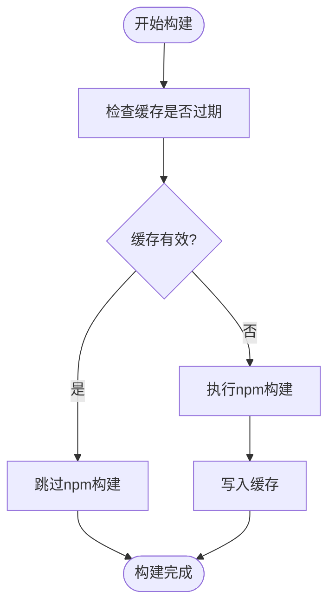

# NPM配置

<cite>
**本文档引用文件**   
- [npmPlugin.ts](file://packages/weapp-vite/src/runtime/npmPlugin.ts)
- [config.ts](file://packages/weapp-vite/src/types/config.ts)
- [npm.md](file://website/config/npm.md)
- [buildPlugin.ts](file://packages/weapp-vite/src/runtime/buildPlugin.ts)
</cite>

## 目录
1. [NPM自动构建与内联策略](#npm自动构建与内联策略)
2. [weapp.npm配置选项](#weappnpm配置选项)
3. [构建行为控制](#构建行为控制)
4. [缓存机制](#缓存机制)
5. [构建选项定制](#构建选项定制)
6. [手动构建命令](#手动构建命令)
7. [最佳实践与常见问题](#最佳实践与常见问题)

## NPM自动构建与内联策略

weapp-vite将npm依赖分为“自动构建”和“自动内联”两种策略。`dependencies`中的依赖会被自动构建到`miniprogram_npm`目录中，而`devDependencies`中的依赖则会被内联到页面JS中，避免额外的包体体积。

例如，在`package.json`中：
```json
{
  "dependencies": {
    "lodash": "^4.17.21"
  },
  "devDependencies": {
    "lodash-es": "^4.17.21"
  }
}
```

- 引入`lodash`时，产物会生成`require('lodash')`，代码写入`miniprogram_npm/lodash`。
- 引入`lodash-es`时，相关实现代码直接被内联到页面JS中。

建议团队约定：运行时代码需要的依赖放在`dependencies`，开发工具链或构建脚本使用的放在`devDependencies`，让weapp-vite自动做出正确判断。

**Section sources**
- [npm.md](file://website/config/npm.md#L7-L23)

## weapp.npm配置选项

`weapp.npm`配置对象用于精细控制npm依赖的构建行为，其类型定义如下：

```ts
{
  enable?: boolean
  cache?: boolean
  buildOptions?: (options: NpmBuildOptions, meta: { name: string; entry: InputOption }) => NpmBuildOptions | undefined
}
```

默认值为`{ enable: true, cache: true }`。

**Section sources**
- [config.ts](file://packages/weapp-vite/src/types/config.ts#L358-L373)
- [npm.md](file://website/config/npm.md#L25-L34)

## 构建行为控制

### enable

`enable`字段是全局开关，用于控制是否生成`miniprogram_npm`目录。当设置为`false`时，不会自动构建npm依赖，但仍支持自动内联。

```ts
export default defineConfig({
  weapp: {
    npm: {
      enable: false // 禁用npm自动构建
    }
  }
})
```

在某些项目中，可能不希望自动构建`miniprogram_npm`，此时可以将`enable`设置为`false`。

**Section sources**
- [npm.md](file://website/config/npm.md#L88)
- [npmPlugin.ts](file://packages/weapp-vite/src/runtime/npmPlugin.ts#L257-L259)

## 缓存机制

### cache

`cache`字段控制npm构建缓存。默认情况下，weapp-vite会缓存构建结果以提高构建速度。在调试构建问题时，可以临时关闭缓存。

```ts
export default defineConfig({
  weapp: {
    npm: {
      cache: false // 临时关闭缓存
    }
  }
})
```

当`cache`为`true`时，weapp-vite会检查`node_modules/weapp-vite/.cache/`目录下的缓存文件，如果依赖未发生变化，则跳过构建。

**Section sources**
- [npm.md](file://website/config/npm.md#L89)
- [npmPlugin.ts](file://packages/weapp-vite/src/runtime/npmPlugin.ts#L58-L84)

## 构建选项定制

### buildOptions

`buildOptions`函数允许为不同的npm包定制Vite库模式的编译配置。该函数接收两个参数：`options`（默认构建选项）和`meta`（包含包名和入口信息）。

```ts
export default defineConfig({
  weapp: {
    npm: {
      buildOptions(options, { name }) {
        if (name === 'lodash') {
          return {
            ...options,
            build: {
              ...options.build,
              target: 'es2018',
              rollupOptions: {
                ...options.build?.rollupOptions,
                treeshake: true,
              },
            },
          }
        }

        if (name === 'dayjs') {
          const external = options.build?.rollupOptions?.external ?? []
          return {
            ...options,
            build: {
              ...options.build,
              rollupOptions: {
                ...options.build?.rollupOptions,
                external: [...external, 'dayjs/plugin/advancedFormat'],
              },
            },
          }
        }

        return options
      },
    },
  },
})
```

通过`buildOptions`，可以为特定包设置不同的目标版本、开启tree-shaking或声明外部依赖。

**Section sources**
- [npm.md](file://website/config/npm.md#L90-L93)
- [npmPlugin.ts](file://packages/weapp-vite/src/runtime/npmPlugin.ts#L87-L155)

## 手动构建命令

当需要在命令行复现“工具 → 构建 npm”时，可以在`package.json`中添加脚本：

```json
{
  "scripts": {
    "build:npm": "weapp-vite build:npm",
    "npm": "weapp-vite npm"
  }
}
```

随后运行`pnpm run build:npm`（或`pnpm run npm`），即可与微信开发者工具保持一致，方便在CI/CD中复用。

**Section sources**
- [npm.md](file://website/config/npm.md#L95-L108)

## 最佳实践与常见问题

### 常见问题排查

| 现象 | 建议排查顺序 |
| --- | --- |
| `miniprogram_npm`体积过大 | 使用`dependencies`精确列出主包依赖，并在`subPackages.*.dependencies`中裁剪独立分包依赖 |
| npm构建内容未更新 | 尝试将`cache`设为`false`或删除`node_modules/.cache/weapp-vite`目录 |
| 某npm包构建失败 | 在`buildOptions`中为该包设置`external` / `format`，或改为自动内联 |

### 构建流程

在构建过程中，weapp-vite会首先检查npm依赖是否发生变化，如果未变化且缓存存在，则跳过构建。否则，会调用`viteBuild`进行构建，并将结果写入`miniprogram_npm`目录。



**Diagram sources**
- [npmPlugin.ts](file://packages/weapp-vite/src/runtime/npmPlugin.ts#L256-L347)
- [buildPlugin.ts](file://packages/weapp-vite/src/runtime/buildPlugin.ts#L314-L344)

**Section sources**
- [npm.md](file://website/config/npm.md#L112-L117)
- [buildPlugin.ts](file://packages/weapp-vite/src/runtime/buildPlugin.ts#L314-L344)