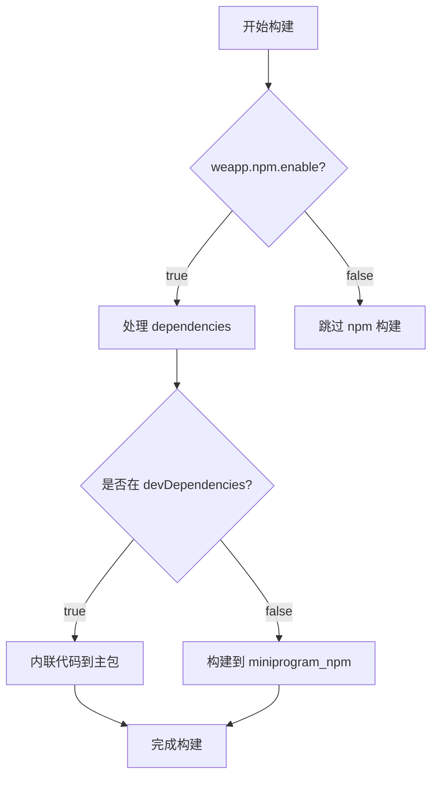
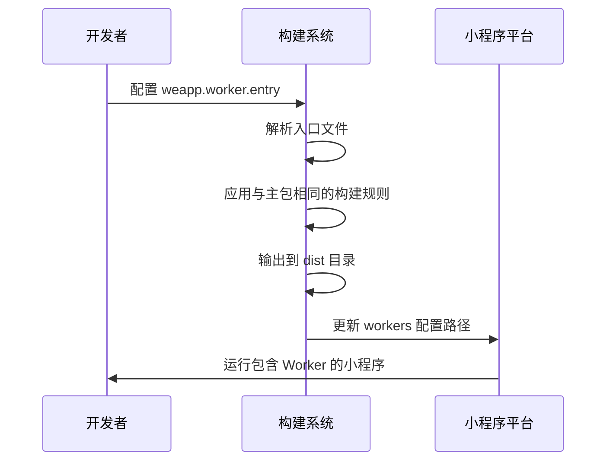
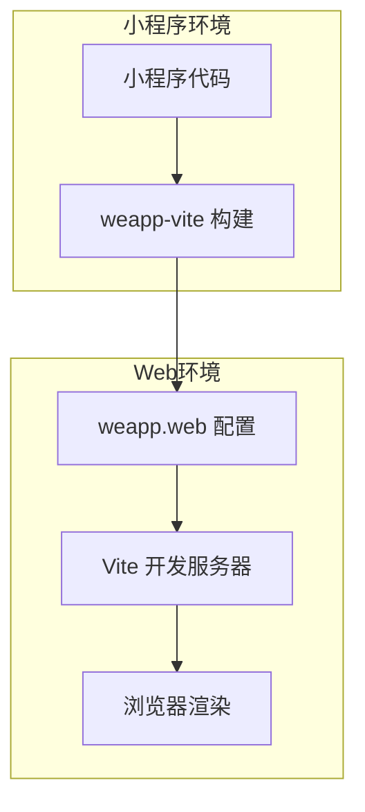

# 运行时配置

<cite>
**本文档引用的文件**
- [config.ts](file://packages/weapp-vite/src/config.ts)
- [types/index.ts](file://packages/weapp-vite/src/types/index.ts)
- [runtime/config/types.ts](file://packages/weapp-vite/src/runtime/config/types.ts)
- [vite.config.ts](file://apps/vite-native/vite.config.ts)
- [weapp-vite-web-demo/vite.config.ts](file://apps/weapp-vite-web-demo/vite.config.ts)
- [website/config/npm.md](file://website/config/npm.md)
- [website/config/worker.md](file://website/config/worker.md)
</cite>

## 目录
1. [简介](#简介)
2. [npm依赖处理配置](#npm依赖处理配置)
3. [Worker线程配置](#worker线程配置)
4. [Web平台适配配置](#web平台适配配置)
5. [性能考量与最佳实践](#性能考量与最佳实践)
6. [总结](#总结)

## 简介

weapp-vite 是一个专为小程序开发设计的构建工具，提供了丰富的运行时配置选项来优化开发体验和应用性能。本文档将详细介绍 npm 依赖处理、Worker 线程和 Web 平台适配三大核心运行时配置，帮助开发者充分利用这些功能来构建高效的小程序应用。

**Section sources**
- [config.ts](file://packages/weapp-vite/src/config.ts#L1-L29)
- [types/index.ts](file://packages/weapp-vite/src/types/index.ts#L1-L8)

## npm依赖处理配置

weapp-vite 提供了精细的 npm 依赖管理机制，通过 `weapp.npm` 配置项可以控制依赖的构建行为。该配置支持自动构建和自动内联两种策略，能够根据依赖类型智能选择最优的处理方式。

### 配置选项

`weapp.npm` 配置对象包含以下关键字段：

- **enable**: 布尔值，控制是否启用 npm 构建功能，默认为 `true`
- **cache**: 布尔值，控制是否使用构建缓存，默认为 `true`
- **buildOptions**: 函数类型，允许为特定 npm 包定制构建选项



**Diagram sources**
- [website/config/npm.md](file://website/config/npm.md#L1-L121)

### 使用场景

当项目中引入 `lodash` 这样的运行时依赖时，weapp-vite 会自动将其构建到 `miniprogram_npm/lodash` 目录中，通过 `require('lodash')` 的方式引用。而对于 `lodash-es` 这样的开发依赖，相关代码会被直接内联到页面 JS 中，避免增加包体积。

这种区分策略建议团队约定：将运行时需要的依赖放在 `dependencies`，而开发工具链或构建脚本使用的依赖放在 `devDependencies`。

**Section sources**
- [website/config/npm.md](file://website/config/npm.md#L1-L121)
- [runtime/config/types.ts](file://packages/weapp-vite/src/runtime/config/types.ts#L8-L90)

## Worker线程配置

weapp-vite 支持对小程序 Worker 的完整构建支持，通过 `weapp.worker` 配置项可以定义 Worker 入口文件和构建策略，确保 Worker 脚本能够享受与主包一致的构建体验。

### 配置语法

`weapp.worker` 配置对象的主要字段为：

- **entry**: 字符串或字符串数组，指定 Worker 的入口文件路径



**Diagram sources**
- [website/config/worker.md](file://website/config/worker.md#L1-L48)

### 使用案例

在需要处理图像或音频等耗时任务时，可以配置 Worker 来避免阻塞主线程：

```typescript
import { defineConfig } from 'weapp-vite/config'

export default defineConfig({
  weapp: {
    worker: {
      entry: ['src/workers/image.ts', 'src/workers/audio.ts'],
    },
  },
})
```

构建时，weapp-vite 会自动处理这些入口文件，支持 TypeScript、ESM 和依赖别名等现代语法特性。

**Section sources**
- [website/config/worker.md](file://website/config/worker.md#L1-L48)
- [vite.config.ts](file://apps/vite-native/vite.config.ts#L125-L129)

## Web平台适配配置

weapp-vite 提供了强大的 Web 平台适配能力，通过 `weapp.web` 配置项可以实现小程序代码在 Web 环境中的运行，支持跨平台开发。

### 配置选项

`weapp.web` 配置支持完整的 Vite 配置对象，允许开发者自定义 Web 端的开发服务器和构建行为：

- **vite**: 嵌套的 Vite 配置对象，用于配置 Web 端的开发服务器
- **server.host**: 指定开发服务器监听地址
- **server.port**: 指定开发服务器端口
- **server.open**: 控制是否在启动时自动打开浏览器



**Diagram sources**
- [weapp-vite-web-demo/vite.config.ts](file://apps/weapp-vite-web-demo/vite.config.ts#L1-L31)

### 使用场景

通过 Web 平台适配配置，开发者可以在浏览器中预览和调试小程序界面，特别适合 UI 组件的开发和调试。同时，也可以利用 Web 环境的丰富调试工具来优化小程序性能。

**Section sources**
- [weapp-vite-web-demo/vite.config.ts](file://apps/weapp-vite-web-demo/vite.config.ts#L1-L31)
- [runtime/webPlugin.ts](file://packages/weapp-vite/src/runtime/webPlugin.ts#L1-L52)

## 性能考量与最佳实践

在配置运行时时，需要考虑以下性能因素：

1. **npm 依赖管理**：合理使用 `dependencies` 和 `devDependencies` 来控制包体积
2. **Worker 使用**：将耗时计算任务放到 Worker 中执行，避免阻塞主线程
3. **Web 适配**：在开发阶段充分利用 Web 预览功能，提高开发效率

建议定期检查 `miniprogram_npm` 目录的体积，对于过大的依赖考虑使用 CDN 或其他优化策略。

## 总结

weapp-vite 的运行时配置系统提供了强大的灵活性和控制力，通过合理的配置可以显著提升小程序的开发效率和运行性能。理解并正确使用 npm 依赖处理、Worker 线程和 Web 平台适配这三大核心配置，是构建高质量小程序应用的关键。