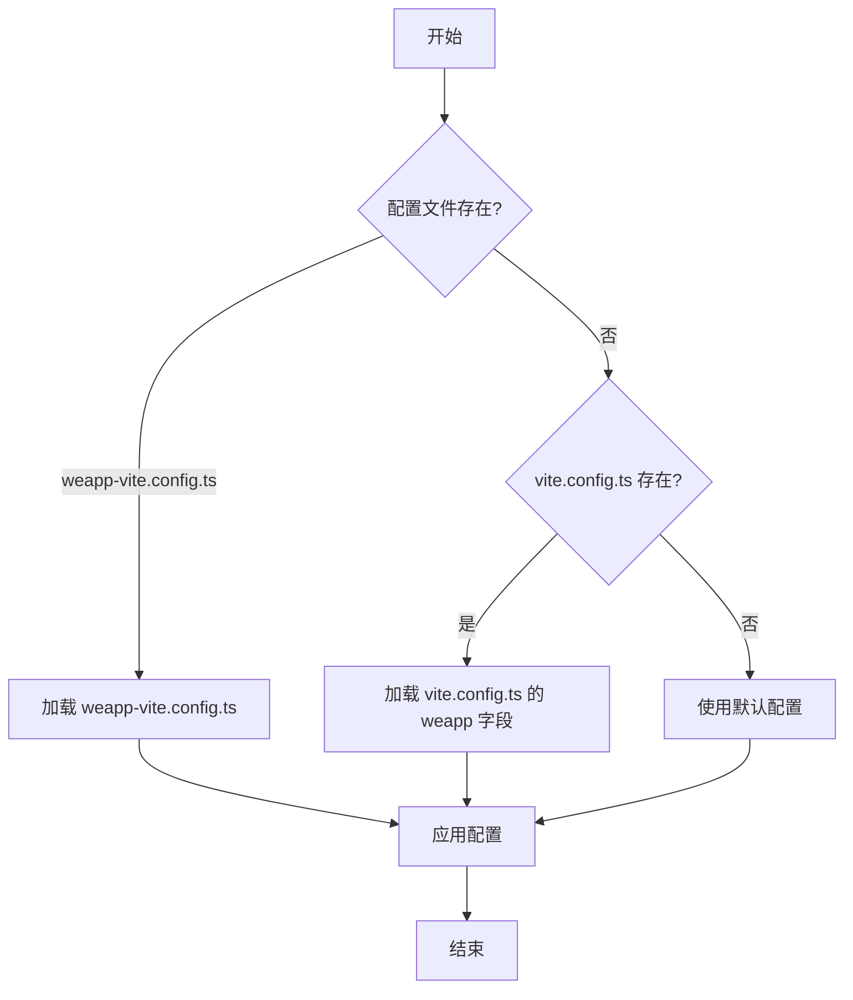

# 配置参考

<cite>
**本文档中引用的文件**  
- [weapp-vite.config.ts](file://weapp-vite.config.ts)
- [vite.config.ts](file://vite.config.ts)
- [config.ts](file://packages/weapp-vite/src/config.ts)
- [weappConfig.ts](file://packages/weapp-vite/src/utils/weappConfig.ts)
- [createConfigService.ts](file://packages/weapp-vite/src/runtime/config/createConfigService.ts)
- [viteConfig.ts](file://@weapp-core/init/src/viteConfig.ts)
- [weapp-config.test.ts](file://packages/weapp-vite/test/weapp-config.test.ts)
- [config.test.ts](file://packages/weapp-vite/test/config.test.ts)
</cite>

## 目录
1. [简介](#简介)
2. [基本配置](#基本配置)
3. [高级配置](#高级配置)
4. [分包配置](#分包配置)
5. [运行时与开发服务器配置](#运行时与开发服务器配置)
6. [配置文件示例](#配置文件示例)
7. [配置优先级与合并规则](#配置优先级与合并规则)
8. [最佳实践](#最佳实践)

## 简介
`weapp-vite` 是一个专为微信小程序设计的现代化构建工具，它扩展了 Vite 的能力，提供了针对小程序开发的专用配置选项。本配置参考文档详细说明了所有可用的配置项，帮助开发者根据项目需求进行精确配置。

`weapp-vite` 支持两种配置方式：在 `vite.config.ts` 中的 `weapp` 字段，或使用专用的 `weapp-vite.config.ts` 文件。配置系统旨在提供灵活性，同时保持与 Vite 生态的兼容性。

**Section sources**
- [config.ts](file://packages/weapp-vite/src/config.ts#L1-L28)
- [weappConfig.ts](file://packages/weapp-vite/src/utils/weappConfig.ts#L4-L12)

## 基本配置
基本配置项定义了项目的输入输出路径、环境变量和基础构建行为。

### 输入输出路径
`srcRoot` 和 `outDir` 配置项控制源代码和输出目录。

- **`srcRoot`**  
  - **类型**: `string`
  - **默认值**: `"src"`
  - **描述**: 源代码的根目录。所有源文件都应位于此目录下。
  - **示例**: 
    ```ts
    weapp: {
      srcRoot: 'source'
    }
    ```

- **`outDir`**  
  - **类型**: `string`
  - **默认值**: `"miniprogram"`
  - **描述**: 构建输出的目标目录。编译后的小程序文件将生成在此目录。
  - **示例**: 
    ```ts
    weapp: {
      outDir: 'dist'
    }
    ```

### 环境变量
`envDir` 和 `envPrefix` 配置项管理环境变量的加载。

- **`envDir`**  
  - **类型**: `string`
  - **默认值**: 项目根目录
  - **描述**: 存放 `.env` 文件的目录。
  - **示例**: 
    ```ts
    weapp: {
      envDir: 'config/env'
    }
    ```

- **`envPrefix`**  
  - **类型**: `string | string[]`
  - **默认值**: `"MP_"`
  - **描述**: 环境变量前缀。只有以指定前缀开头的变量才会被加载到 `import.meta.env` 中。
  - **示例**: 
    ```ts
    weapp: {
      envPrefix: ['MP_', 'VITE_']
    }
    ```

### 基础构建选项
这些选项控制基本的构建行为。

- **`minify`**  
  - **类型**: `boolean | 'terser' | 'esbuild'`
  - **默认值**: `true`
  - **描述**: 是否在生产模式下压缩代码。
  - **示例**: 
    ```ts
    weapp: {
      minify: false // 开发模式下禁用压缩
    }
    ```

- **`cssCodeSplit`**  
  - **类型**: `boolean`
  - **默认值**: `true`
  - **描述**: 是否将 CSS 代码分割成多个文件。
  - **示例**: 
    ```ts
    weapp: {
      cssCodeSplit: false // 禁用 CSS 分割
    }
    ```

**Section sources**
- [weapp-vite.config.ts](file://apps/tdesign-miniprogram-starter-retail/vite.config.ts#L1-L7)
- [weappConfig.ts](file://packages/weapp-vite/src/utils/weappConfig.ts#L16-L19)

## 高级配置
高级配置提供了更精细的控制，包括路径映射、插件和性能优化。

### 别名与路径映射
`resolve.alias` 和 `resolve.paths` 用于配置模块解析。

- **`resolve.alias`**  
  - **类型**: `Record<string, string>`
  - **描述**: 模块别名配置，类似于 Vite 的 `resolve.alias`。
  - **示例**: 
    ```ts
    weapp: {
      resolve: {
        alias: {
          '@': path.resolve(__dirname, 'src'),
          '@components': path.resolve(__dirname, 'src/components')
        }
      }
    }
    ```

- **`resolve.paths`**  
  - **类型**: `Record<string, string[]>`
  - **描述**: TypeScript 路径映射，用于智能提示和类型检查。
  - **示例**: 
    ```ts
    weapp: {
      resolve: {
        paths: {
          "@/*": ["src/*"],
          "@utils/*": ["src/utils/*"]
        }
      }
    }
    ```

### 插件配置
`plugins` 数组用于注册 `weapp-vite` 特定的插件。

- **`plugins`**  
  - **类型**: `Plugin[]`
  - **描述**: 一个插件数组，可以包含 `weapp-vite` 提供的官方插件或第三方插件。
  - **示例**: 
    ```ts
    import { pluginWevu } from 'plugin-wevu'
    
    weapp: {
      plugins: [
        pluginWevu()
      ]
    }
    ```

### 性能优化选项
这些选项用于优化构建性能和输出质量。

- **`optimizeDeps`**  
  - **类型**: `boolean | { include?: string[]; exclude?: string[] }`
  - **默认值**: `true`
  - **描述**: 预构建依赖项以提高开发服务器启动速度。
  - **示例**: 
    ```ts
    weapp: {
      optimizeDeps: {
        include: ['lodash', 'moment'],
        exclude: ['debug-module']
      }
    }
    ```

- **`build.rollupOptions`**  
  - **类型**: `RolldownOptions`
  - **描述**: 直接传递给底层打包器 Rolldown 的选项。
  - **示例**: 
    ```ts
    weapp: {
      build: {
        rollupOptions: {
          output: {
            manualChunks: {
              vendor: ['react', 'react-dom']
            }
          }
        }
      }
    }
    ```

**Section sources**
- [config.ts](file://packages/weapp-vite/src/config.ts#L10-L12)
- [vite.config.ts](file://@weapp-core/init/test/fixtures/vite-native/vite.config.ts#L1-L7)

## 分包配置
分包配置允许将小程序代码拆分为多个包，以优化加载性能。

### 分包定义
`subpackages` 配置项定义了分包的结构。

- **`subpackages`**  
  - **类型**: `Array<{ root: string; pages: string[]; independent?: boolean }>`
  - **描述**: 分包数组，每个分包包含根路径、页面列表和独立性标志。
  - **示例**: 
    ```ts
    weapp: {
      subpackages: [
        {
          root: 'packageA',
          pages: ['pages/index/index', 'pages/logs/logs']
        },
        {
          root: 'packageB',
          pages: ['pages/index/index'],
          independent: true
        }
      ]
    }
    ```

### 公共分包配置
`subpackages.shared` 用于配置跨分包共享的模块。

- **`subpackages.shared`**  
  - **类型**: `string[]`
  - **描述**: 一个模块路径数组，这些模块将被提取到公共包中，供所有分包共享。
  - **示例**: 
    ```ts
    weapp: {
      subpackages: {
        shared: ['utils/common.js', 'components/base/index']
      }
    }
    ```

**Section sources**
- [weapp-config.test.ts](file://packages/weapp-vite/test/weapp-config.test.ts#L7-L27)
- [vite.config.ts](file://apps/subpackage-shared-chunks/vite.config.ts#L1-L7)

## 运行时与开发服务器配置
这些配置项专门用于开发环境和运行时行为。

### 开发服务器选项
`server` 配置项控制开发服务器的行为。

- **`server.port`**  
  - **类型**: `number`
  - **默认值**: `3000`
  - **描述**: 开发服务器监听的端口。
  - **示例**: 
    ```ts
    weapp: {
      server: {
        port: 8080
      }
    }
    ```

- **`server.open`**  
  - **类型**: `boolean | string`
  - **默认值**: `false`
  - **描述**: 启动服务器后是否自动打开浏览器。
  - **示例**: 
    ```ts
    weapp: {
      server: {
        open: '/pages/index/index'
      }
    }
    ```

- **`server.proxy`**  
  - **类型**: `Record<string, string | ProxyOptions>`
  - **描述**: 配置开发服务器的代理规则，用于解决跨域问题。
  - **示例**: 
    ```ts
    weapp: {
      server: {
        proxy: {
          '/api': {
            target: 'http://localhost:8080',
            changeOrigin: true
          }
        }
      }
    }
    ```

### 运行时配置
`runtime` 配置项影响小程序的运行时行为。

- **`runtime.hostComponents`**  
  - **类型**: `Record<string, HostComponentConfig>`
  - **描述**: 配置自定义组件的宿主行为。
  - **示例**: 
    ```ts
    weapp: {
      runtime: {
        hostComponents: {
          'custom-button': {
            props: ['type', 'size'],
            events: ['click']
          }
        }
      }
    }
    ```

**Section sources**
- [vite.config.ts](file://apps/vite-native/vite.config.ts#L1-L7)
- [config.test.ts](file://packages/weapp-vite/test/config.test.ts#L1-L95)

## 配置文件示例
以下是一些不同场景下的配置文件示例。

### 基础项目配置
```ts
import { defineConfig } from 'weapp-vite/config'

export default defineConfig({
  weapp: {
    srcRoot: 'src',
    outDir: 'miniprogram',
    envPrefix: 'MP_',
    minify: true
  }
})
```

### 使用 Tailwind CSS 的项目
```ts
import { defineConfig } from 'weapp-vite/config'
import tailwind from 'tailwindcss'

export default defineConfig({
  weapp: {
    srcRoot: 'src',
    outDir: 'dist',
    resolve: {
      alias: {
        '@': path.resolve(__dirname, 'src')
      }
    },
    css: {
      postcss: {
        plugins: [tailwind()]
      }
    },
    server: {
      port: 3000,
      open: true
    }
  }
})
```

### 大型分包项目
```ts
import { defineConfig } from 'weapp-vite/config'

export default defineConfig({
  weapp: {
    srcRoot: 'src',
    outDir: 'miniprogram',
    subpackages: [
      {
        root: 'packages/home',
        pages: ['pages/index/index', 'pages/discovery/index']
      },
      {
        root: 'packages/user',
        pages: ['pages/profile/index', 'pages/settings/index'],
        independent: true
      }
    ],
    subpackages: {
      shared: ['utils/index.js', 'components/base/index']
    },
    build: {
      rollupOptions: {
        output: {
          manualChunks: {
            'framework': ['react', 'react-dom'],
            'ui-lib': ['tdesign']
          }
        }
      }
    }
  }
})
```

**Section sources**
- [viteConfig.ts](file://@weapp-core/init/src/viteConfig.ts#L1-L10)
- [vite.config.ts](file://templates/weapp-vite-template/vite.config.ts#L1-L7)

## 配置优先级与合并规则
`weapp-vite` 的配置系统支持多种配置文件，并有明确的优先级和合并规则。

### 配置文件优先级
当存在多个配置文件时，优先级如下：
1. `weapp-vite.config.ts` (最高优先级)
2. `vite.config.ts` 中的 `weapp` 字段
3. 默认配置 (最低优先级)

### 配置合并策略
配置项采用深度合并策略：
- 基本类型（字符串、数字、布尔值）会被覆盖
- 对象类型会递归合并
- 数组类型会替换而非合并

例如，如果 `vite.config.ts` 中设置了 `weapp.resolve.alias`，而 `weapp-vite.config.ts` 中也设置了 `resolve.alias`，后者会完全覆盖前者。



**Diagram sources**
- [weappConfig.ts](file://packages/weapp-vite/src/utils/weappConfig.ts#L4-L12)
- [weapp-config.test.ts](file://packages/weapp-vite/test/weapp-config.test.ts#L7-L27)

**Section sources**
- [weappConfig.ts](file://packages/weapp-vite/src/utils/weappConfig.ts#L21-L54)
- [weapp-config.test.ts](file://packages/weapp-vite/test/weapp-config.test.ts#L15-L26)

## 最佳实践
为了获得最佳的开发体验和构建性能，请遵循以下最佳实践：

1. **使用专用配置文件**：对于复杂项目，建议使用 `weapp-vite.config.ts` 以获得更好的类型提示和分离关注点。

2. **合理使用分包**：将功能模块拆分为独立分包，特别是对于大型项目，可以显著改善首屏加载时间。

3. **配置适当的别名**：设置 `@` 指向 `src` 目录，可以简化导入路径，提高代码可读性。

4. **优化依赖预构建**：在 `optimizeDeps.include` 中明确列出大型第三方依赖，可以加快开发服务器启动速度。

5. **利用环境变量**：使用 `envPrefix` 来管理环境变量，避免敏感信息泄露。

6. **定期审查构建输出**：使用构建分析工具检查包大小，识别可以优化的依赖。

通过遵循这些最佳实践，可以确保 `weapp-vite` 项目既高效又易于维护。

**Section sources**
- [config.ts](file://packages/weapp-vite/src/config.ts#L15-L21)
- [viteConfig.ts](file://@weapp-core/init/src/viteConfig.ts#L1-L10)