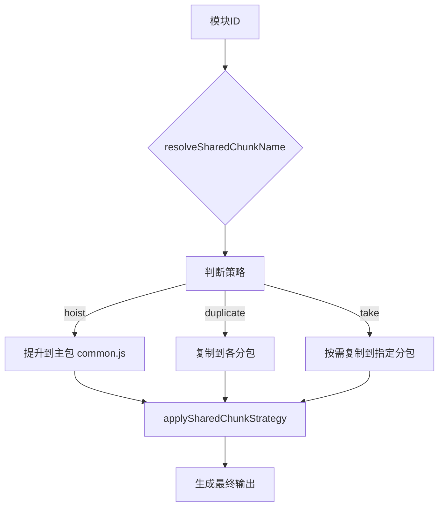
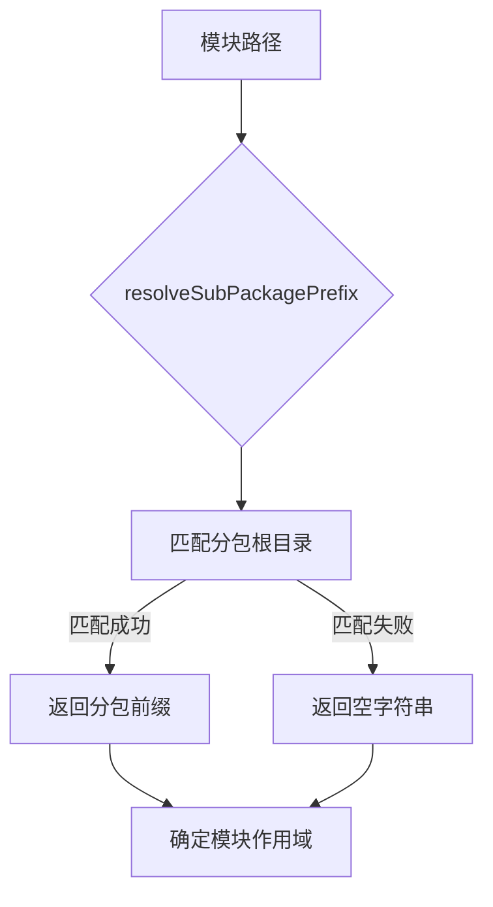
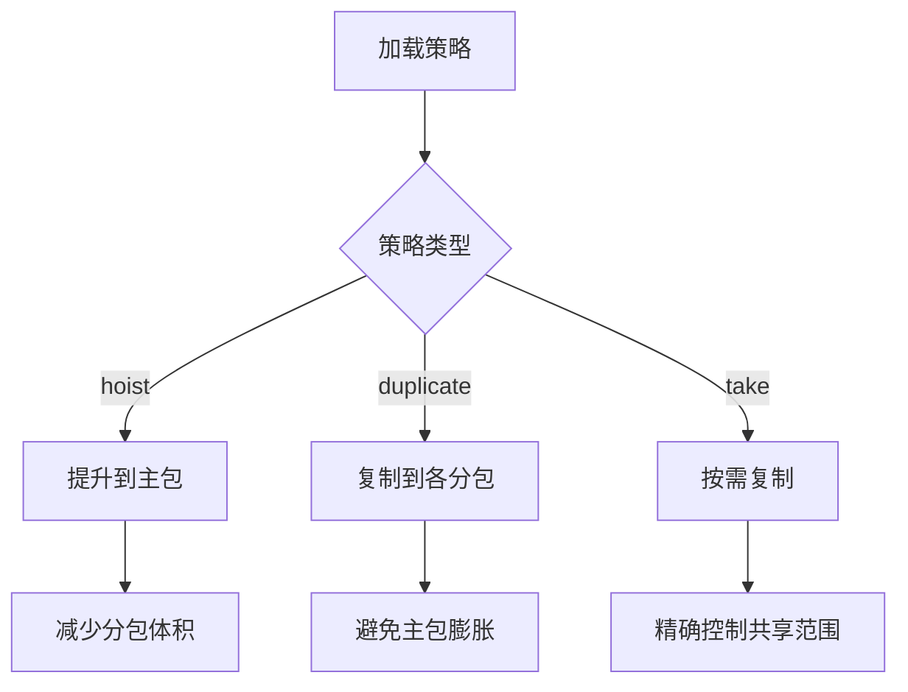
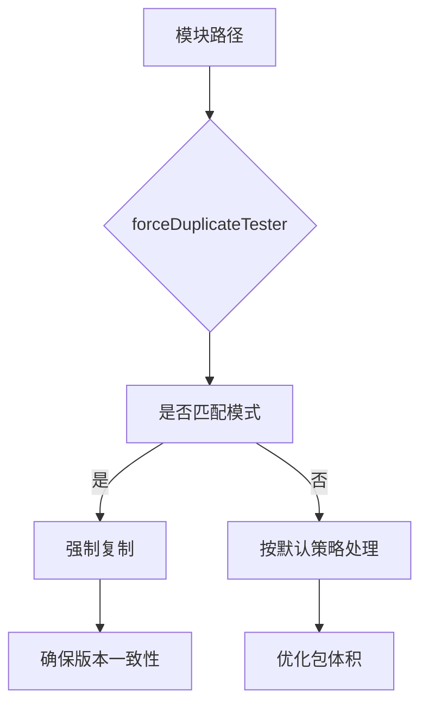
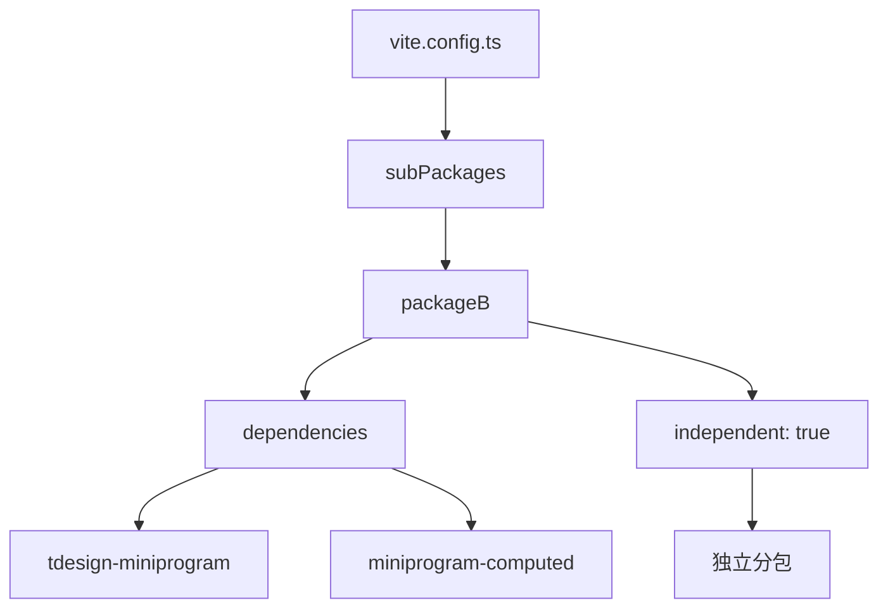
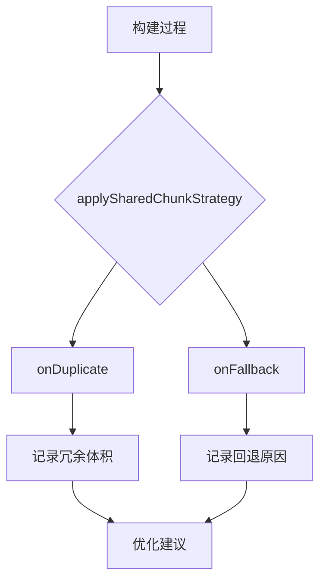
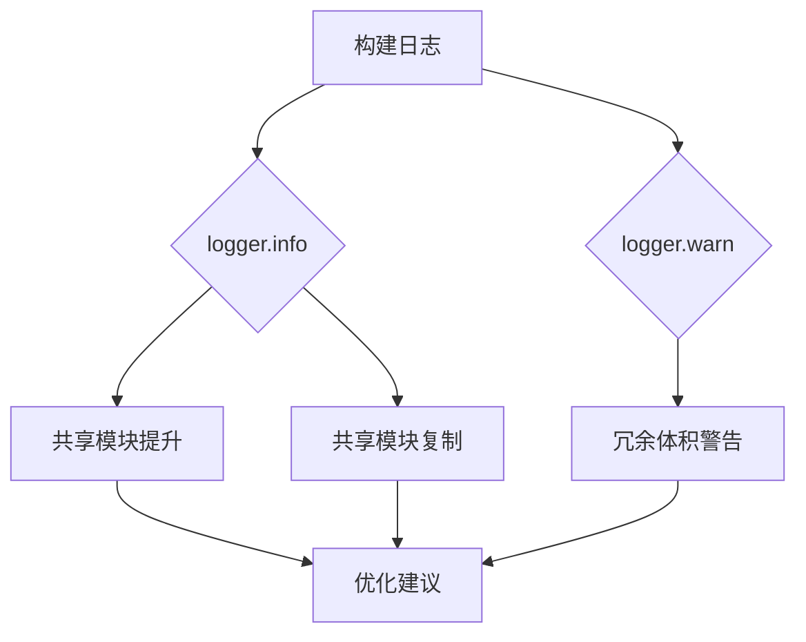

# 共享模块配置

<cite>
**本文档引用的文件**   
- [chunkStrategy.ts](file://packages/weapp-vite/src/runtime/chunkStrategy.ts)
- [chunkStrategy.test.ts](file://packages/weapp-vite/src/runtime/chunkStrategy.test.ts)
- [core.ts](file://packages/weapp-vite/src/plugins/core.ts)
- [sharedStyles.ts](file://packages/weapp-vite/src/plugins/css/shared/sharedStyles.ts)
- [vite.config.ts](file://apps/vite-native/vite.config.ts)
- [cross-subpackage-shared.ts](file://apps/vite-native/subpackage-demos/cross-subpackage-shared.ts)
- [main-and-sub-shared.ts](file://apps/vite-native/subpackage-demos/main-and-sub-shared.ts)
</cite>

## 目录
1. [简介](#简介)
2. [共享模块配置机制](#共享模块配置机制)
3. [跨分包/跨项目共享模块配置](#跨分包跨项目共享模块配置)
4. [共享模块加载策略](#共享模块加载策略)
5. [依赖管理与版本控制](#依赖管理与版本控制)
6. [实际项目配置案例](#实际项目配置案例)
7. [性能影响与潜在风险](#性能影响与潜在风险)
8. [监控与调试方法](#监控与调试方法)
9. [结论](#结论)

## 简介
weapp-vite 提供了一套完善的共享模块配置机制，用于优化小程序项目中的代码复用和包体积。通过智能的分包策略和共享模块管理，开发者可以有效地组织代码结构，避免重复打包，提升应用性能。本文档将深入解析 weapp-vite 中共享模块的配置机制和应用场景。

## 共享模块配置机制
weapp-vite 的共享模块配置机制基于分包策略和模块分析，通过 `resolveSharedChunkName` 和 `applySharedChunkStrategy` 函数实现。这些函数根据模块的引用关系和分包配置，决定共享模块的最终位置和命名。

**Diagram sources**
- [chunkStrategy.ts](file://packages/weapp-vite/src/runtime/chunkStrategy.ts#L76-L162)
- [chunkStrategy.ts](file://packages/weapp-vite/src/runtime/chunkStrategy.ts#L475-L657)

**Section sources**
- [chunkStrategy.ts](file://packages/weapp-vite/src/runtime/chunkStrategy.ts#L76-L162)
- [chunkStrategy.ts](file://packages/weapp-vite/src/runtime/chunkStrategy.ts#L475-L657)

## 跨分包跨项目共享模块配置
在复杂的项目结构中，跨分包或跨项目的共享模块配置尤为重要。weapp-vite 通过 `subPackageRoots` 配置项来指定分包根目录，并利用 `resolveSubPackagePrefix` 函数确定模块所属的分包。

**Diagram sources**
- [chunkStrategy.ts](file://packages/weapp-vite/src/runtime/chunkStrategy.ts#L345-L354)

**Section sources**
- [chunkStrategy.ts](file://packages/weapp-vite/src/runtime/chunkStrategy.ts#L345-L354)

## 共享模块加载策略
weapp-vite 支持多种共享模块加载策略，包括 `hoist`、`duplicate` 和 `take`。这些策略通过 `SharedChunkStrategy` 枚举定义，并在构建过程中根据配置应用。

**Diagram sources**
- [chunkStrategy.ts](file://packages/weapp-vite/src/runtime/chunkStrategy.ts#L101-L123)
- [chunkStrategy.ts](file://packages/weapp-vite/src/runtime/chunkStrategy.ts#L148-L159)

**Section sources**
- [chunkStrategy.ts](file://packages/weapp-vite/src/runtime/chunkStrategy.ts#L101-L123)
- [chunkStrategy.ts](file://packages/weapp-vite/src/runtime/chunkStrategy.ts#L148-L159)

## 依赖管理与版本控制
weapp-vite 通过 `forceDuplicateTester` 函数支持对特定模块的强制复制策略。这在处理第三方库或特定版本的依赖时非常有用，可以确保不同分包使用相同版本的依赖。

**Diagram sources**
- [chunkStrategy.ts](file://packages/weapp-vite/src/runtime/chunkStrategy.ts#L129-L135)
- [chunkStrategy.ts](file://packages/weapp-vite/src/runtime/chunkStrategy.ts#L188-L189)

**Section sources**
- [chunkStrategy.ts](file://packages/weapp-vite/src/runtime/chunkStrategy.ts#L129-L135)
- [chunkStrategy.ts](file://packages/weapp-vite/src/runtime/chunkStrategy.ts#L188-L189)

## 实际项目配置案例
在实际项目中，可以通过配置 `vite.config.ts` 文件来实现共享模块的管理。例如，在 `apps/vite-native` 项目中，通过 `subPackages` 配置项定义了独立分包及其依赖。

**Diagram sources**
- [vite.config.ts](file://apps/vite-native/vite.config.ts#L89-L99)

**Section sources**
- [vite.config.ts](file://apps/vite-native/vite.config.ts#L89-L99)

## 性能影响与潜在风险
共享模块的配置对应用性能有显著影响。不当的配置可能导致主包体积过大或分包重复加载。weapp-vite 通过 `onDuplicate` 和 `onFallback` 回调提供监控和调试信息，帮助开发者优化配置。

**Diagram sources**
- [core.ts](file://packages/weapp-vite/src/plugins/core.ts#L414-L455)
- [chunkStrategy.ts](file://packages/weapp-vite/src/runtime/chunkStrategy.ts#L471-L473)

**Section sources**
- [core.ts](file://packages/weapp-vite/src/plugins/core.ts#L414-L455)
- [chunkStrategy.ts](file://packages/weapp-vite/src/runtime/chunkStrategy.ts#L471-L473)

## 监控与调试方法
weapp-vite 提供了详细的日志输出和调试工具，帮助开发者监控共享模块的构建过程。通过 `logger.info` 和 `logger.warn` 函数，可以实时查看共享模块的处理情况。

**Diagram sources**
- [core.ts](file://packages/weapp-vite/src/plugins/core.ts#L442-L447)
- [core.ts](file://packages/weapp-vite/src/plugins/core.ts#L453-L454)

**Section sources**
- [core.ts](file://packages/weapp-vite/src/plugins/core.ts#L442-L447)
- [core.ts](file://packages/weapp-vite/src/plugins/core.ts#L453-L454)

## 结论
weapp-vite 的共享模块配置机制为小程序开发提供了强大的代码复用和包体积优化能力。通过合理的配置和监控，开发者可以构建高效、可维护的应用。建议在实际项目中充分利用这些特性，结合具体需求进行优化。