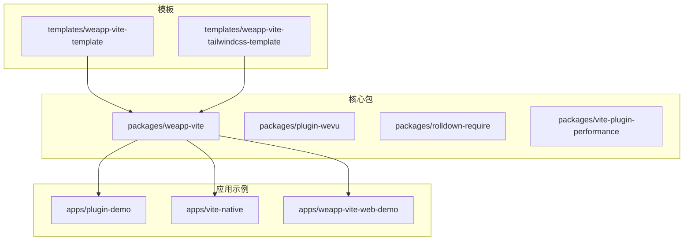
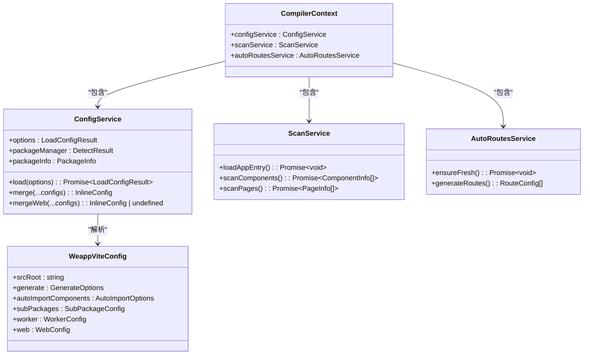
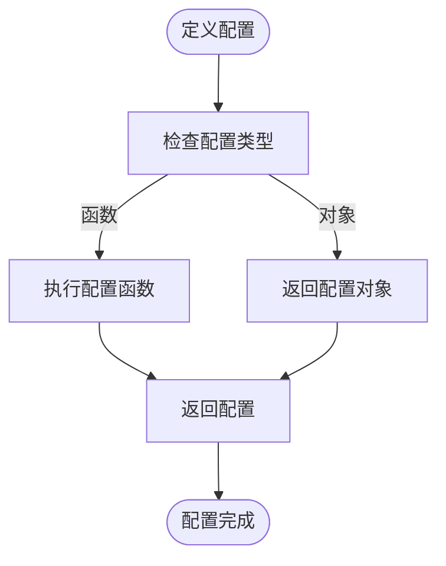
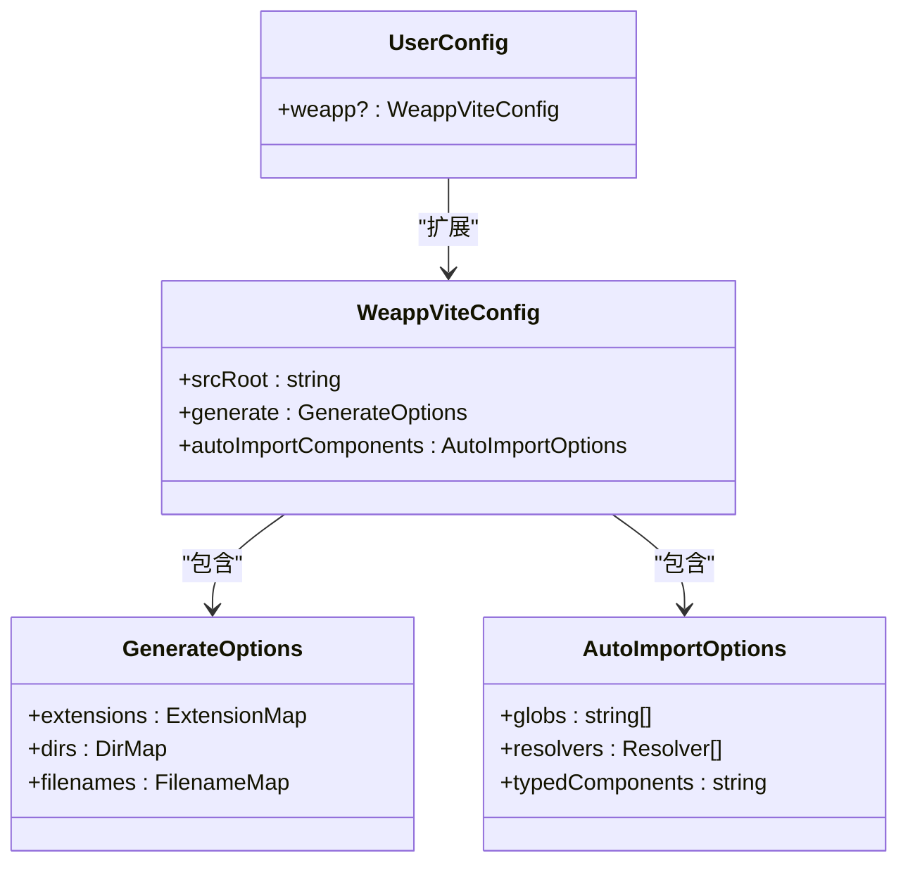
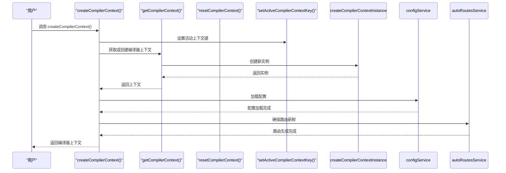
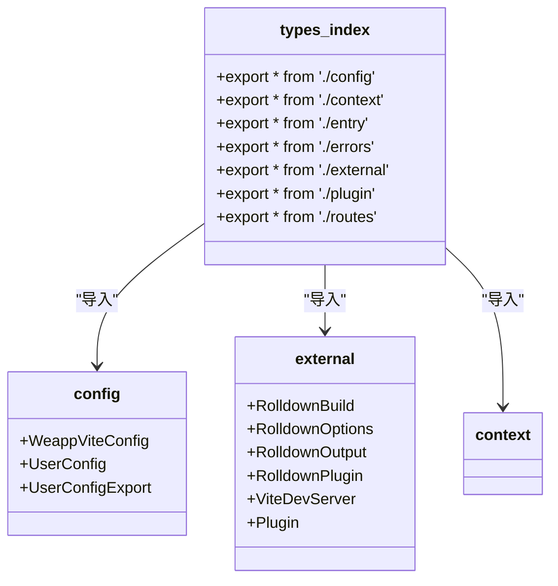
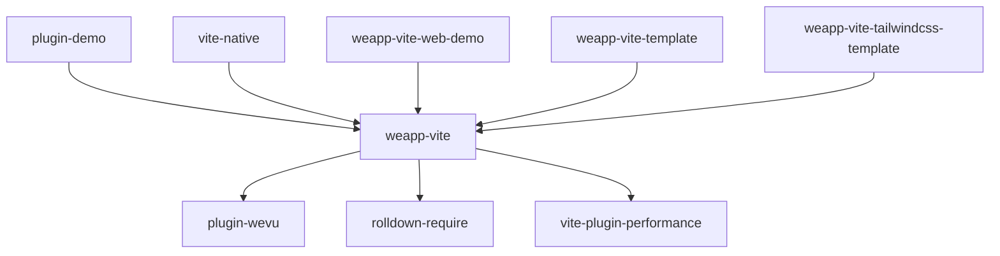

# 代码片段

<cite>
**本文档中引用的文件**  
- [vite.config.ts](file://templates/weapp-vite-template/vite.config.ts)
- [vite.config.ts](file://apps/vite-native/vite.config.ts)
- [vite.config.ts](file://apps/vite-native-ts/vite.config.ts)
- [vite.config.ts](file://apps/weapp-vite-web-demo/vite.config.ts)
- [vite.config.mts](file://apps/plugin-demo/vite.config.mts)
- [config.ts](file://packages/weapp-vite/src/config.ts)
- [types/index.ts](file://packages/weapp-vite/src/types/index.ts)
- [types/external.ts](file://packages/weapp-vite/src/types/external.ts)
- [createContext.ts](file://packages/weapp-vite/src/createContext.ts)
- [index.ts](file://packages/weapp-vite/src/index.ts)
- [runtime/config/types.ts](file://packages/weapp-vite/src/runtime/config/types.ts)
- [utils/index.ts](file://packages/weapp-vite/src/utils/index.ts)
- [context/getInstance.ts](file://packages/weapp-vite/src/context/getInstance.ts)
- [vite-patch.ts](file://scripts/vite-patch.ts)
</cite>

## 目录
1. [简介](#简介)
2. [项目结构](#项目结构)
3. [核心组件](#核心组件)
4. [架构概述](#架构概述)
5. [详细组件分析](#详细组件分析)
6. [依赖分析](#依赖分析)
7. [性能考虑](#性能考虑)
8. [故障排除指南](#故障排除指南)
9. [结论](#结论)
10. [附录](#附录)（如有必要）

## 简介
本文档旨在为 `weapp-vite` 开发提供实用的代码片段集合，涵盖常用配置、类型定义、构建脚本和自动化任务。文档将展示从简单到复杂的渐进式示例，帮助开发者理解如何将这些最佳实践集成到自己的项目中。所有代码片段均来自实际项目，经过验证且可直接使用。

## 项目结构
`weapp-vite` 是一个用于微信小程序开发的现代化构建工具，其项目结构体现了模块化和可扩展的设计理念。核心功能分布在 `packages` 目录下，而 `apps` 目录则包含多个应用示例，用于演示不同配置和功能的使用。

**图示来源**
- [weapp-vite](file://packages/weapp-vite)
- [plugin-demo](file://apps/plugin-demo)
- [vite-native](file://apps/vite-native)
- [weapp-vite-web-demo](file://apps/weapp-vite-web-demo)
- [weapp-vite-template](file://templates/weapp-vite-template)

**本节来源**
- [project_structure](file://project_structure)

## 核心组件
`weapp-vite` 的核心组件包括配置系统、上下文管理、类型定义和工具函数。这些组件共同构成了构建工具的基础，提供了灵活的配置选项和强大的开发支持。

**本节来源**
- [index.ts](file://packages/weapp-vite/src/index.ts)
- [config.ts](file://packages/weapp-vite/src/config.ts)
- [createContext.ts](file://packages/weapp-vite/src/createContext.ts)
- [types/index.ts](file://packages/weapp-vite/src/types/index.ts)

## 架构概述
`weapp-vite` 的架构基于 Vite 的插件系统，通过扩展 Vite 的配置来支持微信小程序的开发。其核心架构包括配置解析、上下文管理、文件扫描和自动路由生成等服务。

**图示来源**
- [runtime/config/types.ts](file://packages/weapp-vite/src/runtime/config/types.ts)
- [createContext.ts](file://packages/weapp-vite/src/createContext.ts)
- [config.ts](file://packages/weapp-vite/src/config.ts)

## 详细组件分析

### 配置系统分析
`weapp-vite` 的配置系统通过 `defineConfig` 函数提供，允许开发者以函数或对象的形式定义配置。配置系统支持环境变量、模式切换和配置合并，提供了极大的灵活性。

#### 配置定义示例

**图示来源**
- [config.ts](file://packages/weapp-vite/src/config.ts)

#### 配置扩展机制

**图示来源**
- [config.ts](file://packages/weapp-vite/src/config.ts)
- [runtime/config/types.ts](file://packages/weapp-vite/src/runtime/config/types.ts)

**本节来源**
- [config.ts](file://packages/weapp-vite/src/config.ts)
- [runtime/config/types.ts](file://packages/weapp-vite/src/runtime/config/types.ts)

### 上下文管理系统分析
上下文管理系统负责管理编译过程中的状态和配置，确保不同服务之间的数据一致性。

#### 上下文创建流程

**图示来源**
- [createContext.ts](file://packages/weapp-vite/src/createContext.ts)
- [context/getInstance.ts](file://packages/weapp-vite/src/context/getInstance.ts)

**本节来源**
- [createContext.ts](file://packages/weapp-vite/src/createContext.ts)
- [context/getInstance.ts](file://packages/weapp-vite/src/context/getInstance.ts)

### 类型系统分析
`weapp-vite` 的类型系统通过模块扩展和类型导出，为开发者提供了完整的类型支持。

#### 类型模块结构

**图示来源**
- [types/index.ts](file://packages/weapp-vite/src/types/index.ts)
- [types/external.ts](file://packages/weapp-vite/src/types/external.ts)
- [config.ts](file://packages/weapp-vite/src/config.ts)

**本节来源**
- [types/index.ts](file://packages/weapp-vite/src/types/index.ts)
- [types/external.ts](file://packages/weapp-vite/src/types/external.ts)

## 依赖分析
`weapp-vite` 的依赖关系清晰，核心包之间通过明确的接口进行通信，应用示例依赖核心包，模板则为新项目提供起点。

**图示来源**
- [package.json](file://packages/weapp-vite/package.json)
- [package.json](file://apps/plugin-demo/package.json)
- [package.json](file://apps/vite-native/package.json)

**本节来源**
- [package.json](file://packages/weapp-vite/package.json)
- [package.json](file://apps/plugin-demo/package.json)
- [package.json](file://apps/vite-native/package.json)

## 性能考虑
`weapp-vite` 在性能方面进行了多项优化，包括构建分析、代码分割和缓存机制。通过 `vite-plugin-performance` 插件，开发者可以监控构建性能并进行优化。

**本节来源**
- [vite-plugin-performance](file://packages/vite-plugin-performance)

## 故障排除指南
当遇到构建问题时，可以检查配置文件的语法、依赖版本和环境变量设置。使用 `weapp-vite` 提供的调试选项可以帮助定位问题。

**本节来源**
- [vite-patch.ts](file://scripts/vite-patch.ts)
- [debug.md](file://website/guide/debug.md)

## 结论
`weapp-vite` 提供了一套完整的微信小程序开发解决方案，通过模块化的设计和丰富的配置选项，支持从简单到复杂的各种项目需求。本文档收集的代码片段展示了最佳实践，帮助开发者快速上手并高效开发。

## 附录
### 常用配置片段
- **基础配置**: [vite.config.ts](file://templates/weapp-vite-template/vite.config.ts)
- **TailwindCSS 集成**: [vite.config.ts](file://apps/vite-native/vite.config.ts)
- **多包配置**: [vite.config.ts](file://apps/vite-native/vite.config.ts)
- **Web 支持**: [vite.config.ts](file://apps/weapp-vite-web-demo/vite.config.ts)
- **插件开发**: [vite.config.mts](file://apps/plugin-demo/vite.config.mts)

### 类型定义参考
- **核心类型**: [types/index.ts](file://packages/weapp-vite/src/types/index.ts)
- **外部依赖类型**: [types/external.ts](file://packages/weapp-vite/src/types/external.ts)
- **运行时配置类型**: [runtime/config/types.ts](file://packages/weapp-vite/src/runtime/config/types.ts)

### 工具函数
- **文件操作**: [utils/file.ts](file://packages/weapp-vite/src/utils/file.ts)
- **JSON 处理**: [utils/json.ts](file://packages/weapp-vite/src/utils/json.ts)
- **项目配置**: [utils/projectConfig.ts](file://packages/weapp-vite/src/utils/projectConfig.ts)