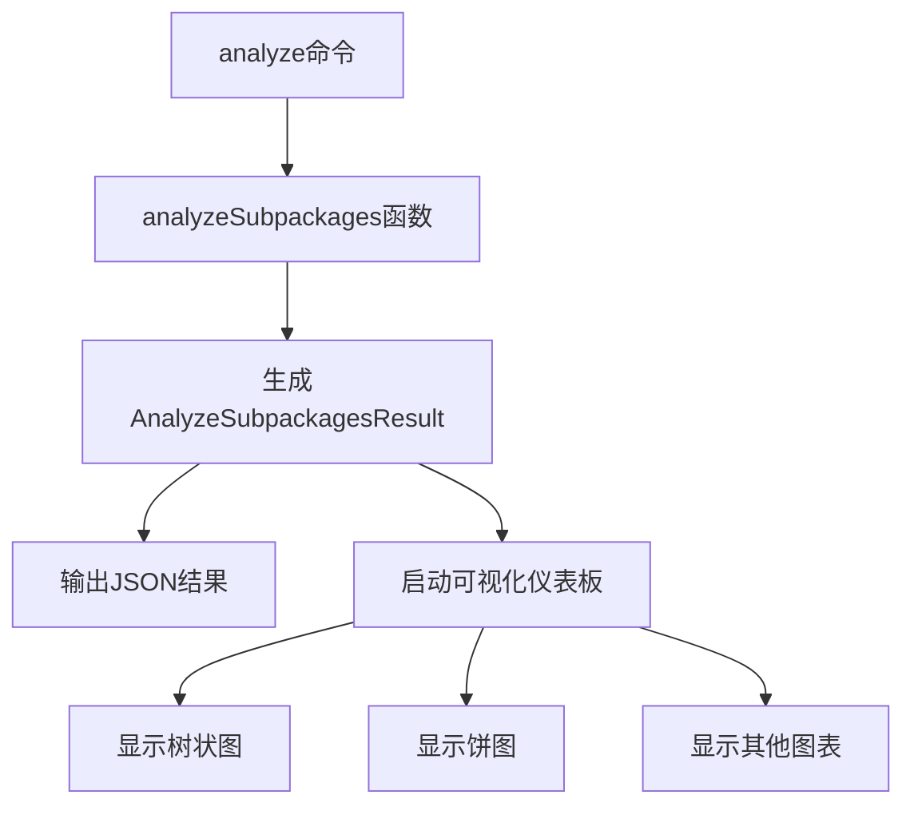

# 分包性能优化

<cite>
**本文档引用的文件**   
- [vite.config.ts](file://apps/subpackage-shared-chunks/vite.config.ts)
- [app.json](file://apps/subpackage-shared-chunks/src/app.json)
- [chunkStrategy.ts](file://packages/weapp-vite/src/runtime/chunkStrategy.ts)
- [subpackages.ts](file://packages/weapp-vite/src/analyze/subpackages.ts)
- [core.ts](file://packages/weapp-vite/src/plugins/core.ts)
- [analyze.ts](file://packages/weapp-vite/src/cli/commands/analyze.ts)
- [dashboard.ts](file://packages/weapp-vite/src/cli/analyze/dashboard.ts)
- [cache.ts](file://packages/rolldown-require/src/cache.ts)
- [subpackages.md](file://docs/subpackages.md)
- [subpackage.md](file://website/guide/subpackage.md)
</cite>

## 目录
1. [引言](#引言)
2. [分包构建与运行时性能监控](#分包构建与运行时性能监控)
3. [weapp-vite的analyze功能详解](#weapp-vite的analyze功能详解)
4. [分包大小监控实践](#分包大小监控实践)
5. [减小分包体积的技术](#减小分包体积的技术)
6. [构建缓存机制与长期缓存策略](#构建缓存机制与长期缓存策略)
7. [结论](#结论)

## 引言
本文档旨在系统性地介绍如何监控和优化微信小程序分包的构建和运行时性能。通过分析weapp-vite框架的源码和文档，我们将深入探讨分包性能优化的各个方面，包括使用analyze功能可视化分包大小和依赖关系，设置大小警告阈值和自动化检查，以及通过代码分割、懒加载和资源压缩等技术减小分包体积。此外，我们还将介绍构建缓存机制如何加速分包的增量构建，以及如何配置长期缓存策略。

**Section sources**
- [subpackages.md](file://docs/subpackages.md#L1-L151)
- [subpackage.md](file://website/guide/subpackage.md#L1-L244)

## 分包构建与运行时性能监控
分包是微信小程序中一种重要的性能优化手段，通过将应用拆分为多个独立的包，可以减少主包的体积，从而加快小程序的启动速度。在weapp-vite框架中，分包的配置主要通过`app.json`和`vite.config.ts`两个文件来完成。

在`app.json`中，我们定义了分包的基本结构，包括主包和各个分包的根目录、页面列表等。例如，在`apps/subpackage-shared-chunks`项目中，`app.json`文件定义了三个分包：订单中心、个人中心和营销活动，每个分包都有独立的根目录和页面列表。

```json
{
  "subpackages": [
    {
      "root": "packages/order",
      "name": "订单中心",
      "pages": ["index", "detail"],
      "independent": true
    },
    {
      "root": "packages/profile",
      "name": "个人中心",
      "pages": ["index", "settings"]
    },
    {
      "root": "packages/marketing",
      "name": "营销活动",
      "pages": ["poster"]
    }
  ]
}
```

在`vite.config.ts`中，我们可以通过`weapp.subPackages`配置项为每个分包添加更高级的功能，如独立编译、依赖裁剪、样式共享和组件自动导入等。此外，`chunks.sharedStrategy`配置项控制跨包共享模块的输出策略，避免主包或分包体积异常。

```ts
export default defineConfig({
  weapp: {
    subPackages: {
      'packages/order': {
        independent: true,
        dependencies: ['crypto-es'],
        autoImportComponents: {
          globs: ['packages/order/components/**/*.wxml'],
        },
        styles: [
          'styles/theme.scss',
          {
            source: '../shared/styles/components.scss',
            scope: 'components',
            include: ['components/**'],
          },
        ],
      },
      'packages/profile': {
        styles: {
          source: 'styles/index.scss',
          scope: 'pages',
        },
      },
      'packages/marketing': {
        watchSharedStyles: false,
      },
    },
    chunks: {
      sharedStrategy: 'duplicate',
      duplicateWarningBytes: 256 * 1024,
    },
  },
})
```

**Section sources**
- [vite.config.ts](file://apps/subpackage-shared-chunks/vite.config.ts#L1-L83)
- [app.json](file://apps/subpackage-shared-chunks/src/app.json#L1-L40)

## weapp-vite的analyze功能详解
weapp-vite提供了一个强大的analyze功能，可以帮助开发者可视化分包大小和依赖关系。通过执行`weapp-vite analyze`命令，可以生成详细的分包报告，帮助开发者定位共享依赖和重复模块。

analyze功能的核心实现位于`packages/weapp-vite/src/analyze/subpackages.ts`文件中。该文件定义了`analyzeSubpackages`函数，该函数接收一个`CompilerContext`对象作为参数，返回一个包含分包信息的`AnalyzeSubpackagesResult`对象。`AnalyzeSubpackagesResult`对象包含三个主要部分：`packages`、`modules`和`subPackages`。

- `packages`：包含每个分包（包括主包）的文件列表，每个文件包含文件名、类型、来源、大小等信息。
- `modules`：包含每个模块的使用情况，每个模块包含模块ID、源文件路径、来源类型和在哪些分包中被使用等信息。
- `subPackages`：包含每个分包的描述信息，包括根目录、是否独立和名称等。

```ts
export interface AnalyzeSubpackagesResult {
  packages: PackageReport[]
  modules: ModuleUsage[]
  subPackages: SubPackageDescriptor[]
}
```

analyze功能还提供了一个可视化仪表板，可以通过`weapp-vite analyze -- --report`命令启动。仪表板使用Vue.js和Tailwind CSS构建，提供了树状图、饼图等多种可视化方式，帮助开发者更直观地理解分包结构和依赖关系。



**Diagram sources **
- [subpackages.ts](file://packages/weapp-vite/src/analyze/subpackages.ts#L52-L108)
- [analyze.ts](file://packages/weapp-vite/src/cli/commands/analyze.ts#L76-L106)
- [dashboard.ts](file://packages/weapp-vite/src/cli/analyze/dashboard.ts#L88-L101)

**Section sources**
- [subpackages.ts](file://packages/weapp-vite/src/analyze/subpackages.ts#L1-L601)
- [analyze.ts](file://packages/weapp-vite/src/cli/commands/analyze.ts#L1-L106)
- [dashboard.ts](file://packages/weapp-vite/src/cli/analyze/dashboard.ts#L46-L101)

## 分包大小监控实践
为了有效监控分包大小，weapp-vite提供了一些实用的配置选项。在`vite.config.ts`中，`chunks.duplicateWarningBytes`配置项可以设置一个阈值，当分包复制共享模块产生的冗余体积超过该阈值时，构建日志会发出警告。

```ts
chunks: {
  sharedStrategy: 'duplicate',
  duplicateWarningBytes: 256 * 1024, // 256KB
}
```

当构建过程中检测到冗余体积超过阈值时，weapp-vite会在日志中输出警告信息，提示开发者检查分包划分是否合理，或者运行`weapp-vite analyze`命令定位问题。

```ts
if (shouldWarnOnDuplicate && redundantBytesTotal > duplicateWarningBytes) {
  logger.warn(`[subpackages] 分包复制共享模块产生冗余体积 ${formatBytes(redundantBytesTotal)}，已超过阈值 ${formatBytes(duplicateWarningBytes)}，建议调整分包划分或运行 weapp-vite analyze 定位问题。`)
}
```

此外，还可以通过`--json`和`--output`选项将analyze结果输出为JSON文件，便于与其他工具集成或进行自动化检查。

```bash
pnpm run analyze -- --json --output report/analyze.json
```

**Section sources**
- [vite.config.ts](file://apps/subpackage-shared-chunks/vite.config.ts#L60-L64)
- [core.ts](file://packages/weapp-vite/src/plugins/core.ts#L452-L454)
- [analyze.ts](file://packages/weapp-vite/src/cli/commands/analyze.ts#L104-L106)

## 减小分包体积的技术
为了减小分包体积，weapp-vite提供了多种技术手段，包括代码分割、懒加载和资源压缩等。

### 代码分割
代码分割是减少分包体积的关键技术之一。weapp-vite通过`chunks.sharedStrategy`配置项控制跨包共享模块的输出策略。默认策略为`duplicate`，即将共享模块复制到每个使用它的分包中，避免分包首次打开时需要回主包拉取共享模块。另一种策略是`hoist`，即将共享模块统一提炼到主包中，适用于更关注控制整体包体的场景。

```ts
chunks: {
  sharedStrategy: 'duplicate', // 或 'hoist'
}
```

### 懒加载
懒加载可以进一步优化分包性能。通过在`app.json`中启用`lazyCodeLoading`，可以避免一次性加载所有自定义组件代码，而是按需加载。

```json
{
  "lazyCodeLoading": "requiredComponents"
}
```

### 资源压缩
资源压缩是减少分包体积的另一种有效手段。weapp-vite支持多种资源压缩技术，包括CSS压缩、JavaScript压缩和图片压缩等。在`vite.config.ts`中，可以通过`build.rolldownOptions.output.minify`配置项启用代码压缩。

```ts
build: {
  rolldownOptions: {
    output: {
      minify: true,
    },
  },
}
```

**Section sources**
- [vite.config.ts](file://apps/subpackage-shared-chunks/vite.config.ts#L60-L64)
- [subpackages.md](file://docs/subpackages.md#L131-L135)
- [subpackage.md](file://website/guide/subpackage.md#L131-L135)

## 构建缓存机制与长期缓存策略
构建缓存机制可以显著加速分包的增量构建。weapp-vite使用`rolldown-require`包来实现构建缓存，该包基于`rolldown`打包器，提供了持久化缓存功能。

在`packages/rolldown-require/src/cache.ts`文件中，定义了缓存相关的接口和函数，包括`CacheConfig`、`CacheMeta`、`CacheRead`等。`resolveCacheOptions`函数用于解析缓存配置，`maybeReadCache`函数用于读取缓存，`storeCacheOutput`函数用于存储缓存输出。

```ts
export interface CacheConfig {
  enabled: boolean
  key: string
  dir: string
  reset: boolean
  entryPath: string
  memory: boolean
  onEvent?: (event: CacheEvent) => void
}

export interface CacheMeta {
  format: 'cjs' | 'esm'
  codePath: string
  files: { path: string, mtimeMs: number, size: number }[]
}

export interface CacheRead {
  codePath: string
  mod?: any
  meta?: CacheMeta
}
```

长期缓存策略可以通过配置缓存目录和重置选项来实现。默认情况下，缓存目录位于项目根目录下的`.rolldown-require-cache`文件夹中。可以通过`cache.reset`选项在每次构建时重置缓存，确保构建结果的准确性。

```ts
const cacheOpt = options.cache
const enabled = cacheOpt === true
  || (typeof cacheOpt === 'object' && cacheOpt.enabled !== false)
if (!enabled) {
  return {
    enabled: false,
    key: '',
    dir: '',
    reset: false,
    entryPath: fileName,
    memory: false,
    onEvent: undefined,
  }
}
```

**Section sources**
- [cache.ts](file://packages/rolldown-require/src/cache.ts#L1-L249)
- [cache.test.ts](file://packages/rolldown-require/test/cache.test.ts#L1-L78)

## 结论
通过本文档的介绍，我们系统性地了解了如何监控和优化微信小程序分包的构建和运行时性能。weapp-vite框架提供了强大的analyze功能，可以帮助开发者可视化分包大小和依赖关系，通过analyze-dashboard分析`apps/subpackage-shared-chunks`的构建结果。分包大小监控的实践方法包括设置大小警告阈值和自动化检查。开发者可以通过代码分割、懒加载和资源压缩等技术减小分包体积。构建缓存机制可以加速分包的增量构建，长期缓存策略可以通过配置缓存目录和重置选项来实现。合理规划分包并结合weapp-vite的构建能力，可以在保证首屏体验的同时降低维护成本。

**Section sources**
- [subpackages.md](file://docs/subpackages.md#L150-L151)
- [subpackage.md](file://website/guide/subpackage.md#L243-L244)