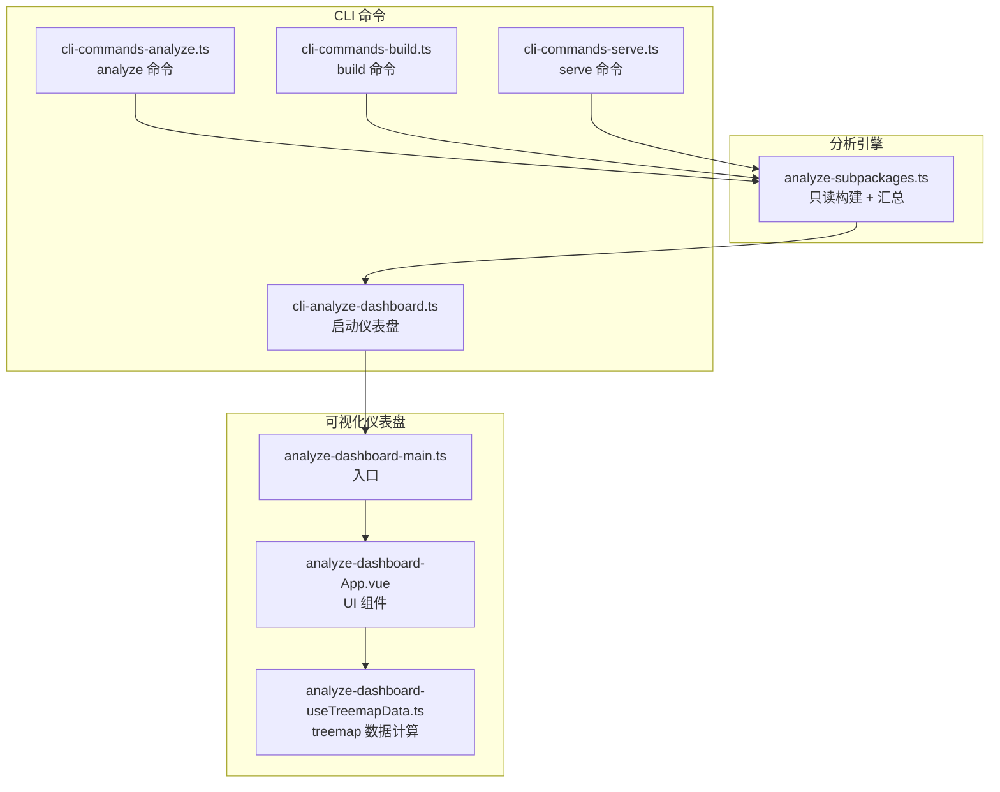
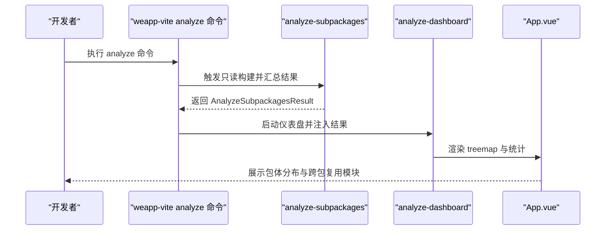
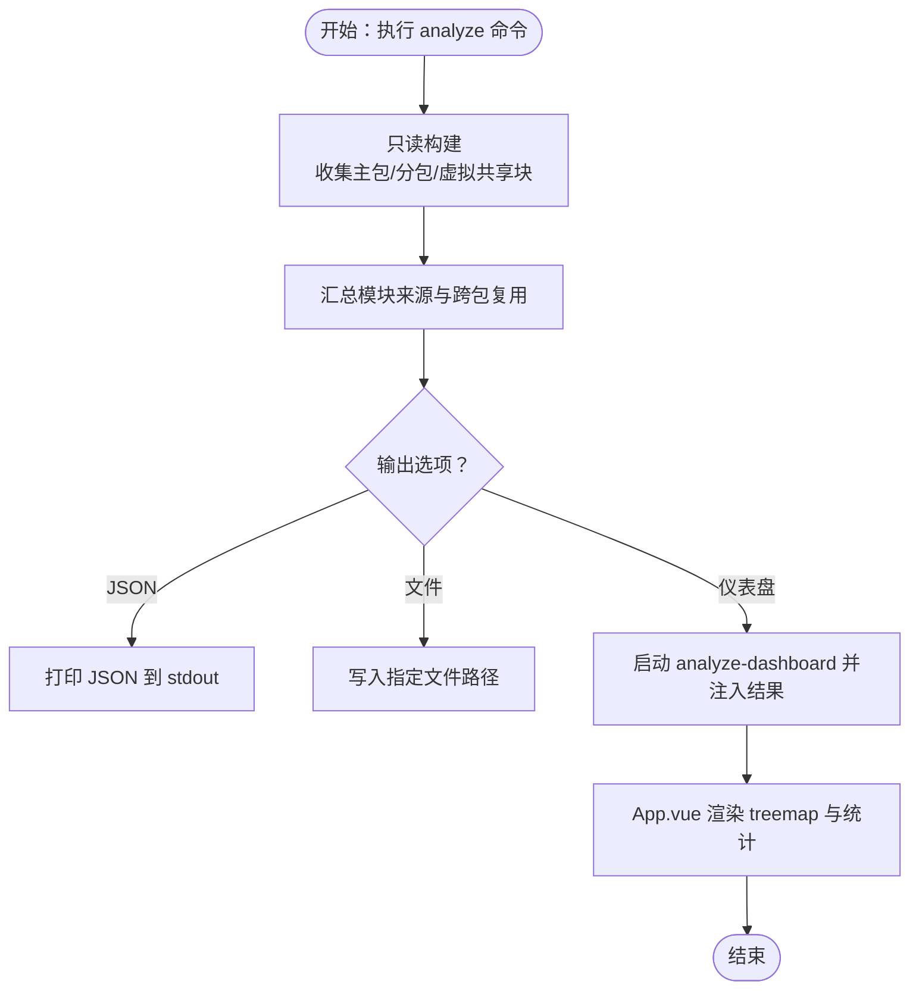
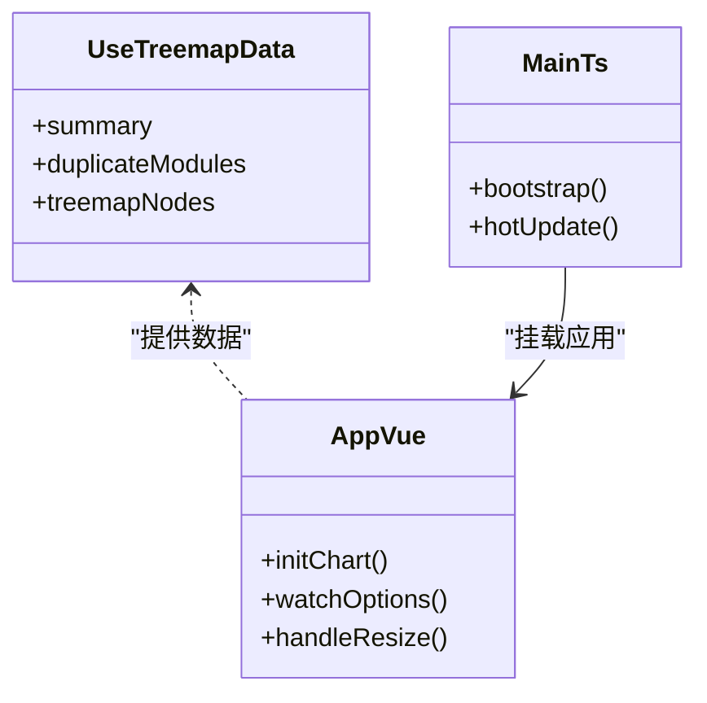
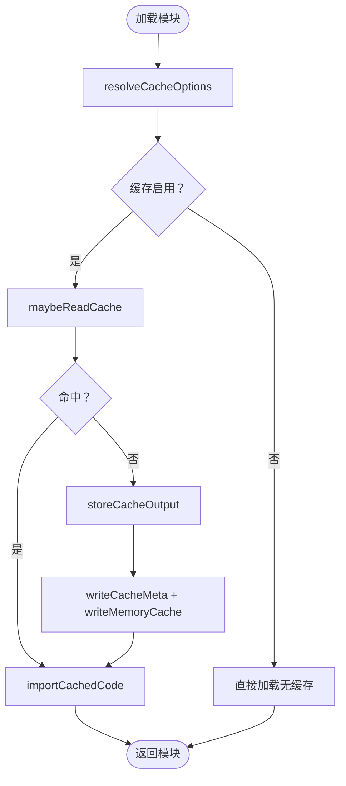
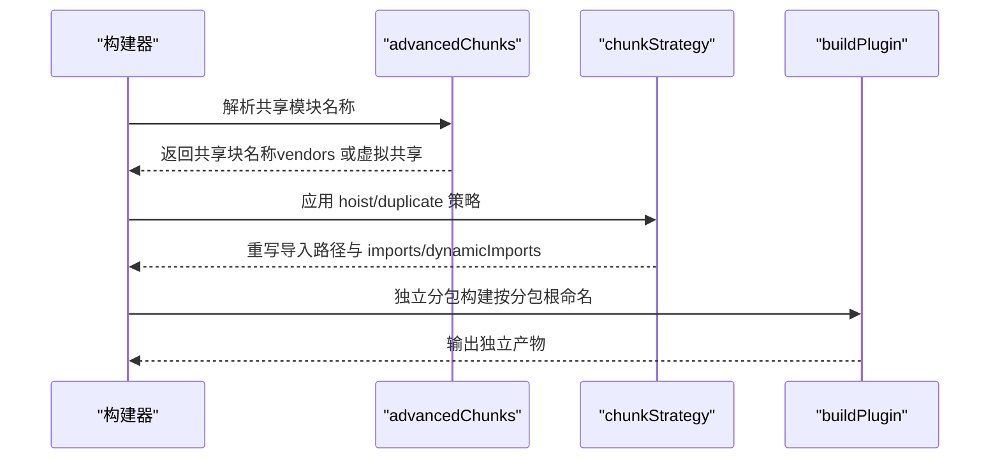
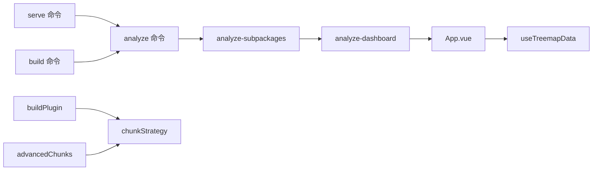

# 构建性能优化

<cite>
**本文引用的文件**
- [packages/weapp-vite/src/analyze/subpackages.ts](file://packages/weapp-vite/src/analyze/subpackages.ts)
- [packages/weapp-vite/src/cli/commands/analyze.ts](file://packages/weapp-vite/src/cli/commands/analyze.ts)
- [packages/weapp-vite/src/cli/commands/serve.ts](file://packages/weapp-vite/src/cli/commands/serve.ts)
- [packages/weapp-vite/src/cli/commands/build.ts](file://packages/weapp-vite/src/cli/commands/build.ts)
- [packages/weapp-vite/src/cli/analyze/dashboard.ts](file://packages/weapp-vite/src/cli/analyze/dashboard.ts)
- [packages/weapp-vite/analyze-dashboard/main.ts](file://packages/weapp-vite/analyze-dashboard/main.ts)
- [packages/weapp-vite/analyze-dashboard/App.vue](file://packages/weapp-vite/analyze-dashboard/App.vue)
- [packages/weapp-vite/analyze-dashboard/useTreemapData.ts](file://packages/weapp-vite/analyze-dashboard/useTreemapData.ts)
- [packages/weapp-vite/src/runtime/chunkStrategy.ts](file://packages/weapp-vite/src/runtime/chunkStrategy.ts)
- [packages/weapp-vite/src/runtime/advancedChunks.ts](file://packages/weapp-vite/src/runtime/advancedChunks.ts)
- [packages/weapp-vite/src/runtime/buildPlugin.ts](file://packages/weapp-vite/src/runtime/buildPlugin.ts)
- [packages/rolldown-require/src/cache.ts](file://packages/rolldown-require/src/cache.ts)
- [packages/rolldown-require/src/loader.ts](file://packages/rolldown-require/src/loader.ts)
- [packages/rolldown-require/test/cache.test.ts](file://packages/rolldown-require/test/cache.test.ts)
- [packages/vite-plugin-performance/README.md](file://packages/vite-plugin-performance/README.md)
- [website/guide/subpackage.md](file://website/guide/subpackage.md)
- [website/config/subpackages.md](file://website/config/subpackages.md)
</cite>

## 目录
1. [简介](#简介)
2. [项目结构](#项目结构)
3. [核心组件](#核心组件)
4. [架构总览](#架构总览)
5. [详细组件分析](#详细组件分析)
6. [依赖关系分析](#依赖关系分析)
7. [性能考量](#性能考量)
8. [故障排查指南](#故障排查指南)
9. [结论](#结论)
10. [附录](#附录)

## 简介
本指南围绕 weapp-vite 的构建性能优化展开，重点讲解如何使用 analyze 功能与 analyze-dashboard 可视化界面，分析分包大小、依赖关系与资源分布；如何配置 analyze 功能（启用分析、输出路径、集成到构建流程）；如何理解并配置构建缓存机制以加速增量构建；以及如何识别与消除构建瓶颈（大型依赖、资源压缩、并行构建优化）。文中所有技术细节均来自仓库源码与官方文档，确保可操作与可验证。

## 项目结构
weapp-vite 将“分析能力”与“可视化仪表盘”解耦为两部分：
- 分析引擎：在内存中执行一次只读构建，汇总主包、分包、虚拟共享块与模块来源，输出结构化结果。
- 可视化仪表盘：Vue 应用，消费分析结果，以树图（treemap）呈现包体分布，辅助定位跨包复用与体积热点。

图表来源
- [packages/weapp-vite/src/analyze/subpackages.ts](file://packages/weapp-vite/src/analyze/subpackages.ts#L539-L601)
- [packages/weapp-vite/src/cli/commands/analyze.ts](file://packages/weapp-vite/src/cli/commands/analyze.ts#L1-L135)
- [packages/weapp-vite/src/cli/commands/build.ts](file://packages/weapp-vite/src/cli/commands/build.ts#L1-L11)
- [packages/weapp-vite/src/cli/commands/serve.ts](file://packages/weapp-vite/src/cli/commands/serve.ts#L49-L98)
- [packages/weapp-vite/src/cli/analyze/dashboard.ts](file://packages/weapp-vite/src/cli/analyze/dashboard.ts#L88-L135)
- [packages/weapp-vite/analyze-dashboard/main.ts](file://packages/weapp-vite/analyze-dashboard/main.ts#L1-L36)
- [packages/weapp-vite/analyze-dashboard/App.vue](file://packages/weapp-vite/analyze-dashboard/App.vue#L1-L147)
- [packages/weapp-vite/analyze-dashboard/useTreemapData.ts](file://packages/weapp-vite/analyze-dashboard/useTreemapData.ts#L161-L226)

章节来源
- [packages/weapp-vite/src/analyze/subpackages.ts](file://packages/weapp-vite/src/analyze/subpackages.ts#L539-L601)
- [packages/weapp-vite/src/cli/commands/analyze.ts](file://packages/weapp-vite/src/cli/commands/analyze.ts#L1-L135)
- [packages/weapp-vite/src/cli/commands/build.ts](file://packages/weapp-vite/src/cli/commands/build.ts#L1-L11)
- [packages/weapp-vite/src/cli/commands/serve.ts](file://packages/weapp-vite/src/cli/commands/serve.ts#L49-L98)
- [packages/weapp-vite/src/cli/analyze/dashboard.ts](file://packages/weapp-vite/src/cli/analyze/dashboard.ts#L88-L135)
- [packages/weapp-vite/analyze-dashboard/main.ts](file://packages/weapp-vite/analyze-dashboard/main.ts#L1-L36)
- [packages/weapp-vite/analyze-dashboard/App.vue](file://packages/weapp-vite/analyze-dashboard/App.vue#L1-L147)
- [packages/weapp-vite/analyze-dashboard/useTreemapData.ts](file://packages/weapp-vite/analyze-dashboard/useTreemapData.ts#L161-L226)

## 核心组件
- 分析引擎（analyze-subpackages）
  - 通过只读构建（write=false）收集主包与独立分包的输出，统计每个包的文件、模块来源与跨包复用情况，输出结构化结果。
  - 关键点：虚拟共享块、模块来源类型（src/node_modules/workspace）、入口与非入口文件、模块原始/渲染字节数。
- 可视化仪表盘（analyze-dashboard）
  - Vue 应用，消费分析结果，以 treemap 展示包体分布，同时列出跨包复用最多的模块 Top N。
- CLI 命令
  - analyze 命令：执行分析并可输出 JSON 或启动可视化仪表盘。
  - serve/build 命令：在开发/生产构建中可触发分析并联动仪表盘更新。
- 构建缓存（rolldown-require）
  - 通过持久化与内存缓存加速模块加载，命中后跳过重复编译，显著缩短增量构建时间。
- 分包策略（chunkStrategy/advancedChunks）
  - 提供 hoist/duplicate 等策略，控制第三方依赖与共享模块在主包/分包间的分布，平衡首开与总体体积。

章节来源
- [packages/weapp-vite/src/analyze/subpackages.ts](file://packages/weapp-vite/src/analyze/subpackages.ts#L1-L200)
- [packages/weapp-vite/analyze-dashboard/App.vue](file://packages/weapp-vite/analyze-dashboard/App.vue#L1-L147)
- [packages/weapp-vite/src/cli/commands/analyze.ts](file://packages/weapp-vite/src/cli/commands/analyze.ts#L1-L135)
- [packages/rolldown-require/src/cache.ts](file://packages/rolldown-require/src/cache.ts#L1-L285)
- [packages/weapp-vite/src/runtime/chunkStrategy.ts](file://packages/weapp-vite/src/runtime/chunkStrategy.ts#L769-L807)
- [packages/weapp-vite/src/runtime/advancedChunks.ts](file://packages/weapp-vite/src/runtime/advancedChunks.ts#L1-L57)

## 架构总览
下面的序列图展示了从 CLI 到分析结果再到仪表盘的端到端流程。

图表来源
- [packages/weapp-vite/src/cli/commands/analyze.ts](file://packages/weapp-vite/src/cli/commands/analyze.ts#L1-L135)
- [packages/weapp-vite/src/analyze/subpackages.ts](file://packages/weapp-vite/src/analyze/subpackages.ts#L539-L601)
- [packages/weapp-vite/src/cli/analyze/dashboard.ts](file://packages/weapp-vite/src/cli/analyze/dashboard.ts#L88-L135)
- [packages/weapp-vite/analyze-dashboard/App.vue](file://packages/weapp-vite/analyze-dashboard/App.vue#L1-L147)

章节来源
- [packages/weapp-vite/src/cli/commands/analyze.ts](file://packages/weapp-vite/src/cli/commands/analyze.ts#L1-L135)
- [packages/weapp-vite/src/analyze/subpackages.ts](file://packages/weapp-vite/src/analyze/subpackages.ts#L539-L601)
- [packages/weapp-vite/src/cli/analyze/dashboard.ts](file://packages/weapp-vite/src/cli/analyze/dashboard.ts#L88-L135)
- [packages/weapp-vite/analyze-dashboard/App.vue](file://packages/weapp-vite/analyze-dashboard/App.vue#L1-L147)

## 详细组件分析

### analyze 功能与 analyze-dashboard 使用
- 启用分析
  - CLI 提供 analyze 命令，执行后会进行一次只读构建，汇总主包/分包/虚拟共享块与模块来源。
  - 开发模式下，serve 命令也可启用分析并在热更新时自动刷新仪表盘。
- 输出与集成
  - analyze 命令支持输出 JSON 或写入磁盘文件，便于与其他工具联动。
  - 仪表盘通过 window 注入分析结果，支持热更新事件同步。
- 可视化指标
  - 包体数量、源码模块数、跨包复用数、总产物体积。
  - treemap 图表展示各包文件占比，Top N 跨包复用模块列表辅助定位热点。

图表来源
- [packages/weapp-vite/src/cli/commands/analyze.ts](file://packages/weapp-vite/src/cli/commands/analyze.ts#L1-L135)
- [packages/weapp-vite/src/analyze/subpackages.ts](file://packages/weapp-vite/src/analyze/subpackages.ts#L539-L601)
- [packages/weapp-vite/src/cli/analyze/dashboard.ts](file://packages/weapp-vite/src/cli/analyze/dashboard.ts#L88-L135)
- [packages/weapp-vite/analyze-dashboard/main.ts](file://packages/weapp-vite/analyze-dashboard/main.ts#L1-L36)
- [packages/weapp-vite/analyze-dashboard/App.vue](file://packages/weapp-vite/analyze-dashboard/App.vue#L1-L147)

章节来源
- [packages/weapp-vite/src/cli/commands/analyze.ts](file://packages/weapp-vite/src/cli/commands/analyze.ts#L1-L135)
- [packages/weapp-vite/src/cli/commands/serve.ts](file://packages/weapp-vite/src/cli/commands/serve.ts#L49-L98)
- [packages/weapp-vite/src/cli/analyze/dashboard.ts](file://packages/weapp-vite/src/cli/analyze/dashboard.ts#L88-L135)
- [packages/weapp-vite/analyze-dashboard/main.ts](file://packages/weapp-vite/analyze-dashboard/main.ts#L1-L36)
- [packages/weapp-vite/analyze-dashboard/App.vue](file://packages/weapp-vite/analyze-dashboard/App.vue#L1-L147)

### analyze-dashboard 可视化实现
- 数据层
  - useTreemapData 计算包体摘要、跨包复用模块 Top N、treemap 节点树。
- UI 层
  - App.vue 初始化 ECharts，监听窗口更新事件，动态渲染 treemap。
- 启动与热更新
  - main.ts 在开发模式下注入 mock 数据，监听 HMR 更新事件，实时刷新。

图表来源
- [packages/weapp-vite/analyze-dashboard/useTreemapData.ts](file://packages/weapp-vite/analyze-dashboard/useTreemapData.ts#L161-L226)
- [packages/weapp-vite/analyze-dashboard/App.vue](file://packages/weapp-vite/analyze-dashboard/App.vue#L1-L147)
- [packages/weapp-vite/analyze-dashboard/main.ts](file://packages/weapp-vite/analyze-dashboard/main.ts#L1-L36)

章节来源
- [packages/weapp-vite/analyze-dashboard/useTreemapData.ts](file://packages/weapp-vite/analyze-dashboard/useTreemapData.ts#L161-L226)
- [packages/weapp-vite/analyze-dashboard/App.vue](file://packages/weapp-vite/analyze-dashboard/App.vue#L1-L147)
- [packages/weapp-vite/analyze-dashboard/main.ts](file://packages/weapp-vite/analyze-dashboard/main.ts#L1-L36)

### 构建缓存机制（rolldown-require）
- 缓存策略
  - 默认关闭，可通过 cache: true 或传入对象开启；支持持久化与进程内缓存。
  - 缓存键由入口路径、mtime/size、format、tsconfig、Node 版本、rolldownOptions 摘要决定。
  - 有效性校验：命中后逐项比对入口与依赖的 mtime/size，任一变化即失效。
  - 内存缓存默认开启，命中后直接返回模块，避免额外 IO。
  - reset 选项可重写缓存条目；onEvent 可捕获 hit/miss/store/skip-invalid 事件。
- 加载流程
  - resolveCacheOptions -> maybeReadCache -> importCachedCode（命中）或写入缓存 -> writeCacheMeta -> writeMemoryCache。
  - ESM 场景优先落盘，失败时回退到 data: URL。

图表来源
- [packages/rolldown-require/src/cache.ts](file://packages/rolldown-require/src/cache.ts#L1-L285)
- [packages/rolldown-require/src/loader.ts](file://packages/rolldown-require/src/loader.ts#L1-L117)
- [packages/rolldown-require/test/cache.test.ts](file://packages/rolldown-require/test/cache.test.ts#L1-L78)

章节来源
- [packages/rolldown-require/src/cache.ts](file://packages/rolldown-require/src/cache.ts#L1-L285)
- [packages/rolldown-require/src/loader.ts](file://packages/rolldown-require/src/loader.ts#L1-L117)
- [packages/rolldown-require/test/cache.test.ts](file://packages/rolldown-require/test/cache.test.ts#L1-L78)

### 分包构建与共享策略
- 策略选择
  - duplicate：跨分包共享模块复制到各自分包的共享块，降低首开拉取成本。
  - hoist：跨分包共享模块统一提炼到主包，减少重复，适合更关注总体体积的项目。
- 名称解析与重写
  - advancedChunks 提供高级名称解析器，结合 vendorsMatcher 与 forceDuplicateTester，决定是否提升到 vendors 或复制到多分包。
  - chunkStrategy 负责在输出阶段重写导入路径、更新 imports/dynamicImports 等字段。
- 独立分包
  - buildPlugin 为独立分包创建独立构建任务，按分包根命名 chunk 文件名，避免共享复用。

图表来源
- [packages/weapp-vite/src/runtime/advancedChunks.ts](file://packages/weapp-vite/src/runtime/advancedChunks.ts#L1-L57)
- [packages/weapp-vite/src/runtime/chunkStrategy.ts](file://packages/weapp-vite/src/runtime/chunkStrategy.ts#L769-L807)
- [packages/weapp-vite/src/runtime/buildPlugin.ts](file://packages/weapp-vite/src/runtime/buildPlugin.ts#L63-L105)

章节来源
- [packages/weapp-vite/src/runtime/advancedChunks.ts](file://packages/weapp-vite/src/runtime/advancedChunks.ts#L1-L57)
- [packages/weapp-vite/src/runtime/chunkStrategy.ts](file://packages/weapp-vite/src/runtime/chunkStrategy.ts#L769-L807)
- [packages/weapp-vite/src/runtime/buildPlugin.ts](file://packages/weapp-vite/src/runtime/buildPlugin.ts#L63-L105)

### 性能分析插件（vite-plugin-performance）
- 作用：包装一个或多个 Vite 插件，统计生命周期钩子耗时，阈值过滤，便于定位慢钩子。
- 使用：在构建配置中 wrapPlugin(...)，设置阈值与回调，输出到监控系统。

章节来源
- [packages/vite-plugin-performance/README.md](file://packages/vite-plugin-performance/README.md#L1-L124)

## 依赖关系分析
- analyze 与 serve/build 的集成
  - serve 命令在 runMini 时可启用 analyze，并在构建事件 END 时触发仪表盘更新。
  - build 命令在执行分析后可选择启动仪表盘或输出 JSON/文件。
- analyze-dashboard 与分析引擎
  - analyze-subpackages 产出结构化结果，dashboard 通过 window 注入并监听热更新事件。
- 分包策略与构建流程
  - advancedChunks/strategy 与 buildPlugin 共同决定共享块命名、复制与重写导入路径。

图表来源
- [packages/weapp-vite/src/cli/commands/serve.ts](file://packages/weapp-vite/src/cli/commands/serve.ts#L49-L98)
- [packages/weapp-vite/src/cli/commands/build.ts](file://packages/weapp-vite/src/cli/commands/build.ts#L1-L11)
- [packages/weapp-vite/src/cli/commands/analyze.ts](file://packages/weapp-vite/src/cli/commands/analyze.ts#L1-L135)
- [packages/weapp-vite/src/analyze/subpackages.ts](file://packages/weapp-vite/src/analyze/subpackages.ts#L539-L601)
- [packages/weapp-vite/src/cli/analyze/dashboard.ts](file://packages/weapp-vite/src/cli/analyze/dashboard.ts#L88-L135)
- [packages/weapp-vite/analyze-dashboard/App.vue](file://packages/weapp-vite/analyze-dashboard/App.vue#L1-L147)
- [packages/weapp-vite/analyze-dashboard/useTreemapData.ts](file://packages/weapp-vite/analyze-dashboard/useTreemapData.ts#L161-L226)
- [packages/weapp-vite/src/runtime/buildPlugin.ts](file://packages/weapp-vite/src/runtime/buildPlugin.ts#L63-L105)
- [packages/weapp-vite/src/runtime/chunkStrategy.ts](file://packages/weapp-vite/src/runtime/chunkStrategy.ts#L769-L807)
- [packages/weapp-vite/src/runtime/advancedChunks.ts](file://packages/weapp-vite/src/runtime/advancedChunks.ts#L1-L57)

章节来源
- [packages/weapp-vite/src/cli/commands/serve.ts](file://packages/weapp-vite/src/cli/commands/serve.ts#L49-L98)
- [packages/weapp-vite/src/cli/commands/build.ts](file://packages/weapp-vite/src/cli/commands/build.ts#L1-L11)
- [packages/weapp-vite/src/cli/commands/analyze.ts](file://packages/weapp-vite/src/cli/commands/analyze.ts#L1-L135)
- [packages/weapp-vite/src/analyze/subpackages.ts](file://packages/weapp-vite/src/analyze/subpackages.ts#L539-L601)
- [packages/weapp-vite/src/cli/analyze/dashboard.ts](file://packages/weapp-vite/src/cli/analyze/dashboard.ts#L88-L135)
- [packages/weapp-vite/analyze-dashboard/App.vue](file://packages/weapp-vite/analyze-dashboard/App.vue#L1-L147)
- [packages/weapp-vite/analyze-dashboard/useTreemapData.ts](file://packages/weapp-vite/analyze-dashboard/useTreemapData.ts#L161-L226)
- [packages/weapp-vite/src/runtime/buildPlugin.ts](file://packages/weapp-vite/src/runtime/buildPlugin.ts#L63-L105)
- [packages/weapp-vite/src/runtime/chunkStrategy.ts](file://packages/weapp-vite/src/runtime/chunkStrategy.ts#L769-L807)
- [packages/weapp-vite/src/runtime/advancedChunks.ts](file://packages/weapp-vite/src/runtime/advancedChunks.ts#L1-L57)

## 性能考量
- 使用 analyze-dashboard 识别跨包复用热点与大体积模块，结合 sharedStrategy 选择 hoist/duplicate。
- 启用 rolldown-require 缓存，减少重复编译；在 CI/本地开发中利用 reset/onEvent 优化缓存命中率。
- 通过 vite-plugin-performance 定位慢钩子，优化插件顺序与配置。
- 独立分包避免跨包共享，减少主包依赖泄漏与重复打包。
- 结合网站指南与配置文档，合理设置 subPackages 与 chunks 参数，控制依赖裁剪与样式共享范围。

[本节为通用性能建议，不直接分析具体文件]

## 故障排查指南
- analyze 命令未输出或仪表盘空白
  - 确认已正确执行 analyze 命令并成功生成分析结果。
  - 检查 serve/build 是否启用 analyze，开发模式下仪表盘是否启动。
- 仪表盘热更新不生效
  - 确认 serve 流程中监听 END 事件并触发更新。
  - 检查 HMR 事件名称与 window 注入逻辑。
- 缓存未命中或频繁失效
  - 检查 cache 配置（enabled/dir/reset/memory/onEvent）。
  - 确认入口与依赖的 mtime/size 未发生变化；必要时使用 reset。
- 分包策略导致体积异常
  - 根据项目目标选择 hoist/duplicate；结合 advancedChunks 的 vendorsMatcher 与 forceDuplicateTester 调整策略。
  - 使用 analyze-dashboard 的 treemap 与跨包复用列表定位问题模块。

章节来源
- [packages/weapp-vite/src/cli/commands/analyze.ts](file://packages/weapp-vite/src/cli/commands/analyze.ts#L1-L135)
- [packages/weapp-vite/src/cli/commands/serve.ts](file://packages/weapp-vite/src/cli/commands/serve.ts#L49-L98)
- [packages/weapp-vite/src/cli/analyze/dashboard.ts](file://packages/weapp-vite/src/cli/analyze/dashboard.ts#L88-L135)
- [packages/rolldown-require/src/cache.ts](file://packages/rolldown-require/src/cache.ts#L1-L285)
- [packages/rolldown-require/test/cache.test.ts](file://packages/rolldown-require/test/cache.test.ts#L1-L78)
- [packages/weapp-vite/src/runtime/advancedChunks.ts](file://packages/weapp-vite/src/runtime/advancedChunks.ts#L1-L57)
- [packages/weapp-vite/src/runtime/chunkStrategy.ts](file://packages/weapp-vite/src/runtime/chunkStrategy.ts#L769-L807)

## 结论
通过 analyze 与 analyze-dashboard，开发者可以直观地看到主包、分包与共享块的体积分布与模块来源，从而有针对性地优化分包策略与共享策略。结合 rolldown-require 缓存与 vite-plugin-performance，能够在本地与 CI 环境中显著缩短增量构建时间并定位性能瓶颈。配合网站指南与配置文档，可进一步精细化控制依赖裁剪、样式共享与构建参数，实现更优的构建性能与产物体积。

[本节为总结性内容，不直接分析具体文件]

## 附录
- 官方指南与配置
  - 分包指南与配置：[分包指南](file://website/guide/subpackage.md#L1-L244)、[分包配置](file://website/config/subpackages.md#L1-L112)
- 常用 CLI 选项
  - analyze 命令支持 --json 与 --output，用于输出 JSON 或写入文件；serve/build 命令可集成分析与仪表盘更新。

章节来源
- [website/guide/subpackage.md](file://website/guide/subpackage.md#L1-L244)
- [website/config/subpackages.md](file://website/config/subpackages.md#L1-L112)