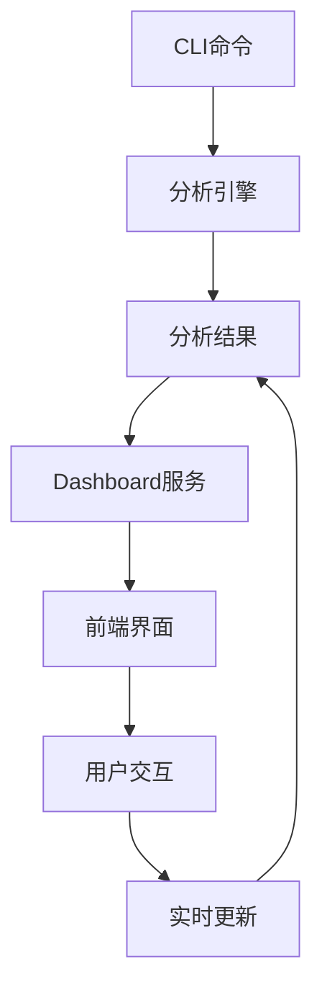
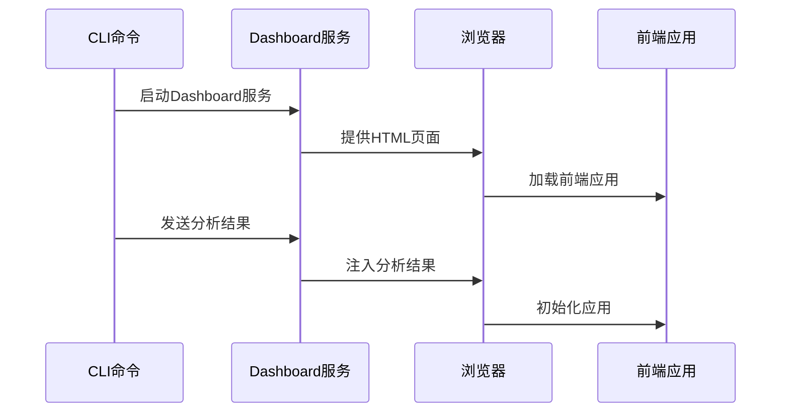
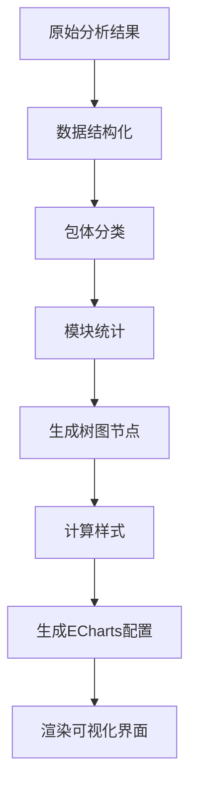
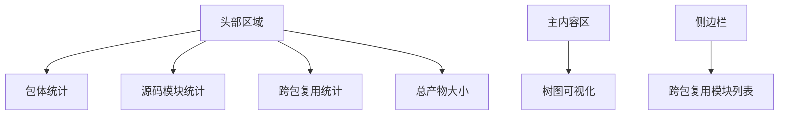
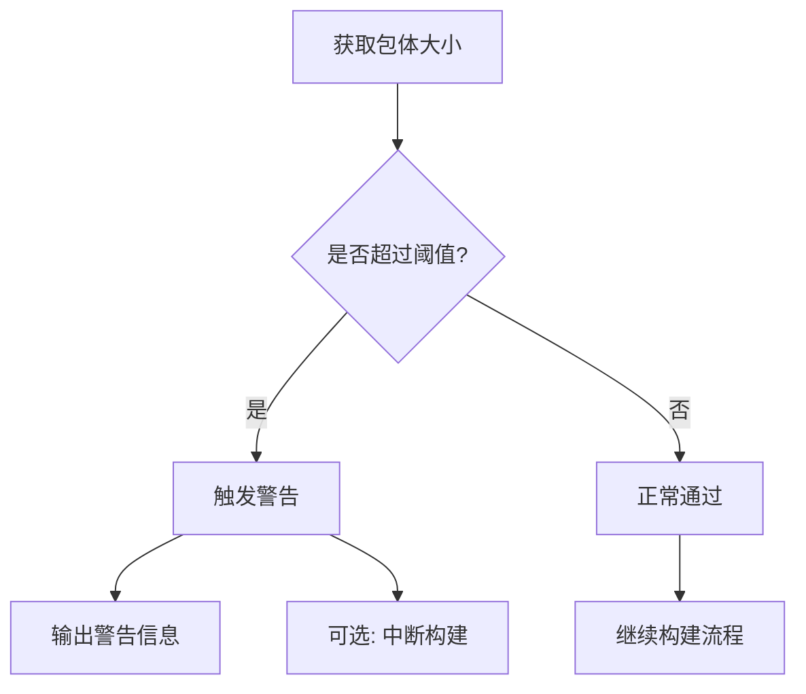
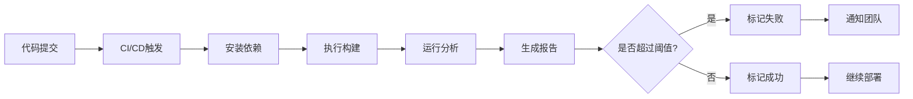
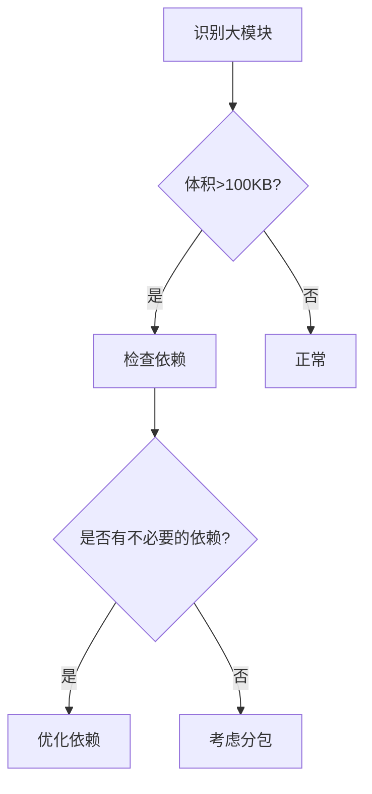
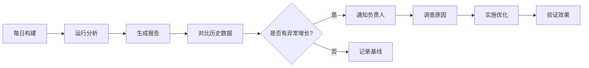

# 监控与分析工具

<cite>
**本文档引用的文件**  
- [main.ts](file://packages/weapp-vite/analyze-dashboard/main.ts)
- [App.vue](file://packages/weapp-vite/analyze-dashboard/App.vue)
- [useTreemapData.ts](file://packages/weapp-vite/analyze-dashboard/useTreemapData.ts)
- [mock-data.ts](file://packages/weapp-vite/analyze-dashboard/mock-data.ts)
- [vite.config.ts](file://packages/weapp-vite/analyze-dashboard/vite.config.ts)
- [build-analyze-dashboard.mjs](file://packages/weapp-vite/scripts/build-analyze-dashboard.mjs)
- [subpackages.ts](file://packages/weapp-vite/src/analyze/subpackages.ts)
- [dashboard.ts](file://packages/weapp-vite/src/cli/analyze/dashboard.ts)
- [analyze.ts](file://packages/weapp-vite/src/cli/commands/analyze.ts)
- [packagePaths.ts](file://packages/weapp-vite/src/packagePaths.ts)
</cite>

## 目录
1. [引言](#引言)
2. [分包监控与分析能力](#分包监控与分析能力)
3. [analyze-dashboard架构设计](#analyze-dashboard架构设计)
4. [可视化界面监控分包大小变化](#可视化界面监控分包大小变化)
5. [设置分包大小警告阈值](#设置分包大小警告阈值)
6. [CI/CD流程中集成自动化检查](#cicd流程中集成自动化检查)
7. [解读分析报告](#解读分析报告)
8. [自定义监控脚本开发](#自定义监控脚本开发)
9. [扩展analyze功能](#扩展analyze功能)
10. [实际案例展示](#实际案例展示)
11. [总结](#总结)

## 引言

weapp-vite提供的分包监控与分析工具是一套完整的性能优化解决方案，旨在帮助开发者全面了解小程序包体结构、监控分包大小变化、识别体积过大的模块和不必要的依赖。该工具通过analyze-dashboard可视化界面，结合CLI命令行工具，为开发者提供了强大的分包分析能力。

**分包监控与分析工具的核心价值**：
- 提供直观的包体结构可视化
- 精确监控分包大小变化趋势
- 识别跨包复用和重复依赖
- 支持自动化集成到CI/CD流程
- 提供可扩展的自定义监控能力

## 分包监控与分析能力

weapp-vite的分包监控与分析能力基于对构建产物的深度分析，能够提供全面的包体结构信息和源码模块映射关系。

### 核心分析功能

#### 包体结构分析
工具能够分析主包、分包和独立分包的结构，包括：
- 包体数量统计
- 源码模块数量
- 跨包复用情况
- 总产物大小

#### 模块依赖分析
通过分析模块间的依赖关系，工具能够：
- 识别跨包复用的模块
- 检测重复引入的依赖
- 追踪模块的源码类型（src、node_modules、plugin等）
- 计算模块的实际体积和原始体积

#### 构建产物分析
对构建产物进行详细分析，包括：
- 代码chunk分析
- 静态资源分析
- 文件来源追踪
- 体积大小计算

**Section sources**
- [subpackages.ts](file://packages/weapp-vite/src/analyze/subpackages.ts#L1-L601)
- [analyze.ts](file://packages/weapp-vite/src/cli/commands/analyze.ts#L1-L136)

## analyze-dashboard架构设计

analyze-dashboard是weapp-vite分包分析功能的可视化核心，采用Vue 3 + TypeScript + ECharts的技术栈构建，提供了直观的包体结构可视化界面。

### 整体架构



**Diagram sources**
- [dashboard.ts](file://packages/weapp-vite/src/cli/analyze/dashboard.ts#L1-L172)
- [main.ts](file://packages/weapp-vite/analyze-dashboard/main.ts#L1-L36)

### 核心组件

#### 数据注入机制
analyze-dashboard通过全局变量`__WEAPP_VITE_ANALYZE_RESULT__`接收分析结果，支持两种模式：
- **开发模式**：使用mock数据进行界面开发和调试
- **生产模式**：接收实际的分析结果数据



**Diagram sources**
- [main.ts](file://packages/weapp-vite/analyze-dashboard/main.ts#L5-L27)
- [dashboard.ts](file://packages/weapp-vite/src/cli/analyze/dashboard.ts#L22-L44)

#### 状态管理
采用Vue的响应式系统管理分析结果状态，主要包含：
- `resultRef`：存储分析结果
- `summary`：计算包体摘要信息
- `duplicateModules`：计算跨包复用模块
- `treemapOption`：生成树图配置

**Section sources**
- [useTreemapData.ts](file://packages/weapp-vite/analyze-dashboard/useTreemapData.ts#L164-L359)
- [App.vue](file://packages/weapp-vite/analyze-dashboard/App.vue#L19-L28)

### 数据处理流程



**Diagram sources**
- [useTreemapData.ts](file://packages/weapp-vite/analyze-dashboard/useTreemapData.ts#L214-L308)
- [App.vue](file://packages/weapp-vite/analyze-dashboard/App.vue#L49-L50)

## 可视化界面监控分包大小变化

analyze-dashboard提供了直观的可视化界面，帮助开发者监控分包大小变化，识别包体结构问题。

### 界面布局



**Diagram sources**
- [App.vue](file://packages/weapp-vite/analyze-dashboard/App.vue#L77-L116)

### 核心可视化组件

#### 树图（Treemap）
使用ECharts的树图组件展示包体结构，具有以下特点：
- 不同颜色区分主包、分包和独立分包
- 大小反映文件或模块的实际体积
- 支持缩放查看细节
- 悬停显示详细信息

```mermaid
classDiagram
class TreemapChart {
+type : 'treemap'
+roam : true
+nodeClick : 'zoomToNode'
+label : LabelConfig
+upperLabel : UpperLabelConfig
+itemStyle : ItemStyleConfig
+levels : LevelConfig[]
+colorMappingBy : 'id'
+data : TreemapNode[]
}
class LabelConfig {
+show : true
+color : '#e2e8f0'
+formatter : '{b}'
}
class UpperLabelConfig {
+show : true
+height : 30
+color : '#f8fafc'
+borderRadius : 4
+formatter : '{b}'
+fontWeight : '600'
}
class ItemStyleConfig {
+gapWidth : 1
}
class LevelConfig {
+itemStyle : LevelItemStyle
+upperLabel : LevelUpperLabel
}
TreemapChart --> LabelConfig
TreemapChart --> UpperLabelConfig
TreemapChart --> ItemStyleConfig
TreemapChart --> LevelConfig
```

**Diagram sources**
- [useTreemapData.ts](file://packages/weapp-vite/analyze-dashboard/useTreemapData.ts#L310-L340)
- [App.vue](file://packages/weapp-vite/analyze-dashboard/App.vue#L122-L124)

#### 交互功能
- **缩放**：点击节点可放大查看细节
- **悬停**：显示详细的模块信息
- **响应式**：适配不同屏幕尺寸
- **实时更新**：支持热重载更新分析结果

**Section sources**
- [App.vue](file://packages/weapp-vite/analyze-dashboard/App.vue#L44-L70)
- [useTreemapData.ts](file://packages/weapp-vite/analyze-dashboard/useTreemapData.ts#L30-L42)

## 设置分包大小警告阈值

weapp-vite提供了灵活的机制来设置分包大小警告阈值，帮助团队维护包体大小规范。

### 阈值配置方式

#### 通过CLI参数
可以直接在命令行中指定阈值：

```bash
weapp-vite analyze --threshold 2048
```

#### 通过配置文件
在项目配置文件中定义阈值规则：

```typescript
// vite.config.ts
export default defineConfig({
  weapp: {
    analyze: {
      thresholds: {
        main: 2048, // 主包2MB
        subPackage: 1024, // 分包1MB
        independent: 512 // 独立分包512KB
      }
    }
  }
})
```

### 阈值验证逻辑



**Section sources**
- [analyze.ts](file://packages/weapp-vite/src/cli/commands/analyze.ts#L14-L74)
- [subpackages.ts](file://packages/weapp-vite/src/analyze/subpackages.ts#L173-L193)

### 警告级别

支持多种警告级别：
- **信息**：仅提示，不影响构建
- **警告**：提示并记录，但继续构建
- **错误**：中断构建流程

## CI/CD流程中集成自动化检查

将分包大小检查集成到CI/CD流程中，可以有效防止包体过大问题进入生产环境。

### 集成方案

#### GitHub Actions集成
```yaml
name: Build and Analyze
on: [push, pull_request]

jobs:
  analyze:
    runs-on: ubuntu-latest
    steps:
      - uses: actions/checkout@v3
      - uses: pnpm/action-setup@v2
      - uses: actions/setup-node@v3
        with:
          node-version: '20'
      - run: pnpm install
      - run: pnpm weapp-vite analyze --json --output analysis-result.json
      - run: node check-size.js
```

#### 脚本自动化检查
```javascript
// check-size.js
const fs = require('fs');
const result = JSON.parse(fs.readFileSync('analysis-result.json'));

const thresholds = {
  main: 2048 * 1024,
  subPackage: 1024 * 1024
};

let hasError = false;

result.packages.forEach(pkg => {
  const totalSize = pkg.files.reduce((sum, file) => sum + (file.size || 0), 0);
  const threshold = pkg.type === 'main' ? thresholds.main : thresholds.subPackage;
  
  if (totalSize > threshold) {
    console.error(`❌ ${pkg.label} 超过大小限制: ${formatBytes(totalSize)} > ${formatBytes(threshold)}`);
    hasError = true;
  }
});

if (hasError) {
  process.exit(1);
}
```

**Section sources**
- [analyze.ts](file://packages/weapp-vite/src/cli/commands/analyze.ts#L80-L81)
- [subpackages.ts](file://packages/weapp-vite/src/analyze/subpackages.ts#L53-L56)

### 自动化检查流程



## 解读分析报告

正确解读分析报告是优化分包性能的关键，以下是如何解读各项指标的指南。

### 报告核心指标

#### 包体统计
- **包体数量**：项目中包含的包总数
- **源码模块**：参与构建的源码模块数量
- **跨包复用**：被多个包引用的模块数量
- **总产物**：所有包体的总大小

#### 模块分析
- **模块体积**：压缩后的实际体积
- **原始体积**：未压缩前的体积
- **源码类型**：模块来源（src、node_modules等）
- **跨包复用次数**：被多少个包引用

### 识别问题模式

#### 体积过大的模块


**Section sources**
- [useTreemapData.ts](file://packages/weapp-vite/analyze-dashboard/useTreemapData.ts#L146-L159)
- [App.vue](file://packages/weapp-vite/analyze-dashboard/App.vue#L129-L142)

#### 不必要的依赖
常见问题包括：
- 重复引入相同的库
- 引入了未使用的功能
- 过度依赖大型框架

### 优化建议
- 将大模块拆分为更小的单元
- 使用按需加载
- 移除未使用的依赖
- 考虑使用CDN加载大型库

## 自定义监控脚本开发

weapp-vite提供了API接口，支持开发自定义监控脚本以满足特定项目的监控需求。

### API接口

#### 分析结果结构
```typescript
interface AnalyzeSubpackagesResult {
  packages: PackageReport[]
  modules: ModuleUsage[]
  subPackages: SubPackageDescriptor[]
}

interface PackageReport {
  id: string
  label: string
  type: PackageType
  files: PackageFileEntry[]
}

interface ModuleUsage {
  id: string
  source: string
  sourceType: ModuleSourceType
  packages: Array<{ packageId: string, files: string[] }>
}
```

**Section sources**
- [subpackages.ts](file://packages/weapp-vite/src/analyze/subpackages.ts#L52-L56)

### 自定义脚本示例

```typescript
// custom-analyzer.ts
import { analyzeSubpackages } from 'weapp-vite/analyze/subpackages';
import { createCompilerContext } from 'weapp-vite/createContext';

async function customAnalyze() {
  const ctx = await createCompilerContext({
    cwd: process.cwd(),
    mode: 'production'
  });
  
  const result = await analyzeSubpackages(ctx);
  
  // 自定义分析逻辑
  const largeModules = result.modules.filter(mod => {
    const totalSize = mod.packages.reduce((sum, pkg) => {
      const pkgInfo = result.packages.find(p => p.id === pkg.packageId);
      return sum + (pkgInfo?.files.find(f => f.file === pkg.files[0])?.size || 0);
    }, 0);
    return totalSize > 1024 * 100; // 100KB
  });
  
  console.log('大模块列表:', largeModules);
}

customAnalyze();
```

## 扩展analyze功能

weapp-vite的analyze功能设计为可扩展的，支持通过插件机制扩展分析能力。

### 扩展点

#### 自定义分析器
可以注册自定义分析器来添加新的分析维度：

```typescript
// custom-analyzer-plugin.ts
import type { Plugin } from 'weapp-vite';

const customAnalyzerPlugin: Plugin = {
  name: 'custom-analyzer',
  config(config) {
    // 添加自定义配置
    return {
      weapp: {
        analyze: {
          customRules: {
            maxModuleSize: 200 * 1024 // 200KB
          }
        }
      }
    };
  },
  buildStart() {
    // 在构建开始时执行自定义分析
  }
};

export default customAnalyzerPlugin;
```

#### 结果处理器
可以注册结果处理器来修改或增强分析结果：

```typescript
// result-processor.ts
import type { AnalyzeSubpackagesResult } from 'weapp-vite/analyze/subpackages';

function processResult(result: AnalyzeSubpackagesResult) {
  // 添加自定义指标
  result.customMetrics = {
    averageModuleSize: calculateAverageSize(result.modules),
    dependencyComplexity: calculateComplexity(result.modules)
  };
  return result;
}
```

**Section sources**
- [subpackages.ts](file://packages/weapp-vite/src/analyze/subpackages.ts#L539-L601)
- [analyze.ts](file://packages/weapp-vite/src/cli/commands/analyze.ts#L102-L103)

## 实际案例展示

通过实际案例展示如何利用分析数据持续优化分包性能。

### 案例一：电商小程序优化

#### 优化前状态
- 主包大小：2.8MB
- 分包A大小：1.5MB
- 分包B大小：1.2MB
- 跨包复用模块：3个

#### 问题分析
通过analyze-dashboard发现：
- `lodash-es`被三个包重复引入
- `common-header`组件在所有包中都存在
- `request-utils`工具库体积过大

#### 优化措施
1. 将`lodash-es`提取为共享虚拟包
2. 将`common-header`组件放入主包
3. 拆分`request-utils`为更小的模块

#### 优化后结果
- 主包大小：2.2MB（↓21%）
- 分包A大小：1.1MB（↓27%）
- 分包B大小：0.9MB（↓25%）
- 跨包复用模块：8个

### 案例二：社交小程序性能提升

#### 监控流程


**Section sources**
- [dashboard.ts](file://packages/weapp-vite/src/cli/analyze/dashboard.ts#L159-L164)
- [analyze.ts](file://packages/weapp-vite/src/cli/commands/analyze.ts#L126-L127)

### 持续优化策略
- 建立包体大小基线
- 设置合理的增长阈值
- 定期审查依赖关系
- 团队共享优化经验

## 总结

weapp-vite的监控与分析工具为小程序开发提供了强大的分包管理和性能优化能力。通过analyze-dashboard可视化界面，开发者可以直观地监控分包大小变化，识别性能瓶颈。工具支持灵活的阈值设置和CI/CD集成，确保包体大小在可控范围内。同时，开放的API和扩展机制使得工具能够适应不同项目的需求。

关键优势：
- **可视化**：直观的树图展示包体结构
- **自动化**：易于集成到CI/CD流程
- **可扩展**：支持自定义监控脚本和功能扩展
- **精准**：精确到模块级别的分析能力

通过持续使用这些工具，团队可以建立健康的包体管理规范，确保小程序性能始终保持在最佳状态。