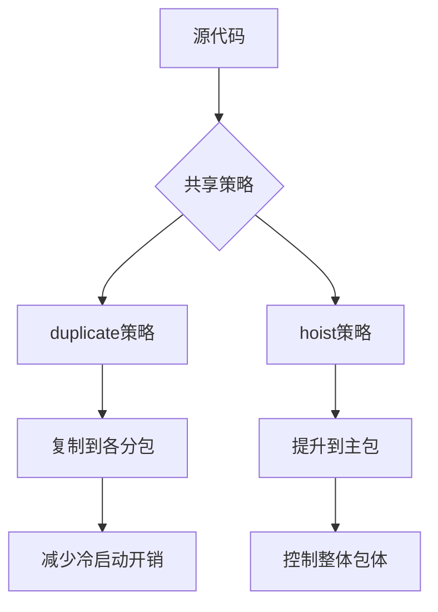
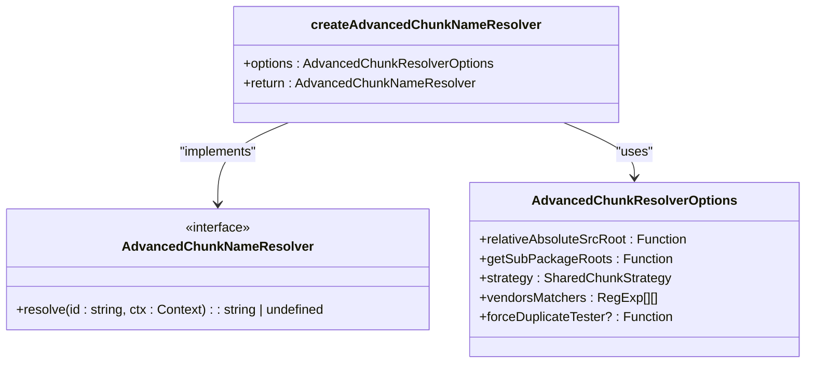
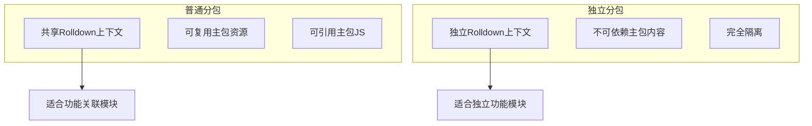
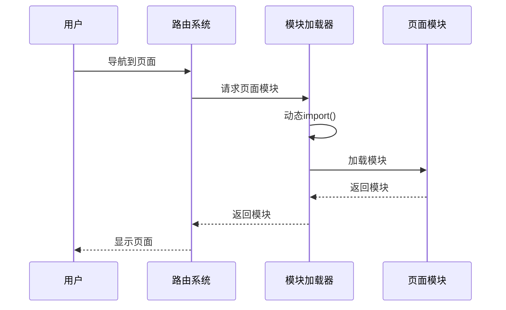
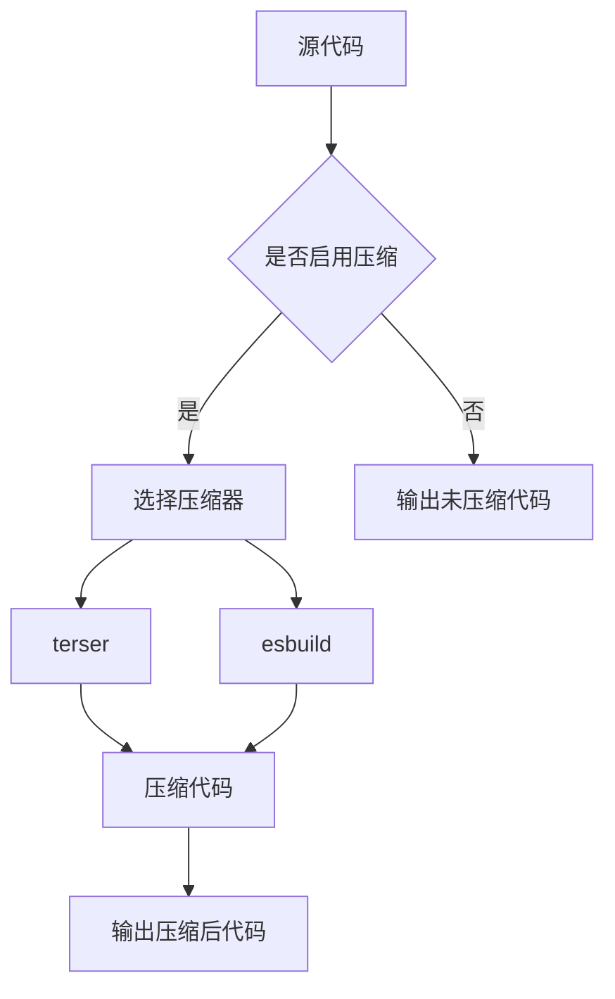
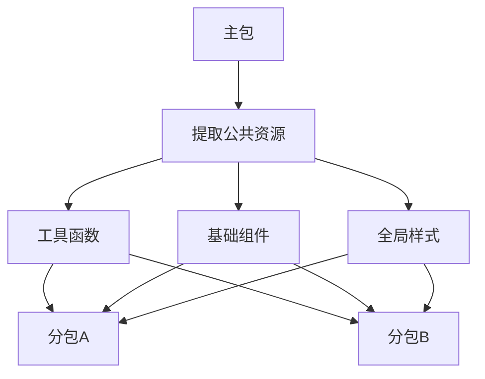
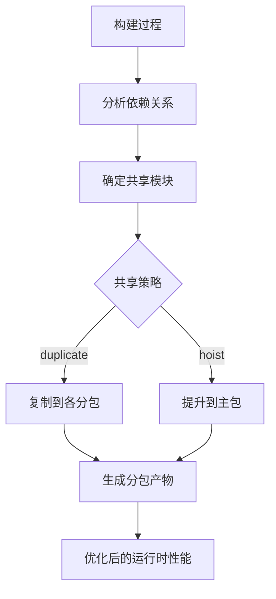

# 运行时性能优化

<cite>
**本文档引用的文件**   
- [vite.config.ts](file://apps/subpackage-shared-chunks/vite.config.ts)
- [app.ts](file://apps/subpackage-shared-chunks/src/app.ts)
- [chunkStrategy.ts](file://packages/weapp-vite/src/runtime/chunkStrategy.ts)
- [advancedChunks.ts](file://packages/weapp-vite/src/runtime/advancedChunks.ts)
- [subpackage.md](file://website/guide/subpackage.md)
- [heavy.ts](file://apps/wevu-runtime-demo/src/utils/heavy.ts)
- [index.ts](file://apps/wevu-runtime-demo/src/subpackages/perf/pages/chunk/index.ts)
</cite>

## 目录
1. [引言](#引言)
2. [代码分割策略](#代码分割策略)
3. [分包结构优化](#分包结构优化)
4. [懒加载实现](#懒加载实现)
5. [资源压缩技术](#资源压缩技术)
6. [主包体积优化](#主包体积优化)
7. [性能优化示例](#性能优化示例)
8. [结论](#结论)

## 引言

微信小程序的运行时性能优化是提升用户体验的关键环节。本指南系统性地介绍如何通过分包、代码分割、懒加载和资源压缩等技术优化小程序的运行时性能表现。我们将详细说明代码分割策略，如何合理组织分包结构以实现按需加载，指导懒加载的实现方法，并通过apps/subpackage-shared-chunks示例展示运行时性能优化的实际效果。

**Section sources**
- [subpackage.md](file://website/guide/subpackage.md#L1-L244)

## 代码分割策略

代码分割是优化小程序性能的核心技术之一。通过合理的代码分割策略，可以将应用程序拆分为多个较小的代码块，实现按需加载，从而减少初始加载时间。

### 共享块策略

在weapp-vite中，提供了两种主要的共享块策略：`duplicate`（复制）和`hoist`（提升）。`duplicate`策略会将共享代码复制到各个分包中，避免分包首次打开时需要回主包拉取共享模块；而`hoist`策略则会将共享代码统一提炼到主包中。



**Diagram sources**
- [chunkStrategy.ts](file://packages/weapp-vite/src/runtime/chunkStrategy.ts#L1-L800)
- [subpackage.md](file://website/guide/subpackage.md#L30-L36)

### 高级分块策略

对于第三方依赖和node_modules中的模块，可以采用更精细的分块策略。通过`createAdvancedChunkNameResolver`函数，可以为不同类型的模块创建不同的分块名称解析器。



**Diagram sources**
- [advancedChunks.ts](file://packages/weapp-vite/src/runtime/advancedChunks.ts#L1-L58)

**Section sources**
- [advancedChunks.ts](file://packages/weapp-vite/src/runtime/advancedChunks.ts#L1-L58)

## 分包结构优化

合理的分包结构是实现高效按需加载的基础。通过优化分包结构，可以确保代码和资源的合理分布，最大化性能优势。

### 普通分包与独立分包

普通分包和独立分包有不同的使用场景和限制。普通分包与主包共享Rolldown上下文，可以复用模块和样式；而独立分包则完全隔离，适用于功能相对独立的模块。



**Diagram sources**
- [subpackage.md](file://website/guide/subpackage.md#L18-L158)

### 样式共享配置

通过`weapp.subPackages[].styles`配置，可以实现分包间的样式共享。这允许在不同分包间共享主题变量、基础样式等，避免重复定义。

```typescript
export default defineConfig({
  weapp: {
    subPackages: {
      'packages/member': {
        styles: [
          'styles/tokens.css',
          { source: 'styles/layout.wxss', scope: 'pages' },
        ],
      },
      'packages/offline': {
        independent: true,
        styles: [
          {
            source: 'styles/offline-theme.scss',
            include: ['pages/**/*.wxss', 'components/**/*.wxss'],
          },
        ],
      },
    },
  },
})
```

**Section sources**
- [vite.config.ts](file://apps/subpackage-shared-chunks/vite.config.ts#L32-L58)

## 懒加载实现

懒加载是优化小程序性能的重要手段，通过延迟加载非关键资源，可以显著提升初始加载速度。

### 路由级别懒加载

路由级别的懒加载可以通过动态import()实现。当用户导航到特定页面时，才加载该页面所需的代码。



**Diagram sources**
- [index.ts](file://apps/wevu-runtime-demo/src/subpackages/perf/pages/chunk/index.ts#L1-L21)

### 组件级别懒加载

组件级别的懒加载可以通过条件渲染和动态导入相结合的方式实现。只有当组件需要显示时，才加载其代码。

```typescript
async function loadHeavyComponent() {
  const { HeavyComponent } = await import('./HeavyComponent')
  return HeavyComponent
}
```

**Section sources**
- [heavy.ts](file://apps/wevu-runtime-demo/src/utils/heavy.ts#L1-L10)

## 资源压缩技术

资源压缩是减少小程序包体积的有效方法，包括代码压缩、图片压缩和样式压缩等。

### 代码压缩配置

通过构建配置中的minify选项，可以启用代码压缩。weapp-vite支持多种压缩器，如terser和esbuild。



**Section sources**
- [build.ts](file://packages/weapp-vite/src/cli/commands/build.ts#L13-L43)

### WXML和WXSS压缩

WXML和WXSS资源可以通过构建过程中的转换和优化来压缩。weapp-vite会自动处理这些资源的压缩和优化。

```typescript
export function handleWxml(data: ReturnType<typeof scanWxml>, options?: HandleWxmlOptions) {
  const opts = defu<Required<HandleWxmlOptions>, HandleWxmlOptions[]>(options, {
    removeComment: true,
    transformEvent: true,
  })
  // ...处理WXML压缩逻辑
}
```

**Section sources**
- [handle.ts](file://packages/weapp-vite/src/wxml/handle.ts#L44-L139)

## 主包体积优化

减少主包体积是提升小程序启动速度的关键。通过提取公共资源、按需引入第三方库和条件编译等技术，可以有效控制主包大小。

### 公共资源提取

将公共的工具函数、组件和样式提取到独立的目录中，通过分包共享机制进行管理。



**Diagram sources**
- [subpackage.md](file://website/guide/subpackage.md#L30-L36)

### 第三方库按需引入

通过配置`weapp.subPackages[].dependencies`，可以精确声明每个分包需要的npm依赖，避免将所有依赖都打包到主包中。

```typescript
export default defineConfig({
  weapp: {
    subPackages: {
      'packages/order': {
        dependencies: ['crypto-es'],
      },
    },
  },
})
```

**Section sources**
- [vite.config.ts](file://apps/subpackage-shared-chunks/vite.config.ts#L33-L35)

### 条件编译

利用环境变量和条件编译，可以在不同环境下打包不同的代码，进一步优化包体积。

```typescript
const env = import.meta.env.VITE_SUB_PACKAGE_B
if (env === 'development') {
  // 开发环境特定代码
} else {
  // 生产环境代码
}
```

**Section sources**
- [banana.ts](file://packages/weapp-vite/test/fixtures/subPackages/src/packageB/pages/banana.ts#L1-L9)

## 性能优化示例

通过apps/subpackage-shared-chunks示例，我们可以看到运行时性能优化的实际效果。

### 示例配置分析

该示例展示了如何配置分包和共享策略：

```typescript
export default defineConfig({
  weapp: {
    srcRoot: 'src',
    subPackages: {
      'packages/order': {
        independent: true,
        dependencies: ['crypto-es'],
        styles: [
          'styles/theme.scss',
          {
            source: '../shared/styles/components.scss',
            scope: 'components',
            include: ['components/**'],
          },
        ],
      },
      'packages/profile': {
        styles: {
          source: 'styles/index.scss',
          scope: 'pages',
        },
      },
    },
    chunks: {
      sharedStrategy: 'duplicate',
      duplicateWarningBytes: 256 * 1024,
    },
  },
})
```

**Section sources**
- [vite.config.ts](file://apps/subpackage-shared-chunks/vite.config.ts#L3-L63)

### 实际效果展示

通过分析构建产物，可以看到共享代码被正确地复制到各个分包中，实现了按需加载的目标。



**Diagram sources**
- [subpackage.md](file://website/guide/subpackage.md#L66-L79)

## 结论

通过系统性的运行时性能优化，可以显著提升微信小程序的用户体验。合理的代码分割策略、优化的分包结构、有效的懒加载实现和资源压缩技术，共同构成了完整的性能优化方案。通过apps/subpackage-shared-chunks示例，我们看到了这些优化技术的实际应用效果。在实际项目中，应根据具体需求选择合适的优化策略，持续监控和改进小程序的性能表现。