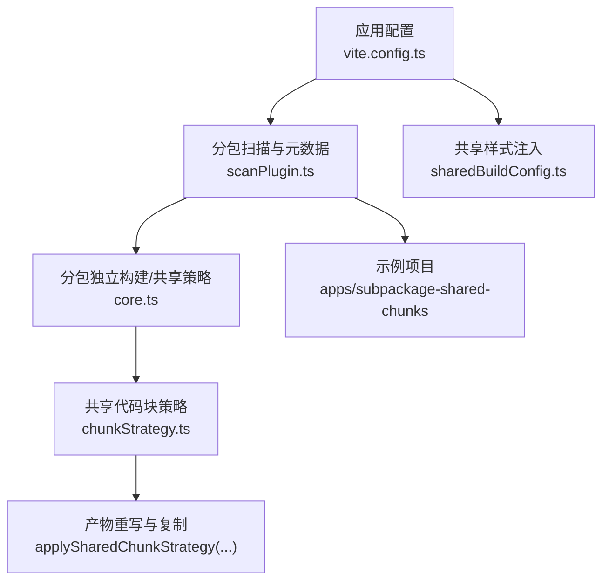
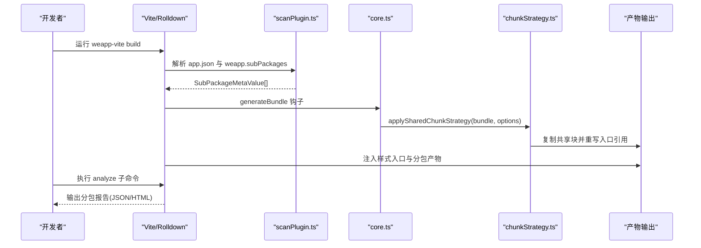
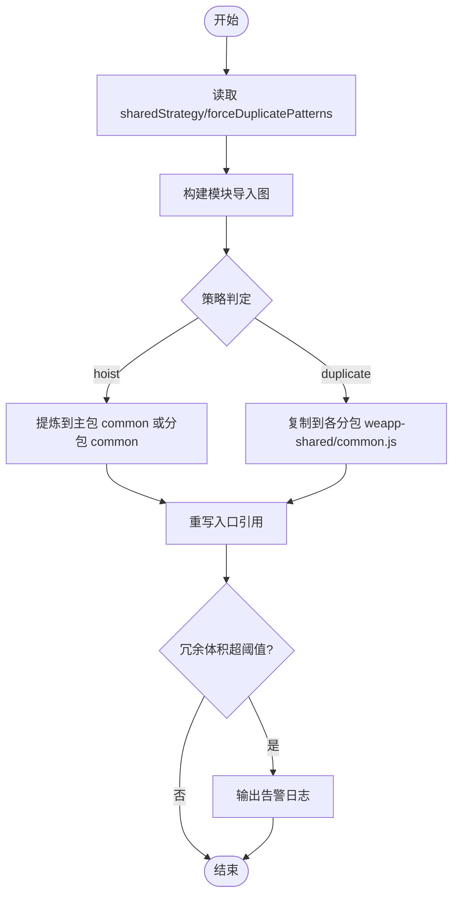
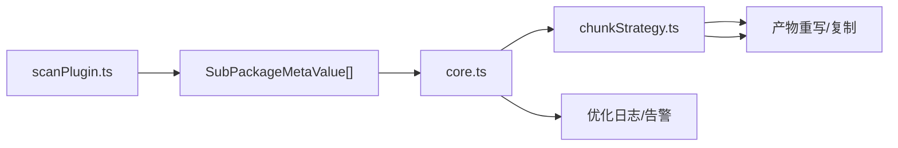

# 分包指南

<cite>
**本文引用的文件**
- [docs/subpackages.md](file://docs/subpackages.md)
- [website/config/subpackages.md](file://website/config/subpackages.md)
- [website/guide/subpackage.md](file://website/guide/subpackage.md)
- [packages/weapp-vite/src/types/config.ts](file://packages/weapp-vite/src/types/config.ts)
- [packages/weapp-vite/src/runtime/chunkStrategy.ts](file://packages/weapp-vite/src/runtime/chunkStrategy.ts)
- [packages/weapp-vite/src/runtime/chunkStrategy.test.ts](file://packages/weapp-vite/src/runtime/chunkStrategy.test.ts)
- [packages/weapp-vite/src/plugins/core.ts](file://packages/weapp-vite/src/plugins/core.ts)
- [packages/weapp-vite/src/runtime/sharedBuildConfig.ts](file://packages/weapp-vite/src/runtime/sharedBuildConfig.ts)
- [packages/weapp-vite/src/runtime/scanPlugin.ts](file://packages/weapp-vite/src/runtime/scanPlugin.ts)
- [apps/subpackage-shared-chunks/vite.config.ts](file://apps/subpackage-shared-chunks/vite.config.ts)
- [apps/subpackage-shared-chunks/src/app.json](file://apps/subpackage-shared-chunks/src/app.json)
- [apps/subpackage-shared-chunks/src/pages/index/index.ts](file://apps/subpackage-shared-chunks/src/pages/index/index.ts)
- [packages/weapp-vite/test/fixtures/subpackage-dayjs/vite.config.ts](file://packages/weapp-vite/test/fixtures/subpackage-dayjs/vite.config.ts)
- [packages/weapp-vite/test/analyze-subpackages.test.ts](file://packages/weapp-vite/test/analyze-subpackages.test.ts)
</cite>

## 目录
1. [引言](#引言)
2. [项目结构](#项目结构)
3. [核心组件](#核心组件)
4. [架构总览](#架构总览)
5. [详细组件分析](#详细组件分析)
6. [依赖分析](#依赖分析)
7. [性能考量](#性能考量)
8. [故障排查指南](#故障排查指南)
9. [结论](#结论)
10. [附录](#附录)

## 引言
本指南面向使用 weapp-vite 的小程序开发者，系统讲解分包在小程序架构中的作用与优势，以及 weapp-vite 如何优化分包构建过程。文档重点覆盖：
- 分包配置语法与选项：独立分包、预下载分包、分包预加载等
- 共享代码块在分包间的复用机制与策略
- 分包策略的决策指南：如何根据项目规模与用户行为选择合适方案
- 构建性能与运行时性能影响及监控优化方法
- 通过 apps/subpackage-shared-chunks 示例展示共享代码块的落地实践

## 项目结构
weapp-vite 将分包能力与构建器深度整合，核心体现在：
- 读取 app.json 并直接沿用官方分包语义
- 通过 weapp.subPackages 为每个分包追加独立编译、依赖裁剪、样式共享、组件自动导入等高级能力
- 通过 weapp.chunks.sharedStrategy 控制跨包共享模块的输出策略，避免主包/分包体积异常
- 提供 analyze 子命令生成分包报告，辅助定位共享依赖与重复模块

图表来源
- [packages/weapp-vite/src/runtime/scanPlugin.ts](file://packages/weapp-vite/src/runtime/scanPlugin.ts#L514-L546)
- [packages/weapp-vite/src/plugins/core.ts](file://packages/weapp-vite/src/plugins/core.ts#L304-L322)
- [packages/weapp-vite/src/runtime/chunkStrategy.ts](file://packages/weapp-vite/src/runtime/chunkStrategy.ts#L475-L503)
- [packages/weapp-vite/src/runtime/sharedBuildConfig.ts](file://packages/weapp-vite/src/runtime/sharedBuildConfig.ts#L49-L84)
- [apps/subpackage-shared-chunks/vite.config.ts](file://apps/subpackage-shared-chunks/vite.config.ts#L1-L83)

章节来源
- [website/guide/subpackage.md](file://website/guide/subpackage.md#L1-L244)
- [website/config/subpackages.md](file://website/config/subpackages.md#L1-L112)
- [docs/subpackages.md](file://docs/subpackages.md#L1-L151)

## 核心组件
- 分包配置入口：weapp.subPackages
  - 为每个 app.json 中的 subPackages.root 提供独立编译、依赖裁剪、样式共享、组件自动导入等能力
  - 支持强制独立上下文、注入 inlineConfig、按分包开启/关闭自动导入、样式注入范围控制
- 共享代码块策略：weapp.chunks.sharedStrategy
  - duplicate：默认策略，将跨分包共享模块复制到各自分包，降低首开回主包拉取成本
  - hoist：将跨分包共享模块提炼到主包 common.js，有利于整体包体控制
  - forceDuplicatePatterns：允许对特定模块强制按分包复制，忽略“主包”身份
  - duplicateWarningBytes：复制共享模块产生的冗余体积阈值告警
- 分包扫描与元数据：scanPlugin.ts
  - 解析 app.json 的 subPackages/subpackages，生成 SubPackageMetaValue，合并 weapp.subPackages 的覆盖项
- 共享策略执行：chunkStrategy.ts
  - resolveSharedChunkName：根据导入图与策略计算共享块最终落盘位置
  - applySharedChunkStrategy：在 generateBundle 阶段复制共享块并重写入口引用
- 分析与诊断：analyze 子命令
  - 输出每个主包/分包的 chunk/资源数量、跨包复用与复制的源码列表，辅助体积分析与预警

章节来源
- [packages/weapp-vite/src/types/config.ts](file://packages/weapp-vite/src/types/config.ts#L299-L327)
- [packages/weapp-vite/src/runtime/scanPlugin.ts](file://packages/weapp-vite/src/runtime/scanPlugin.ts#L514-L546)
- [packages/weapp-vite/src/runtime/chunkStrategy.ts](file://packages/weapp-vite/src/runtime/chunkStrategy.ts#L76-L123)
- [packages/weapp-vite/src/plugins/core.ts](file://packages/weapp-vite/src/plugins/core.ts#L304-L322)

## 架构总览
weapp-vite 的分包构建流程围绕“扫描—策略—执行—注入—分析”展开：
- 扫描阶段：从 app.json 读取分包元数据，合并 weapp.subPackages 的覆盖项
- 策略阶段：根据 sharedStrategy、forceDuplicatePatterns、duplicateWarningBytes 计算共享块落盘位置
- 执行阶段：在 generateBundle 阶段复制共享块并重写入口引用，输出到各分包目录
- 注入阶段：为分包注入样式入口，按 scope/include/exclude 精准控制
- 分析阶段：通过 analyze 子命令输出报告，定位共享模块与体积分布

图表来源
- [packages/weapp-vite/src/runtime/scanPlugin.ts](file://packages/weapp-vite/src/runtime/scanPlugin.ts#L514-L546)
- [packages/weapp-vite/src/plugins/core.ts](file://packages/weapp-vite/src/plugins/core.ts#L304-L322)
- [packages/weapp-vite/src/runtime/chunkStrategy.ts](file://packages/weapp-vite/src/runtime/chunkStrategy.ts#L475-L503)
- [packages/weapp-vite/test/analyze-subpackages.test.ts](file://packages/weapp-vite/test/analyze-subpackages.test.ts#L1-L44)

## 详细组件分析

### 分包配置语法与选项
- weapp.subPackages
  - 键名为 app.json 中 subPackages.root
  - 支持字段：independent、dependencies、inlineConfig、autoImportComponents、styles、watchSharedStyles
  - 作用：为分包开启独立编译、裁剪依赖、注入额外构建配置、样式共享与自动导入
- weapp.chunks
  - sharedStrategy：duplicate/hoist
  - logOptimization：是否输出优化日志
  - forceDuplicatePatterns：强制按分包复制的模块匹配规则
  - duplicateWarningBytes：复制共享模块冗余体积告警阈值

章节来源
- [website/config/subpackages.md](file://website/config/subpackages.md#L1-L112)
- [packages/weapp-vite/src/types/config.ts](file://packages/weapp-vite/src/types/config.ts#L389-L401)
- [packages/weapp-vite/src/types/config.ts](file://packages/weapp-vite/src/types/config.ts#L301-L327)

### 共享代码块策略与实现
- 策略计算
  - resolveSharedChunkName：综合模块导入图、策略、forceDuplicateTester，决定共享块最终落盘位置
  - hoist 策略：若模块仅在某分包内被引用，生成该分包的 common；若跨分包或主包参与，回退到主包 common
  - duplicate 策略：默认将跨分包共享模块复制到各自分包的 weapp-shared/common.js，避免首开回主包
- 策略执行
  - applySharedChunkStrategy：遍历虚拟共享块，复制到各分包目录并重写入口引用，移除虚拟共享块
  - 日志与告警：根据涉及分包与主包情况输出优化日志；超过冗余体积阈值输出警告
- 测试验证
  - chunkStrategy.test.ts 覆盖 hoist/duplicate、take 前缀、forceDuplicatePatterns 等场景

图表来源
- [packages/weapp-vite/src/runtime/chunkStrategy.ts](file://packages/weapp-vite/src/runtime/chunkStrategy.ts#L76-L123)
- [packages/weapp-vite/src/runtime/chunkStrategy.ts](file://packages/weapp-vite/src/runtime/chunkStrategy.ts#L475-L503)
- [packages/weapp-vite/src/plugins/core.ts](file://packages/weapp-vite/src/plugins/core.ts#L414-L460)
- [packages/weapp-vite/src/runtime/chunkStrategy.test.ts](file://packages/weapp-vite/src/runtime/chunkStrategy.test.ts#L1-L110)

章节来源
- [packages/weapp-vite/src/runtime/chunkStrategy.ts](file://packages/weapp-vite/src/runtime/chunkStrategy.ts#L76-L123)
- [packages/weapp-vite/src/runtime/chunkStrategy.ts](file://packages/weapp-vite/src/runtime/chunkStrategy.ts#L178-L355)
- [packages/weapp-vite/src/runtime/chunkStrategy.test.ts](file://packages/weapp-vite/src/runtime/chunkStrategy.test.ts#L167-L193)
- [packages/weapp-vite/src/plugins/core.ts](file://packages/weapp-vite/src/plugins/core.ts#L414-L460)

### 独立分包与普通分包
- 普通分包
  - 共享 Rolldown 上下文，跨分包共享模块默认复制到各自分包，减少首开回主包
  - 代码产物位置遵循“谁引用谁落盘”的原则；主包与分包共同引用的模块复制到虚拟共享块，再复制到各分包
- 独立分包
  - 独立 Rolldown 上下文，彼此不共享 JS 代码
  - 独立分包中不能依赖主包或其他分包的内容（使用分包异步化时 JS 文件、组件、插件不受此条限制）
  - 独立分包样式需在独立上下文中重新编译并注入 @import

章节来源
- [website/guide/subpackage.md](file://website/guide/subpackage.md#L18-L113)
- [website/guide/subpackage.md](file://website/guide/subpackage.md#L151-L206)

### 分包预加载与异步化
- 预加载
  - 在 app.json 的 preloadRule 中声明触发页、目标分包、网络条件与超时时间
  - 首屏页通常指定为触发页，将次屏高频路径加入 packages，并配置 network: "all"
  - 页面 onLoad 中可结合 wx.preloadSubpackage 做二次确认
- 异步化
  - 启用 lazyCodeLoading: "requiredComponents"，避免一次性加载所有自定义组件代码
  - 使用 import() 动态引入模块，构建器生成独立 chunk；搭配 sharedStrategy 避免重复落地

章节来源
- [docs/subpackages.md](file://docs/subpackages.md#L117-L151)
- [apps/subpackage-shared-chunks/src/app.json](file://apps/subpackage-shared-chunks/src/app.json#L24-L30)
- [apps/subpackage-shared-chunks/src/pages/index/index.ts](file://apps/subpackage-shared-chunks/src/pages/index/index.ts#L25-L36)

### 样式共享与注入
- weapp.subPackages[].styles
  - 支持字符串或对象配置，自动注入 @import 到分包页面/组件
  - scope: all/pages/components；include/exclude 精准控制注入范围
  - 支持 .wxss/.css/.scss/.less/.styl 等格式，构建后转换为目标平台样式后缀
- 独立分包样式
  - 在独立上下文中重新编译同一份源文件，保持样式同步且无需手动维护相对路径

章节来源
- [website/config/subpackages.md](file://website/config/subpackages.md#L81-L112)
- [website/guide/subpackage.md](file://website/guide/subpackage.md#L160-L206)

### 示例：apps/subpackage-shared-chunks
- 分包划分
  - packages/order：独立分包，依赖裁剪，样式共享
  - packages/profile：普通分包，样式共享
  - packages/marketing：普通分包，关闭共享样式监听
- 预加载与异步化
  - app.json 中配置 preloadRule
  - 页面 onLoad 中调用 wx.preloadSubpackage
- 共享策略
  - weapp.chunks.sharedStrategy = 'duplicate'
  - duplicateWarningBytes 设置为 256KB

章节来源
- [apps/subpackage-shared-chunks/vite.config.ts](file://apps/subpackage-shared-chunks/vite.config.ts#L1-L83)
- [apps/subpackage-shared-chunks/src/app.json](file://apps/subpackage-shared-chunks/src/app.json#L1-L40)
- [apps/subpackage-shared-chunks/src/pages/index/index.ts](file://apps/subpackage-shared-chunks/src/pages/index/index.ts#L25-L36)

## 依赖分析
- 分包扫描与元数据
  - scanPlugin.ts 从 app.json 读取 subPackages/subpackages，合并 weapp.subPackages 的覆盖项（dependencies、inlineConfig、autoImportComponents、styles、watchSharedStyles）
- 共享策略与构建配置
  - sharedBuildConfig.ts 基于 sharedStrategy 与 forceDuplicatePatterns 创建 advancedChunks 分组规则，控制 vendor 与 common 的命名与落盘
- 策略执行与日志
  - core.ts 在 generateBundle 阶段调用 applySharedChunkStrategy，并根据涉及分包与主包输出优化日志；超过阈值输出警告

图表来源
- [packages/weapp-vite/src/runtime/scanPlugin.ts](file://packages/weapp-vite/src/runtime/scanPlugin.ts#L514-L546)
- [packages/weapp-vite/src/runtime/sharedBuildConfig.ts](file://packages/weapp-vite/src/runtime/sharedBuildConfig.ts#L49-L84)
- [packages/weapp-vite/src/plugins/core.ts](file://packages/weapp-vite/src/plugins/core.ts#L304-L322)
- [packages/weapp-vite/src/plugins/core.ts](file://packages/weapp-vite/src/plugins/core.ts#L414-L460)

章节来源
- [packages/weapp-vite/src/runtime/scanPlugin.ts](file://packages/weapp-vite/src/runtime/scanPlugin.ts#L514-L546)
- [packages/weapp-vite/src/runtime/sharedBuildConfig.ts](file://packages/weapp-vite/src/runtime/sharedBuildConfig.ts#L49-L84)
- [packages/weapp-vite/src/plugins/core.ts](file://packages/weapp-vite/src/plugins/core.ts#L304-L322)

## 性能考量
- 构建性能
  - duplicate 策略减少首开回主包拉取，适合首屏性能敏感场景
  - hoist 策略统一提炼共享模块到主包，有利于整体包体控制，但可能增加主包体积
  - forceDuplicatePatterns 可避免伪主包引用导致的回退，提升预测性
- 运行时性能
  - 预加载与异步化降低首屏等待，提升交互流畅度
  - 样式共享减少重复 @import，降低页面初始化成本
- 监控与优化
  - 使用 analyze 子命令输出分包报告，定位共享模块与体积分布
  - duplicateWarningBytes 设置合理阈值，及时发现冗余复制带来的体积膨胀

章节来源
- [website/guide/subpackage.md](file://website/guide/subpackage.md#L112-L150)
- [packages/weapp-vite/test/analyze-subpackages.test.ts](file://packages/weapp-vite/test/analyze-subpackages.test.ts#L1-L44)
- [docs/subpackages.md](file://docs/subpackages.md#L137-L151)

## 故障排查指南
- 构建日志
  - 关注 [subpackages] 警告：路径超出 srcRoot、格式不受支持或重复注册
  - 共享模块复制/回退日志：确认涉及分包与主包范围
- 产物体积
  - 检查微信开发者工具包体积面板：主包 < 2MB、单个分包 < 2MB、合计 < 20MB
  - 使用 analyze 子命令输出 JSON 报告，定位跨包复用与重复模块
- 独立分包约束
  - 独立分包中不能依赖主包或其他分包内容（使用分包异步化时例外）
  - 独立分包样式需在独立上下文中重新编译并注入 @import

章节来源
- [docs/subpackages.md](file://docs/subpackages.md#L137-L151)
- [website/guide/subpackage.md](file://website/guide/subpackage.md#L201-L206)

## 结论
weapp-vite 将小程序分包能力与构建器深度融合，通过 weapp.subPackages 与 weapp.chunks 的配置，开发者可以：
- 精细化控制每个分包的独立编译、依赖裁剪、样式共享与自动导入
- 以 duplicate/hoist 等策略平衡首屏性能与整体包体控制
- 借助 analyze 子命令与日志告警持续优化分包体积与运行时性能
- 通过 apps/subpackage-shared-chunks 示例快速落地独立分包、预加载与共享样式

## 附录

### 分包策略决策指南
- 首屏性能优先：使用 duplicate 策略，将跨分包共享模块复制到各分包，降低首开回主包
- 包体控制优先：使用 hoist 策略，统一提炼共享模块到主包 common.js
- 复杂共享关系：结合 forceDuplicatePatterns，对特定模块强制按分包复制
- 预加载与异步化：在 app.json 中配置 preloadRule，并在页面 onLoad 中二次确认预加载
- 样式共享：通过 weapp.subPackages[].styles 精准控制注入范围，减少重复 @import

章节来源
- [website/guide/subpackage.md](file://website/guide/subpackage.md#L112-L150)
- [website/config/subpackages.md](file://website/config/subpackages.md#L81-L112)
- [docs/subpackages.md](file://docs/subpackages.md#L117-L151)