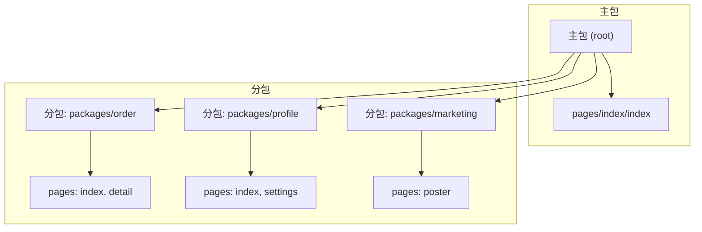
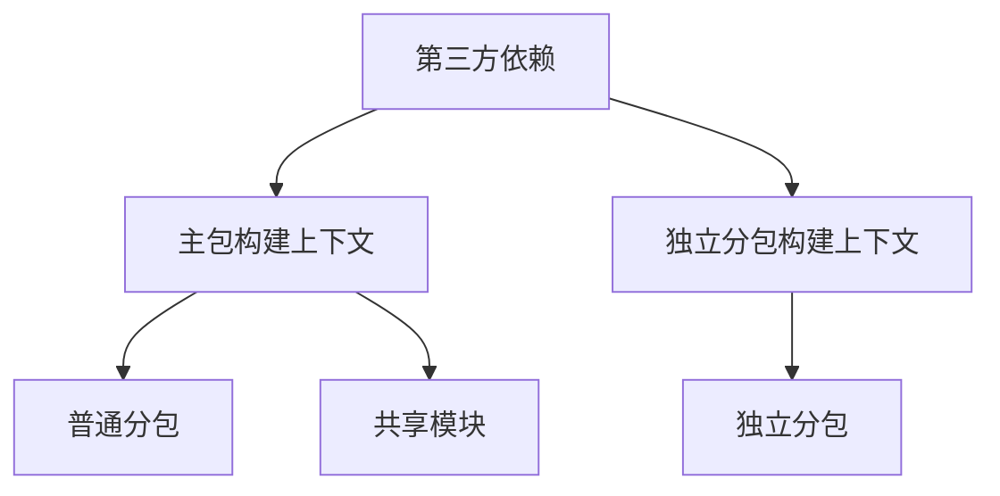
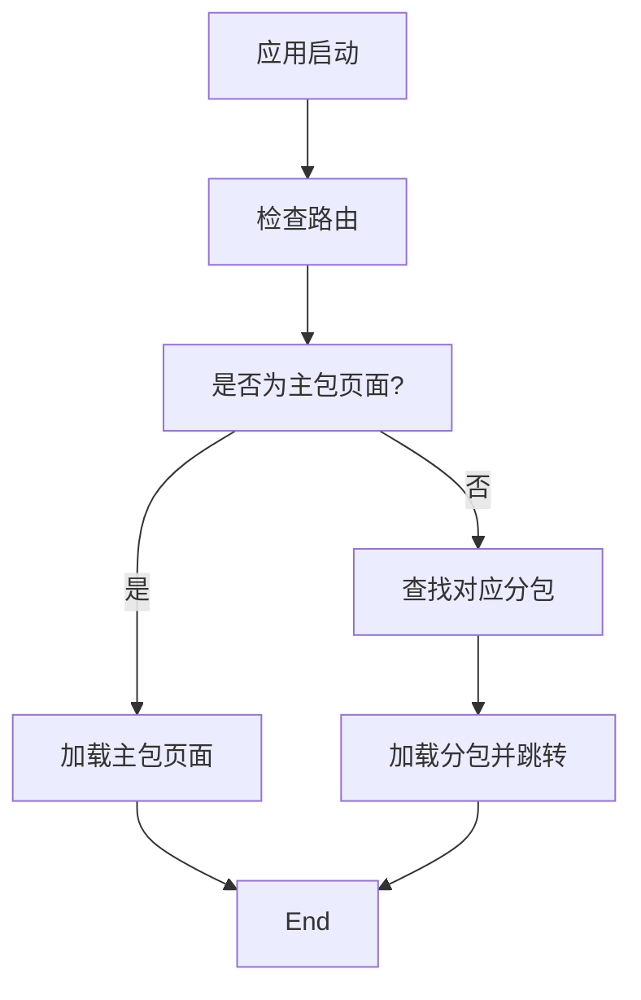
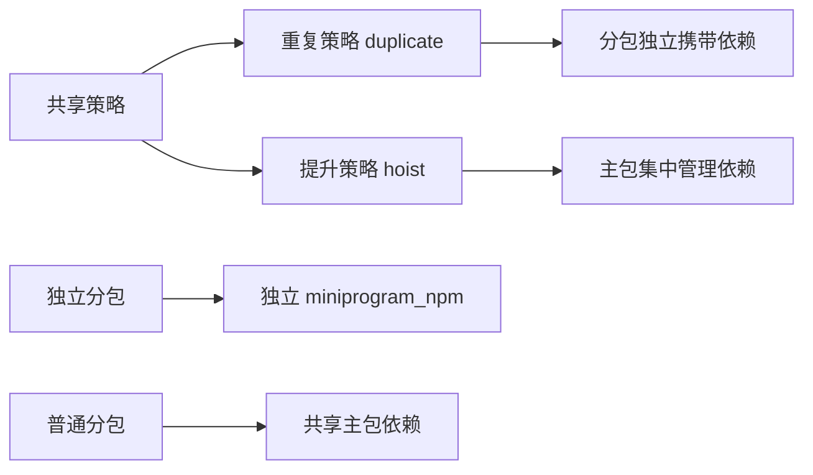

# 基础分包配置

<cite>
**本文档引用的文件**
- [project.config.json](file://apps/subpackage-shared-chunks/project.config.json)
- [app.json](file://apps/subpackage-shared-chunks/src/app.json)
- [vite.config.ts](file://apps/subpackage-shared-chunks/vite.config.ts)
- [app.json](file://apps/vite-native/_app.json)
- [project.config.json](file://apps/vite-native/project.config.json)
- [subpackage.md](file://website/guide/subpackage.md)
- [subpackages.md](file://website/config/subpackages.md)
</cite>

## 目录
1. [简介](#简介)
2. [项目结构](#项目结构)
3. [核心组件](#核心组件)
4. [架构概述](#架构概述)
5. [详细组件分析](#详细组件分析)
6. [依赖分析](#依赖分析)
7. [性能考虑](#性能考虑)
8. [故障排除指南](#故障排除指南)
9. [结论](#结论)

## 简介
本文档旨在为开发者提供在 weapp-vite 框架中进行基础分包配置的详细指南。通过分析 `apps/subpackage-shared-chunks` 和 `apps/vite-native` 示例项目，详细说明如何在 `project.config.json` 和 `app.json` 中定义分包结构，包括主包与子包的路径配置、分包 JSON 配置文件的字段含义、分包路由配置方法以及分包内资源组织的最佳实践。

## 项目结构
weapp-vite 项目中的分包结构遵循微信小程序官方规范，并通过 Vite 构建工具进行增强支持。以 `apps/subpackage-shared-chunks` 为例，其分包目录结构体现了模块化和可维护性的最佳实践。



**Diagram sources**
- [app.json](file://apps/subpackage-shared-chunks/src/app.json#L6-L22)

**Section sources**
- [app.json](file://apps/subpackage-shared-chunks/src/app.json#L1-L40)

## 核心组件
分包配置的核心在于 `app.json` 和 `project.config.json` 两个文件的协同工作。`app.json` 定义了运行时的分包结构和页面路由，而 `project.config.json` 则负责开发环境的项目设置。

**Section sources**
- [app.json](file://apps/subpackage-shared-chunks/src/app.json#L1-L40)
- [project.config.json](file://apps/subpackage-shared-chunks/project.config.json#L1-L43)

## 架构概述
weapp-vite 的分包架构基于 Rolldown 打包器（为小程序定制的 Rollup 变体），支持普通分包和独立分包两种模式。普通分包共享主包的构建上下文，而独立分包则拥有独立的构建上下文，实现完全隔离。



**Diagram sources**
- [vite.config.ts](file://apps/subpackage-shared-chunks/vite.config.ts#L32-L59)

## 详细组件分析

### 分包配置分析
分包配置主要通过 `app.json` 的 `subpackages` 字段和 `vite.config.ts` 的 `weapp.subPackages` 选项共同定义。

#### app.json 分包定义
在 `app.json` 中，`subpackages` 数组定义了所有分包的路径和页面：

```json
"subpackages": [
  {
    "root": "packages/order",
    "name": "订单中心",
    "pages": ["index", "detail"],
    "independent": true
  },
  {
    "root": "packages/profile",
    "name": "个人中心",
    "pages": ["index", "settings"]
  },
  {
    "root": "packages/marketing",
    "name": "营销活动",
    "pages": ["poster"]
  }
]
```

- `root`: 分包根目录路径
- `name`: 分包名称（可选）
- `pages`: 分包内页面路径列表（相对于分包根目录）
- `independent`: 是否为独立分包

**Section sources**
- [app.json](file://apps/subpackage-shared-chunks/src/app.json#L6-L22)

#### vite.config.ts 分包增强配置
在 `vite.config.ts` 中，`weapp.subPackages` 提供了更精细的构建控制：

```typescript
subPackages: {
  'packages/order': {
    independent: true,
    dependencies: ['crypto-es'],
    autoImportComponents: {
      globs: ['packages/order/components/**/*.wxml'],
    },
    styles: [
      'styles/theme.scss',
      {
        source: '../shared/styles/components.scss',
        scope: 'components',
        include: ['components/**'],
      },
    ],
  },
  'packages/profile': {
    styles: {
      source: 'styles/index.scss',
      scope: 'pages',
    },
  },
  'packages/marketing': {
    watchSharedStyles: false,
  },
}
```

- `independent`: 强制设置分包为独立上下文
- `dependencies`: 精确声明该分包所需的 npm 依赖
- `autoImportComponents`: 为分包单独配置组件自动导入
- `styles`: 配置共享样式文件，自动注入到分包中

**Section sources**
- [vite.config.ts](file://apps/subpackage-shared-chunks/vite.config.ts#L32-L59)

### 分包路由配置
分包页面的路由配置需要在 `app.json` 的 `pages` 和 `subpackages` 字段中正确定义。主包页面直接在 `pages` 数组中声明，而分包页面则通过 `subpackages` 的 `pages` 字段定义。



**Diagram sources**
- [app.json](file://apps/subpackage-shared-chunks/src/app.json#L3-L22)

## 依赖分析
分包的依赖管理是性能优化的关键。weapp-vite 提供了多种策略来控制依赖的打包方式。



**Diagram sources**
- [vite.config.ts](file://apps/subpackage-shared-chunks/vite.config.ts#L60-L63)

## 性能考虑
分包配置对小程序性能有重要影响。建议采用以下最佳实践：

1. **合理设置 sharedStrategy**：根据项目需求选择 `duplicate` 或 `hoist` 策略
2. **精确声明 dependencies**：避免将不必要的依赖打包到分包中
3. **使用 preloadRule**：预加载关键分包，提升用户体验
4. **监控包体积**：通过 `duplicateWarningBytes` 设置体积告警阈值

```json
"preloadRule": {
  "pages/index/index": {
    "packages": ["packages/profile"],
    "network": "all",
    "timeout": 2000
  }
}
```

**Section sources**
- [app.json](file://apps/subpackage-shared-chunks/src/app.json#L24-L29)

## 故障排除指南
在配置分包时可能遇到的常见问题及解决方案：

**Section sources**
- [subpackage.md](file://website/guide/subpackage.md#L240-L243)
- [subpackages.md](file://website/config/subpackages.md#L104-L108)

## 结论
通过本文档的指导，开发者可以全面掌握在 weapp-vite 中进行基础分包配置的方法。关键要点包括：正确配置 `app.json` 和 `project.config.json`，理解普通分包与独立分包的区别，合理组织分包目录结构，以及优化依赖管理和性能表现。这些实践将帮助构建可维护、高性能的小程序应用。