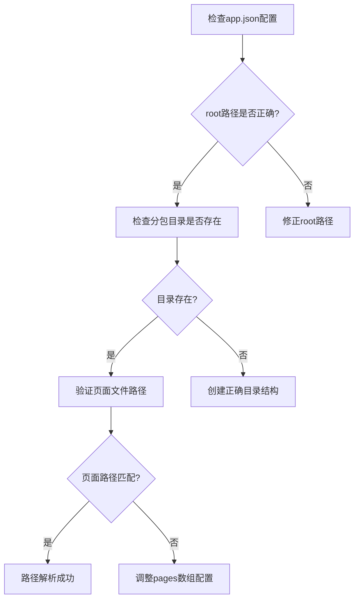
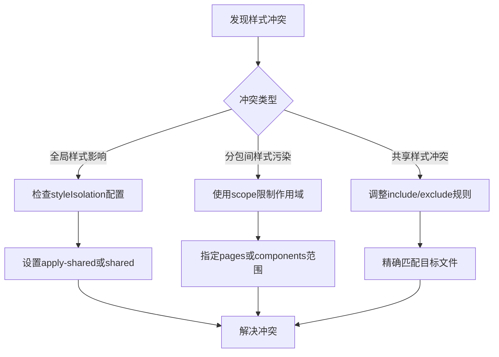
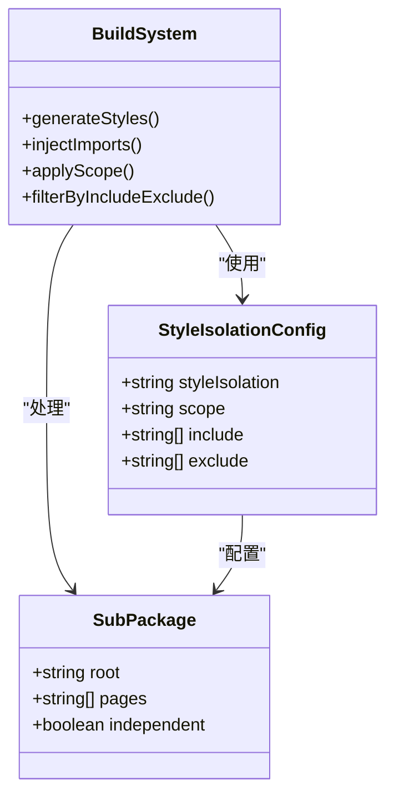
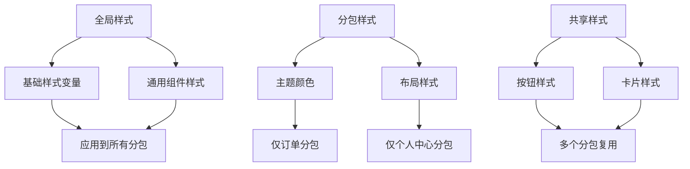
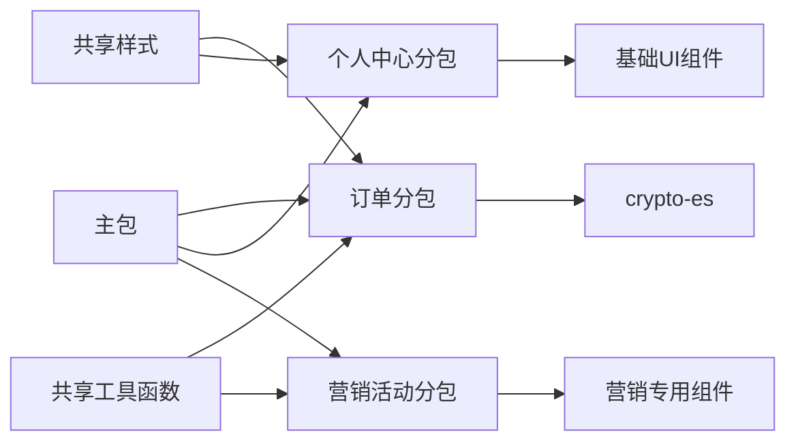
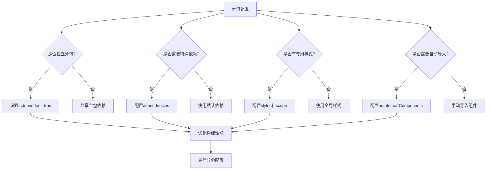

# 常见问题与解决方案

<cite>
**本文档引用的文件**  
- [vite.config.ts](file://apps/subpackage-shared-chunks/vite.config.ts)
- [app.json](file://apps/subpackage-shared-chunks/src/app.json)
- [theme.scss](file://apps/subpackage-shared-chunks/src/packages/order/styles/theme.scss)
- [components.scss](file://apps/subpackage-shared-chunks/src/shared/styles/components.scss)
- [index.scss](file://apps/subpackage-shared-chunks/src/packages/profile/styles/index.scss)
- [subpackages.md](file://website/config/subpackages.md)
- [chunkStrategy.ts](file://packages/weapp-vite/src/runtime/chunkStrategy.ts)
- [core.ts](file://packages/weapp-vite/src/plugins/core.ts)
</cite>

## 目录
1. [分包路径解析错误](#分包路径解析错误)
2. [样式冲突问题](#样式冲突问题)
3. [组件引用失败](#组件引用失败)
4. [分包间样式隔离机制](#分包间样式隔离机制)
5. [全局样式与分包样式关系](#全局样式与分包样式关系)
6. [分包调试技巧](#分包调试技巧)
7. [分包配置陷阱与最佳实践](#分包配置陷阱与最佳实践)

## 分包路径解析错误

分包路径解析错误通常发生在 `app.json` 中的 `subpackages` 配置与实际文件路径不匹配时。在 `apps/subpackage-shared-chunks` 示例中，`app.json` 正确配置了三个分包：订单中心、个人中心和营销活动，分别对应 `packages/order`、`packages/profile` 和 `packages/marketing` 目录。

当出现路径解析错误时，应检查以下几点：
- 确保 `app.json` 中的 `root` 字段与实际目录路径完全一致
- 验证分包目录是否存在且路径拼写正确
- 确认分包内的页面文件路径与 `pages` 数组中的配置匹配



**图示来源**
- [app.json](file://apps/subpackage-shared-chunks/src/app.json#L6-L22)

**本节来源**
- [app.json](file://apps/subpackage-shared-chunks/src/app.json#L6-L22)

## 样式冲突问题

样式冲突是分包开发中的常见问题，主要源于全局样式与分包样式的相互影响。在 `apps/subpackage-shared-chunks` 项目中，通过 `vite.config.ts` 的 `subPackages` 配置实现了精细化的样式管理。

订单分包 (`packages/order`) 配置了独立的主题样式和共享组件样式：
```ts
subPackages: {
  'packages/order': {
    styles: [
      'styles/theme.scss',
      {
        source: '../shared/styles/components.scss',
        scope: 'components',
        include: ['components/**'],
      },
    ],
  },
}
```

这种配置方式可以有效避免样式冲突：
- `theme.scss` 仅作用于订单分包内部
- `components.scss` 通过 `scope: 'components'` 限定作用范围
- 使用 `include` 精确控制样式注入的目标文件

当遇到样式冲突时，解决方案包括：
1. 为不同分包提供独立的样式入口文件
2. 使用 `scope` 参数限制样式作用范围
3. 通过 `include`/`exclude` 精细控制样式注入规则



**图示来源**
- [vite.config.ts](file://apps/subpackage-shared-chunks/vite.config.ts#L32-L48)
- [components.scss](file://apps/subpackage-shared-chunks/src/shared/styles/components.scss)

**本节来源**
- [vite.config.ts](file://apps/subpackage-shared-chunks/vite.config.ts#L32-L48)
- [theme.scss](file://apps/subpackage-shared-chunks/src/packages/order/styles/theme.scss)
- [components.scss](file://apps/subpackage-shared-chunks/src/shared/styles/components.scss)

## 组件引用失败

组件引用失败通常由以下原因导致：
- 分包间组件自动导入配置不一致
- 共享组件路径解析错误
- 构建配置中 `autoImportComponents` 设置不当

在 `apps/subpackage-shared-chunks` 项目中，主包配置了全局的组件自动导入：
```ts
autoImportComponents: {
  globs: [
    'components/**/*.wxml',
    'shared/**/*.wxml',
  ],
}
```

同时，订单分包也配置了独立的自动导入规则：
```ts
'packages/order': {
  autoImportComponents: {
    globs: [
      'packages/order/components/**/*.wxml',
    ],
  },
}
```

这种分层配置确保了组件引用的正确性。当遇到组件引用失败时，应检查：
- 确认 `autoImportComponents.globs` 是否包含目标组件路径
- 验证组件文件命名和路径是否符合 glob 模式
- 检查是否存在分包独立配置覆盖了主包配置

**本节来源**
- [vite.config.ts](file://apps/subpackage-shared-chunks/vite.config.ts#L7-L13)
- [vite.config.ts](file://apps/subpackage-shared-chunks/vite.config.ts#L36-L40)

## 分包间样式隔离机制

分包间样式隔离是通过微信小程序的 `styleIsolation` 特性实现的。在 `weapp-vite` 项目中，构建系统会自动处理样式隔离，确保不同分包的样式不会相互干扰。

分析 `packages/weapp-vite` 中的 TDesign 组件发现，多个组件都设置了 `"styleIsolation": "apply-shared"`，这表明它们采用了共享样式应用模式：
- `apply-shared`: 表示组件应用父组件的样式，同时自身样式可被子组件继承
- `shared`: 表示组件样式不隔离，父子组件样式相互影响
- `isolated`: 默认值，表示组件样式完全隔离

构建系统通过以下机制实现样式隔离：
1. 根据分包配置生成独立的样式文件
2. 在编译阶段自动注入 `@import` 语句
3. 通过 `scope` 参数控制样式作用范围
4. 利用 `include`/`exclude` 实现精细的样式注入控制



**图示来源**
- [overlay.json](file://packages/weapp-vite/test/fixtures/mixjs/miniprogram_npm/tdesign-miniprogram/overlay/overlay.json)
- [indexes-anchor.json](file://packages/weapp-vite/test/fixtures/mixjs/miniprogram_npm/tdesign-miniprogram/indexes-anchor/indexes-anchor.json)

**本节来源**
- [overlay.json](file://packages/weapp-vite/test/fixtures/mixjs/miniprogram_npm/tdesign-miniprogram/overlay/overlay.json#L3)
- [indexes-anchor.json](file://packages/weapp-vite/test/fixtures/mixjs/miniprogram_npm/tdesign-miniprogram/indexes-anchor/indexes-anchor.json#L3)

## 全局样式与分包样式关系

全局样式与分包样式的关系需要精心管理，以避免样式冲突和重复加载。在 `apps/subpackage-shared-chunks` 项目中，通过 `vite.config.ts` 的 `styles` 配置实现了灵活的样式管理策略。

关键配置点包括：
- **全局样式**: 通过主包配置影响整个应用
- **分包专用样式**: 为特定分包提供定制化样式
- **共享样式**: 在多个分包间复用的样式

营销分包的配置展示了如何关闭共享样式监听：
```ts
'packages/marketing': {
  watchSharedStyles: false,
}
```

这表明该分包不需要监听共享样式的变化，提高了构建效率。

个人中心分包的样式配置：
```ts
'packages/profile': {
  styles: {
    source: 'styles/index.scss',
    scope: 'pages',
  },
}
```

此配置将 `index.scss` 的样式仅作用于页面级别，实现了样式作用域的精确控制。

最佳实践建议：
1. 将基础样式定义在共享目录中
2. 为每个分包提供专用的主题样式
3. 使用 `scope` 参数明确样式作用范围
4. 通过 `watchSharedStyles` 优化构建性能



**图示来源**
- [vite.config.ts](file://apps/subpackage-shared-chunks/vite.config.ts#L50-L58)
- [index.scss](file://apps/subpackage-shared-chunks/src/packages/profile/styles/index.scss)

**本节来源**
- [vite.config.ts](file://apps/subpackage-shared-chunks/vite.config.ts#L50-L58)
- [index.scss](file://apps/subpackage-shared-chunks/src/packages/profile/styles/index.scss)

## 分包调试技巧

有效的分包调试需要利用开发者工具和构建系统的诊断功能。以下是实用的调试技巧：

### 使用开发者工具检查分包加载状态
1. 在微信开发者工具中打开"网络"面板
2. 查看各分包的加载时间和资源大小
3. 检查预加载规则是否生效

### 构建日志分析
`weapp-vite` 的构建系统提供了详细的日志信息：
- 查看分包独立构建的输出日志
- 监控共享样式文件的生成过程
- 检查组件自动导入的执行情况

### 调试配置
在 `vite.config.ts` 中可以通过以下方式增强调试能力：
```ts
chunks: {
  sharedStrategy: 'duplicate',
  duplicateWarningBytes: 256 * 1024,
}
```

此配置会：
- 采用重复策略处理共享代码块
- 当重复代码超过 256KB 时发出警告

### 分包依赖关系可视化
通过分析构建产物，可以了解分包间的依赖关系：


**图示来源**
- [vite.config.ts](file://apps/subpackage-shared-chunks/vite.config.ts#L60-L63)
- [app.json](file://apps/subpackage-shared-chunks/src/app.json#L24-L29)

**本节来源**
- [vite.config.ts](file://apps/subpackage-shared-chunks/vite.config.ts#L60-L63)
- [app.json](file://apps/subpackage-shared-chunks/src/app.json#L24-L29)

## 分包配置陷阱与最佳实践

### 常见配置陷阱
1. **路径拼写错误**: `root` 路径大小写或拼写错误
2. **样式作用域混淆**: 未正确设置 `scope` 导致样式污染
3. **依赖重复打包**: 未配置 `dependencies` 导致 npm 依赖重复
4. **独立分包配置缺失**: 忘记设置 `independent: true`

### 最佳实践建议
1. **精确控制依赖**
```ts
'packages/order': {
  independent: true,
  dependencies: ['crypto-es'],
}
```
只包含必要的 npm 依赖，避免包体积膨胀。

2. **合理使用共享策略**
```ts
chunks: {
  sharedStrategy: 'duplicate',
  duplicateWarningBytes: 256 * 1024,
}
```
根据项目规模选择合适的共享策略，并设置合理的警告阈值。

3. **模块化样式管理**
- 将样式分为基础样式、组件样式和页面样式
- 使用 `include`/`exclude` 精确控制样式注入
- 为不同分包提供独立的主题变量

4. **性能优化**
- 使用 `preloadRule` 预加载常用分包
- 为不常更新的分包设置 `watchSharedStyles: false`
- 合理规划分包大小，避免单个分包过大

5. **开发体验优化**
- 利用 `autoRoutes` 自动生成路由
- 配置 `autoImportComponents` 减少手动导入
- 使用 TypeScript 增强类型安全



**图示来源**
- [vite.config.ts](file://apps/subpackage-shared-chunks/vite.config.ts)
- [subpackages.md](file://website/config/subpackages.md)

**本节来源**
- [vite.config.ts](file://apps/subpackage-shared-chunks/vite.config.ts)
- [subpackages.md](file://website/config/subpackages.md#L81-L108)