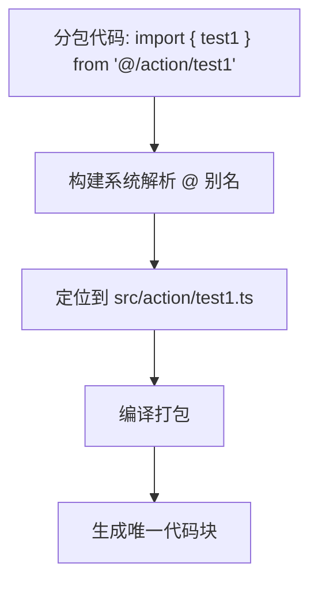
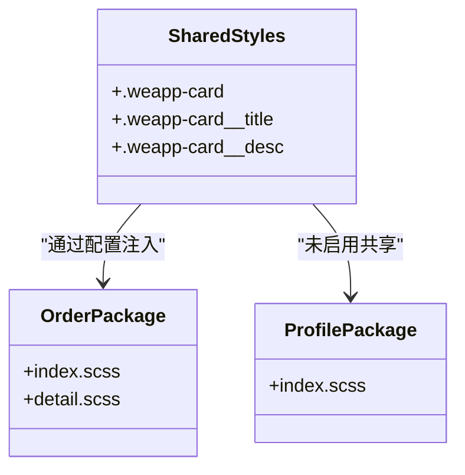
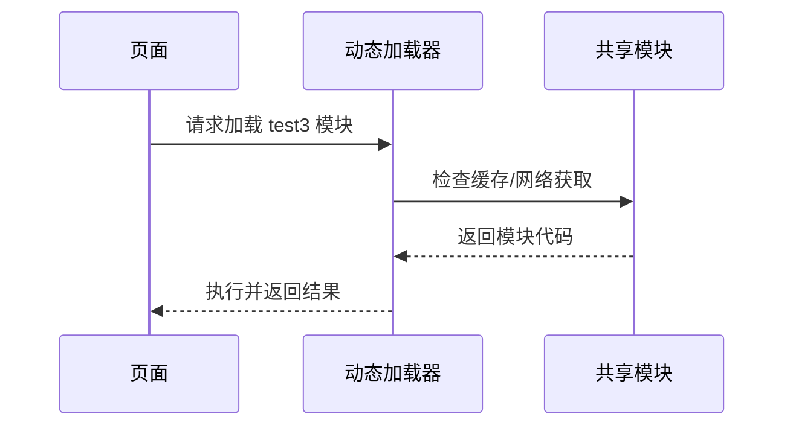

# 共享代码块

<cite>
**本文档引用的文件**
- [vite.config.ts](file://apps/subpackage-shared-chunks/vite.config.ts)
- [app.json](file://apps/subpackage-shared-chunks/src/app.json)
- [index.ts](file://apps/subpackage-shared-chunks/src/action/index.ts)
- [test1.ts](file://apps/subpackage-shared-chunks/src/action/test1.ts)
- [test2.ts](file://apps/subpackage-shared-chunks/src/action/test2.ts)
- [test3.ts](file://apps/subpackage-shared-chunks/src/action/test3.ts)
- [test4.ts](file://apps/subpackage-shared-chunks/src/action/test4.ts)
- [components.scss](file://apps/subpackage-shared-chunks/src/shared/styles/components.scss)
- [index.ts](file://apps/subpackage-shared-chunks/src/packages/order/index.ts)
- [detail.ts](file://apps/subpackage-shared-chunks/src/packages/order/detail.ts)
- [index.ts](file://apps/subpackage-shared-chunks/src/packages/profile/index.ts)
- [poster.ts](file://apps/subpackage-shared-chunks/src/packages/marketing/poster.ts)
</cite>

## 目录
1. [简介](#简介)
2. [共享代码块的构建策略](#共享代码块的构建策略)
3. [共享路径与别名配置](#共享路径与别名配置)
4. [样式共享机制](#样式共享机制)
5. [按需加载与性能优化](#按需加载与性能优化)
6. [分包间依赖管理](#分包间依赖管理)
7. [最佳实践建议](#最佳实践建议)

## 简介
本文档详细说明在 `weapp-vite` 项目中如何通过 `apps/subpackage-shared-chunks` 示例实现跨分包的代码复用机制。重点介绍公共逻辑和样式的提取方法、共享代码的打包策略、路径别名配置以及性能优化方案，确保共享代码只被打包一次并高效复用。

## 共享代码块的构建策略
在 `apps/subpackage-shared-chunks` 项目中，通过将公共逻辑集中存放在 `src/action` 目录下，实现多分包间的代码复用。该目录包含多个工具函数文件（如 `test1.ts`、`test2.ts` 等），并通过 `index.ts` 统一导出，形成模块化接口。

构建系统通过 `vite.config.ts` 中的 `chunks.sharedStrategy: 'duplicate'` 配置控制共享代码的打包行为。此策略确保当多个分包引用相同模块时，构建工具会识别重复依赖并进行优化处理，避免代码冗余。

**Section sources**
- [action/index.ts](file://apps/subpackage-shared-chunks/src/action/index.ts)
- [action/test1.ts](file://apps/subpackage-shared-chunks/src/action/test1.ts)
- [action/test2.ts](file://apps/subpackage-shared-chunks/src/action/test2.ts)
- [action/test3.ts](file://apps/subpackage-shared-chunks/src/action/test3.ts)
- [action/test4.ts](file://apps/subpackage-shared-chunks/src/action/test4.ts)
- [vite.config.ts](file://apps/subpackage-shared-chunks/vite.config.ts#L60-L63)

## 共享路径与别名配置
项目通过 `@` 路径别名简化跨分包的导入语句。例如，在 `packages/order/index.ts` 中使用 `import { test1 } from '@/action/test1'` 即可直接引用共享逻辑，无需复杂的相对路径。

这种别名机制由构建工具自动支持，开发者可在任何分包中通过 `@/` 前缀访问根目录下的共享资源。该配置提升了代码可读性，并降低了因路径变更导致的维护成本。

**Diagram sources**
- [packages/order/index.ts](file://apps/subpackage-shared-chunks/src/packages/order/index.ts#L3)
- [packages/marketing/poster.ts](file://apps/subpackage-shared-chunks/src/packages/marketing/poster.ts#L2)

**Section sources**
- [packages/order/index.ts](file://apps/subpackage-shared-chunks/src/packages/order/index.ts#L1-L48)
- [packages/marketing/poster.ts](file://apps/subpackage-shared-chunks/src/packages/marketing/poster.ts#L1-L26)

## 样式共享机制
公共样式通过 `src/shared/styles/components.scss` 文件集中管理，定义了如 `.weapp-card` 等通用组件类名。这些样式可通过分包配置选择性注入。

在 `vite.config.ts` 中，`subPackages['packages/order']` 配置了 `styles` 字段，明确指定从 `../shared/styles/components.scss` 引入样式，并限定作用范围为 `components/**` 路径下的文件。这种方式实现了样式的按需注入，避免全局污染。

**Diagram sources**
- [shared/styles/components.scss](file://apps/subpackage-shared-chunks/src/shared/styles/components.scss)
- [vite.config.ts](file://apps/subpackage-shared-chunks/vite.config.ts#L42-L48)

**Section sources**
- [shared/styles/components.scss](file://apps/subpackage-shared-chunks/src/shared/styles/components.scss)
- [vite.config.ts](file://apps/subpackage-shared-chunks/vite.config.ts#L32-L59)

## 按需加载与性能优化
为提升性能，项目采用动态导入（`import()`）实现按需加载。例如在 `detail.ts` 中通过 `const { test3 } = await import('@/action/test3')` 延迟加载非关键功能模块，减少初始包体积。

同时，`preloadRule` 配置允许预加载关联分包。在 `app.json` 中设置 `pages/index/index` 页面预加载 `packages/profile` 分包，可显著提升后续页面跳转速度。

构建系统还通过 `duplicateWarningBytes` 设置（256KB）监控重复代码体积，超出阈值时发出警告，帮助开发者及时优化依赖结构。

**Diagram sources**
- [packages/order/detail.ts](file://apps/subpackage-shared-chunks/src/packages/order/detail.ts#L11)
- [app.json](file://apps/subpackage-shared-chunks/src/app.json#L24-L29)

**Section sources**
- [packages/order/detail.ts](file://apps/subpackage-shared-chunks/src/packages/order/detail.ts#L1-L46)
- [app.json](file://apps/subpackage-shared-chunks/src/app.json#L24-L30)

## 分包间依赖管理
各分包通过 `subPackages` 配置独立管理其依赖。例如 `packages/order` 明确声明依赖 `crypto-es` 库，并启用独立的组件自动导入规则。

这种细粒度控制使得不同分包可根据实际需求引入特定依赖，避免不必要的代码打包。同时，通过统一的 `@` 别名机制，所有分包都能安全访问共享代码，形成清晰的依赖层级。

**Section sources**
- [vite.config.ts](file://apps/subpackage-shared-chunks/vite.config.ts#L32-L59)
- [packages/order/index.ts](file://apps/subpackage-shared-chunks/src/packages/order/index.ts#L1-L48)

## 最佳实践建议
1. **集中管理共享逻辑**：将跨分包复用的代码统一存放于 `src/shared` 或 `src/action` 目录
2. **合理使用动态导入**：对非首屏关键功能采用 `import()` 按需加载
3. **配置预加载规则**：利用 `preloadRule` 提升用户体验
4. **监控重复代码**：通过 `duplicateWarningBytes` 及时发现潜在的代码冗余
5. **样式作用域控制**：为共享样式配置 `scope` 和 `include` 规则，避免样式泄漏
6. **统一导入规范**：使用 `@/` 别名保持导入语句一致性，提高可维护性