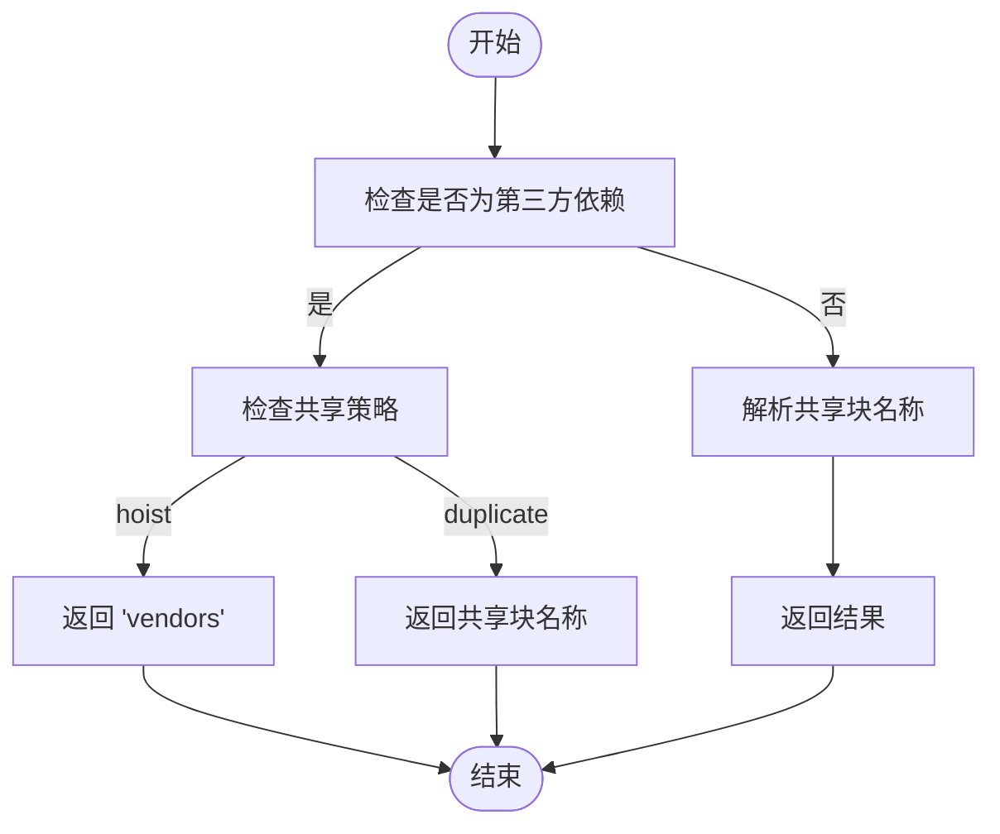
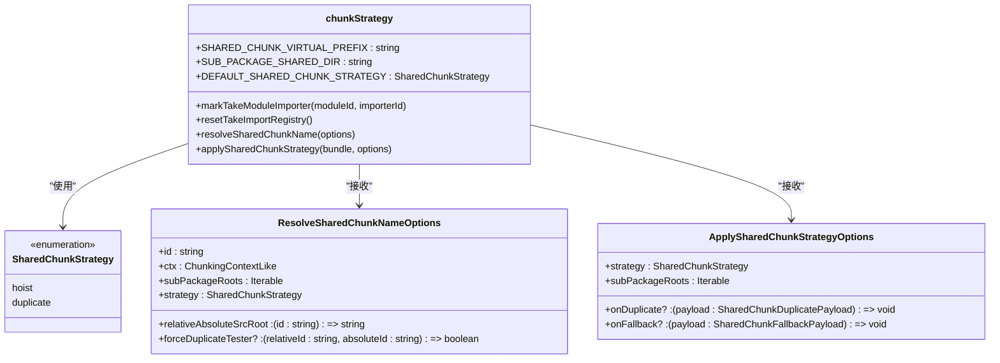
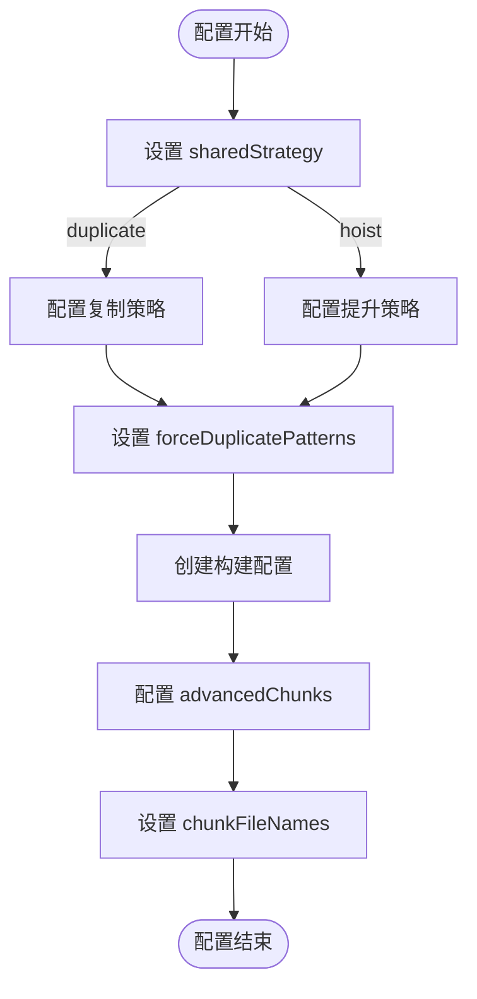
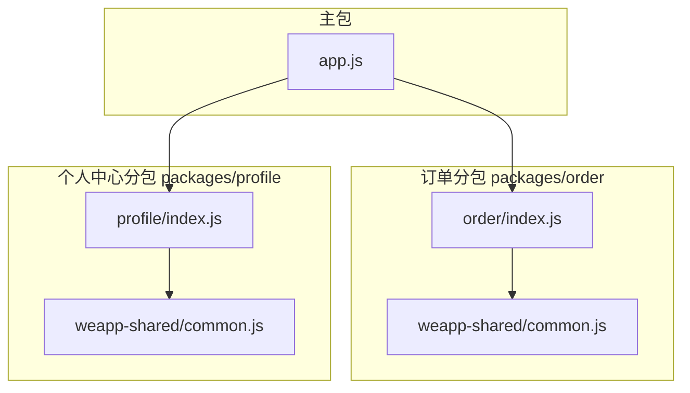

# 共享代码块构建策略

<cite>
**本文档引用的文件**   
- [chunkStrategy.ts](file://packages/weapp-vite/src/runtime/chunkStrategy.ts)
- [advancedChunks.ts](file://packages/weapp-vite/src/runtime/advancedChunks.ts)
- [sharedBuildConfig.ts](file://packages/weapp-vite/src/runtime/sharedBuildConfig.ts)
- [vite.config.ts](file://apps/subpackage-shared-chunks/vite.config.ts)
- [config.ts](file://packages/weapp-vite/src/types/config.ts)
</cite>

## 目录
1. [简介](#简介)
2. [核心机制](#核心机制)
3. [advancedChunks插件分析](#advancedchunks插件分析)
4. [chunkStrategy处理逻辑](#chunkstrategy处理逻辑)
5. [代码分割配置](#代码分割配置)
6. [示例分析](#示例分析)
7. [总结](#总结)

## 简介
weapp-vite通过advancedChunks和chunkStrategy机制实现了跨分包共享代码的智能打包策略。该策略确保公共模块只被打包一次，避免了代码冗余，同时支持灵活的分包独立编译和共享块处理。本文档详细分析了这些机制的实现原理和配置方式。

## 核心机制
weapp-vite的共享代码块构建策略主要由两个核心组件构成：advancedChunks插件和chunkStrategy模块。advancedChunks负责识别跨分包的共享依赖，而chunkStrategy则处理独立分包和共享块的具体逻辑。

**Section sources**
- [chunkStrategy.ts](file://packages/weapp-vite/src/runtime/chunkStrategy.ts#L1-L50)
- [advancedChunks.ts](file://packages/weapp-vite/src/runtime/advancedChunks.ts#L1-L10)

## advancedChunks插件分析
advancedChunks插件通过createAdvancedChunkNameResolver函数创建一个高级的块名称解析器，该解析器能够识别跨分包的共享依赖。插件首先检查模块是否为第三方依赖（通过vendorsMatchers匹配node_modules目录），然后根据配置的策略决定如何处理共享代码。

当策略为'hoist'时，第三方依赖会被提升到主包的'vendors'块中；当策略为'duplicate'时，共享代码会被复制到各个分包中。插件通过分析模块的导入关系图，确保只有被多个分包共同引用的模块才会被识别为共享模块。

**Diagram sources **
- [advancedChunks.ts](file://packages/weapp-vite/src/runtime/advancedChunks.ts#L25-L57)
- [chunkStrategy.ts](file://packages/weapp-vite/src/runtime/chunkStrategy.ts#L76-L162)

**Section sources**
- [advancedChunks.ts](file://packages/weapp-vite/src/runtime/advancedChunks.ts#L1-L58)
- [chunkStrategy.ts](file://packages/weapp-vite/src/runtime/chunkStrategy.ts#L76-L162)

## chunkStrategy处理逻辑
chunkStrategy模块实现了共享代码块的核心处理逻辑，包括独立分包和共享块的处理。模块定义了两种共享策略：'hoist'（提升到主包）和'duplicate'（复制到分包），默认策略为'duplicate'。

模块通过resolveSharedChunkName函数分析模块的导入关系，确定其共享范围。对于被多个分包引用的模块，函数会生成一个唯一的共享块名称，格式为`weapp_shared_virtual/分包A+分包B/common`。applySharedChunkStrategy函数则负责实际的块处理，包括创建共享块、更新导入引用等。

**Diagram sources **
- [chunkStrategy.ts](file://packages/weapp-vite/src/runtime/chunkStrategy.ts#L7-L162)
- [config.ts](file://packages/weapp-vite/src/types/config.ts#L298-L308)

**Section sources**
- [chunkStrategy.ts](file://packages/weapp-vite/src/runtime/chunkStrategy.ts#L1-L800)

## 代码分割配置
通过配置optimization.splitChunks可以实现代码分割。在weapp-vite中，这一配置通过createSharedBuildConfig函数实现。该函数根据项目配置创建相应的构建配置，包括设置vendorsMatchers来识别第三方依赖，以及配置advancedChunks的分组规则。

配置中的sharedStrategy选项控制跨分包共享代码的输出策略：'duplicate'策略将共享代码复制到各自的分包中，而'hoist'策略则将共享代码提炼到主包中。forceDuplicatePatterns选项允许强制某些模块按分包复制，即使它们位于主包目录中。

**Diagram sources **
- [sharedBuildConfig.ts](file://packages/weapp-vite/src/runtime/sharedBuildConfig.ts#L49-L84)
- [config.ts](file://packages/weapp-vite/src/types/config.ts#L301-L327)

**Section sources**
- [sharedBuildConfig.ts](file://packages/weapp-vite/src/runtime/sharedBuildConfig.ts#L1-L85)
- [config.ts](file://packages/weapp-vite/src/types/config.ts#L298-L327)

## 示例分析
以subpackage-shared-chunks示例为例，该项目配置了duplicate共享策略，并定义了多个分包。构建过程中，系统会分析各分包的依赖关系，将被多个分包共享的模块打包成独立的共享块。

例如，当order和profile分包都引用了utils模块时，构建系统会创建一个名为`weapp_shared_virtual/packages_order+packages_profile/common.js`的共享块，并将该块复制到两个分包的weapp-shared目录中。同时，系统会更新各分包的导入引用，确保正确加载共享代码。

**Diagram sources **
- [vite.config.ts](file://apps/subpackage-shared-chunks/vite.config.ts#L60-L63)
- [chunkStrategy.ts](file://packages/weapp-vite/src/runtime/chunkStrategy.ts#L475-L657)

**Section sources**
- [vite.config.ts](file://apps/subpackage-shared-chunks/vite.config.ts#L1-L83)
- [chunkStrategy.ts](file://packages/weapp-vite/src/runtime/chunkStrategy.ts#L475-L657)

## 总结
weapp-vite的共享代码块构建策略通过advancedChunks插件和chunkStrategy模块的协同工作，实现了高效的跨分包代码共享。该策略不仅确保了公共模块只被打包一次，还提供了灵活的配置选项，支持不同的项目需求。通过合理的配置，开发者可以优化小程序的包大小和加载性能。

**Section sources**
- [chunkStrategy.ts](file://packages/weapp-vite/src/runtime/chunkStrategy.ts#L1-L999)
- [advancedChunks.ts](file://packages/weapp-vite/src/runtime/advancedChunks.ts#L1-L58)
- [sharedBuildConfig.ts](file://packages/weapp-vite/src/runtime/sharedBuildConfig.ts#L1-L85)