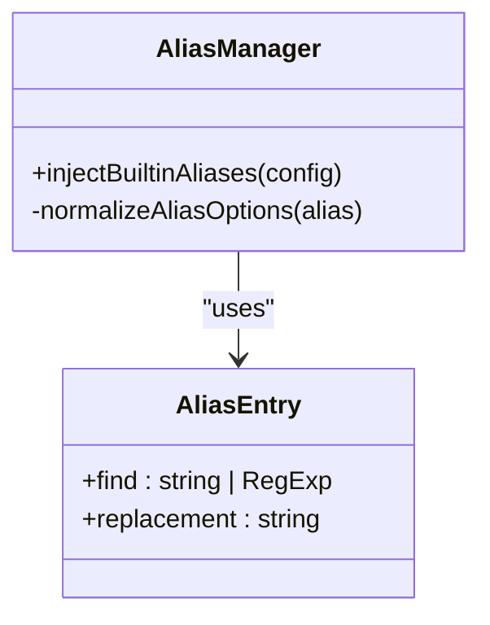
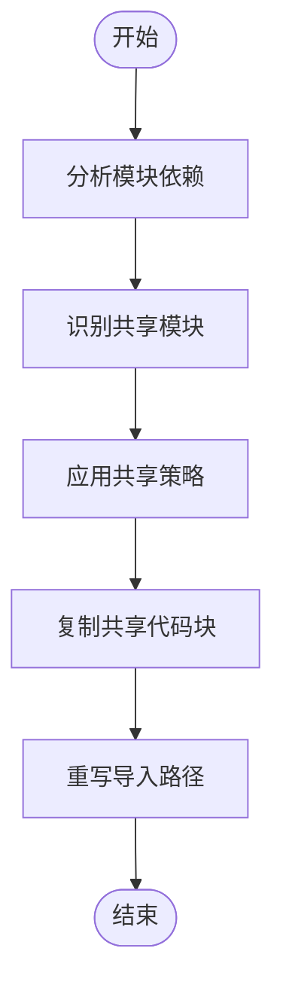

# 共享路径配置

<cite>
**本文档中引用的文件**  
- [project.config.json](file://apps/subpackage-shared-chunks/project.config.json)
- [vite.config.ts](file://apps/subpackage-shared-chunks/vite.config.ts)
- [components.scss](file://apps/subpackage-shared-chunks/src/shared/styles/components.scss)
- [theme.scss](file://apps/subpackage-shared-chunks/src/packages/order/styles/theme.scss)
- [projectConfig.ts](file://packages/weapp-vite/src/utils/projectConfig.ts)
- [chunkStrategy.ts](file://packages/weapp-vite/src/runtime/chunkStrategy.ts)
</cite>

## 目录
1. [简介](#简介)
2. [项目结构](#项目结构)
3. [核心配置文件分析](#核心配置文件分析)
4. [共享路径配置详解](#共享路径配置详解)
5. [分包样式共享机制](#分包样式共享机制)
6. [共享代码块策略](#共享代码块策略)
7. [配置继承与覆盖机制](#配置继承与覆盖机制)
8. [最佳实践与注意事项](#最佳实践与注意事项)
9. [结论](#结论)

## 简介
本文档详细阐述了在微信小程序Vite项目中如何通过`project.config.json`和`vite.config.ts`配置共享代码块的路径映射。重点讲解如何设置共享目录、使用别名简化跨分包导入，以及配置的继承和覆盖机制，确保多分包项目中路径解析的一致性。

## 项目结构
本项目采用模块化设计，主要包含多个应用示例和核心工具包。重点关注`subpackage-shared-chunks`示例项目，它展示了共享路径配置的实际应用。

```mermaid
graph TD
A[项目根目录] --> B[apps]
A --> C[packages]
A --> D[@weapp-core]
B --> E[subpackage-shared-chunks]
E --> F[src]
F --> G[shared]
F --> H[packages]
G --> I[styles]
H --> J[order]
H --> K[profile]
```

**Diagram sources**
- [subpackage-shared-chunks/project.config.json](file://apps/subpackage-shared-chunks/project.config.json)
- [subpackage-shared-chunks/vite.config.ts](file://apps/subpackage-shared-chunks/vite.config.ts)

**Section sources**
- [apps/subpackage-shared-chunks](file://apps/subpackage-shared-chunks)

## 核心配置文件分析
项目的核心配置由`project.config.json`和`vite.config.ts`两个文件共同完成。前者是微信小程序的标准配置文件，后者是Vite构建工具的配置文件。

### project.config.json
该文件定义了小程序的基本配置信息，包括编译类型、设置选项和项目根目录等。

**Section sources**
- [apps/subpackage-shared-chunks/project.config.json](file://apps/subpackage-shared-chunks/project.config.json)

### vite.config.ts
该文件定义了Vite构建工具的配置，包括源码根目录、自动路由、组件自动导入等高级功能。

**Section sources**
- [apps/subpackage-shared-chunks/vite.config.ts](file://apps/subpackage-shared-chunks/vite.config.ts)

## 共享路径配置详解
在多分包项目中，合理配置共享路径对于提高代码复用性和维护性至关重要。

### subpackages.shared字段
通过`subPackages`字段可以定义各个分包的配置，其中`styles`属性用于指定共享样式文件。

```typescript
subPackages: {
  'packages/order': {
    styles: [
      'styles/theme.scss',
      {
        source: '../shared/styles/components.scss',
        scope: 'components',
        include: ['components/**'],
      },
    ],
  },
}
```

上述配置表明`packages/order`分包将引入两个样式文件：一个是本地的`theme.scss`，另一个是来自共享目录的`components.scss`。

**Section sources**
- [apps/subpackage-shared-chunks/vite.config.ts](file://apps/subpackage-shared-chunks/vite.config.ts#L32-L48)

### 别名配置
通过别名可以简化跨分包导入，提高代码可读性。



**Diagram sources**
- [packages/weapp-vite/src/runtime/config/internal/alias.ts](file://packages/weapp-vite/src/runtime/config/internal/alias.ts)

**Section sources**
- [packages/weapp-vite/src/runtime/config/internal/alias.ts](file://packages/weapp-vite/src/runtime/config/internal/alias.ts)

## 分包样式共享机制
分包样式共享机制允许不同分包复用相同的样式定义，同时可以根据需要进行定制。

### 共享样式文件
共享样式文件通常放置在`shared`目录下，供多个分包引用。

```scss
/* 公共组件样式，仅在需要的分包中注入 */
.weapp-card {
  margin: 16rpx;
  padding: 24rpx;
  border-radius: 16rpx;
  background: #ffffff;
  box-shadow: 0 12rpx 24rpx rgba(0, 0, 0, 0.04);
}
```

**Section sources**
- [apps/subpackage-shared-chunks/src/shared/styles/components.scss](file://apps/subpackage-shared-chunks/src/shared/styles/components.scss)

### 样式作用域控制
通过`scope`和`include`属性可以精确控制样式的注入范围。

```typescript
{
  source: '../shared/styles/components.scss',
  scope: 'components',
  include: ['components/**'],
}
```

**Section sources**
- [apps/subpackage-shared-chunks/vite.config.ts](file://apps/subpackage-shared-chunks/vite.config.ts#L44-L47)

## 共享代码块策略
共享代码块策略决定了如何处理跨分包的公共代码。

### duplicate策略
`duplicate`策略会将共享代码复制到每个需要的分包中，避免运行时加载问题。

```typescript
chunks: {
  sharedStrategy: 'duplicate',
  duplicateWarningBytes: 256 * 1024,
}
```

**Section sources**
- [apps/subpackage-shared-chunks/vite.config.ts](file://apps/subpackage-shared-chunks/vite.config.ts#L60-L63)

### 策略实现
共享代码块策略的实现涉及模块依赖分析和代码分割。



**Diagram sources**
- [packages/weapp-vite/src/runtime/chunkStrategy.ts](file://packages/weapp-vite/src/runtime/chunkStrategy.ts)

**Section sources**
- [packages/weapp-vite/src/runtime/chunkStrategy.ts](file://packages/weapp-vite/src/runtime/chunkStrategy.ts)

## 配置继承与覆盖机制
配置继承与覆盖机制确保了多分包项目中配置的一致性和灵活性。

### 配置合并
项目配置通过`Object.assign`进行合并，私有配置优先级高于基础配置。

```typescript
return Object.assign({}, privateJson, baseJson) as ProjectConfig
```

**Section sources**
- [packages/weapp-vite/src/utils/projectConfig.ts](file://packages/weapp-vite/src/utils/projectConfig.ts#L32)

### 分包配置覆盖
分包可以覆盖全局配置，实现个性化设置。

```typescript
const subPackageConfig = ctx.configService.weappViteConfig?.subPackages?.[subPackage.root!]
meta.subPackage.dependencies = subPackageConfig?.dependencies
meta.subPackage.inlineConfig = subPackageConfig?.inlineConfig
```

**Section sources**
- [packages/weapp-vite/src/runtime/scanPlugin.ts](file://packages/weapp-vite/src/runtime/scanPlugin.ts#L525-L527)

## 最佳实践与注意事项
### 目录结构规划
建议将共享代码统一放置在`shared`目录下，并按功能进一步细分。

### 避免循环依赖
在设计共享模块时，应注意避免出现循环依赖，这可能导致构建失败或运行时错误。

### 性能考量
合理使用共享代码块策略，平衡包大小和加载性能。对于大型共享模块，考虑按需加载。

## 结论
通过合理配置`project.config.json`和`vite.config.ts`，可以有效管理多分包项目中的共享路径。利用`subPackages`字段定义共享目录，结合别名简化跨分包导入，再通过配置继承与覆盖机制确保一致性，能够显著提升项目的可维护性和开发效率。