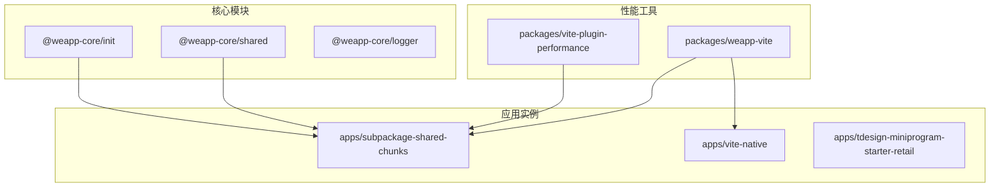
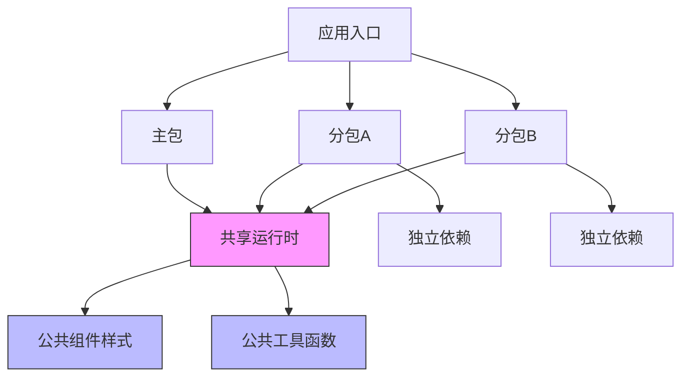
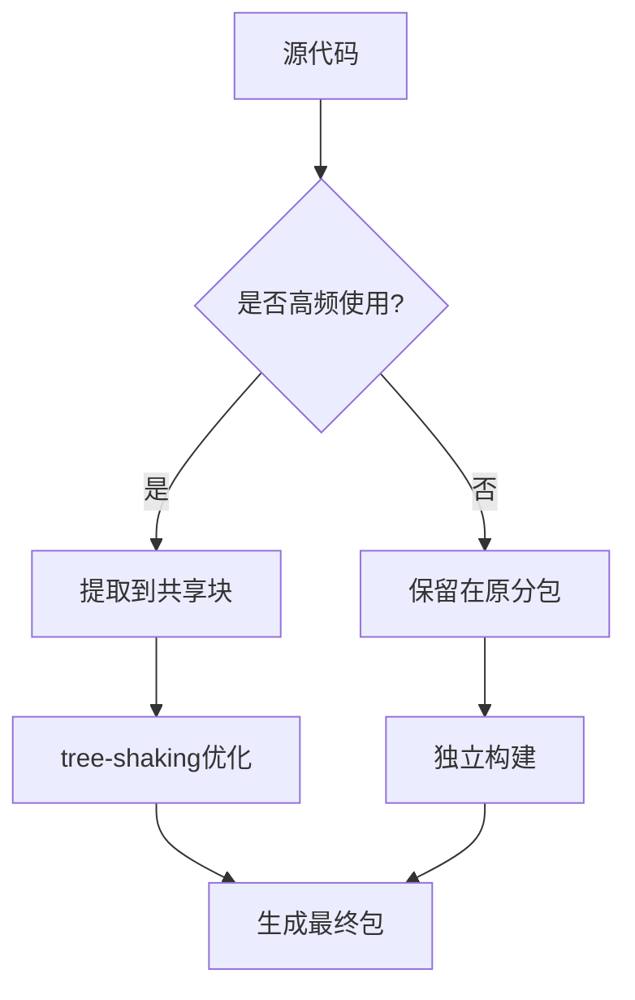
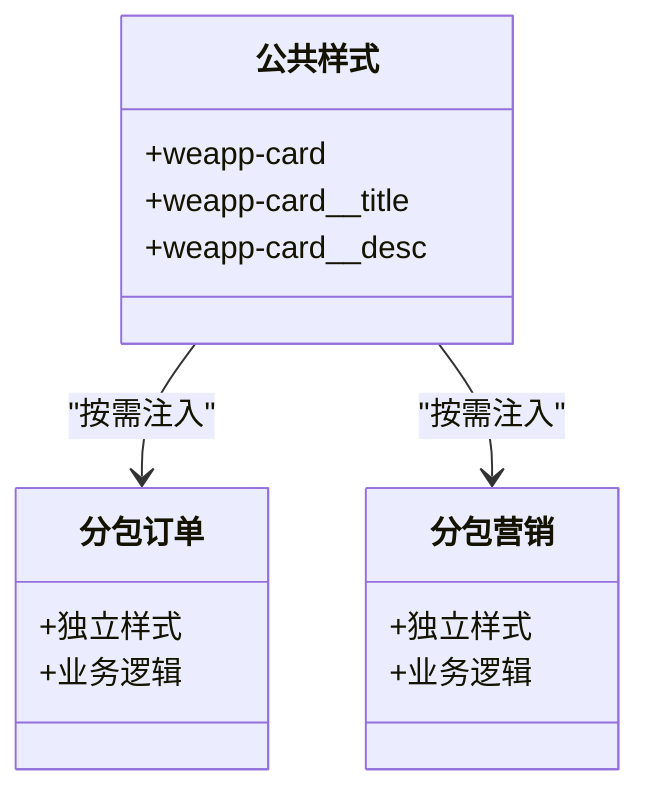
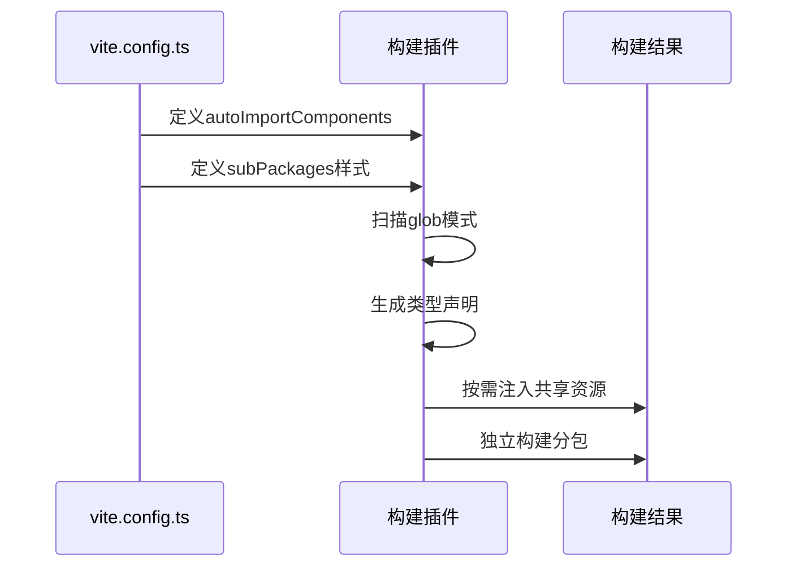
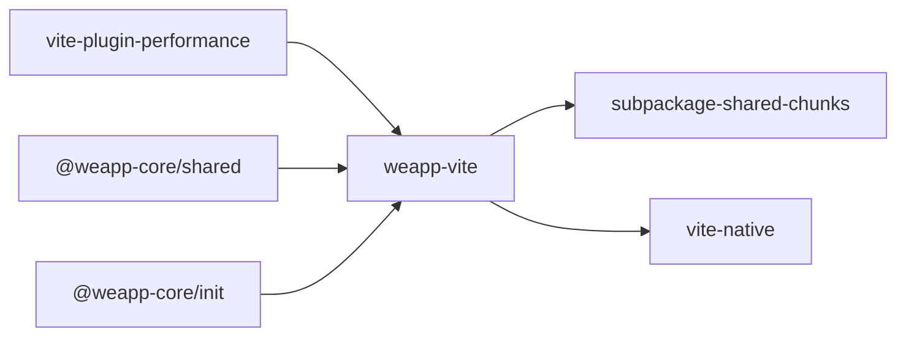

# 性能优化实践

<cite>
**本文档中引用的文件**  
- [vite.config.ts](file://apps/subpackage-shared-chunks/vite.config.ts)
- [components.scss](file://apps/subpackage-shared-chunks/src/shared/styles/components.scss)
- [index.ts](file://apps/subpackage-shared-chunks/src/action/index.ts)
- [index.ts](file://packages/weapp-vite/src/index.ts)
- [config.ts](file://packages/weapp-vite/src/config.ts)
- [options.ts](file://packages/vite-plugin-performance/src/options.ts)
- [utils.ts](file://packages/vite-plugin-performance/src/utils.ts)
</cite>

## 目录
1. [简介](#简介)
2. [项目结构](#项目结构)
3. [核心组件](#核心组件)
4. [架构概述](#架构概述)
5. [详细组件分析](#详细组件分析)
6. [依赖分析](#依赖分析)
7. [性能考虑](#性能考虑)
8. [故障排除指南](#故障排除指南)
9. [结论](#结论)

## 简介
本文档深入探讨微信小程序 Vite 项目的性能优化策略，重点介绍如何通过按需加载、代码分割和共享模块管理来提升应用性能。我们将分析高频公共逻辑的提取、共享样式组件的复用、tree-shaking 优化以及共享块大小监控等关键技术。

## 项目结构
项目采用模块化设计，核心功能分布在多个子包中，支持独立构建和按需加载。共享代码集中管理，通过配置实现精细化控制。

**Diagram sources**
- [vite.config.ts](file://apps/subpackage-shared-chunks/vite.config.ts#L3-L83)
- [index.ts](file://packages/weapp-vite/src/index.ts#L1-L4)

**Section sources**
- [vite.config.ts](file://apps/subpackage-shared-chunks/vite.config.ts#L1-L83)
- [vite.config.ts](file://apps/vite-native/vite.config.ts#L1-L138)

## 核心组件
分析显示，项目通过 `weapp-vite` 提供核心构建能力，`vite-plugin-performance` 提供性能监控，`@weapp-core/shared` 管理共享逻辑。这些组件协同工作，实现高效的代码分割和按需加载。

**Section sources**
- [index.ts](file://packages/weapp-vite/src/index.ts#L1-L4)
- [index.ts](file://packages/vite-plugin-performance/src/index.ts#L1-L5)

## 架构概述
系统采用分层架构，支持主包与分包的独立构建。通过配置化的代码分割策略，实现共享模块的智能管理。

**Diagram sources**
- [vite.config.ts](file://apps/subpackage-shared-chunks/vite.config.ts#L32-L59)
- [vite.config.ts](file://apps/vite-native/vite.config.ts#L89-L99)

## 详细组件分析

### 共享代码块优化分析
项目通过 `chunks` 配置实现共享代码块的精细化管理，采用 `duplicate` 策略控制重复代码，并设置 256KB 的重复警告阈值。

#### 代码分割策略

**Diagram sources**
- [vite.config.ts](file://apps/subpackage-shared-chunks/vite.config.ts#L60-L63)
- [options.ts](file://packages/vite-plugin-performance/src/options.ts#L1-L40)

#### 共享样式组件复用
公共组件样式通过 `subPackages` 配置实现按需注入，避免不必要的样式加载。

**Diagram sources**
- [components.scss](file://apps/subpackage-shared-chunks/src/shared/styles/components.scss#L1-L21)
- [vite.config.ts](file://apps/subpackage-shared-chunks/vite.config.ts#L41-L48)

**Section sources**
- [components.scss](file://apps/subpackage-shared-chunks/src/shared/styles/components.scss#L1-L21)
- [index.ts](file://apps/subpackage-shared-chunks/src/action/index.ts#L1-L2)

### 按需加载机制分析
系统通过配置化的自动导入机制，实现组件和样式的按需加载。

**Diagram sources**
- [vite.config.ts](file://apps/subpackage-shared-chunks/vite.config.ts#L7-L14)
- [vite.config.ts](file://apps/subpackage-shared-chunks/vite.config.ts#L32-L59)

## 依赖分析
项目依赖关系清晰，核心构建工具与应用实例分离，支持独立演进。

**Diagram sources**
- [package.json](file://packages/vite-plugin-performance/package.json)
- [package.json](file://packages/weapp-vite/package.json)

**Section sources**
- [index.ts](file://packages/weapp-vite/src/index.ts#L1-L4)
- [config.ts](file://packages/weapp-vite/src/config.ts#L1-L29)

## 性能考虑
项目通过多种机制确保性能最优：

1. **代码分割**：通过 `chunks.sharedStrategy` 配置实现智能代码分割
2. **tree-shaking**：ESM 模块格式支持静态分析和无用代码消除
3. **按需加载**：分包独立依赖和样式注入
4. **性能监控**：`vite-plugin-performance` 提供构建性能分析

建议定期监控共享块大小，避免因过度共享导致主包膨胀。可通过设置合理的 `duplicateWarningBytes` 阈值来预警。

**Section sources**
- [vite.config.ts](file://apps/subpackage-shared-chunks/vite.config.ts#L60-L63)
- [options.ts](file://packages/vite-plugin-performance/src/options.ts#L1-L40)
- [utils.ts](file://packages/vite-plugin-performance/src/utils.ts#L1-L8)

## 故障排除指南
常见性能问题及解决方案：

- **共享块过大**：检查是否有低频使用的代码被错误地放入共享块
- **样式重复**：确保 `watchSharedStyles` 配置正确
- **构建缓慢**：使用 `vite-plugin-performance` 分析构建瓶颈
- **按需加载失效**：检查 `autoImportComponents.globs` 配置是否正确

**Section sources**
- [vite.config.ts](file://apps/subpackage-shared-chunks/vite.config.ts#L7-L14)
- [vite.config.ts](file://apps/subpackage-shared-chunks/vite.config.ts#L41-L48)

## 结论
本项目通过精细化的配置和模块化设计，实现了高效的性能优化。关键策略包括：高频公共逻辑提取、按需样式注入、智能代码分割和构建性能监控。这些实践为大型微信小程序的性能优化提供了可靠方案。