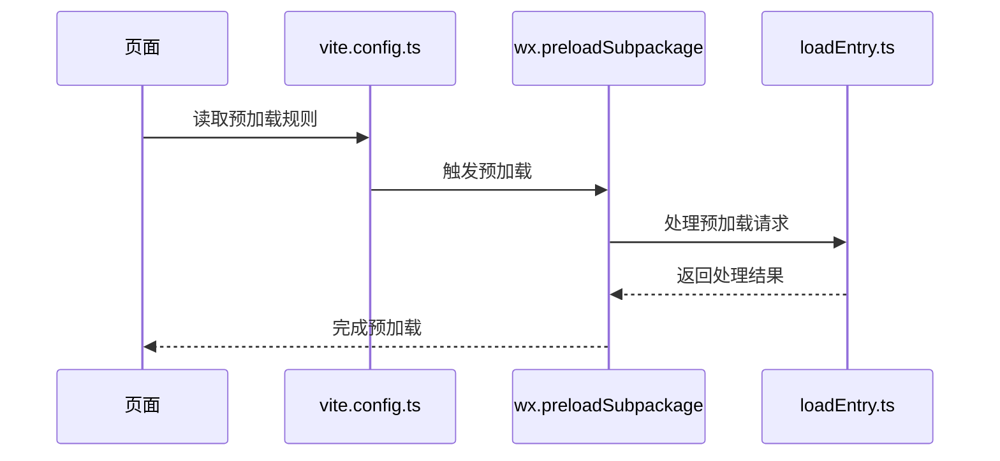
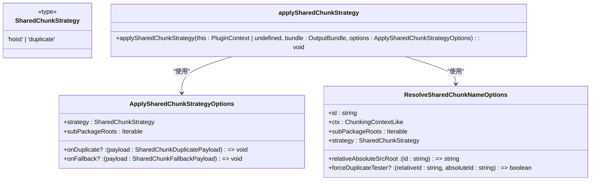
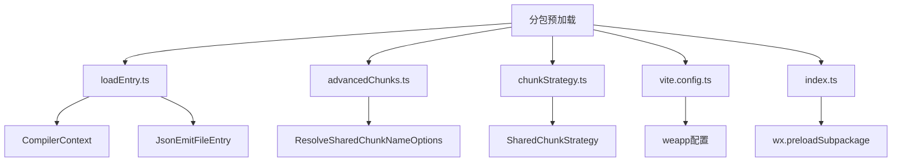
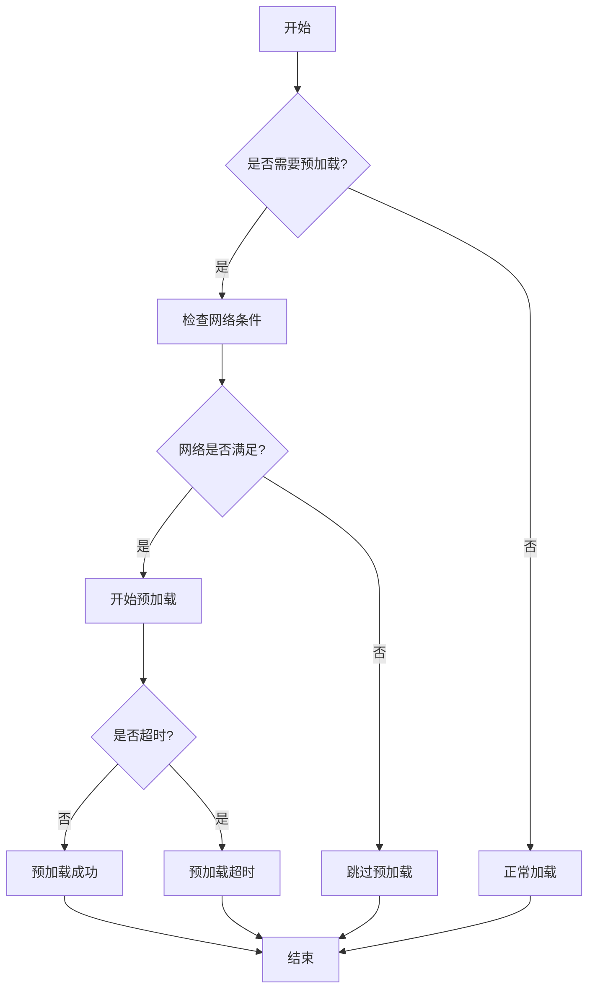
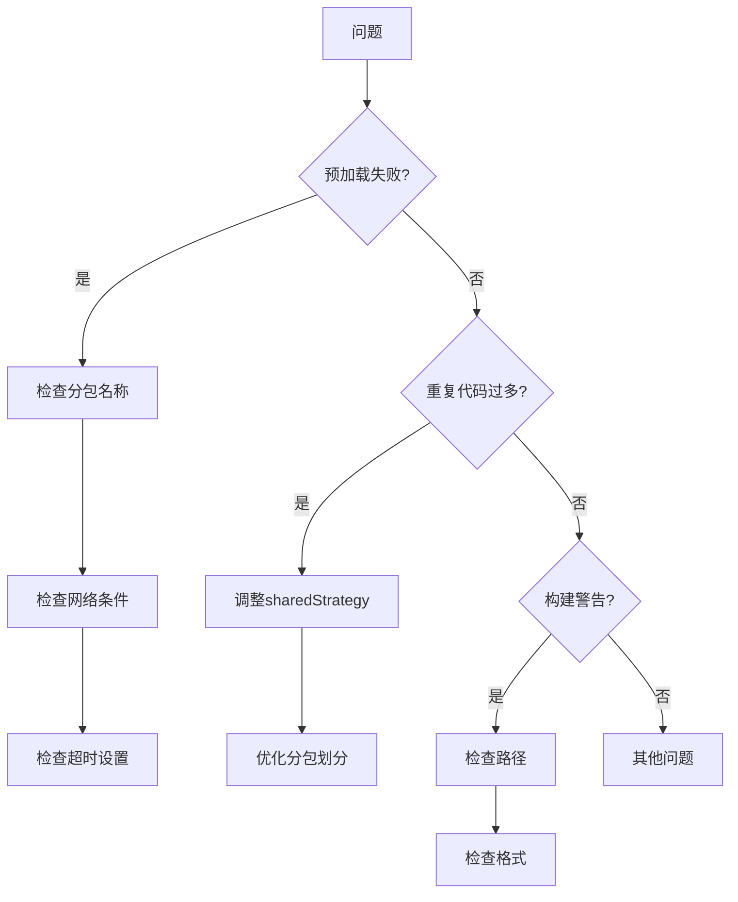

# 分包预加载

<cite>
**本文档引用的文件**  
- [loadEntry.ts](file://packages/weapp-vite/src/plugins/hooks/useLoadEntry/loadEntry.ts)
- [advancedChunks.ts](file://packages/weapp-vite/src/runtime/advancedChunks.ts)
- [chunkStrategy.ts](file://packages/weapp-vite/src/runtime/chunkStrategy.ts)
- [vite.config.ts](file://apps/subpackage-shared-chunks/vite.config.ts)
- [index.ts](file://apps/subpackage-shared-chunks/src/pages/index/index.ts)
- [subpackages.md](file://docs/subpackages.md)
- [core.ts](file://packages/weapp-vite/src/plugins/core.ts)
</cite>

## 目录
1. [简介](#简介)
2. [项目结构](#项目结构)
3. [核心组件](#核心组件)
4. [架构概述](#架构概述)
5. [详细组件分析](#详细组件分析)
6. [依赖分析](#依赖分析)
7. [性能考虑](#性能考虑)
8. [故障排除指南](#故障排除指南)
9. [结论](#结论)

## 简介
本文档详细介绍了在微信小程序Vite项目中如何配置和使用分包预加载功能，以提升用户体验。通过分析`loadEntry.ts`和`advancedChunks.ts`中的实现逻辑，深入讲解预加载的触发条件和配置选项。同时说明如何在`vite.config.ts`中设置预加载规则，以及不同预加载策略对性能的影响。提供实际案例展示如何为关键业务路径配置预加载，减少用户等待时间，并解释预加载的缓存机制和更新策略，确保用户始终获得最新内容。

## 项目结构
本项目采用模块化设计，主要分为以下几个部分：
- `@weapp-core/`: 核心初始化脚本和工具
- `apps/`: 各种应用示例，包括分包共享chunks的示例
- `packages/`: 核心插件和工具包
- `docs/`: 文档资源

重点关注`apps/subpackage-shared-chunks`目录，该目录包含了一个完整的分包预加载示例。

```mermaid
graph TD
A[项目根目录] --> B[@weapp-core]
A --> C[apps]
A --> D[packages]
A --> E[docs]
C --> F[subpackage-shared-chunks]
F --> G[vite.config.ts]
F --> H[src/pages/index/index.ts]
```

**图表来源**
- [vite.config.ts](file://apps/subpackage-shared-chunks/vite.config.ts)
- [index.ts](file://apps/subpackage-shared-chunks/src/pages/index/index.ts)

**章节来源**
- [vite.config.ts](file://apps/subpackage-shared-chunks/vite.config.ts)
- [index.ts](file://apps/subpackage-shared-chunks/src/pages/index/index.ts)

## 核心组件
分包预加载功能的核心组件包括：
- `loadEntry.ts`: 负责加载入口文件并处理预加载逻辑
- `advancedChunks.ts`: 提供高级chunk名称解析功能
- `chunkStrategy.ts`: 定义分包策略和共享chunk的处理逻辑

这些组件共同协作，实现了高效的分包管理和预加载机制。

**章节来源**
- [loadEntry.ts](file://packages/weapp-vite/src/plugins/hooks/useLoadEntry/loadEntry.ts)
- [advancedChunks.ts](file://packages/weapp-vite/src/runtime/advancedChunks.ts)
- [chunkStrategy.ts](file://packages/weapp-vite/src/runtime/chunkStrategy.ts)

## 架构概述
分包预加载的架构主要包括以下几个层次：
1. 配置层：通过`vite.config.ts`进行预加载规则配置
2. 执行层：在页面加载时调用`wx.preloadSubpackage`方法
3. 管理层：由`loadEntry.ts`和`chunkStrategy.ts`处理具体的预加载逻辑



**图表来源**
- [vite.config.ts](file://apps/subpackage-shared-chunks/vite.config.ts)
- [loadEntry.ts](file://packages/weapp-vite/src/plugins/hooks/useLoadEntry/loadEntry.ts)
- [index.ts](file://apps/subpackage-shared-chunks/src/pages/index/index.ts)

## 详细组件分析

### loadEntry.ts 分析
`loadEntry.ts`是分包预加载的核心文件，负责处理入口文件的加载和预加载逻辑。

```mermaid
classDiagram
class EntryLoaderOptions {
+ctx : CompilerContext
+entriesMap : Map<string, Entry | undefined>
+loadedEntrySet : Set<string>
+normalizeEntry : (entry : string, jsonPath : string) => string
+registerJsonAsset : (entry : JsonEmitFileEntry) => void
+scanTemplateEntry : (templateEntry : string) => Promise<void>
+emitEntriesChunks : (this : PluginContext, resolvedIds : (ResolvedId | null)[]) => Promise<unknown>[]
+applyAutoImports : (baseName : string, json : any) => void
+extendedLibManager : ExtendedLibManager
+buildTarget : BuildTarget
+debug? : (...args : any[]) => void
}
class createEntryLoader {
+createStopwatch() : () => string
+addWatchTarget(pluginCtx : PluginContext, target : string, existsCache : Map<string, boolean>) : Promise<boolean>
+collectStyleImports(pluginCtx : PluginContext, id : string, existsCache : Map<string, boolean>) : Promise<string[]>
+collectAppSideFiles(pluginCtx : PluginContext, id : string, json : any, jsonService : CompilerContext['jsonService'], registerJsonAsset : (entry : JsonEmitFileEntry) => void, existsCache : Map<string, boolean>) : Promise<void>
+ensureTemplateScanned(pluginCtx : PluginContext, id : string, scanTemplateEntry : (templateEntry : string) => Promise<void>, existsCache : Map<string, boolean>) : Promise<string>
+resolveEntries(this : PluginContext, entries : string[], absoluteRoot : string) : Promise<{entry : string, resolvedId : ResolvedId | null}[]>
+loadEntry(this : PluginContext, id : string, type : 'app' | 'page' | 'component') : Promise<{code : string}>
}
createEntryLoader --> EntryLoaderOptions : "使用"
```

**图表来源**
- [loadEntry.ts](file://packages/weapp-vite/src/plugins/hooks/useLoadEntry/loadEntry.ts)

**章节来源**
- [loadEntry.ts](file://packages/weapp-vite/src/plugins/hooks/useLoadEntry/loadEntry.ts)

### advancedChunks.ts 分析
`advancedChunks.ts`提供了高级chunk名称解析功能，用于优化分包策略。

```mermaid
classDiagram
class AdvancedChunkNameResolver {
<<type>>
(id : string, ctx : ResolveSharedChunkNameOptions['ctx']) => string | undefined
}
class AdvancedChunkResolverOptions {
+relativeAbsoluteSrcRoot : ResolveSharedChunkNameOptions['relativeAbsoluteSrcRoot']
+getSubPackageRoots : () => ResolveSharedChunkNameOptions['subPackageRoots']
+strategy : ResolveSharedChunkNameOptions['strategy']
+vendorsMatchers : RegExp[][]
+forceDuplicateTester? : ResolveSharedChunkNameOptions['forceDuplicateTester']
}
class createAdvancedChunkNameResolver {
+createAdvancedChunkNameResolver(options : AdvancedChunkResolverOptions) : AdvancedChunkNameResolver
}
createAdvancedChunkNameResolver --> AdvancedChunkResolverOptions : "使用"
createAdvancedChunkNameResolver --> AdvancedChunkNameResolver : "返回"
```

**图表来源**
- [advancedChunks.ts](file://packages/weapp-vite/src/runtime/advancedChunks.ts)

**章节来源**
- [advancedChunks.ts](file://packages/weapp-vite/src/runtime/advancedChunks.ts)

### chunkStrategy.ts 分析
`chunkStrategy.ts`定义了分包策略和共享chunk的处理逻辑。



**图表来源**
- [chunkStrategy.ts](file://packages/weapp-vite/src/runtime/chunkStrategy.ts)

**章节来源**
- [chunkStrategy.ts](file://packages/weapp-vite/src/runtime/chunkStrategy.ts)

## 依赖分析
分包预加载功能依赖于多个核心组件和配置文件：



**图表来源**
- [loadEntry.ts](file://packages/weapp-vite/src/plugins/hooks/useLoadEntry/loadEntry.ts)
- [advancedChunks.ts](file://packages/weapp-vite/src/runtime/advancedChunks.ts)
- [chunkStrategy.ts](file://packages/weapp-vite/src/runtime/chunkStrategy.ts)
- [vite.config.ts](file://apps/subpackage-shared-chunks/vite.config.ts)
- [index.ts](file://apps/subpackage-shared-chunks/src/pages/index/index.ts)

**章节来源**
- [loadEntry.ts](file://packages/weapp-vite/src/plugins/hooks/useLoadEntry/loadEntry.ts)
- [advancedChunks.ts](file://packages/weapp-vite/src/runtime/advancedChunks.ts)
- [chunkStrategy.ts](file://packages/weapp-vite/src/runtime/chunkStrategy.ts)
- [vite.config.ts](file://apps/subpackage-shared-chunks/vite.config.ts)
- [index.ts](file://apps/subpackage-shared-chunks/src/pages/index/index.ts)

## 性能考虑
分包预加载对性能有显著影响，需要合理配置：

1. **预加载时机**：在页面`onLoad`时触发预加载，避免阻塞首屏渲染
2. **网络条件**：通过`network`参数控制预加载的网络条件
3. **超时设置**：合理设置`timeout`避免长时间等待
4. **分包策略**：选择合适的`sharedStrategy`减少冗余代码



**图表来源**
- [index.ts](file://apps/subpackage-shared-chunks/src/pages/index/index.ts)
- [vite.config.ts](file://apps/subpackage-shared-chunks/vite.config.ts)

## 故障排除指南
在使用分包预加载时可能遇到以下问题：

1. **预加载失败**：检查分包名称是否正确，网络条件是否满足
2. **重复代码过多**：调整`sharedStrategy`为`hoist`或优化分包划分
3. **构建警告**：关注构建日志中的`[subpackages]`警告，检查路径和格式



**章节来源**
- [subpackages.md](file://docs/subpackages.md)
- [core.ts](file://packages/weapp-vite/src/plugins/core.ts)

## 结论
分包预加载是提升微信小程序用户体验的重要手段。通过合理配置`vite.config.ts`中的预加载规则，结合`wx.preloadSubpackage`方法，可以在用户访问关键业务路径前预先加载所需资源，显著减少等待时间。同时需要注意预加载的网络条件、超时设置和分包策略，以达到最佳性能效果。