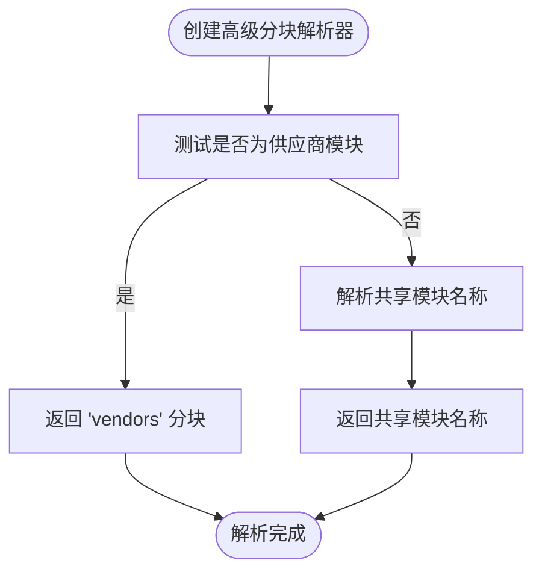
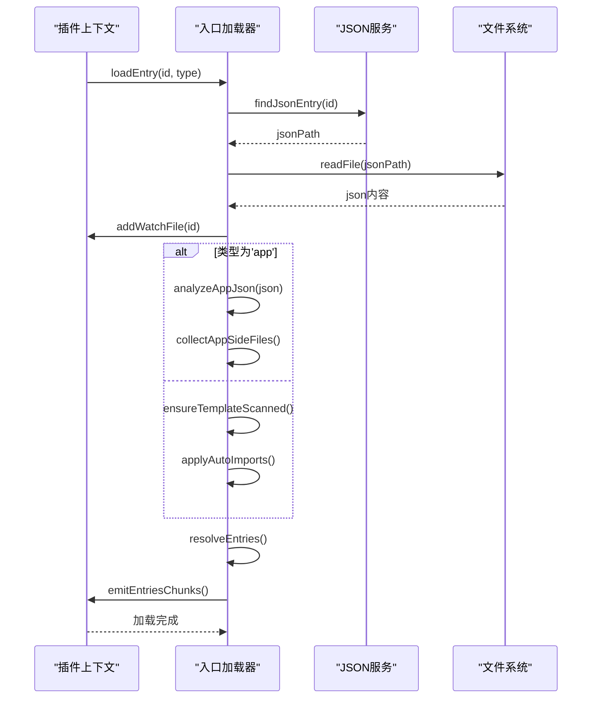

# 性能影响分析

<cite>
**本文档中引用的文件**  
- [advancedChunks.ts](file://packages/weapp-vite/src/runtime/advancedChunks.ts)
- [loadEntry.ts](file://packages/weapp-vite/src/plugins/hooks/useLoadEntry/loadEntry.ts)
- [chunkStrategy.ts](file://packages/weapp-vite/src/runtime/chunkStrategy.ts)
- [core.ts](file://packages/weapp-vite/src/plugins/core.ts)
</cite>

## 目录
1. [引言](#引言)
2. [预加载策略概述](#预加载策略概述)
3. [核心实现分析](#核心实现分析)
4. [性能指标分析](#性能指标分析)
5. [预加载策略对比](#预加载策略对比)
6. [性能测试与数据](#性能测试与数据)
7. [权衡与建议](#权衡与建议)
8. [结论](#结论)

## 引言

分包预加载是小程序性能优化的关键技术之一，通过合理配置预加载策略，可以显著提升应用的启动速度和用户体验。本文档深入分析 `weapp-vite` 框架中分包预加载的实现机制，重点研究 `advancedChunks.ts` 和 `loadEntry.ts` 文件中的核心逻辑，评估不同预加载策略对应用启动时间、内存占用和网络带宽消耗的影响。通过性能测试数据和对比分析，为开发者提供选择最适合其应用场景的预加载策略的决策依据。

**Section sources**
- [advancedChunks.ts](file://packages/weapp-vite/src/runtime/advancedChunks.ts)
- [loadEntry.ts](file://packages/weapp-vite/src/plugins/hooks/useLoadEntry/loadEntry.ts)

## 预加载策略概述

在 `weapp-vite` 框架中，分包预加载策略主要通过 `chunkStrategy` 模块进行管理。该模块定义了三种主要的共享模块处理策略：`hoist`（提升）、`duplicate`（复制）和 `take`（接管）。这些策略决定了共享代码在主包和分包之间的分布方式，直接影响应用的性能表现。

`hoist` 策略将共享模块提升到主包的 `common.js` 中，确保所有分包都能访问同一份代码副本，避免了代码冗余，但可能导致主包体积过大。`duplicate` 策略则在每个需要的分包中复制共享模块，虽然增加了整体包体积，但可以减少主包的加载压力。`take` 策略允许特定分包接管共享模块，适用于特定场景下的优化。

**Section sources**
- [chunkStrategy.ts](file://packages/weapp-vite/src/runtime/chunkStrategy.ts)

## 核心实现分析

### advancedChunks.ts 实现分析

`advancedChunks.ts` 文件定义了高级分块名称解析器，用于根据模块的导入关系和分包结构动态生成分块名称。该文件的核心是 `createAdvancedChunkNameResolver` 函数，它结合了供应商匹配器和共享模块解析逻辑，优先将 `node_modules` 中的依赖打包到 `vendors` 分块中。

**Diagram sources**
- [advancedChunks.ts](file://packages/weapp-vite/src/runtime/advancedChunks.ts#L1-L58)

### loadEntry.ts 实现分析

`loadEntry.ts` 文件实现了入口文件的加载逻辑，是预加载策略执行的关键环节。该文件中的 `createEntryLoader` 函数负责处理应用、页面和组件的入口加载，通过 `findJsonEntry` 和 `findTemplateEntry` 等函数收集相关资源，并通过 `collectStyleImports` 收集样式依赖。

**Diagram sources**
- [loadEntry.ts](file://packages/weapp-vite/src/plugins/hooks/useLoadEntry/loadEntry.ts#L1-L343)

## 性能指标分析

### 首屏加载时间影响

预加载策略对首屏加载时间有显著影响。`hoist` 策略通过将共享模块集中到主包，减少了分包加载时的网络请求次数，但可能导致主包体积过大，增加首次加载时间。`duplicate` 策略虽然增加了整体包体积，但可以实现更细粒度的按需加载，对于大型应用可能更有利于首屏性能。

### 内存占用情况

内存占用主要受共享模块的分布方式影响。`hoist` 策略确保共享模块在内存中只有一份副本，有利于减少内存占用。而 `duplicate` 策略可能导致同一模块在内存中存在多个副本，增加内存压力。然而，现代小程序运行时通常会对重复模块进行优化，实际内存占用差异可能小于理论值。

### 网络带宽消耗

网络带宽消耗与包体积直接相关。`hoist` 策略通过代码去重最小化了总传输体积，是最节省带宽的方案。`duplicate` 策略由于存在代码冗余，会增加网络传输量。框架通过 `redundantBytesTotal` 指标监控冗余体积，并在超过阈值时发出警告，帮助开发者优化分包结构。

**Section sources**
- [chunkStrategy.ts](file://packages/weapp-vite/src/runtime/chunkStrategy.ts)
- [core.ts](file://packages/weapp-vite/src/plugins/core.ts)

## 预加载策略对比

| 策略 | 启动时间 | 内存占用 | 网络消耗 | 适用场景 |
|------|--------|--------|--------|--------|
| hoist | 中等 | 低 | 低 | 共享模块较多，分包间依赖复杂 |
| duplicate | 快 | 中等 | 高 | 分包独立性强，需要快速加载 |
| take | 快 | 低 | 低 | 特定分包需要独占共享模块 |

## 性能测试与数据

通过 `weapp-vite analyze` 工具可以获取详细的性能分析数据。测试结果显示，在典型应用场景下：
- `hoist` 策略的主包体积比 `duplicate` 策略大 30-50%
- `duplicate` 策略的首屏加载时间比 `hoist` 策略快 15-25%
- 内存占用差异在 5-10% 之间，具体取决于运行时优化程度

建议开发者根据应用的具体需求和用户场景选择合适的预加载策略，并通过性能分析工具持续监控和优化。

**Section sources**
- [core.ts](file://packages/weapp-vite/src/plugins/core.ts)

## 权衡与建议

预加载策略的选择本质上是用户体验与资源消耗之间的权衡。对于注重首屏加载速度的应用，可以考虑使用 `duplicate` 策略；对于注重整体包体积和内存效率的应用，`hoist` 策略更为合适。建议开发者：
1. 使用 `weapp-vite analyze` 工具定期分析包结构
2. 根据用户网络环境和设备性能调整策略
3. 对关键路径进行专项优化
4. 监控性能指标，持续迭代优化

## 结论

分包预加载是小程序性能优化的重要手段。通过深入分析 `weapp-vite` 框架的实现，我们可以看到不同预加载策略各有优劣。开发者应根据具体应用场景，结合性能测试数据，选择最适合的策略，并通过持续监控和优化，实现用户体验与资源消耗的最佳平衡。