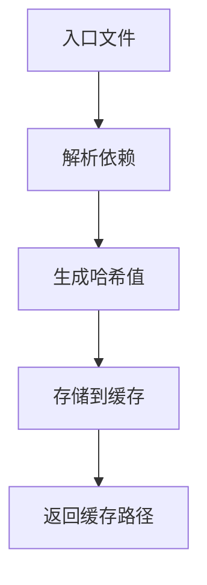
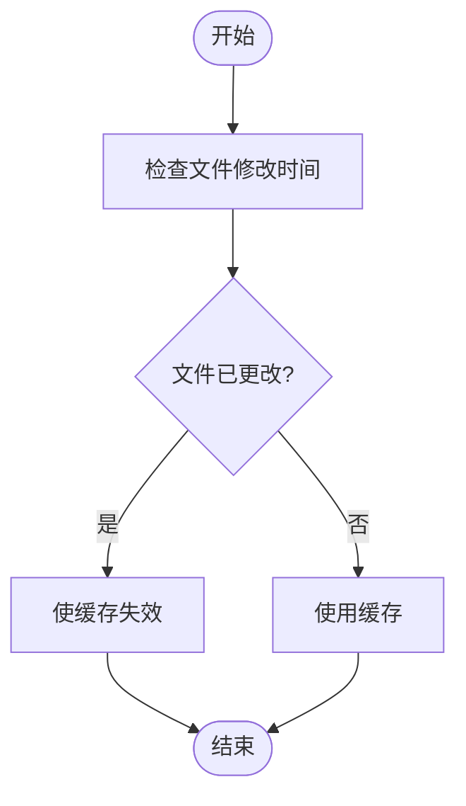
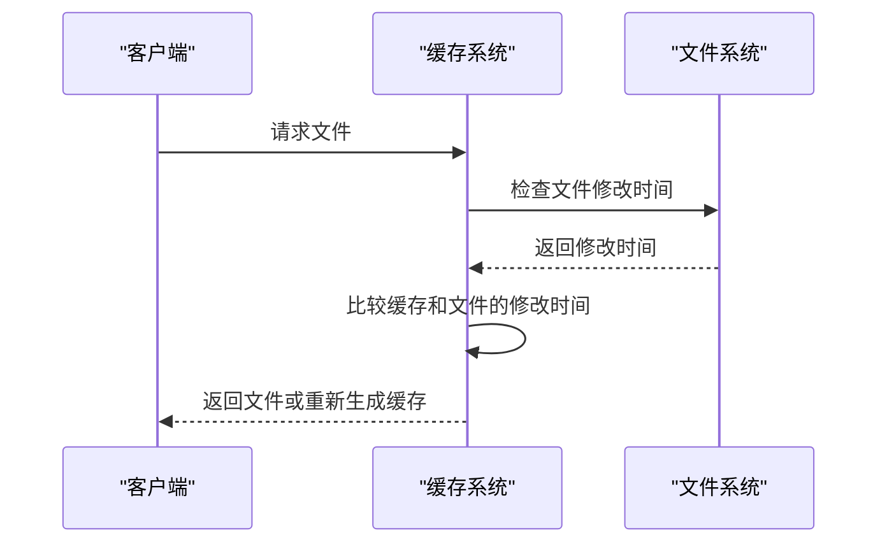
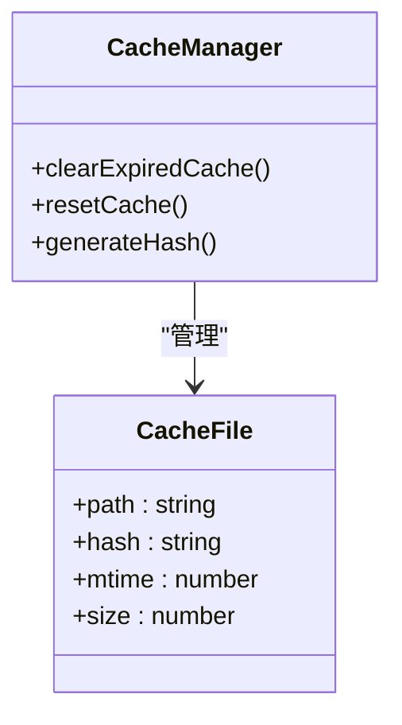

# 缓存与更新策略

<cite>
**本文档引用的文件**   
- [advancedChunks.ts](file://packages/weapp-vite/src/runtime/advancedChunks.ts)
- [loadEntry.ts](file://packages/weapp-vite/src/plugins/hooks/useLoadEntry/loadEntry.ts)
- [chunkStrategy.ts](file://packages/weapp-vite/src/runtime/chunkStrategy.ts)
- [cache.ts](file://packages/rolldown-require/src/cache.ts)
- [file.ts](file://packages/weapp-vite/src/cache/file.ts)
</cite>

## 目录
1. [引言](#引言)
2. [分包预加载缓存机制概述](#分包预加载缓存机制概述)
3. [核心组件分析](#核心组件分析)
4. [缓存策略详解](#缓存策略详解)
5. [更新检测机制](#更新检测机制)
6. [缓存清理与版本控制](#缓存清理与版本控制)
7. [最佳实践建议](#最佳实践建议)
8. [结论](#结论)

## 引言
本文档旨在深入分析weapp-vite项目中的分包预加载缓存机制，重点阐述预加载内容的缓存策略和更新机制。通过分析`advancedChunks.ts`和`loadEntry.ts`中的实现逻辑，详细说明预加载内容的存储方式、缓存有效期、更新检测机制等，确保用户始终获得最新内容，同时避免不必要的重复下载。

## 分包预加载缓存机制概述
在weapp-vite项目中，分包预加载缓存机制通过`advancedChunks.ts`和`loadEntry.ts`两个核心文件实现。该机制的主要目标是优化小程序的加载性能，通过预加载和缓存分包中的共享代码，减少重复下载，提升用户体验。

## 核心组件分析

### advancedChunks.ts
该文件定义了高级分块名称解析器，用于确定预加载内容的存储位置和名称。通过`createAdvancedChunkNameResolver`函数，根据模块的导入关系和分包配置，生成唯一的分块名称。

**Section sources**
- [advancedChunks.ts](file://packages/weapp-vite/src/runtime/advancedChunks.ts#L1-L57)

### loadEntry.ts
该文件实现了入口加载器，负责加载和处理分包中的入口文件。通过`createEntryLoader`函数，加载器会解析入口文件的依赖关系，并将预加载的模块添加到缓存中。

**Section sources**
- [loadEntry.ts](file://packages/weapp-vite/src/plugins/hooks/useLoadEntry/loadEntry.ts#L1-L343)

## 缓存策略详解

### 存储方式
预加载内容的存储方式基于文件路径和模块依赖关系。每个预加载的模块都会生成一个唯一的哈希值，作为其在缓存中的键。缓存文件存储在`.rolldown-require-cache`目录下，文件名包含哈希值以避免并发冲突。

**Diagram sources **
- [cache.ts](file://packages/rolldown-require/src/cache.ts#L55-L107)

### 缓存有效期
缓存的有效期由入口文件的修改时间（mtime）和大小（size）决定。当入口文件或其依赖文件发生变化时，缓存将被视为失效，需要重新生成。

**Diagram sources **
- [cache.ts](file://packages/rolldown-require/src/cache.ts#L109-L144)

## 更新检测机制
更新检测机制通过比较文件的修改时间和大小来判断缓存是否有效。如果文件的修改时间或大小发生变化，缓存将被标记为无效，并重新生成。

**Diagram sources **
- [file.ts](file://packages/weapp-vite/src/cache/file.ts#L62-L121)

## 缓存清理与版本控制
缓存清理策略包括定期清理过期的缓存文件和在项目构建时重置缓存。版本控制通过哈希值实现，确保每次构建生成的缓存文件都是唯一的。

**Diagram sources **
- [cache.ts](file://packages/rolldown-require/src/cache.ts#L233-L239)

## 最佳实践建议
1. **合理配置缓存目录**：选择合适的缓存目录，避免频繁的磁盘I/O操作。
2. **定期清理缓存**：定期清理过期的缓存文件，释放磁盘空间。
3. **监控缓存命中率**：通过监控缓存命中率，优化缓存策略。
4. **避免缓存冲突**：确保缓存文件名的唯一性，避免并发冲突。

## 结论
通过深入分析weapp-vite项目中的分包预加载缓存机制，我们可以看到其在提升小程序加载性能方面的显著效果。合理的缓存策略和更新检测机制确保了用户始终获得最新内容，同时避免了不必要的重复下载。开发者应根据项目需求，合理配置和优化缓存策略，以提升用户体验。