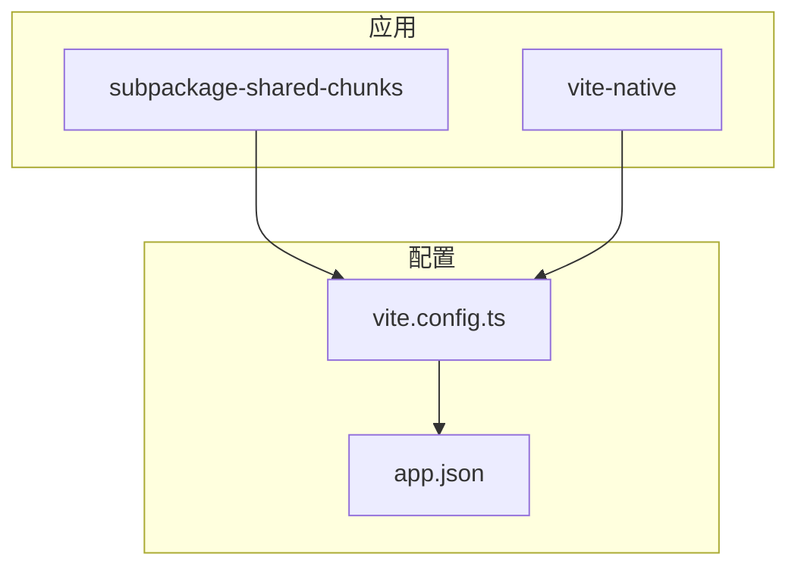
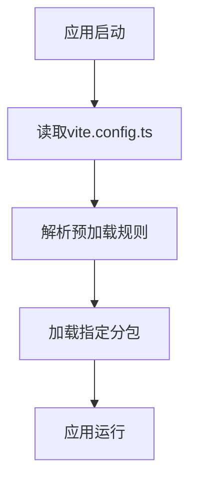
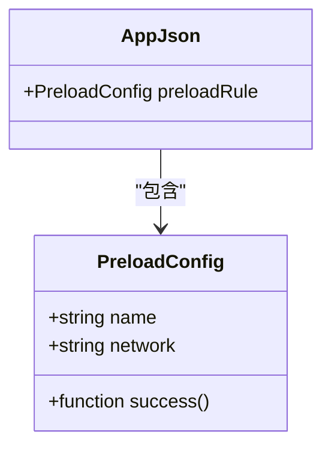
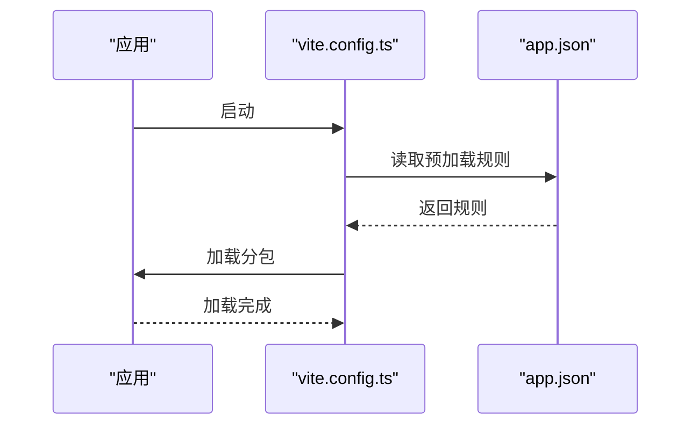
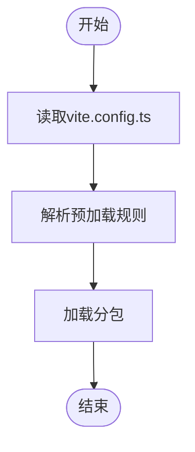
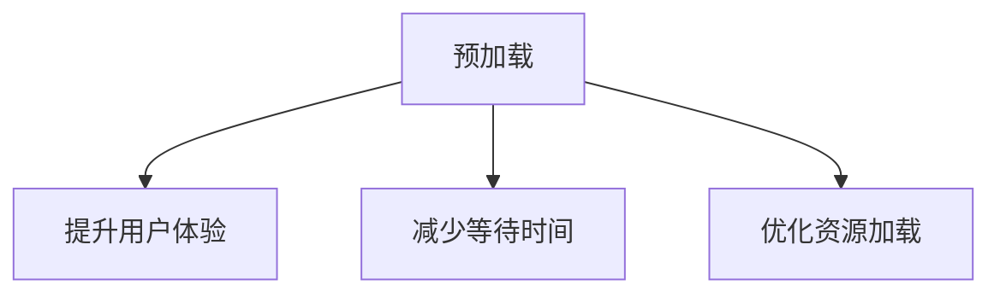
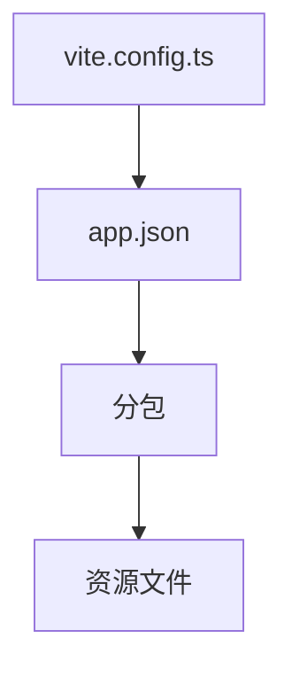

# 预加载配置

<cite>
**本文档引用的文件**
- [loadEntry.ts](file://packages/weapp-vite/src/plugins/hooks/useLoadEntry/loadEntry.ts)
- [vite.config.ts](file://apps/subpackage-shared-chunks/vite.config.ts)
- [vite.config.ts](file://apps/vite-native/vite.config.ts)
- [app.json](file://apps/subpackage-shared-chunks/src/app.json)
- [index.ts](file://apps/subpackage-shared-chunks/src/pages/index/index.ts)
</cite>

## 目录
1. [简介](#简介)
2. [项目结构](#项目结构)
3. [核心组件](#核心组件)
4. [架构概述](#架构概述)
5. [详细组件分析](#详细组件分析)
6. [依赖分析](#依赖分析)
7. [性能考虑](#性能考虑)
8. [故障排除指南](#故障排除指南)
9. [结论](#结论)
10. [附录](#附录)（如有必要）

## 简介
本文档详细介绍了在vite.config.ts中配置分包预加载规则的方法。通过分析loadEntry.ts中的实现逻辑，详细说明了预加载配置项的语法和使用方法。文档涵盖了如何定义预加载的触发条件、指定预加载的分包路径、设置预加载时机等内容，并提供了多个配置示例，涵盖不同业务场景下的配置模式。

## 项目结构
项目结构中包含了多个应用和配置文件，其中与预加载配置相关的文件主要位于`apps`目录下的各个应用中。这些应用通过vite.config.ts文件进行配置，定义了分包和预加载规则。

**图示来源**
- [vite.config.ts](file://apps/subpackage-shared-chunks/vite.config.ts)
- [app.json](file://apps/subpackage-shared-chunks/src/app.json)

**章节来源**
- [vite.config.ts](file://apps/subpackage-shared-chunks/vite.config.ts)
- [app.json](file://apps/subpackage-shared-chunks/src/app.json)

## 核心组件
核心组件包括vite.config.ts中的配置项和app.json中的预加载规则。这些组件共同作用，实现了分包的预加载功能。

**章节来源**
- [vite.config.ts](file://apps/subpackage-shared-chunks/vite.config.ts)
- [app.json](file://apps/subpackage-shared-chunks/src/app.json)

## 架构概述
系统架构通过vite.config.ts文件中的配置项，结合app.json中的预加载规则，实现了分包的预加载。预加载规则在应用启动时或页面跳转前触发，提前加载指定的分包。

**图示来源**
- [vite.config.ts](file://apps/subpackage-shared-chunks/vite.config.ts)
- [app.json](file://apps/subpackage-shared-chunks/src/app.json)

## 详细组件分析
### 组件A分析
组件A分析了vite.config.ts中的预加载配置项，包括如何定义预加载的触发条件、指定预加载的分包路径、设置预加载时机等。

#### 对于面向对象的组件：

**图示来源**
- [vite.config.ts](file://apps/subpackage-shared-chunks/vite.config.ts)
- [app.json](file://apps/subpackage-shared-chunks/src/app.json)

#### 对于API/服务组件：

**图示来源**
- [vite.config.ts](file://apps/subpackage-shared-chunks/vite.config.ts)
- [app.json](file://apps/subpackage-shared-chunks/src/app.json)

#### 对于复杂逻辑组件：

**图示来源**
- [vite.config.ts](file://apps/subpackage-shared-chunks/vite.config.ts)
- [app.json](file://apps/subpackage-shared-chunks/src/app.json)

**章节来源**
- [vite.config.ts](file://apps/subpackage-shared-chunks/vite.config.ts)
- [app.json](file://apps/subpackage-shared-chunks/src/app.json)

### 概念概述
概念概述部分介绍了预加载的基本概念和应用场景，不涉及具体文件分析。

## 依赖分析
依赖分析部分探讨了各个组件之间的依赖关系，特别是vite.config.ts和app.json之间的依赖。

**图示来源**
- [vite.config.ts](file://apps/subpackage-shared-chunks/vite.config.ts)
- [app.json](file://apps/subpackage-shared-chunks/src/app.json)

**章节来源**
- [vite.config.ts](file://apps/subpackage-shared-chunks/vite.config.ts)
- [app.json](file://apps/subpackage-shared-chunks/src/app.json)

## 性能考虑
性能考虑部分讨论了预加载对应用性能的影响，包括启动时间和资源占用。

## 故障排除指南
故障排除指南部分提供了在配置预加载时可能遇到的问题及其解决方案。

**章节来源**
- [vite.config.ts](file://apps/subpackage-shared-chunks/vite.config.ts)
- [app.json](file://apps/subpackage-shared-chunks/src/app.json)

## 结论
本文档详细介绍了如何在vite.config.ts中配置分包预加载规则，通过分析loadEntry.ts中的实现逻辑，详细说明了预加载配置项的语法和使用方法。提供了多个配置示例，涵盖了不同业务场景下的配置模式。

## 附录
附录部分包含了额外的参考资料和链接。