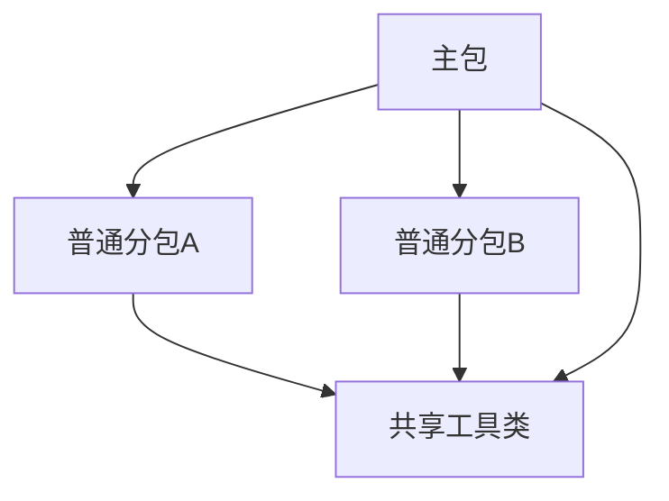
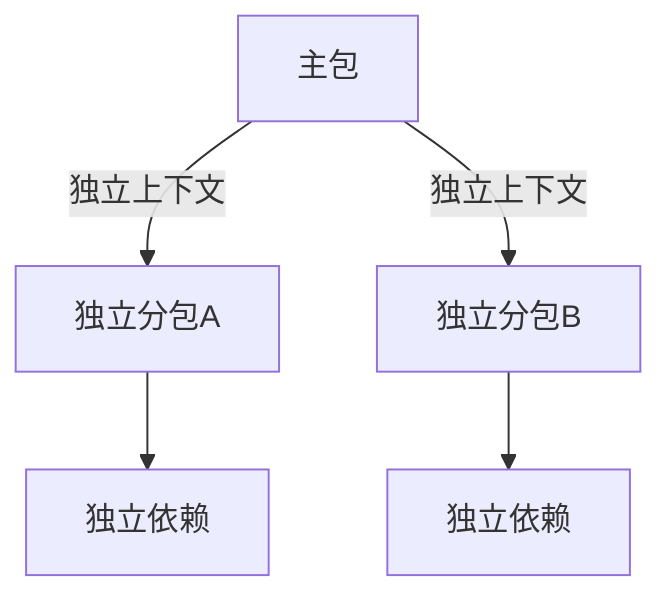
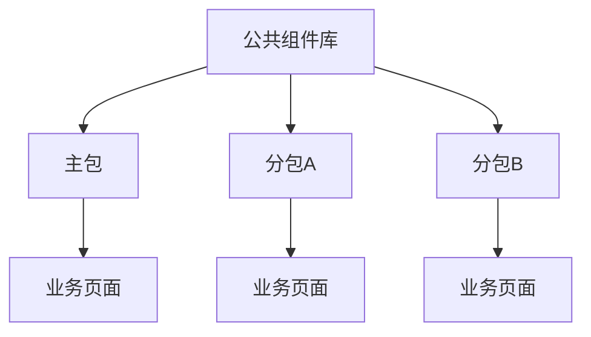
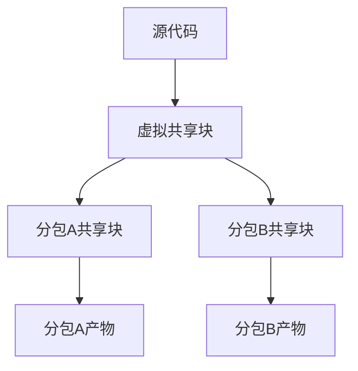
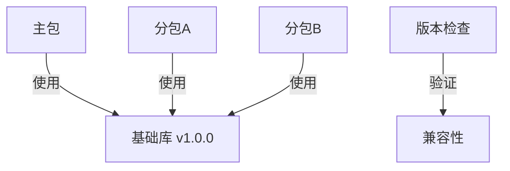
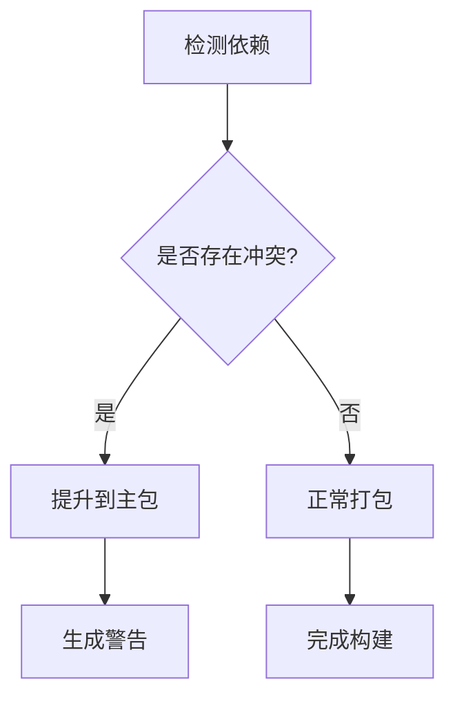
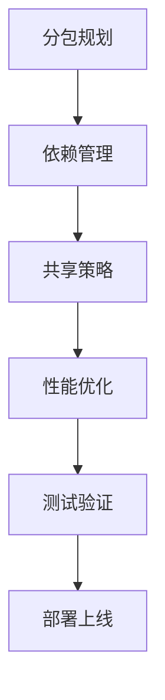

# 依赖关系管理

<cite>
**本文档中引用的文件**  
- [vite.config.ts](file://apps/vite-native/vite.config.ts)
- [vite.config.ts](file://apps/subpackage-shared-chunks/vite.config.ts)
- [package.json](file://apps/vite-native/package.json)
- [package.json](file://apps/subpackage-shared-chunks/package.json)
- [subpackages.md](file://website/config/subpackages.md)
- [subpackage.md](file://website/guide/subpackage.md)
- [chunkStrategy.ts](file://packages/weapp-vite/src/runtime/chunkStrategy.ts)
- [chunkStrategy.test.ts](file://packages/weapp-vite/src/runtime/chunkStrategy.test.ts)
- [core.ts](file://packages/weapp-vite/src/plugins/core.ts)
- [main-and-sub-shared.ts](file://apps/vite-native/subpackage-demos/main-and-sub-shared.ts)
- [independent-subpackage.ts](file://apps/vite-native/subpackage-demos/independent-subpackage.ts)
- [cross-subpackage-shared.ts](file://apps/vite-native/subpackage-demos/cross-subpackage-shared.ts)
</cite>

## 目录
1. [引言](#引言)
2. [分包依赖处理机制](#分包依赖处理机制)
3. [共享基础库与公共组件](#共享基础库与公共组件)
4. [避免资源重复打包](#避免资源重复打包)
5. [依赖版本管理策略](#依赖版本管理策略)
6. [依赖冲突解决方案](#依赖冲突解决方案)
7. [最佳实践](#最佳实践)
8. [结论](#结论)

## 引言

在大型微信小程序项目中，合理使用分包机制能够显著提升首屏加载速度并有效控制包体大小。`weapp-vite` 构建工具通过灵活的配置选项，支持普通分包和独立分包的精细化管理。本文档深入探讨主包与分包之间的依赖关系处理机制，重点介绍如何在保持业务隔离的同时共享基础库和公共组件，通过实际案例说明配置方法，并提供依赖版本管理和冲突解决的最佳实践。

**本文档中引用的文件**  
- [vite.config.ts](file://apps/vite-native/vite.config.ts)
- [vite.config.ts](file://apps/subpackage-shared-chunks/vite.config.ts)
- [package.json](file://apps/vite-native/package.json)
- [package.json](file://apps/subpackage-shared-chunks/package.json)
- [subpackages.md](file://website/config/subpackages.md)
- [subpackage.md](file://website/guide/subpackage.md)

## 分包依赖处理机制

`weapp-vite` 通过 `weapp.subPackages` 配置项提供灵活的分包编译选项，支持独立分包、依赖裁剪和样式共享等高级功能。分包的依赖处理机制主要分为两种模式：普通分包和独立分包。

### 普通分包

普通分包与主包共享同一个构建上下文（Rolldown 上下文），这意味着它们可以共享模块、样式和资源。在普通分包模式下：

- 分包可以引用主包中的 JS 文件、模板和资源
- 主包可以引用分包中的公共组件
- 共享的代码和依赖会被智能地分配到最合适的包中



**图示来源**  
- [vite.config.ts](file://apps/vite-native/vite.config.ts)
- [subpackage.md](file://website/guide/subpackage.md)

### 独立分包

独立分包与主包完全隔离，拥有独立的构建上下文。这种模式适用于需要完全独立的业务模块，如需要自定义 TabBar 或使用插件的分包。

- 独立分包不能直接依赖主包或其他分包的内容
- 每个独立分包都有自己的 `miniprogram_npm` 目录
- 需要通过显式配置来共享基础库和公共组件



**图示来源**  
- [vite.config.ts](file://apps/vite-native/vite.config.ts)
- [subpackage.md](file://website/guide/subpackage.md)

**本文档中引用的文件**  
- [vite.config.ts](file://apps/vite-native/vite.config.ts)
- [subpackage.md](file://website/guide/subpackage.md)

## 共享基础库与公共组件

在保持业务隔离的同时共享基础库和公共组件是分包架构中的关键挑战。`weapp-vite` 提供了多种机制来实现这一目标。

### 共享策略配置

通过 `weapp.chunks.sharedStrategy` 配置项，可以控制共享代码的处理策略：

- `duplicate`（默认）：将共享代码复制到每个使用它的分包中
- `hoist`：将共享代码提升到主包中

```typescript
// vite.config.ts
export default defineConfig({
  weapp: {
    chunks: {
      sharedStrategy: 'duplicate',
      duplicateWarningBytes: 256 * 1024,
    },
  },
})
```

### 共享样式管理

`weapp.subPackages[].styles` 配置项允许在分包之间共享样式文件：

```typescript
export default defineConfig({
  weapp: {
    subPackages: {
      'packages/order': {
        styles: [
          'styles/theme.scss',
          {
            source: '../shared/styles/components.scss',
            scope: 'components',
            include: ['components/**'],
          },
        ],
      },
    },
  },
})
```

### 自动组件导入

通过 `autoImportComponents` 配置，可以在分包中自动导入公共组件：

```typescript
export default defineConfig({
  weapp: {
    autoImportComponents: {
      globs: ['components/**/*.wxml'],
      resolvers: [TDesignResolver(), VantResolver()],
    },
    subPackages: {
      packageB: {
        autoImportComponents: {
          resolvers: [VantResolver()],
        },
      },
    },
  },
})
```



**图示来源**  
- [vite.config.ts](file://apps/vite-native/vite.config.ts)
- [subpackage.md](file://website/guide/subpackage.md)

**本文档中引用的文件**  
- [vite.config.ts](file://apps/vite-native/vite.config.ts)
- [subpackage.md](file://website/guide/subpackage.md)

## 避免资源重复打包

资源重复打包是分包架构中常见的问题，会导致包体膨胀。`weapp-vite` 提供了多种机制来避免这一问题。

### 依赖精确控制

通过 `weapp.subPackages[].dependencies` 配置项，可以精确控制每个分包需要的 npm 依赖：

```typescript
export default defineConfig({
  weapp: {
    subPackages: {
      packageB: {
        independent: true,
        dependencies: ['tdesign-miniprogram', 'miniprogram-computed'],
      },
    },
  },
})
```

### 共享策略优化

根据项目需求选择合适的共享策略：

- **`duplicate` 策略**：适合注重分包首屏性能的场景
- **`hoist` 策略**：适合注重整体包体控制的场景

```typescript
export default defineConfig({
  weapp: {
    chunks: {
      sharedStrategy: 'duplicate',
      forceDuplicatePatterns: ['action/**'],
      duplicateWarningBytes: 768 * 1024,
    },
  },
})
```

### 虚拟共享块

`weapp-vite` 使用虚拟共享块机制来管理跨包共享的代码：



**图示来源**  
- [chunkStrategy.ts](file://packages/weapp-vite/src/runtime/chunkStrategy.ts)
- [chunkStrategy.test.ts](file://packages/weapp-vite/src/runtime/chunkStrategy.test.ts)

**本文档中引用的文件**  
- [vite.config.ts](file://apps/subpackage-shared-chunks/vite.config.ts)
- [chunkStrategy.ts](file://packages/weapp-vite/src/runtime/chunkStrategy.ts)

## 依赖版本管理策略

有效的依赖版本管理是确保主包与分包兼容性的关键。

### 版本获取机制

`weapp-vite` 通过 `latestVersion` 函数从 npm 仓库获取最新的依赖版本：

```typescript
export async function latestVersion(
  packageName: string,
  prefix: string = '^',
  fetch: typeof getLatestVersionFromNpm = getLatestVersionFromNpm,
) {
  try {
    const resolved = await fetch(packageName)
    if (!resolved) {
      return null
    }
    return `${prefix}${resolved}`
  }
  catch {
    return null
  }
}
```

### 依赖缓存与更新

构建工具会缓存依赖信息，并在依赖发生变化时重新构建：

```typescript
async function buildPackage(
  { dep, outDir, options, isDependenciesCacheOutdate }:
  { dep: string, outDir: string, options?: NpmBuildOptions, isDependenciesCacheOutdate: boolean },
) {
  if (await shouldSkipBuild(destOutDir, isDependenciesCacheOutdate)) {
    logger.info(`[npm] 依赖 \`${dep}\` 未发生变化，跳过处理!`)
    return
  }
  // 构建逻辑
}
```

### 兼容性保证

通过以下策略确保主包与分包之间的兼容性：

1. **统一依赖版本**：确保主包和分包使用相同版本的基础库
2. **语义化版本控制**：使用 `^` 或 `~` 前缀来控制版本更新范围
3. **依赖锁定**：使用 `pnpm-lock.yaml` 锁定依赖版本



**图示来源**  
- [npm.ts](file://@weapp-core/init/src/npm.ts)
- [npmPlugin.ts](file://packages/weapp-vite/src/runtime/npmPlugin.ts)

**本文档中引用的文件**  
- [npm.ts](file://@weapp-core/init/src/npm.ts)
- [npmPlugin.ts](file://packages/weapp-vite/src/runtime/npmPlugin.ts)

## 依赖冲突解决方案

在复杂的分包架构中，依赖冲突是不可避免的。`weapp-vite` 提供了多种解决方案。

### 依赖提升

通过 `sharedStrategy: 'hoist'` 将共享依赖提升到主包：

```typescript
export default defineConfig({
  weapp: {
    chunks: {
      sharedStrategy: 'hoist',
    },
  },
})
```

### 别名配置

使用路径别名来解决模块引用冲突：

```typescript
export default defineConfig({
  weapp: {
    jsonAlias: {
      entries: [
        {
          find: '@',
          replacement: path.resolve(__dirname, 'components'),
        },
      ],
    },
  },
})
```

### 外部化依赖

将某些依赖标记为外部依赖，避免重复打包：

```typescript
function canExternalizeFile(filePath: string): boolean {
  const ext = path.extname(filePath)
  return !ext || ext === '.js' || ext === '.mjs' || ext === '.cjs'
}
```

### 冲突检测与警告

构建工具会检测潜在的依赖冲突并提供警告：

```typescript
applySharedChunkStrategy.call(pluginContext, bundle, {
  strategy: 'duplicate',
  subPackageRoots: ['packageA', 'packageB'],
  onDuplicate: (event) => {
    duplicateEvents.push(event)
  },
  onFallback: (event) => {
    fallbackEvents.push(event)
  },
})
```



**图示来源**  
- [chunkStrategy.ts](file://packages/weapp-vite/src/runtime/chunkStrategy.ts)
- [core.ts](file://packages/weapp-vite/src/plugins/core.ts)

**本文档中引用的文件**  
- [chunkStrategy.ts](file://packages/weapp-vite/src/runtime/chunkStrategy.ts)
- [core.ts](file://packages/weapp-vite/src/plugins/core.ts)

## 最佳实践

基于对 `weapp-vite` 构建工具的分析，以下是分包依赖管理的最佳实践。

### 分包规划原则

1. **保持主包最小化**：首屏只保留必要页面与基座逻辑
2. **以业务边界拆分**：分包根目录与域名一致，便于团队协作
3. **评估独立性**：需要自定义 TabBar 或插件能力的模块优先考虑独立分包
4. **同步规划代码共享**：公共工具、样式、国际化资源放在主包或公共目录

### 配置示例

```typescript
import { defineConfig } from 'weapp-vite/config'
import { VantResolver } from 'weapp-vite/auto-import-components/resolvers'

export default defineConfig({
  weapp: {
    subPackages: {
      'packages/order': {
        independent: true,
        dependencies: ['tdesign-miniprogram', 'miniprogram-computed'],
        styles: ['styles/theme.scss'],
        autoImportComponents: {
          resolvers: [VantResolver()],
        },
      },
      'packages/profile': {
        styles: {
          source: 'styles/index.scss',
          scope: 'pages',
        },
      },
    },
    chunks: {
      sharedStrategy: 'duplicate',
      forceDuplicatePatterns: ['action/**'],
      duplicateWarningBytes: 768 * 1024,
    },
  },
})
```

### 调试与分析

使用内置的分析工具检查产物布局：

```json
{
  "scripts": {
    "analyze": "weapp-vite analyze"
  }
}
```

执行分析命令：

```bash
pnpm run analyze -- --json --output report/analyze.json
```

### 性能优化

1. **预加载规则**：使用 `preloadRule` 预加载可能访问的分包
2. **异步化能力**：启用 `lazyCodeLoading` 按需加载非首屏模块
3. **资源压缩**：启用代码压缩和资源优化



**图示来源**  
- [subpackages.md](file://website/config/subpackages.md)
- [subpackage.md](file://website/guide/subpackage.md)

**本文档中引用的文件**  
- [subpackages.md](file://website/config/subpackages.md)
- [subpackage.md](file://website/guide/subpackage.md)

## 结论

`weapp-vite` 构建工具为微信小程序的分包架构提供了强大而灵活的依赖管理机制。通过合理的配置和最佳实践，可以在保持业务隔离的同时有效共享基础库和公共组件，避免资源重复打包。

关键要点总结：

1. **灵活的分包模式**：支持普通分包和独立分包，满足不同业务场景需求
2. **智能的共享策略**：通过 `sharedStrategy` 配置项优化共享代码的处理方式
3. **精确的依赖控制**：使用 `dependencies` 配置项精确管理每个分包的依赖
4. **完善的冲突解决方案**：提供依赖提升、别名配置等多种解决冲突的手段
5. **强大的分析工具**：内置分析命令帮助开发者理解和优化产物布局

通过遵循本文档中的最佳实践，开发者可以构建出高效、可维护的小程序分包架构，提升用户体验和开发效率。