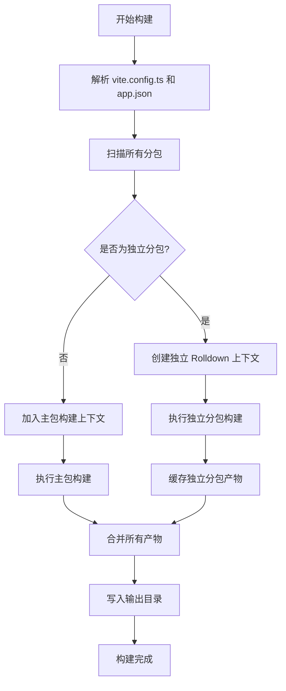
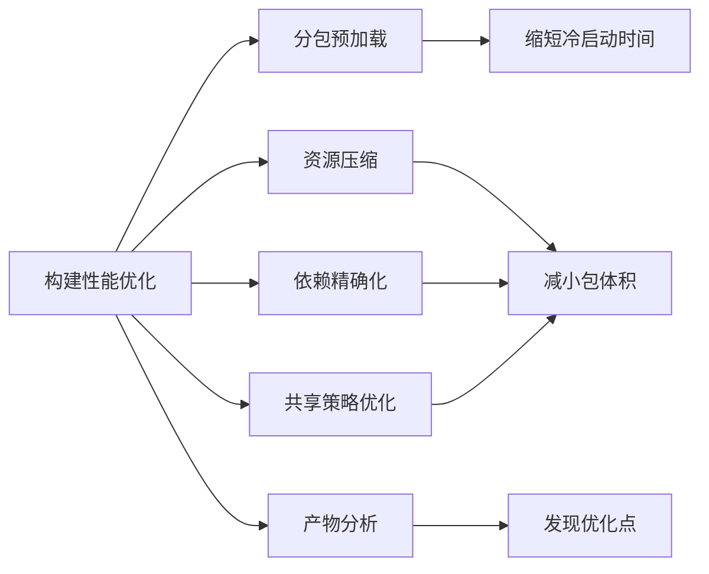

# 构建与发布流程

<cite>
**本文档中引用的文件**  
- [vite.config.ts](file://apps/vite-native/vite.config.ts)
- [vite.config.ts](file://apps/subpackage-shared-chunks/vite.config.ts)
- [subpackages.md](file://docs/subpackages.md)
- [subpackage.md](file://website/guide/subpackage.md)
- [buildPlugin.ts](file://packages/weapp-vite/src/runtime/buildPlugin.ts)
- [chunkStrategy.ts](file://packages/weapp-vite/src/runtime/chunkStrategy.ts)
- [core.ts](file://packages/weapp-vite/src/plugins/core.ts)
- [debug.md](file://website/guide/debug.md)
</cite>

## 目录
1. [引言](#引言)
2. [独立分包构建流程](#独立分包构建流程)
3. [编译与打包步骤](#编译与打包步骤)
4. [输出路径与文件命名](#输出路径与文件命名)
5. [构建产物结构](#构建产物结构)
6. [部署方法](#部署方法)
7. [微信开发者工具调试技巧](#微信开发者工具调试技巧)
8. [构建性能优化建议](#构建性能优化建议)
9. [结论](#结论)

## 引言

本文档详细说明了基于 `weapp-vite` 的微信小程序独立分包的完整构建和发布流程。通过分析项目结构、配置文件和核心构建逻辑，我们将深入探讨分包的编译、打包、优化、输出配置、产物结构、部署方式以及调试技巧。目标是为开发者提供一套清晰、可操作的指南，以实现高效、可靠的独立分包开发与发布。

**Section sources**
- [subpackages.md](file://docs/subpackages.md#L1-L151)
- [subpackage.md](file://website/guide/subpackage.md#L1-L244)

## 独立分包构建流程

独立分包的构建流程始于 `vite.config.ts` 中的配置，并由 `weapp-vite` 的构建服务驱动。整个流程可以概括为：配置解析 -> 分包扫描 -> 独立上下文构建 -> 产物生成与写入。

首先，构建系统会读取 `app.json` 文件，识别所有分包，特别是标记了 `"independent": true` 的独立分包。然后，对于每个独立分包，系统会创建一个独立的 Rolldown（构建器）上下文，确保其编译过程与主包及其他分包完全隔离。这种隔离性是独立分包的核心特性，它意味着独立分包拥有自己的运行时上下文，无法直接访问主包的全局数据和资源。

构建流程的关键在于 `buildPlugin.ts` 中的 `createBuildService` 函数。该函数负责协调主包和所有独立分包的构建任务。它通过 `buildIndependentBundle` 方法为每个独立分包启动一个独立的构建流程，并将结果缓存起来。在主包构建完成后，这些独立分包的产物会被一并写入输出目录。



**Diagram sources**
- [buildPlugin.ts](file://packages/weapp-vite/src/runtime/buildPlugin.ts#L31-L373)
- [core.ts](file://packages/weapp-vite/src/plugins/core.ts#L197-L775)

**Section sources**
- [buildPlugin.ts](file://packages/weapp-vite/src/runtime/buildPlugin.ts#L31-L373)
- [core.ts](file://packages/weapp-vite/src/plugins/core.ts#L197-L775)

## 编译与打包步骤

独立分包的编译与打包步骤是构建流程的核心，主要包括依赖分析、代码转换、模块打包和资源优化。

1.  **依赖分析与裁剪**：在 `vite.config.ts` 的 `weapp.subPackages` 配置中，可以通过 `dependencies` 字段精确声明该独立分包所需的 npm 依赖。构建系统会根据此配置，只为该分包生成对应的 `miniprogram_npm` 目录，从而防止主包的依赖泄漏到独立分包中，有效控制分包体积。
2.  **代码转换**：利用 Vite 的插件生态，源代码（如 TypeScript、SCSS）会被转换为目标平台（微信小程序）支持的格式（JavaScript、WXSS）。例如，`vite.config.ts` 中配置的 `css.preprocessorOptions` 会指导 SCSS 编译器处理样式文件。
3.  **模块打包**：对于独立分包，其内部的所有模块（JS、WXML、WXSS、JSON）都会在独立的 Rolldown 上下文中被打包。入口文件（如 `app.js`）会被处理，其依赖关系图会被解析，并最终生成一个或多个 chunk 文件。
4.  **资源优化**：构建过程会自动进行代码压缩（如果 `build.minify` 启用）、Tree-shaking（移除未使用的代码）和资源压缩。此外，通过 `weapp.subPackages[].styles` 配置，可以将公共样式文件（如主题变量、基础样式）自动注入到分包的样式文件中，减少重复代码。

**Section sources**
- [vite.config.ts](file://apps/vite-native/vite.config.ts#L1-L138)
- [vite.config.ts](file://apps/subpackage-shared-chunks/vite.config.ts#L1-L83)
- [subpackage.md](file://website/guide/subpackage.md#L151-L159)

## 输出路径与文件命名规则

构建产物的输出路径和文件命名由 Vite 的 `build` 配置和 `weapp` 插件的特定逻辑共同决定。

-   **输出目录**：默认情况下，构建产物会输出到 `dist` 目录。可以通过 `build.outDir` 配置项来修改此路径。例如，在 `vite.config.ts` 中设置 `build: { outDir: 'my-dist' }` 可以将输出目录改为 `my-dist`。
-   **分包路径**：独立分包的产物会根据其在 `app.json` 中定义的 `root` 路径，直接输出到 `dist` 目录下的对应子目录中。例如，一个 `root` 为 `packages/order` 的独立分包，其所有文件都会被构建到 `dist/packages/order/` 目录下。
-   **文件命名**：JavaScript 文件的命名遵循 Rolldown 的 `chunkFileNames` 规则。对于独立分包，其 chunk 文件名通常会包含分包的根路径，以确保唯一性。共享的公共模块（common.js）会被放置在分包目录下的 `__shared__` 子目录中。文件扩展名由源文件和预处理器决定，例如 `.ts` 文件会被编译为 `.js`，`.scss` 文件会被编译为 `.wxss`。

**Section sources**
- [vite.config.ts](file://apps/vite-native/vite.config.ts#L131-L137)
- [vite.config.ts](file://apps/subpackage-shared-chunks/vite.config.ts#L65-L71)
- [path.ts](file://@weapp-core/init/src/utils/path.ts#L1-L9)

## 构建产物结构

构建完成后，输出目录（如 `dist`）的结构会清晰地反映小程序的分包结构。

-   **主包**：包含 `app.js`、`app.json`、`app.wxss` 等主包文件，以及主包页面和组件的代码。
-   **独立分包目录**：每个独立分包都有一个以其 `root` 命名的独立目录。该目录内包含该分包自身的 `app.js`（如果存在）、页面、组件、样式文件以及一个 `miniprogram_npm` 目录，该目录仅包含该分包所声明的 npm 依赖。
-   **共享资源**：公共的静态资源（如图片、字体）通常会被复制到 `dist` 根目录或指定的公共目录下，由主包和所有分包共同引用。
-   **特殊目录**：`__shared__` 目录存在于每个分包内部，用于存放该分包专用的共享代码块（如 `common.js`），这些代码块是为避免冷启动时回主包拉取而复制过来的。

这种结构确保了独立分包的自包含性，使其可以独立运行和更新。

```mermaid
erDiagram
dist ||--o{ main : "主包"
dist ||--o{ packageB : "独立分包"
dist ||--o{ shared_assets : "共享资源"
main {
string app.js
string app.json
string app.wxss
string pages/index.js
}
packageB {
string app.js
string pages/index.js
string __shared__/common.js
string miniprogram_npm/tdesign-miniprogram/
}
shared_assets {
string images/logo.png
string fonts/iconfont.woff
}
```

**Diagram sources**
- [subpackage.md](file://website/guide/subpackage.md#L68-L79)
- [vite.config.ts](file://apps/vite-native/vite.config.ts#L89-L99)

## 部署方法

部署独立分包的过程与部署普通小程序应用基本相同，主要通过微信开发者工具完成。

1.  **构建项目**：在项目根目录执行构建命令（如 `pnpm run build`），生成 `dist` 目录。
2.  **打开开发者工具**：启动微信开发者工具。
3.  **导入项目**：选择“导入项目”，将项目目录指向 `dist` 目录，并填写正确的 AppID。
4.  **预览与上传**：在开发者工具中进行预览测试。确认无误后，点击“上传”按钮，将整个项目（包含主包和所有分包）上传到微信服务器。
5.  **版本管理**：在微信公众平台的小程序管理后台，可以对上传的版本进行管理，包括设置体验版、提交审核和发布正式版。

由于独立分包是项目的一部分，因此部署时是作为一个整体进行的。微信服务器会自动识别 `app.json` 中的分包配置，并正确处理独立分包。

**Section sources**
- [subpackage.md](file://docs/subpackages.md#L142-L143)
- [vite.config.ts](file://apps/vite-native/vite.config.ts#L131-L137)

## 微信开发者工具调试技巧

在微信开发者工具中调试独立分包，可以利用源码映射、断点调试和性能分析等工具来提升效率。

-   **源码映射 (Source Map)**：`weapp-vite` 默认会生成 source map 文件。在开发者工具的“详情”->“本地设置”中，确保“开启 ES6 转 ES5”和“上传代码时自动压缩”等选项与构建配置一致。这样，开发者工具就能将压缩后的代码映射回原始的 TypeScript 或 SCSS 源码，方便查看和调试。
-   **断点调试**：在开发者工具的“Sources”面板中，可以找到原始的源码文件（通常位于 `webpack://` 或类似的虚拟路径下）。直接在源码上设置断点，当程序运行到该位置时，执行会暂停，可以检查当前的变量状态和调用栈。
-   **性能分析**：利用开发者工具的“性能”面板，可以记录和分析小程序的运行性能。重点关注页面渲染时间、JS 脚本执行耗时和内存占用。对于独立分包，可以特别关注其首次加载时间，以评估分包预加载策略的效果。
-   **构建日志**：在构建过程中，关注控制台输出的日志。`weapp-vite` 会在日志中提示 `[subpackages]` 相关信息，帮助开发者确认分包是否被正确处理。

**Section sources**
- [debug.md](file://website/guide/debug.md#L1-L63)
- [subpackage.md](file://website/guide/subpackage.md#L201-L206)

## 构建性能优化建议

为了提升构建速度和优化最终产物，可以采取以下建议：

-   **分包预加载**：在 `app.json` 中合理配置 `preloadRule`，在用户访问主包页面时，提前下载高频访问的独立分包。这可以显著缩短用户首次打开该分包时的等待时间。
-   **资源压缩**：确保在生产构建时启用代码压缩（`build.minify: true`）。同时，可以使用 `vite-plugin-image-optimizer` 等插件对图片资源进行压缩，减小包体积。
-   **依赖精确化**：为每个独立分包精确配置 `dependencies`，只包含其真正需要的 npm 包，避免将庞大的通用库打包进分包。
-   **共享策略优化**：通过 `weapp.chunks.sharedStrategy` 配置跨分包共享模块的策略。`duplicate` 策略（默认）会将共享代码复制到各个分包，换取更快的冷启动速度；`hoist` 策略则会将共享代码提升到主包，以减小分包体积。应根据项目需求权衡选择。
-   **分析构建产物**：利用 `weapp-vite analyze` 命令生成构建分析报告，直观地查看每个包的体积构成和共享模块，从而发现优化点。



**Diagram sources**
- [subpackages.md](file://docs/subpackages.md#L125-L129)
- [subpackage.md](file://website/guide/subpackage.md#L117-L135)
- [chunkStrategy.ts](file://packages/weapp-vite/src/runtime/chunkStrategy.ts#L46-L503)

**Section sources**
- [subpackages.md](file://docs/subpackages.md#L125-L135)
- [subpackage.md](file://website/guide/subpackage.md#L117-L135)
- [chunkStrategy.ts](file://packages/weapp-vite/src/runtime/chunkStrategy.ts#L46-L503)

## 结论

本文档全面阐述了基于 `weapp-vite` 的独立分包构建与发布流程。通过合理的配置，开发者可以高效地管理复杂的分包结构，利用独立分包的特性实现模块化、高性能的小程序开发。关键在于理解构建流程、掌握配置选项、善用调试工具，并持续进行性能优化。遵循本文档的指导，可以确保构建过程稳定可靠，最终产物符合预期，为用户提供流畅的使用体验。