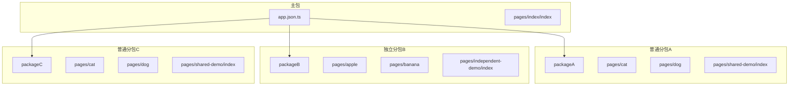
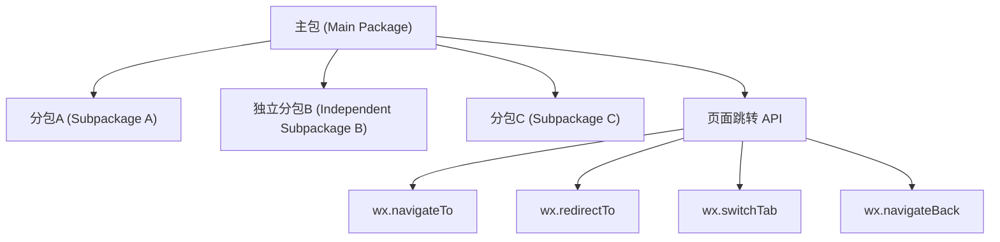
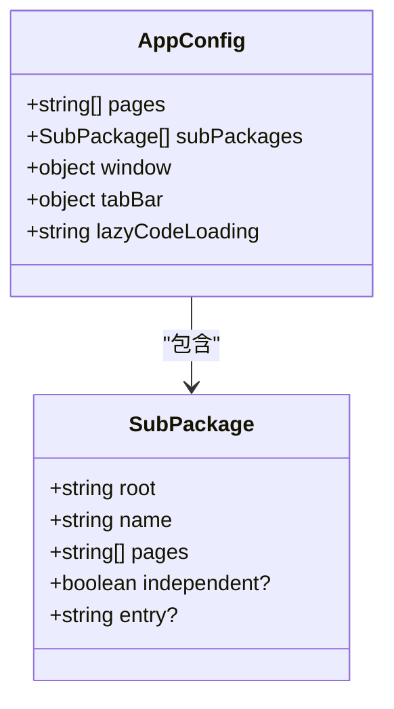
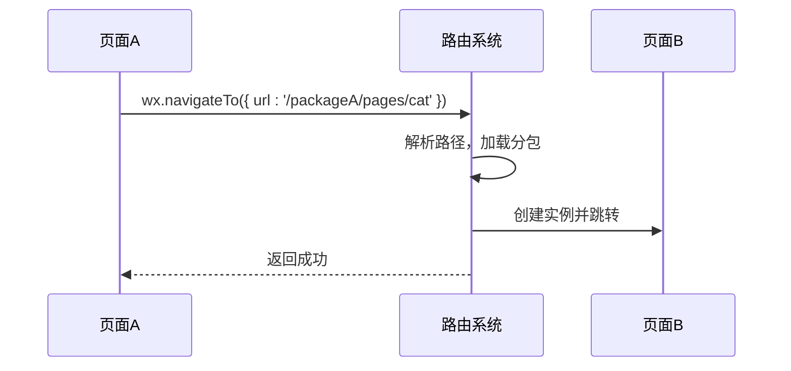
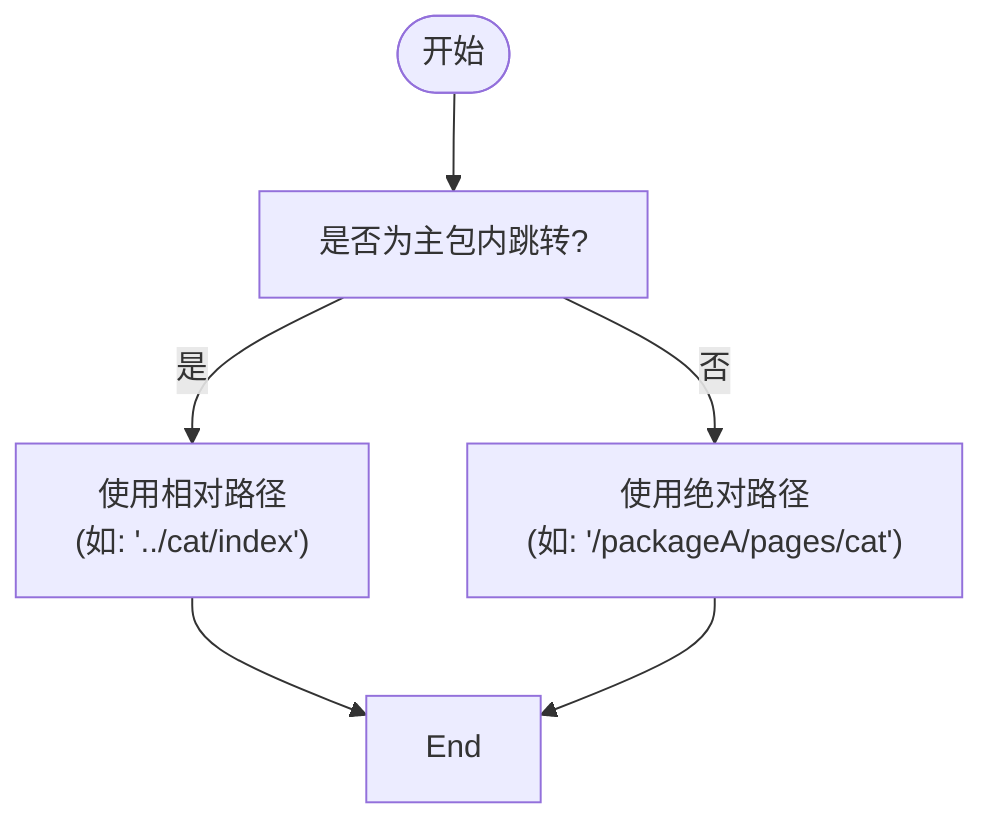
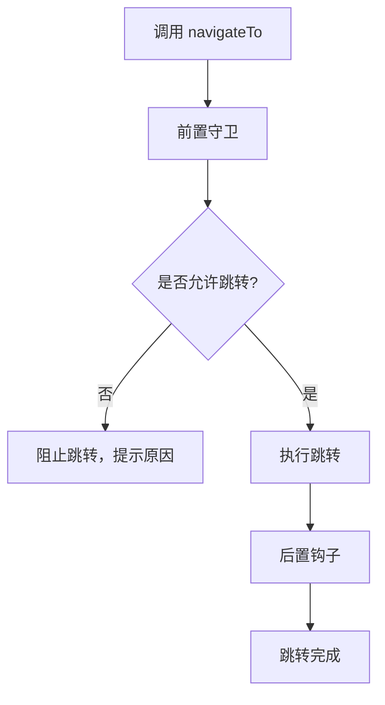
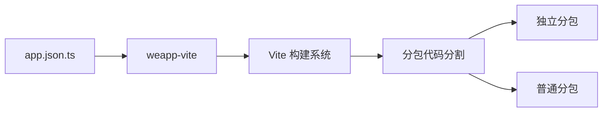

# 路由配置策略

<cite>
**本文档中引用的文件**  
- [app.json.ts](file://apps/vite-native/app.json.ts)
- [app.json](file://apps/wevu-runtime-demo/src/app.json)
- [index.json](file://@weapp-core/init/templates/default/src/pages/index/index.json)
- [index.json](file://apps/vite-native/packageA/pages/shared-demo/index.json)
- [index.json](file://apps/vite-native/packageB/pages/independent-demo/index.json)
- [index.json](file://apps/vite-native/packageC/pages/shared-demo/index.json)
- [polyfill.ts](file://packages/web/src/runtime/polyfill.ts)
- [index.js](file://apps/tdesign-miniprogram-starter-retail/custom-tab-bar/index.js)
</cite>

## 目录
1. [简介](#简介)
2. [项目结构](#项目结构)
3. [核心组件](#核心组件)
4. [架构概述](#架构概述)
5. [详细组件分析](#详细组件分析)
6. [依赖分析](#依赖分析)
7. [性能考虑](#性能考虑)
8. [故障排除指南](#故障排除指南)
9. [结论](#结论)

## 简介
本文档旨在提供微信小程序中独立分包路由配置的最佳实践，确保主包与分包之间页面跳转的顺畅性。通过分析实际项目中的配置文件和代码实现，详细说明如何配置分包内的页面路由、使用相对路径和绝对路径进行页面跳转、实现路由懒加载以优化性能，以及如何通过路由守卫保障页面访问的安全性。

## 项目结构
本项目采用模块化设计，支持主包与多个分包（包括普通分包和独立分包）的协同工作。分包通过 `subPackages` 字段在主应用配置中声明，每个分包拥有独立的根目录和页面集合。

**图示来源**
- [app.json.ts](file://apps/vite-native/app.json.ts#L22-L57)

**本节来源**
- [app.json.ts](file://apps/vite-native/app.json.ts#L1-L105)

## 核心组件
核心路由功能由主应用配置文件 `app.json.ts` 驱动，其中定义了所有页面路径、分包结构、窗口样式、底部导航栏及懒加载策略。页面级别的配置文件如 `index.json` 则用于设置特定页面的标题和自定义组件引用。

**本节来源**
- [app.json.ts](file://apps/vite-native/app.json.ts#L1-L105)
- [index.json](file://@weapp-core/init/templates/default/src/pages/index/index.json#L1-L8)

## 架构概述
系统采用分层架构，主包负责全局配置和导航控制，各分包独立管理自身页面逻辑。通过 `subPackages` 配置实现代码分割，提升加载效率。独立分包通过 `independent: true` 标记，实现完全独立的运行时上下文。

**图示来源**
- [app.json.ts](file://apps/vite-native/app.json.ts#L22-L57)
- [polyfill.ts](file://packages/web/src/runtime/polyfill.ts#L437-L470)

## 详细组件分析

### 分包路由配置分析
分包通过 `subPackages` 数组配置，每个分包包含 `root`（根路径）、`name`（名称）、`pages`（页面列表）和可选的 `independent` 标志。

#### 分包配置示例

**图示来源**
- [app.json.ts](file://apps/vite-native/app.json.ts#L22-L57)

#### 页面跳转流程

**图示来源**
- [polyfill.ts](file://packages/web/src/runtime/polyfill.ts#L437-L470)

#### 路径使用场景分析

**图示来源**
- [app.json.ts](file://apps/vite-native/app.json.ts#L5-L10)
- [polyfill.ts](file://packages/web/src/runtime/polyfill.ts#L441-L442)

### 路由懒加载机制
通过配置 `"lazyCodeLoading": "requiredComponents"`，小程序仅在需要时加载必要的组件代码，显著减少初始加载时间。

**图示来源**
- [app.json](file://apps/wevu-runtime-demo/src/app.json#L30)
- [app.json.ts](file://apps/vite-native/app.json.ts#L60)

### 路由守卫实现方法
虽然微信小程序原生不支持路由守卫，但可通过封装导航 API 实现类似功能。

**图示来源**
- [polyfill.ts](file://packages/web/src/runtime/polyfill.ts#L437-L470)

**本节来源**
- [app.json.ts](file://apps/vite-native/app.json.ts#L1-L105)
- [polyfill.ts](file://packages/web/src/runtime/polyfill.ts#L437-L481)

## 依赖分析
项目依赖 `weapp-vite` 工具链实现分包构建与路由解析，通过 TypeScript 配置文件提供类型安全的路由定义。分包间可通过共享模块实现代码复用。

**图示来源**
- [app.json.ts](file://apps/vite-native/app.json.ts#L1-L3)
- [package.json](file://apps/vite-native/package.json#L74)

**本节来源**
- [app.json.ts](file://apps/vite-native/app.json.ts#L1-L105)
- [package.json](file://apps/vite-native/package.json#L1-L77)

## 性能考虑
- **分包大小控制**：每个分包不超过 2MB
- **独立分包优化**：独立分包不依赖主包，可单独下载运行
- **懒加载策略**：启用 `requiredComponents` 懒加载，减少初始包体积
- **预加载机制**：对高频访问页面实施预加载

## 故障排除指南
- **分包无法访问**：检查 `subPackages` 配置路径是否正确
- **独立分包失效**：确认 `independent: true` 已设置且分包路径独立
- **页面跳转失败**：验证目标页面路径是否存在且已注册
- **懒加载未生效**：检查 `lazyCodeLoading` 配置项

**本节来源**
- [app.json.ts](file://apps/vite-native/app.json.ts#L60)
- [app.json](file://apps/wevu-runtime-demo/src/app.json#L30)

## 结论
通过合理配置 `app.json` 中的 `subPackages` 字段，结合绝对路径跳转和懒加载机制，可实现高效、灵活的分包路由系统。独立分包的使用进一步提升了大型小程序的性能和可维护性。建议在实际开发中遵循本文档的最佳实践，确保路由系统的稳定性和可扩展性。