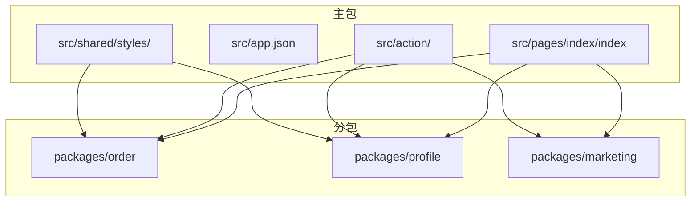
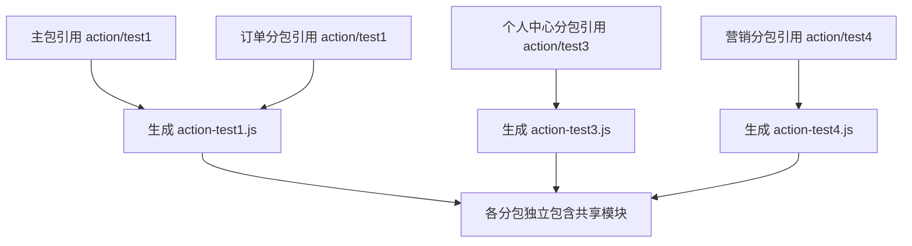
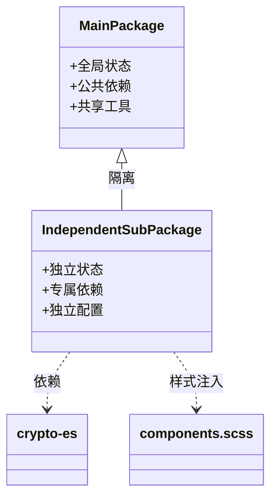
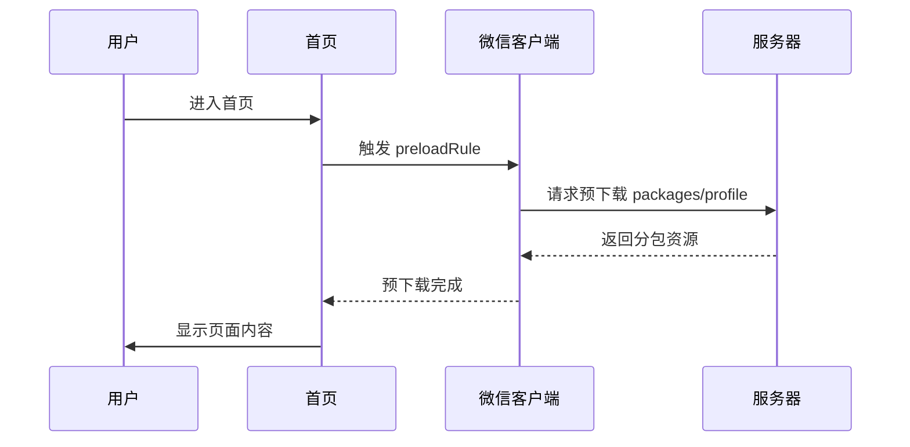
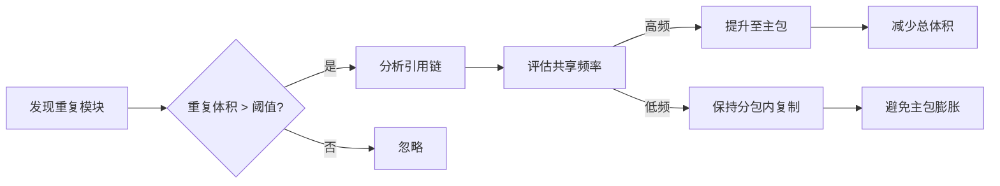

# 高级分包策略

<cite>
**本文档引用文件**  
- [vite.config.ts](file://apps/subpackage-shared-chunks/vite.config.ts)
- [app.json](file://apps/subpackage-shared-chunks/src/app.json)
- [index.ts](file://apps/subpackage-shared-chunks/src/action/index.ts)
- [test1.ts](file://apps/subpackage-shared-chunks/src/action/test1.ts)
- [test2.ts](file://apps/subpackage-shared-chunks/src/action/test2.ts)
- [test3.ts](file://apps/subpackage-shared-chunks/src/action/test3.ts)
- [test4.ts](file://apps/subpackage-shared-chunks/src/action/test4.ts)
- [components.scss](file://apps/subpackage-shared-chunks/src/shared/styles/components.scss)
- [docs/subpackages.md](file://docs/subpackages.md)
- [packages/weapp-vite/src/plugins/core.ts](file://packages/weapp-vite/src/plugins/core.ts)
- [packages/weapp-vite/src/runtime/buildPlugin.ts](file://packages/weapp-vite/src/runtime/buildPlugin.ts)
</cite>

## 目录

1. [引言](#引言)
2. [项目结构与分包布局](#项目结构与分包布局)
3. [核心分包特性详解](#核心分包特性详解)
4. [共享代码块机制](#共享代码块机制)
5. [独立分包配置](#独立分包配置)
6. [预下载分包策略](#预下载分包策略)
7. [分包预加载机制](#分包预加载机制)
8. [分包依赖分析与优化](#分包依赖分析与优化)
9. [总结](#总结)

## 引言

在现代微信小程序开发中，随着业务复杂度的提升，合理使用分包技术已成为优化首屏加载速度、控制包体积和提升用户体验的关键手段。本文档基于 `weapp-vite` 构建工具，深入探讨高级分包策略，包括独立分包、预下载分包、分包预加载以及跨分包共享代码块等核心机制。

通过分析 `apps/subpackage-shared-chunks` 示例项目，我们将详细说明如何通过配置实现模块化、隔离性和性能优化，帮助开发者构建可维护、高性能的小程序架构。

## 项目结构与分包布局

本示例项目的分包结构清晰地体现了以业务边界划分的设计理念。主要分包位于 `src/packages/` 目录下，包含三个独立功能模块：

- `packages/order`：订单中心，配置为独立分包
- `packages/profile`：个人中心，常规分包
- `packages/marketing`：营销活动，常规分包

此外，`src/shared/` 目录用于存放跨分包共享的样式资源，而 `src/action/` 则包含多个可被不同分包引用的工具函数模块。



**Diagram sources**
- [app.json](file://apps/subpackage-shared-chunks/src/app.json#L6-L23)
- [vite.config.ts](file://apps/subpackage-shared-chunks/vite.config.ts#L32-L59)

**Section sources**
- [app.json](file://apps/subpackage-shared-chunks/src/app.json#L1-L40)
- [vite.config.ts](file://apps/subpackage-shared-chunks/vite.config.ts#L1-L83)

## 核心分包特性详解

`weapp-vite` 提供了丰富的分包配置能力，允许开发者在 `vite.config.ts` 中通过 `weapp.subPackages` 字段对每个分包进行精细化控制。这些特性包括：

- **独立分包支持**：通过 `independent: true` 实现运行时隔离
- **依赖裁剪**：精确控制分包所需的 npm 依赖
- **样式共享注入**：将公共样式按需注入到指定分包
- **自动组件导入**：为分包单独配置组件自动导入规则
- **构建策略定制**：为特定分包覆盖全局构建配置

这些能力使得分包不仅是一个物理拆分单元，更成为一个逻辑独立、可独立演进的业务模块。

**Section sources**
- [vite.config.ts](file://apps/subpackage-shared-chunks/vite.config.ts#L32-L59)
- [docs/subpackages.md](file://docs/subpackages.md#L11-L15)

## 共享代码块机制

### 共享代码组织

在 `apps/subpackage-shared-chunks` 项目中，`src/action/` 目录下的多个 `.ts` 文件构成了共享代码库：

- `test1.ts`：引入外部依赖 `crypto-es` 并导出函数
- `test2.ts`：依赖 `test1.ts`，形成依赖链
- `test3.ts` 和 `test4.ts`：包含独立的工具函数

这些模块通过 `index.ts` 统一导出，便于其他模块批量引用。

### 共享策略配置

`vite.config.ts` 中通过 `chunks.sharedStrategy` 配置共享策略：

```ts
chunks: {
  sharedStrategy: 'duplicate',
  duplicateWarningBytes: 256 * 1024,
}
```

当 `sharedStrategy` 设置为 `'duplicate'` 时，构建系统会将被多个分包引用的模块分别打包到各个分包中，避免主包体积膨胀。同时，通过 `duplicateWarningBytes` 设置警告阈值（256KB），提醒开发者关注重复代码带来的体积问题。



**Diagram sources**
- [test1.ts](file://apps/subpackage-shared-chunks/src/action/test1.ts#L1-L6)
- [test2.ts](file://apps/subpackage-shared-chunks/src/action/test2.ts#L1-L7)
- [vite.config.ts](file://apps/subpackage-shared-chunks/vite.config.ts#L60-L63)

**Section sources**
- [index.ts](file://apps/subpackage-shared-chunks/src/action/index.ts#L1-L2)
- [test1.ts](file://apps/subpackage-shared-chunks/src/action/test1.ts#L1-L6)
- [test2.ts](file://apps/subpackage-shared-chunks/src/action/test2.ts#L1-L7)
- [test3.ts](file://apps/subpackage-shared-chunks/src/action/test3.ts#L1-L8)
- [test4.ts](file://apps/subpackage-shared-chunks/src/action/test4.ts#L1-L8)
- [vite.config.ts](file://apps/subpackage-shared-chunks/vite.config.ts#L60-L63)

## 独立分包配置

### 独立分包定义

在 `app.json` 中，`packages/order` 被标记为独立分包：

```json
{
  "root": "packages/order",
  "independent": true
}
```

同时在 `vite.config.ts` 中进行增强配置：

```ts
subPackages: {
  'packages/order': {
    independent: true,
    dependencies: ['crypto-es'],
    styles: [
      'styles/theme.scss',
      {
        source: '../shared/styles/components.scss',
        scope: 'components',
        include: ['components/**']
      }
    ]
  }
}
```

### 独立性与隔离性

独立分包拥有以下特性：

1. **独立运行时上下文**：无法直接访问主包的全局变量和状态
2. **独立依赖管理**：必须显式声明所需 npm 依赖（如 `crypto-es`）
3. **独立构建流程**：构建系统会为独立分包创建单独的构建任务
4. **独立样式作用域**：可通过配置将共享样式按需注入



**Diagram sources**
- [app.json](file://apps/subpackage-shared-chunks/src/app.json#L8-L12)
- [vite.config.ts](file://apps/subpackage-shared-chunks/vite.config.ts#L33-L48)
- [packages/weapp-vite/src/runtime/buildPlugin.ts#L59-L105](file://packages/weapp-vite/src/runtime/buildPlugin.ts#L59-L105)

**Section sources**
- [app.json](file://apps/subpackage-shared-chunks/src/app.json#L8-L12)
- [vite.config.ts](file://apps/subpackage-shared-chunks/vite.config.ts#L33-L48)
- [packages/weapp-vite/src/runtime/buildPlugin.ts](file://packages/weapp-vite/src/runtime/buildPlugin.ts#L59-L105)

## 预下载分包策略

### 预下载配置

在 `app.json` 中通过 `preloadRule` 配置预下载规则：

```json
"preloadRule": {
  "pages/index/index": {
    "packages": ["packages/profile"],
    "network": "all",
    "timeout": 2000
  }
}
```

该配置表示：当用户进入首页 `pages/index/index` 时，立即预下载 `packages/profile` 分包，无论网络类型（Wi-Fi/4G），超时时间为 2 秒。

### 运行时预加载

除了静态配置，还可以在页面生命周期中动态触发预加载：

```ts
onLoad() {
  wx.preloadSubpackage({
    name: 'packages/profile',
    success() {
      console.log('[index] preload profile success')
    }
  })
}
```

这种动态方式允许开发者根据用户行为、设备性能或网络状况进行更精细化的控制。



**Diagram sources**
- [app.json](file://apps/subpackage-shared-chunks/src/app.json#L24-L30)
- [index.ts](file://apps/subpackage-shared-chunks/src/pages/index/index.ts#L25-L36)

**Section sources**
- [app.json](file://apps/subpackage-shared-chunks/src/app.json#L24-L30)
- [index.ts](file://apps/subpackage-shared-chunks/src/pages/index/index.ts#L25-L36)

## 分包预加载机制

### 预加载触发条件

分包预加载可通过以下方式触发：

1. **页面加载时**：在 `onLoad` 或 `onShow` 中调用 `wx.preloadSubpackage`
2. **用户交互前**：在用户可能跳转前预先加载目标分包
3. **网络状态良好时**：检测到 Wi-Fi 网络时批量预加载

### 配置选项

`wx.preloadSubpackage` 支持以下参数：

- `name`：分包名称（对应 `app.json` 中的 `root`）
- `network`：网络类型限制（`all`、`wifi`）
- `success`：成功回调
- `fail`：失败回调
- `complete`：完成回调

### 性能优化建议

- **关键路径优先**：对用户转化漏斗中的关键页面进行预加载
- **按需加载**：避免一次性预加载过多分包导致主线程阻塞
- **错误处理**：为预加载添加失败回调，确保降级体验
- **条件判断**：根据设备性能、内存状况动态调整预加载策略

**Section sources**
- [index.ts](file://apps/subpackage-shared-chunks/src/pages/index/index.ts#L25-L36)
- [docs/subpackages.md](file://docs/subpackages.md#L125-L129)

## 分包依赖分析与优化

### 依赖分析工具

`weapp-vite` 提供了内置的分析工具，可通过以下命令生成分包报告：

```bash
pnpm run analyze
```

该工具能可视化展示各分包的依赖关系、共享模块和体积分布，帮助定位冗余代码。

### 避免循环依赖

为避免分包间的循环依赖，建议：

1. **单向依赖原则**：确保依赖关系为有向无环图（DAG）
2. **公共模块上提**：将被多方引用的模块移至主包或共享目录
3. **接口抽象**：通过定义接口而非直接引用具体实现来解耦

### 冗余代码优化

当构建日志出现以下警告时：

```
[subpackages] 分包复制共享模块产生冗余体积 X，已超过阈值 Y
```

应采取以下措施：

1. **调整共享策略**：考虑将高频共享模块提升至主包
2. **重构代码结构**：减少跨分包的细粒度引用
3. **使用动态导入**：对非首屏模块使用 `import()` 懒加载



**Diagram sources**
- [packages/weapp-vite/src/plugins/core.ts](file://packages/weapp-vite/src/plugins/core.ts#L452-L454)
- [docs/subpackages.md](file://docs/subpackages.md#L139-L142)

**Section sources**
- [packages/weapp-vite/src/plugins/core.ts](file://packages/weapp-vite/src/plugins/core.ts#L452-L454)
- [docs/subpackages.md](file://docs/subpackages.md#L137-L142)

## 总结

本文档详细阐述了基于 `weapp-vite` 的高级分包策略，涵盖独立分包、预下载、预加载和共享代码块等核心机制。通过合理配置 `app.json` 和 `vite.config.ts`，开发者可以实现：

- **业务模块完全隔离**：通过独立分包确保高敏业务的安全性和独立性
- **用户体验优化**：利用预下载和预加载技术缩短关键路径等待时间
- **代码高效复用**：通过共享代码块机制避免重复开发和体积膨胀
- **构建精细控制**：借助依赖分析工具持续优化包体结构

建议在实际项目中结合 `weapp-vite analyze` 工具定期审查分包结构，确保架构的可持续演进。合理的分包策略不仅能提升性能，更能促进团队协作和模块化开发。