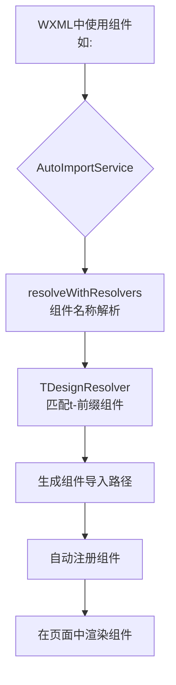
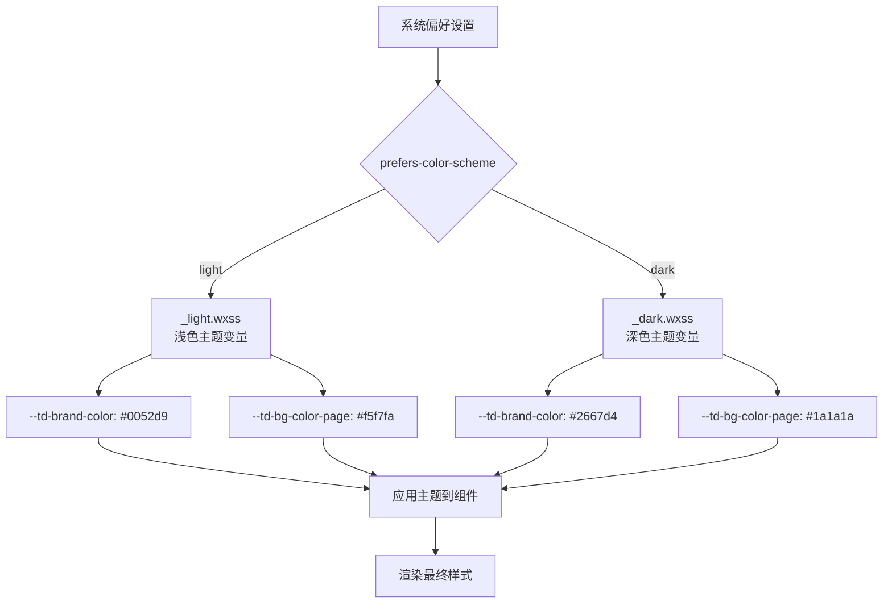
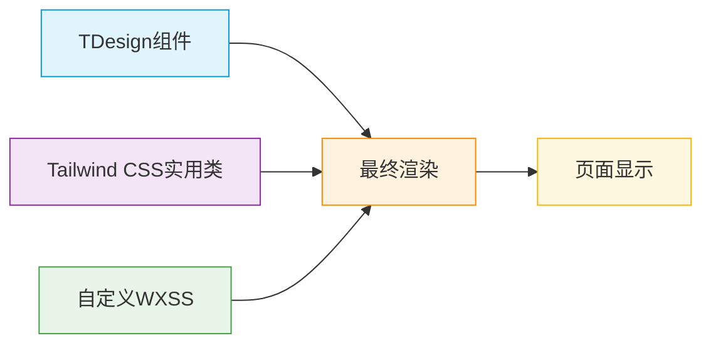
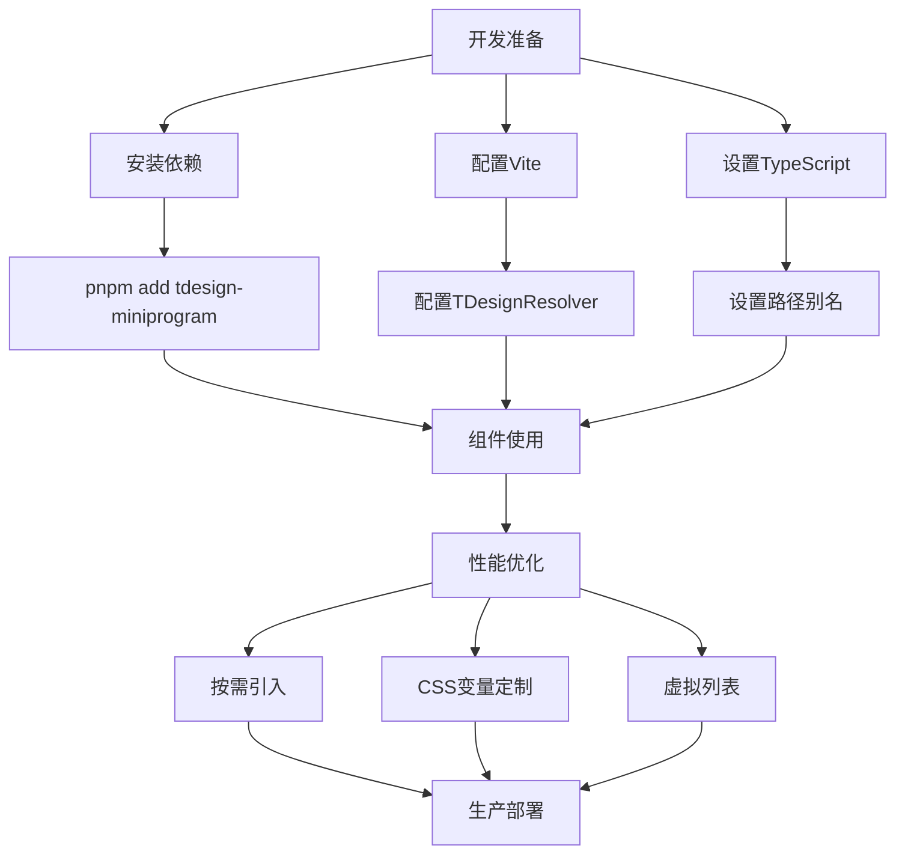
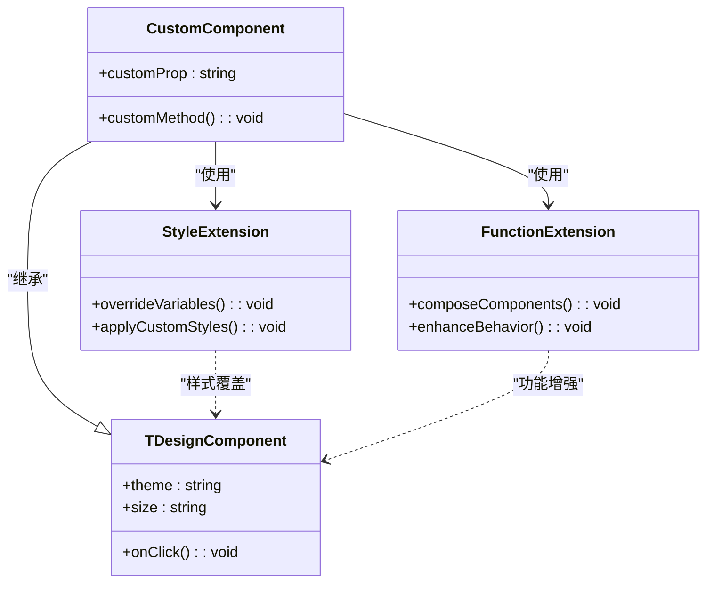

# TDesign模板

<cite>
**本文档引用的文件**
- [vite.config.ts](file://templates/weapp-vite-tailwindcss-tdesign-template/vite.config.ts)
- [package.json](file://templates/weapp-vite-tailwindcss-tdesign-template/package.json)
- [tdesign.md](file://website/integration/tdesign.md)
- [tdesign.ts](file://packages/weapp-vite/src/auto-import-components/resolvers/tdesign.ts)
- [tdesign.json](file://packages/weapp-vite/src/auto-import-components/resolvers/json/tdesign.json)
- [autoImportService.ts](file://packages/weapp-vite/src/runtime/autoImport/service.ts)
- [config.ts](file://packages/weapp-vite/src/runtime/autoImport/config.ts)
- [_index.wxss](file://packages/weapp-vite/test/fixtures/mixjs/miniprogram_npm/tdesign-miniprogram/common/style/theme/_index.wxss)
- [_light.wxss](file://packages/weapp-vite/test/fixtures/mixjs/miniprogram_npm/tdesign-miniprogram/common/style/theme/_light.wxss)
- [_dark.wxss](file://packages/weapp-vite/test/fixtures/mixjs/miniprogram_npm/tdesign-miniprogram/common/style/theme/_dark.wxss)
</cite>

## 目录
1. [TDesign模板概述](#tdesign模板概述)
2. [TDesign组件自动注册与按需引入机制](#tdesign组件自动注册与按需引入机制)
3. [auto-import-components.json配置解析](#auto-import-componentsjson配置解析)
4. [TDesign主题定制与样式覆盖](#tdesign主题定制与样式覆盖)
5. [TDesign与Tailwind CSS协同工作模式](#tdesign与tailwind-css协同工作模式)
6. [Vite环境下TDesign组件最佳实践](#vite环境下tdesign组件最佳实践)
7. [TDesign组件扩展与自定义](#tdesign组件扩展与自定义)

## TDesign模板概述

weapp-vite项目中的TDesign模板提供了一个完整的微信小程序开发环境，集成了TDesign组件库、Tailwind CSS和Vite构建工具。该模板通过`weapp-vite-tailwindcss-tdesign-template`目录实现，为开发者提供了现代化的开发体验。模板的核心特性包括TDesign组件的自动导入、Tailwind CSS的实用类样式系统以及灵活的主题定制能力。

**本节来源**
- [package.json](file://templates/weapp-vite-tailwindcss-tdesign-template/package.json#L1-L42)

## TDesign组件自动注册与按需引入机制

TDesign模板通过weapp-vite的自动导入功能实现了组件的自动注册和按需引入。该机制的核心是`TDesignResolver`解析器，它在Vite配置中被注册，能够自动识别并注册TDesign组件。

在`vite.config.ts`文件中，通过`autoImportComponents`配置项启用了自动导入功能，并将`TDesignResolver()`作为解析器添加到`resolvers`数组中。当开发者在WXML文件中使用以"t-"前缀开头的组件标签时，系统会自动解析并注册相应的TDesign组件，无需手动在JSON配置文件中声明。

这种机制基于weapp-vite的运行时服务`AutoImportService`，该服务通过`createAutoImportService`函数创建，并维护一个组件注册表。服务会收集所有解析器提供的组件映射，并根据组件名称进行解析和注册。



**图表来源**
- [vite.config.ts](file://templates/weapp-vite-tailwindcss-tdesign-template/vite.config.ts#L1-L42)
- [tdesign.ts](file://packages/weapp-vite/src/auto-import-components/resolvers/tdesign.ts)
- [autoImportService.ts](file://packages/weapp-vite/src/runtime/autoImport/service.ts#L59-L612)

**本节来源**
- [vite.config.ts](file://templates/weapp-vite-tailwindcss-tdesign-template/vite.config.ts#L1-L42)
- [tdesign.md](file://website/integration/tdesign.md#L61-L84)

## auto-import-components.json配置解析

`auto-import-components.json`文件是TDesign组件自动导入机制的核心配置文件，它定义了组件名称与导入路径之间的映射关系。该文件由`TDesignResolver`解析器生成，包含了所有可用的TDesign组件及其对应的模块路径。

在weapp-vite系统中，`TDesignResolver`会读取预定义的组件映射数据（存储在`tdesign.json`文件中），这些数据包含了TDesign组件库中所有组件的名称和导入路径。当Vite构建过程启动时，解析器会根据这些映射数据生成`auto-import-components.json`文件。

`TDesignResolver`的实现逻辑包括：
1. 定义组件前缀匹配规则（以"t-"开头）
2. 从`tdesign.json`中获取所有组件的映射关系
3. 根据组件名称动态生成导入路径
4. 将映射关系写入`auto-import-components.json`文件

这种配置方式实现了真正的按需引入，只有在模板中实际使用的组件才会被引入和打包，有效减少了最终包的体积。

```mermaid
classDiagram
class TDesignResolver {
+prefix : string
+componentMap : Map[string, string]
+constructor(options : ResolverOptions)
+resolve(componentName : string) : ResolveResult
}
class AutoImportService {
+registry : ComponentRegistry
+manifestCache : Map[string, string]
+collectResolverComponents() : Record[string, string]
+resolveWithResolvers(name : string) : ResolverMatch
+writeManifest() : Promise<void>
}
class ComponentManifest {
+componentName : string
+importPath : string
+writeToFile(path : string) : void
+readFromFile(path : string) : ManifestData
}
TDesignResolver --> AutoImportService : "提供组件映射"
AutoImportService --> ComponentManifest : "生成和写入"
ComponentManifest ..> "auto-import-components.json" : "文件输出"
```

**图表来源**
- [tdesign.ts](file://packages/weapp-vite/src/auto-import-components/resolvers/tdesign.ts)
- [tdesign.json](file://packages/weapp-vite/src/auto-import-components/resolvers/json/tdesign.json)
- [autoImportService.ts](file://packages/weapp-vite/src/runtime/autoImport/service.ts#L77-L95)

**本节来源**
- [tdesign.ts](file://packages/weapp-vite/src/auto-import-components/resolvers/tdesign.ts)
- [tdesign.json](file://packages/weapp-vite/src/auto-import-components/resolvers/json/tdesign.json)

## TDesign主题定制与样式覆盖

TDesign模板提供了强大的主题定制能力，通过CSS变量和媒体查询实现了深色模式和浅色模式的自动切换。主题样式主要定义在TDesign组件库的WXSS文件中，通过`--td-*`前缀的CSS变量来控制各种视觉属性。

主题系统的核心文件包括：
- `_index.wxss`: 基础主题变量定义
- `_light.wxss`: 浅色模式主题变量
- `_dark.wxss`: 深色模式主题变量

这些文件使用`@media (prefers-color-scheme: light/dark)`媒体查询来检测用户的系统偏好，并相应地应用不同的主题变量。例如，在浅色模式下，`--td-brand-color`被设置为蓝色调，而在深色模式下则调整为更适合暗背景的颜色。

样式覆盖机制允许开发者通过在项目样式文件中重新定义CSS变量来定制组件外观。由于CSS变量的层叠特性，项目中定义的变量值会覆盖TDesign组件库中的默认值，从而实现个性化的主题设计。



**图表来源**
- [_index.wxss](file://packages/weapp-vite/test/fixtures/mixjs/miniprogram_npm/tdesign-miniprogram/common/style/theme/_index.wxss#L1-L260)
- [_light.wxss](file://packages/weapp-vite/test/fixtures/mixjs/miniprogram_npm/tdesign-miniprogram/common/style/theme/_light.wxss#L1-L121)
- [_dark.wxss](file://packages/weapp-vite/test/fixtures/mixjs/miniprogram_npm/tdesign-miniprogram/common/style/theme/_dark.wxss#L1-L121)

**本节来源**
- [_index.wxss](file://packages/weapp-vite/test/fixtures/mixjs/miniprogram_npm/tdesign-miniprogram/common/style/theme/_index.wxss#L1-L260)
- [_light.wxss](file://packages/weapp-vite/test/fixtures/mixjs/miniprogram_npm/tdesign-miniprogram/common/style/theme/_light.wxss#L1-L121)
- [_dark.wxss](file://packages/weapp-vite/test/fixtures/mixjs/miniprogram_npm/tdesign-miniprogram/common/style/theme/_dark.wxss#L1-L121)

## TDesign与Tailwind CSS协同工作模式

TDesign模板实现了TDesign组件与Tailwind CSS的无缝集成，两者在样式处理上形成了互补关系。TDesign负责提供功能完整的UI组件，而Tailwind CSS则提供灵活的实用类样式系统，用于页面布局和自定义样式。

协同工作模式的关键在于样式优先级的处理。Tailwind CSS的实用类具有较高的特异性，可以覆盖TDesign组件的默认样式。例如，开发者可以在TDesign按钮组件上使用Tailwind的`bg-red-500`类来改变背景颜色，而不会影响按钮的其他功能特性。

在`vite.config.ts`中，通过`UnifiedViteWeappTailwindcssPlugin`插件实现了Tailwind CSS的集成，并配置了`rem2rpx: true`选项，确保了设计稿中的rem单位能够正确转换为小程序的rpx单位。

这种协同模式的优势包括：
1. **组件功能完整性**：TDesign提供经过充分测试的UI组件
2. **样式灵活性**：Tailwind CSS提供原子化的实用类，便于快速调整样式
3. **开发效率**：无需编写自定义CSS，通过类名组合即可实现复杂样式
4. **响应式支持**：Tailwind CSS内置的响应式断点与小程序多端适配完美结合



**图表来源**
- [vite.config.ts](file://templates/weapp-vite-tailwindcss-tdesign-template/vite.config.ts#L36-L40)
- [tdesign.md](file://website/integration/tdesign.md)
- [index.wxml](file://apps/vite-native/pages/features/ui/index.wxml#L1-L33)

**本节来源**
- [vite.config.ts](file://templates/weapp-vite-tailwindcss-tdesign-template/vite.config.ts#L36-L40)
- [index.wxml](file://apps/vite-native/pages/features/ui/index.wxml#L1-L33)

## Vite环境下TDesign组件最佳实践

在Vite环境下使用TDesign组件时，应遵循以下最佳实践以确保最佳的开发体验和性能表现：

### 组件使用方式
推荐使用自动导入机制，直接在WXML文件中使用TDesign组件，无需在JSON文件中手动声明。例如：
```xml
<t-button theme="primary" size="large">主要按钮</t-button>
<t-card title="卡片标题">卡片内容</t-card>
```

### 性能优化建议
1. **按需引入**：利用自动导入机制，确保只有使用的组件被打包
2. **合理使用CSS变量**：通过覆盖CSS变量而非重写样式来定制主题
3. **避免过度嵌套**：减少组件的嵌套层级以提高渲染性能
4. **使用虚拟列表**：对于长列表场景，使用TDesign的虚拟列表组件

### 开发调试技巧
1. **启用类型检查**：配置TypeScript以获得组件属性的智能提示
2. **使用开发者工具**：利用微信开发者工具的调试功能检查组件状态
3. **监控包大小**：定期检查构建产物大小，优化不必要的依赖



**图表来源**
- [vite.config.ts](file://templates/weapp-vite-tailwindcss-tdesign-template/vite.config.ts)
- [package.json](file://templates/weapp-vite-tailwindcss-tdesign-template/package.json)
- [tdesign.md](file://website/integration/tdesign.md)

**本节来源**
- [tdesign.md](file://website/integration/tdesign.md)
- [vite.config.ts](file://templates/weapp-vite-tailwindcss-tdesign-template/vite.config.ts)

## TDesign组件扩展与自定义

TDesign模板支持对组件进行扩展和自定义，以满足特定的设计需求。扩展方式主要包括：

### 样式扩展
通过CSS变量覆盖机制，可以轻松定制组件的视觉样式。在项目样式文件中重新定义TDesign的CSS变量即可：
```css
/* 自定义主题变量 */
page {
    --td-brand-color: #ff6b35;
    --td-bg-color-page: #f8f9fa;
    --td-text-color-primary: #212529;
}
```

### 功能扩展
可以通过组件组合的方式创建新的复合组件。例如，将TDesign的按钮和弹窗组件组合成一个确认对话框组件。

### 自定义解析器
对于特殊的组件引入需求，可以创建自定义的解析器。解析器需要实现特定的接口，定义组件名称的匹配规则和导入路径的生成逻辑。



**图表来源**
- [tdesign.ts](file://packages/weapp-vite/src/auto-import-components/resolvers/tdesign.ts)
- [autoImportService.ts](file://packages/weapp-vite/src/runtime/autoImport/service.ts)
- [config.ts](file://packages/weapp-vite/src/runtime/autoImport/config.ts)

**本节来源**
- [tdesign.ts](file://packages/weapp-vite/src/auto-import-components/resolvers/tdesign.ts)
- [autoImportService.ts](file://packages/weapp-vite/src/runtime/autoImport/service.ts)
- [config.ts](file://packages/weapp-vite/src/runtime/autoImport/config.ts)