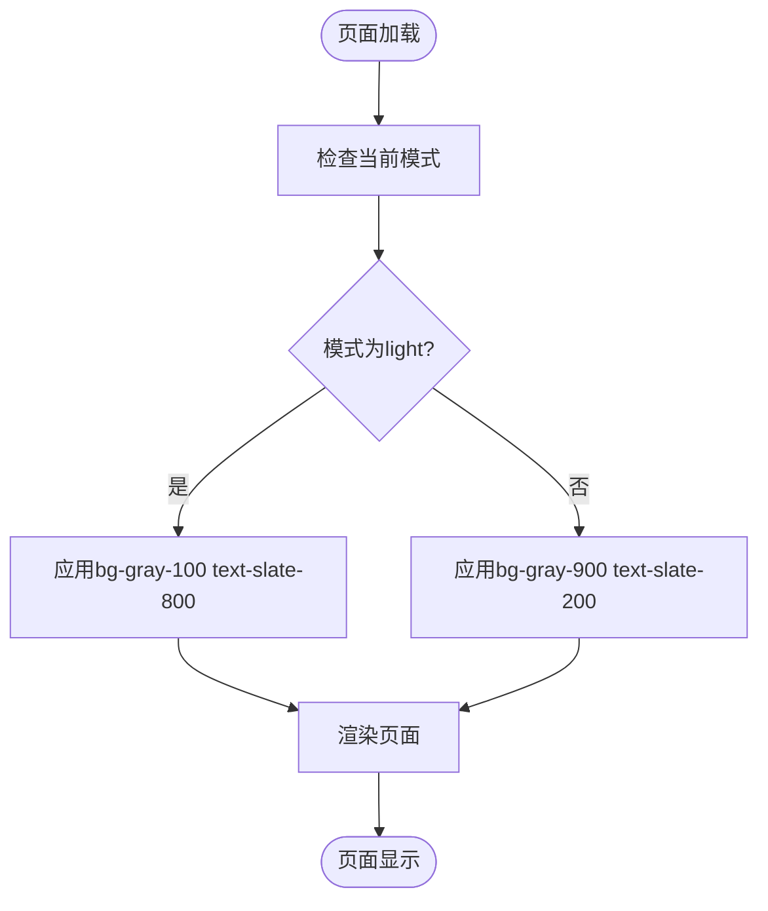

# Tailwind模板

<cite>
**本文档中引用的文件**  
- [tailwind.config.ts](file://templates/weapp-vite-tailwindcss-template/tailwind.config.ts)
- [postcss.config.js](file://templates/weapp-vite-tailwindcss-template/postcss.config.js)
- [vite.config.ts](file://templates/weapp-vite-tailwindcss-template/vite.config.ts)
- [package.json](file://templates/weapp-vite-tailwindcss-template/package.json)
- [index.wxml](file://templates/weapp-vite-tailwindcss-template/src/pages/index/index.wxml)
- [index.ts](file://templates/weapp-vite-tailwindcss-template/src/pages/index/index.ts)
- [tsconfig.json](file://templates/weapp-vite-tailwindcss-template/tsconfig.json)
- [project.config.json](file://templates/weapp-vite-tailwindcss-template/project.config.json)
- [weapp-vite-tailwindcss-tdesign-template/tailwind.config.ts](file://templates/weapp-vite-tailwindcss-tdesign-template/tailwind.config.ts)
- [weapp-vite-tailwindcss-vant-template/tailwind.config.ts](file://templates/weapp-vite-tailwindcss-vant-template/tailwind.config.ts)
- [tailwindcss.md](file://website/integration/tailwindcss.md)
- [tdesign.md](file://website/integration/tdesign.md)
- [vant.md](file://website/integration/vant.md)
</cite>

## 目录
1. [简介](#简介)
2. [项目结构](#项目结构)
3. [核心组件](#核心组件)
4. [架构概述](#架构概述)
5. [详细组件分析](#详细组件分析)
6. [依赖分析](#依赖分析)
7. [性能考虑](#性能考虑)
8. [故障排除指南](#故障排除指南)
9. [结论](#结论)

## 简介
本文档全面解析weapp-vite中基于Tailwind CSS的模板系统。详细解释tailwind.config.ts的配置选项和自定义主题设置，说明postcss.config.js中Tailwind插件的集成方式。分析模板中CSS类名的使用模式和响应式设计实践。对比基础模板，突出Tailwind模板在样式开发效率上的优势。说明Tailwind模板与TDesign、Vant等UI框架的集成方式和共存策略。提供Tailwind模板的性能优化建议，包括类名提取和构建体积控制。展示如何在小程序环境中有效利用Tailwind的实用优先(utility-first)开发模式。

## 项目结构
Tailwind模板项目结构遵循weapp-vite的标准组织方式，将源代码、配置文件和构建输出清晰分离。模板提供了完整的开发环境配置，包括TypeScript支持、SCSS预处理和Tailwind CSS集成。


**Diagram sources**
- [vite.config.ts](file://templates/weapp-vite-tailwindcss-template/vite.config.ts#L4-L37)
- [tailwind.config.ts](file://templates/weapp-vite-tailwindcss-template/tailwind.config.ts#L1-L23)
- [postcss.config.js](file://templates/weapp-vite-tailwindcss-template/postcss.config.js#L1-L7)

**Section sources**
- [vite.config.ts](file://templates/weapp-vite-tailwindcss-template/vite.config.ts#L1-L38)
- [tailwind.config.ts](file://templates/weapp-vite-tailwindcss-template/tailwind.config.ts#L1-L23)
- [postcss.config.js](file://templates/weapp-vite-tailwindcss-template/postcss.config.js#L1-L7)
- [tsconfig.json](file://templates/weapp-vite-tailwindcss-template/tsconfig.json#L1-L12)

## 核心组件
Tailwind模板的核心组件包括Tailwind CSS配置、PostCSS集成、Vite插件配置和UI组件实现。这些组件协同工作，为小程序开发提供高效的样式开发体验。

**Section sources**
- [tailwind.config.ts](file://templates/weapp-vite-tailwindcss-template/tailwind.config.ts#L1-L23)
- [postcss.config.js](file://templates/weapp-vite-tailwindcss-template/postcss.config.js#L1-L7)
- [vite.config.ts](file://templates/weapp-vite-tailwindcss-template/vite.config.ts#L1-L38)
- [package.json](file://templates/weapp-vite-tailwindcss-template/package.json#L1-L39)

## 架构概述
Tailwind模板采用分层架构，将样式处理、构建配置和UI实现分离。Vite作为构建工具，通过UnifiedViteWeappTailwindcssPlugin插件与Tailwind CSS集成，实现高效的样式处理和热更新。


**Diagram sources**
- [vite.config.ts](file://templates/weapp-vite-tailwindcss-template/vite.config.ts#L32-L37)
- [postcss.config.js](file://templates/weapp-vite-tailwindcss-template/postcss.config.js#L1-L7)
- [tailwind.config.ts](file://templates/weapp-vite-tailwindcss-template/tailwind.config.ts#L1-L23)

## 详细组件分析
### Tailwind配置分析
Tailwind配置文件定义了内容扫描范围、主题扩展和插件集成。配置针对小程序环境进行了优化，禁用了不适用的核心插件。

#### 配置选项分析


**Diagram sources**
- [tailwind.config.ts](file://templates/weapp-vite-tailwindcss-template/tailwind.config.ts#L4-L22)

**Section sources**
- [tailwind.config.ts](file://templates/weapp-vite-tailwindcss-template/tailwind.config.ts#L1-L23)

### PostCSS集成分析
PostCSS配置文件定义了Tailwind CSS和autoprefixer插件的使用，确保样式在不同环境中的一致性。

#### 插件集成流程


**Diagram sources**
- [postcss.config.js](file://templates/weapp-vite-tailwindcss-template/postcss.config.js#L1-L7)
- [vite.config.ts](file://templates/weapp-vite-tailwindcss-template/vite.config.ts#L25-L31)

### CSS类名使用模式
Tailwind模板采用实用优先的开发模式，通过组合原子化类名实现复杂的UI设计。

#### 类名使用示例


**Diagram sources**
- [index.wxml](file://templates/weapp-vite-tailwindcss-template/src/pages/index/index.wxml#L1-L25)

### 响应式设计实践
Tailwind模板通过条件类名和响应式前缀实现多设备适配。

#### 响应式实现流程


**Diagram sources**
- [index.wxml](file://templates/weapp-vite-tailwindcss-template/src/pages/index/index.wxml#L1)
- [index.ts](file://templates/weapp-vite-tailwindcss-template/src/pages/index/index.ts#L23-L34)

## 依赖分析
Tailwind模板的依赖关系清晰，核心依赖包括Tailwind CSS、PostCSS、autoprefixer和weapp-tailwindcss插件。

```mermaid
graph TD
A[项目] --> B[tailwindcss]
A --> C[postcss]
A --> D[autoprefixer]
A --> E[weapp-tailwindcss]
A --> F[@egoist/tailwindcss-icons]
A --> G[@iconify-json/mdi]
B --> H[实用类生成]
C --> I[CSS处理]
D --> J[浏览器兼容]
E --> K[小程序集成]
F --> L[图标支持]
G --> M[图标数据]
```

**Diagram sources**
- [package.json](file://templates/weapp-vite-tailwindcss-template/package.json#L27-L36)
- [tailwind.config.ts](file://templates/weapp-vite-tailwindcss-template/tailwind.config.ts#L2-L16)

**Section sources**
- [package.json](file://templates/weapp-vite-tailwindcss-template/package.json#L1-L39)
- [tailwind.config.ts](file://templates/weapp-vite-tailwindcss-template/tailwind.config.ts#L1-L23)

## 性能考虑
Tailwind模板通过类名提取和构建优化控制最终包体积。配置中content选项确保只生成实际使用的类名，避免不必要的样式膨胀。

**Section sources**
- [tailwind.config.ts](file://templates/weapp-vite-tailwindcss-template/tailwind.config.ts#L5-L8)
- [vite.config.ts](file://templates/weapp-vite-tailwindcss-template/vite.config.ts#L33-L35)

## 故障排除指南
### 常见问题
1. **类名未生成**：检查tailwind.config.ts中的content配置是否包含正确的文件路径
2. **样式不生效**：确认postcss.config.js正确配置了tailwindcss插件
3. **HMR失效**：检查vite.config.ts中UnifiedViteWeappTailwindcssPlugin的配置

**Section sources**
- [tailwind.config.ts](file://templates/weapp-vite-tailwindcss-template/tailwind.config.ts#L5-L8)
- [postcss.config.js](file://templates/weapp-vite-tailwindcss-template/postcss.config.js#L1-L7)
- [vite.config.ts](file://templates/weapp-vite-tailwindcss-template/vite.config.ts#L33-L37)

## 结论
Tailwind模板为weapp-vite提供了高效的样式开发解决方案。通过原子化CSS类名、实用优先的开发模式和完整的构建集成，显著提升了小程序样式的开发效率。模板与TDesign、Vant等UI框架的共存策略灵活，既可独立使用Tailwind的实用类，也可与组件库结合使用。配置针对小程序环境进行了优化，禁用了不适用的preflight和container核心插件，确保生成的样式适合小程序运行环境。