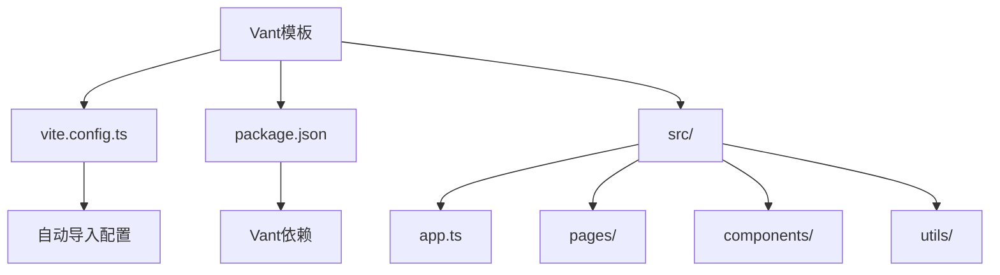
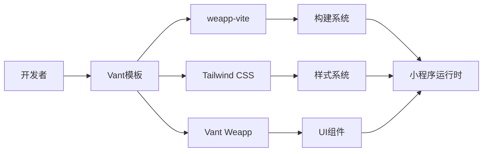
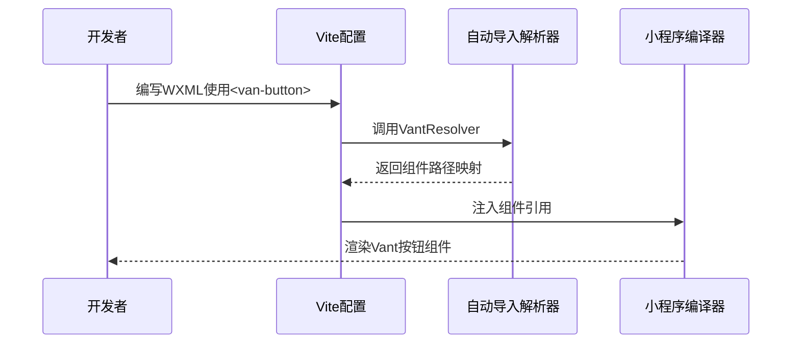

# Vant模板

<cite>
**本文档中引用的文件**   
- [vite.config.ts](file://templates/weapp-vite-tailwindcss-vant-template/vite.config.ts)
- [package.json](file://templates/weapp-vite-tailwindcss-vant-template/package.json)
- [vant.ts](file://packages/weapp-vite/src/auto-import-components/resolvers/vant.ts)
- [vant.json](file://packages/weapp-vite/src/auto-import-components/resolvers/json/vant.json)
- [index.ts](file://templates/weapp-vite-tailwindcss-vant-template/src/pages/index/index.ts)
- [index.wxml](file://templates/weapp-vite-tailwindcss-vant-template/src/pages/index/index.wxml)
- [app.wxss](file://apps/vite-native-skyline/app.wxss)
- [vant.md](file://website/integration/vant.md)
</cite>

## 目录
1. [简介](#简介)
2. [项目结构](#项目结构)
3. [核心组件](#核心组件)
4. [架构概述](#架构概述)
5. [详细组件分析](#详细组件分析)
6. [依赖分析](#依赖分析)
7. [性能考虑](#性能考虑)
8. [故障排除指南](#故障排除指南)
9. [结论](#结论)

## 简介
本文档全面解析weapp-vite中集成Vant组件库的模板。详细说明模板中Vant组件的自动注册机制和按需加载配置，解释如何通过vite-plugin-weapp实现Vant组件的无缝集成。分析模板中Vant样式与原生小程序样式的兼容性处理方案。说明Vant模板的构建优化策略，包括组件树摇(tree-shaking)和体积控制。提供Vant组件在现代化小程序开发环境中的最佳实践，包括常用组件的使用示例和常见问题解决方案。展示如何在保持Vant设计语言一致性的同时进行品牌定制。

## 项目结构
Vant模板是weapp-vite项目中的一个特定模板，位于`templates/weapp-vite-tailwindcss-vant-template/`目录下。该模板集成了Vant Weapp组件库，为开发者提供了一个现代化的小程序开发环境。



**图示来源**
- [vite.config.ts](file://templates/weapp-vite-tailwindcss-vant-template/vite.config.ts)
- [package.json](file://templates/weapp-vite-tailwindcss-vant-template/package.json)

**本节来源**
- [vite.config.ts](file://templates/weapp-vite-tailwindcss-vant-template/vite.config.ts)
- [package.json](file://templates/weapp-vite-tailwindcss-vant-template/package.json)

## 核心组件
Vant模板的核心在于其对Vant Weapp组件库的集成和自动化配置。通过`vite.config.ts`中的配置，实现了组件的自动导入和按需加载，大大简化了开发流程。

**本节来源**
- [vite.config.ts](file://templates/weapp-vite-tailwindcss-vant-template/vite.config.ts)
- [vant.ts](file://packages/weapp-vite/src/auto-import-components/resolvers/vant.ts)

## 架构概述
Vant模板的架构设计旨在提供一个高效、可维护的小程序开发环境。它结合了weapp-vite的构建能力、Tailwind CSS的实用优先样式系统和Vant Weapp的UI组件库。



**图示来源**
- [vite.config.ts](file://templates/weapp-vite-tailwindcss-vant-template/vite.config.ts)
- [tailwind.config.ts](file://templates/weapp-vite-tailwindcss-vant-template/tailwind.config.ts)

## 详细组件分析
### Vant组件自动注册机制
Vant模板通过`weapp-vite`的自动导入功能实现了Vant组件的自动注册。开发者无需手动在每个页面的JSON文件中声明组件，即可直接在WXML中使用Vant组件。



**图示来源**
- [vant.ts](file://packages/weapp-vite/src/auto-import-components/resolvers/vant.ts)
- [vite.config.ts](file://templates/weapp-vite-tailwindcss-vant-template/vite.config.ts)

#### 自动注册实现原理
VantResolver是实现自动注册的核心。它读取`vant.json`文件中定义的所有Vant组件名称，然后为每个组件创建一个从组件标签名到实际模块路径的映射。

```mermaid
classDiagram
class VantResolver {
+defaultPrefix : string
+components : string[]
+resolve(name, prefix) : {key, value}
+createResolver(opts) : Resolver
}
class VantComponent {
+name : string
+path : string
}
VantResolver --> VantComponent : 包含
VantResolver --> "vant.json" : 读取
```

**图示来源**
- [vant.ts](file://packages/weapp-vite/src/auto-import-components/resolvers/vant.ts)
- [vant.json](file://packages/weapp-vite/src/auto-import-components/resolvers/json/vant.json)

**本节来源**
- [vant.ts](file://packages/weapp-vite/src/auto-import-components/resolvers/vant.ts)
- [vant.json](file://packages/weapp-vite/src/auto-import-components/resolvers/json/vant.json)

### 按需加载配置
Vant模板通过智能的按需加载机制，确保只有实际使用的组件才会被打包到最终产物中，有效控制了应用体积。

```mermaid
flowchart TD
A[开发者使用<van-button>] --> B{分析WXML}
B --> C[识别van-button标签]
C --> D[查找VantResolver映射]
D --> E[确定@vant/weapp/button路径]
E --> F[仅打包button组件]
F --> G[生成最终包]
```

**图示来源**
- [vant.ts](file://packages/weapp-vite/src/auto-import-components/resolvers/vant.ts)
- [vite.config.ts](file://templates/weapp-vite-tailwindcss-vant-template/vite.config.ts)

**本节来源**
- [vant.ts](file://packages/weapp-vite/src/auto-import-components/resolvers/vant.ts)
- [vite.config.ts](file://templates/weapp-vite-tailwindcss-vant-template/vite.config.ts)

### 样式兼容性处理
Vant模板通过合理的样式导入策略，解决了Vant组件样式与原生小程序样式的兼容性问题。

```mermaid
graph TD
A[app.wxss] --> B[导入Vant基础样式]
A --> C[导入Tailwind基础样式]
B --> D[@import '@vant/weapp/common/index.css']
C --> E[@tailwind base]
D --> F[Vant样式作用域]
E --> G[Tailwind样式作用域]
F --> H[避免样式冲突]
G --> H
```

**图示来源**
- [app.wxss](file://apps/vite-native-skyline/app.wxss)
- [tailwind.config.ts](file://templates/weapp-vite-tailwindcss-vant-template/tailwind.config.ts)

**本节来源**
- [app.wxss](file://apps/vite-native-skyline/app.wxss)
- [tailwind.config.ts](file://templates/weapp-vite-tailwindcss-vant-template/tailwind.config.ts)

## 依赖分析
Vant模板的依赖关系清晰，主要依赖于weapp-vite核心功能、Vant Weapp组件库和Tailwind CSS样式系统。

```mermaid
graph TD
A[weapp-vite-tailwindcss-vant-template] --> B[@vant/weapp]
A --> C[weapp-vite]
A --> D[weapp-tailwindcss]
A --> E[tailwindcss]
B --> F[Vant Weapp组件]
C --> G[构建和开发服务器]
D --> H[Tailwind集成]
E --> I[实用优先CSS]
```

**图示来源**
- [package.json](file://templates/weapp-vite-tailwindcss-vant-template/package.json)
- [vite.config.ts](file://templates/weapp-vite-tailwindcss-vant-template/vite.config.ts)

**本节来源**
- [package.json](file://templates/weapp-vite-tailwindcss-vant-template/package.json)
- [vite.config.ts](file://templates/weapp-vite-tailwindcss-vant-template/vite.config.ts)

## 性能考虑
Vant模板在性能方面进行了多项优化，确保生成的小程序具有良好的运行效率和较小的包体积。

### 构建优化策略
Vant模板采用了多种构建优化策略，包括树摇和体积控制。


**图示来源**
- [vant.ts](file://packages/weapp-vite/src/auto-import-components/resolvers/vant.ts)
- [vite.config.ts](file://templates/weapp-vite-tailwindcss-vant-template/vite.config.ts)

**本节来源**
- [vant.ts](file://packages/weapp-vite/src/auto-import-components/resolvers/vant.ts)
- [vite.config.ts](file://templates/weapp-vite-tailwindcss-vant-template/vite.config.ts)

## 故障排除指南
### 常见问题及解决方案
在使用Vant模板时，可能会遇到一些常见问题，以下是解决方案。

**本节来源**
- [vant.md](file://website/integration/vant.md)
- [vite.config.ts](file://templates/weapp-vite-tailwindcss-vant-template/vite.config.ts)

## 结论
Vant模板为weapp-vite用户提供了一个强大而灵活的开发环境，通过自动注册、按需加载和样式兼容性处理等机制，极大地提升了开发效率。该模板不仅集成了高质量的Vant Weapp组件库，还结合了Tailwind CSS的现代化样式系统，为构建现代化小程序应用提供了完整的解决方案。