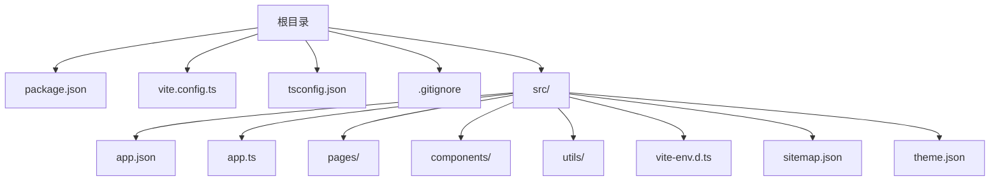
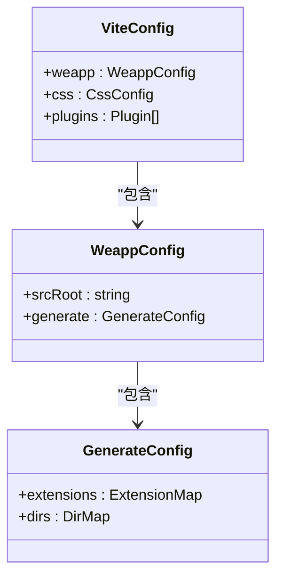
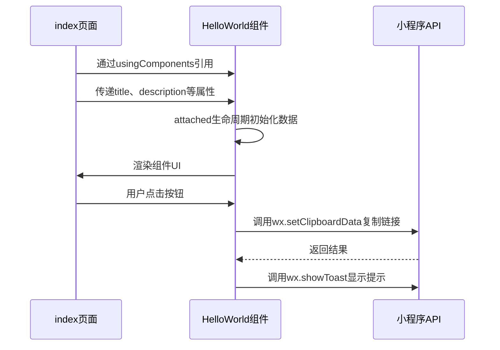
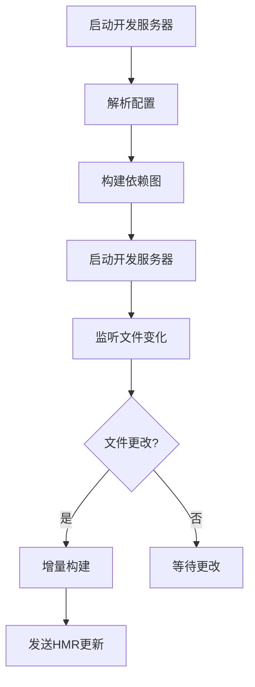

# 基础模板

<cite>
**本文档中引用的文件**  
- [app.json](file://templates/weapp-vite-template/src/app.json)
- [app.ts](file://templates/weapp-vite-template/src/app.ts)
- [vite.config.ts](file://templates/weapp-vite-template/vite.config.ts)
- [tsconfig.json](file://templates/weapp-vite-template/tsconfig.json)
- [package.json](file://templates/weapp-vite-template/package.json)
- [index.json](file://templates/weapp-vite-template/src/pages/index/index.json)
- [index.ts](file://templates/weapp-vite-template/src/pages/index/index.ts)
- [index.wxml](file://templates/weapp-vite-template/src/pages/index/index.wxml)
- [HelloWorld.json](file://templates/weapp-vite-template/src/components/HelloWorld/HelloWorld.json)
- [HelloWorld.ts](file://templates/weapp-vite-template/src/components/HelloWorld/HelloWorld.ts)
- [HelloWorld.wxml](file://templates/weapp-vite-template/src/components/HelloWorld/HelloWorld.wxml)
- [HelloWorld.scss](file://templates/weapp-vite-template/src/components/HelloWorld/HelloWorld.scss)
- [util.ts](file://templates/weapp-vite-template/src/utils/util.ts)
</cite>

## 目录
1. [简介](#简介)
2. [项目结构](#项目结构)
3. [核心配置文件解析](#核心配置文件解析)
4. [示例页面与组件实现](#示例页面与组件实现)
5. [构建流程与开发服务器配置](#构建流程与开发服务器配置)
6. [使用指南](#使用指南)
7. [依赖关系与构建优化策略](#依赖关系与构建优化策略)

## 简介
weapp-vite默认模板是一个为微信小程序量身打造的现代化开发模板，集成了Vite构建工具，提供快速的开发服务器启动、热更新和高效的构建能力。该模板旨在为开发者提供一个开箱即用的基础项目结构，包含必要的配置文件、示例页面和组件，以及最佳实践指导。通过使用此模板，开发者可以专注于业务逻辑的实现，而不必从零开始搭建开发环境。

## 项目结构
weapp-vite默认模板的项目结构清晰，遵循微信小程序的目录规范，同时引入了现代前端开发的最佳实践。根目录包含项目配置文件和构建脚本，src目录则组织了小程序的源代码。



**Diagram sources**
- [package.json](file://templates/weapp-vite-template/package.json)
- [vite.config.ts](file://templates/weapp-vite-template/vite.config.ts)
- [src/](file://templates/weapp-vite-template/src)

**Section sources**
- [package.json](file://templates/weapp-vite-template/package.json)
- [vite.config.ts](file://templates/weapp-vite-template/vite.config.ts)
- [src/](file://templates/weapp-vite-template/src)

## 核心配置文件解析

### app.json
`app.json`是小程序的全局配置文件，定义了小程序的页面路径、窗口样式、网络超时时间等全局配置。weapp-vite模板中的`app.json`通过`$schema`字段引用了weapp-vite提供的JSON Schema，以获得更好的编辑器智能提示和类型检查。

**Section sources**
- [app.json](file://templates/weapp-vite-template/src/app.json)

### app.ts
`app.ts`是小程序的入口文件，定义了小程序的全局对象。在weapp-vite模板中，它通过`App()`函数创建小程序实例，并可以定义全局数据和生命周期函数。

**Section sources**
- [app.ts](file://templates/weapp-vite-template/src/app.ts)

### vite.config.ts
`vite.config.ts`是Vite的配置文件，用于定制构建行为。weapp-vite模板中的配置文件通过`defineConfig`函数定义了weapp-vite特有的配置，如源码根目录、文件生成规则、CSS预处理器选项等。



**Diagram sources**
- [vite.config.ts](file://templates/weapp-vite-template/vite.config.ts)

**Section sources**
- [vite.config.ts](file://templates/weapp-vite-template/vite.config.ts)

### tsconfig.json
`tsconfig.json`是TypeScript的配置文件，定义了编译选项。weapp-vite模板采用了分层的tsconfig结构，通过`references`字段引用了`tsconfig.app.json`和`tsconfig.node.json`，分别用于应用代码和Node.js环境代码的类型检查。

**Section sources**
- [tsconfig.json](file://templates/weapp-vite-template/tsconfig.json)

### package.json
`package.json`定义了项目的元数据、依赖关系和脚本命令。weapp-vite模板提供了常用的npm脚本，如`dev`用于启动开发服务器，`build`用于构建生产版本，`g`用于生成新组件或页面。

**Section sources**
- [package.json](file://templates/weapp-vite-template/package.json)

## 示例页面与组件实现

### index页面
`index`页面是小程序的首页，位于`src/pages/index/`目录下。它由`.json`、`.ts`、`.wxml`和`.wxss`（或`.scss`）文件组成，分别定义了页面配置、逻辑、结构和样式。

**Section sources**
- [index.json](file://templates/weapp-vite-template/src/pages/index/index.json)
- [index.ts](file://templates/weapp-vite-template/src/pages/index/index.ts)
- [index.wxml](file://templates/weapp-vite-template/src/pages/index/index.wxml)

### HelloWorld组件
`HelloWorld`组件是一个示例自定义组件，位于`src/components/HelloWorld/`目录下。它展示了如何定义组件的属性、生命周期函数和方法，并通过WXML和SCSS实现UI。



**Diagram sources**
- [HelloWorld.json](file://templates/weapp-vite-template/src/components/HelloWorld/HelloWorld.json)
- [HelloWorld.ts](file://templates/weapp-vite-template/src/components/HelloWorld/HelloWorld.ts)
- [HelloWorld.wxml](file://templates/weapp-vite-template/src/components/HelloWorld/HelloWorld.wxml)

**Section sources**
- [HelloWorld.json](file://templates/weapp-vite-template/src/components/HelloWorld/HelloWorld.json)
- [HelloWorld.ts](file://templates/weapp-vite-template/src/components/HelloWorld/HelloWorld.ts)
- [HelloWorld.wxml](file://templates/weapp-vite-template/src/components/HelloWorld/HelloWorld.wxml)
- [HelloWorld.scss](file://templates/weapp-vite-template/src/components/HelloWorld/HelloWorld.scss)

## 构建流程与开发服务器配置
weapp-vite模板的构建流程基于Vite，利用其原生ES模块支持和热模块替换（HMR）技术，实现了极快的启动速度和开发时的即时反馈。开发服务器通过`weapp-vite dev`命令启动，会监听文件变化并自动重新构建和刷新小程序。



**Diagram sources**
- [vite.config.ts](file://templates/weapp-vite-template/vite.config.ts)
- [package.json](file://templates/weapp-vite-template/package.json)

**Section sources**
- [vite.config.ts](file://templates/weapp-vite-template/vite.config.ts)
- [package.json](file://templates/weapp-vite-template/package.json)

## 使用指南

### 从零开始创建项目
使用weapp-vite模板创建新项目非常简单，可以通过npm、yarn或pnpm等包管理工具直接初始化：

```bash
npm create weapp-vite@latest my-project -- --template weapp-vite
```

### 目录结构调整
模板的目录结构可以根据项目需求进行调整。例如，可以将`utils`目录重命名为`helpers`，或将`components`目录按功能模块进一步细分。

### 基本功能扩展
在现有模板基础上扩展功能，如添加新页面或组件，可以使用`weapp-vite generate`命令，或手动创建相应的文件并更新`app.json`中的页面列表。

**Section sources**
- [package.json](file://templates/weapp-vite-template/package.json)
- [app.json](file://templates/weapp-vite-template/src/app.json)

## 依赖关系与构建优化策略
weapp-vite模板的依赖关系清晰，主要依赖`weapp-vite`核心包、`typescript`用于类型检查、`sass`用于SCSS编译。构建优化策略包括利用Vite的预构建和按需编译特性，减少初始加载时间；通过代码分割和懒加载，优化运行时性能。

**Section sources**
- [package.json](file://templates/weapp-vite-template/package.json)
- [vite.config.ts](file://templates/weapp-vite-template/vite.config.ts)