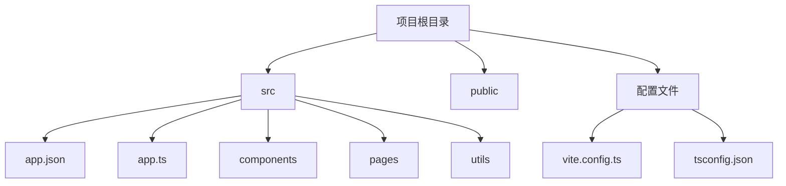
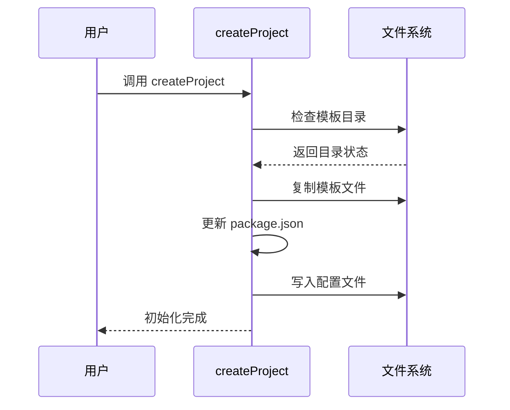

# 模板说明

<cite>
**本文档中引用的文件**  
- [template-tree.txt](file://website/snippets/template-tree.txt)
- [createProject.ts](file://@weapp-core/init/src/createProject.ts)
- [configFiles.ts](file://@weapp-core/init/src/configFiles.ts)
- [viteConfig.ts](file://@weapp-core/init/src/viteConfig.ts)
- [tsconfigJson.ts](file://@weapp-core/init/src/tsconfigJson.ts)
- [weapp-vite-template/package.json](file://templates/weapp-vite-template/package.json)
- [weapp-vite-template/src/app.ts](file://templates/weapp-vite-template/src/app.ts)
- [weapp-vite-template/src/app.json](file://templates/weapp-vite-template/src/app.json)
- [weapp-vite-template/vite.config.ts](file://templates/weapp-vite-template/vite.config.ts)
- [weapp-vite-template/tsconfig.json](file://templates/weapp-vite-template/tsconfig.json)
- [tailwindcss/template](file://templates/weapp-vite-tailwindcss-template)
- [tdesign/template](file://templates/weapp-vite-tailwindcss-tdesign-template)
- [vant/template](file://templates/weapp-vite-tailwindcss-vant-template)
</cite>

## 目录
1. [引言](#引言)
2. [项目模板系统概述](#项目模板系统概述)
3. [默认模板结构详解](#默认模板结构详解)
4. [不同模板的对比分析](#不同模板的对比分析)
5. [关键配置文件解析](#关键配置文件解析)
6. [示例组件与页面的最佳实践](#示例组件与页面的最佳实践)
7. [模板自定义指南](#模板自定义指南)
8. [项目初始化流程与文件生成机制](#项目初始化流程与文件生成机制)

## 引言
weapp-vite 是一个用于开发微信小程序的现代化构建工具，提供了多种项目模板以满足不同开发需求。本文档旨在全面解析 weapp-vite 提供的项目模板系统，帮助开发者理解模板的组织结构、配置文件的作用以及如何根据项目需求进行自定义。

## 项目模板系统概述
weapp-vite 的模板系统位于 `templates/` 目录下，包含多个预设模板，如基础模板、Tailwind CSS 模板、TDesign 模板和 Vant 模板。这些模板通过 `@weapp-core/init` 模块中的 `createProject` 函数进行初始化，该函数负责复制模板文件并更新必要的配置。

**Section sources**
- [createProject.ts](file://@weapp-core/init/src/createProject.ts#L54-L85)

## 默认模板结构详解
默认模板（weapp-vite-template）提供了一个标准的小程序项目结构，包含以下主要目录和文件：

- `src/`：源代码目录，包含小程序的核心文件
  - `app.json`：小程序全局配置
  - `app.ts`：小程序应用实例
  - `components/`：自定义组件目录
  - `pages/`：页面目录
  - `utils/`：工具函数
  - `vite-env.d.ts`：Vite 环境类型定义
- `public/`：静态资源目录
- 配置文件：`vite.config.ts`、`tsconfig.json` 等

该结构遵循小程序的标准目录规范，同时集成了现代前端工具链。



**Diagram sources**
- [template-tree.txt](file://website/snippets/template-tree.txt)

**Section sources**
- [template-tree.txt](file://website/snippets/template-tree.txt)

## 不同模板的对比分析
weapp-vite 提供了多种模板以适应不同的开发需求：

### 基础模板
最简化的模板，仅包含必要的文件和依赖，适合从零开始构建项目。

### Tailwind CSS 模板
集成了 Tailwind CSS 样式框架，提供现代化的原子化 CSS 开发体验。

### TDesign 模板
集成腾讯 TDesign 组件库，提供一套完整的设计系统和 UI 组件。

### Vant 模板
集成 Vant Weapp 组件库，提供丰富的移动端 UI 组件。

这些模板的主要差异体现在 `package.json` 的依赖项和额外的配置文件上，如 Tailwind CSS 模板包含 `tailwind.config.ts`，而组件库模板则包含相应的 UI 库依赖。

**Section sources**
- [weapp-vite-template/package.json](file://templates/weapp-vite-template/package.json)
- [tailwindcss/template](file://templates/weapp-vite-tailwindcss-template)
- [tdesign/template](file://templates/weapp-vite-tailwindcss-tdesign-template)
- [vant/template](file://templates/weapp-vite-tailwindcss-vant-template)

## 关键配置文件解析
### vite.config.ts
Vite 构建配置文件，定义了 weapp-vite 的特定选项：

```typescript
export default defineConfig(({ mode }) => ({
  weapp: {
    srcRoot: 'src',
    generate: {
      extensions: {
        js: 'ts',
        wxss: 'scss',
      },
    },
  },
}))
```

该配置指定了源码根目录和文件生成规则，如将 `.js` 文件生成为 `.ts` 文件。

**Section sources**
- [vite.config.ts](file://templates/weapp-vite-template/vite.config.ts#L1-L40)
- [configFiles.ts](file://@weapp-core/init/src/configFiles.ts#L15-L31)

### tsconfig.json
TypeScript 配置文件，采用引用式配置：

```json
{
  "references": [
    { "path": "./tsconfig.app.json" },
    { "path": "./tsconfig.node.json" }
  ]
}
```

这种配置方式将应用代码和构建脚本的配置分离，提高了配置的可维护性。

**Section sources**
- [tsconfig.json](file://templates/weapp-vite-template/tsconfig.json)
- [tsconfigJson.ts](file://@weapp-core/init/src/tsconfigJson.ts)

### project.config.json
小程序项目配置文件，包含项目的基本信息和编译设置。

## 示例组件与页面的最佳实践
默认模板中的 `HelloWorld` 组件展示了标准的组件结构：

- 组件使用 TypeScript 编写
- 样式使用 SCSS 预处理器
- 模板使用 WXML 语法
- 遵循小程序的组件生命周期

`index` 页面作为入口页面，展示了页面配置、数据绑定和事件处理的最佳实践。

**Section sources**
- [weapp-vite-template/src/components/HelloWorld](file://templates/weapp-vite-template/src/components/HelloWorld)
- [weapp-vite-template/src/pages/index](file://templates/weapp-vite-template/src/pages/index)

## 模板自定义指南
开发者可以根据项目需求对模板进行自定义：

1. 修改 `vite.config.ts` 中的构建选项
2. 调整 `tsconfig.json` 的编译选项
3. 添加或修改组件库依赖
4. 自定义文件生成规则

通过修改这些配置，可以适应不同规模和需求的项目开发。

**Section sources**
- [configFiles.ts](file://@weapp-core/init/src/configFiles.ts)
- [viteConfig.ts](file://@weapp-core/init/src/viteConfig.ts)

## 项目初始化流程与文件生成机制
项目初始化通过 `createProject` 函数实现，其流程如下：

1. 确定目标模板目录
2. 复制模板文件到目标位置
3. 更新 `package.json` 中的依赖版本
4. 确保 `.gitignore` 文件存在
5. 写入最终的配置文件

该机制确保了新项目能够正确继承模板的配置，同时保持依赖的最新状态。



**Diagram sources**
- [createProject.ts](file://@weapp-core/init/src/createProject.ts#L54-L85)

**Section sources**
- [createProject.ts](file://@weapp-core/init/src/createProject.ts#L54-L85)