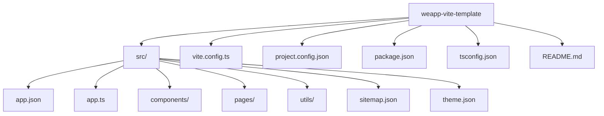

# 附录

<cite>
**本文档中引用的文件**
- [README.md](file://README.md)
- [package.json](file://package.json)
- [pnpm-workspace.yaml](file://pnpm-workspace.yaml)
- [turbo.json](file://turbo.json)
- [@weapp-core/init/src/index.ts](file://@weapp-core/init/src/index.ts)
- [@weapp-core/init/src/createProject.ts](file://@weapp-core/init/src/createProject.ts)
- [@weapp-core/init/templates/default/README.md](file://@weapp-core/init/templates/default/README.md)
- [templates/weapp-vite-template/README.md](file://templates/weapp-vite-template/README.md)
- [templates/weapp-vite-template/src/app.ts](file://templates/weapp-vite-template/src/app.ts)
- [templates/weapp-vite-template/vite.config.ts](file://templates/weapp-vite-template/vite.config.ts)
- [templates/weapp-vite-template/project.config.json](file://templates/weapp-vite-template/project.config.json)
- [website/snippets/template-tree.txt](file://website/snippets/template-tree.txt)
</cite>

## 目录结构

本项目采用 Monorepo 架构，使用 pnpm 作为包管理器，通过 turbo 实现高效的构建和任务管理。项目整体结构清晰，各目录职责分明，便于维护和扩展。

项目主要包含以下几个核心目录：

- `@weapp-core/`：核心功能模块，包含初始化、日志、示意图生成等基础能力
- `apps/`：应用示例目录，包含多个使用 weapp-vite 构建的完整小程序示例
- `docs/`：项目文档，包含详细的使用指南和技术说明
- `packages/`：核心 npm 包，包含 `weapp-vite` 主包、`create-weapp-vite` 脚手架等
- `templates/`：项目模板，用于快速创建新项目
- `website/`：项目官方网站和文档站点
- `scripts/`：构建和开发辅助脚本

这种目录结构设计使得项目既能保持核心功能的稳定性，又能方便地扩展新的功能和示例。

```mermaid
graph TD
A[项目根目录] --> B[@weapp-core/]
A --> C[apps/]
A --> D[docs/]
A --> E[packages/]
A --> F[templates/]
A --> G[website/]
A --> H[scripts/]
B --> B1[init]
B --> B2[logger]
B --> B3[schematics]
B --> B4[shared]
E --> E1[weapp-vite]
E --> E2[create-weapp-vite]
E --> E3[vite-plugin-performance]
E --> E4[rolldown-require]
F --> F1[weapp-vite-template]
F --> F2[weapp-vite-tailwindcss-template]
F --> F3[weapp-vite-tailwindcss-tdesign-template]
F --> F4[weapp-vite-tailwindcss-vant-template]
```

**图示来源**
- [package.json](file://package.json)
- [pnpm-workspace.yaml](file://pnpm-workspace.yaml)

**本节来源**
- [package.json](file://package.json)
- [pnpm-workspace.yaml](file://pnpm-workspace.yaml)

## 模板树说明

weapp-vite 提供了多种项目模板，帮助开发者快速启动新项目。其中最基础的是 `weapp-vite-template`，其文件结构经过精心设计，体现了现代小程序开发的最佳实践。

模板的主要文件结构如下：

```
weapp-vite-template/
├── src/                    # 源代码目录
│   ├── app.json            # 小程序全局配置
│   ├── app.ts              # 小程序入口文件
│   ├── components/         # 组件目录
│   ├── pages/              # 页面目录
│   ├── utils/              # 工具函数
│   ├── sitemap.json        # 站点地图配置
│   └── theme.json          # 主题配置
├── vite.config.ts          # Vite 配置文件
├── project.config.json     # 微信开发者工具配置
├── package.json            # 项目依赖配置
├── tsconfig.json           # TypeScript 配置
└── README.md               # 项目说明文档
```

这种结构将源代码与构建配置分离，使得项目更加清晰和易于维护。`src` 目录集中存放所有源代码，而根目录则存放各种配置文件，符合现代前端项目的组织规范。



**图示来源**
- [website/snippets/template-tree.txt](file://website/snippets/template-tree.txt)
- [templates/weapp-vite-template/README.md](file://templates/weapp-vite-template/README.md)

**本节来源**
- [website/snippets/template-tree.txt](file://website/snippets/template-tree.txt)
- [templates/weapp-vite-template/README.md](file://templates/weapp-vite-template/README.md)

## 分包配置最佳实践

weapp-vite 对小程序分包提供了完善的配置支持，通过 `vite.config.ts` 文件中的 `weapp` 配置项可以灵活地管理分包结构。

### 基础分包配置

在 `vite.config.ts` 中，可以通过 `weapp` 配置项定义分包：

```typescript
export default defineConfig({
  weapp: {
    srcRoot: 'src',
    generate: {
      extensions: {
        js: 'ts',
        wxss: 'scss',
      },
      dirs: {
        component: 'src/components',
        page: 'src/pages',
      },
    },
  },
})
```

### 高级分包用法

#### 1. 独立分包配置

对于大型项目，可以配置独立分包，提高加载性能：

```typescript
// 在 project.config.json 中配置
{
  "packOptions": {
    "include": [
      {
        "root": "packageA",
        "name": "packageA"
      }
    ]
  }
}
```

#### 2. 分包预加载配置

通过配置分包预加载规则，优化用户体验：

```typescript
// vite.config.ts
export default defineConfig({
  weapp: {
    // 分包预加载配置
    preloadRules: {
      'pages/shop/index': {
        network: 'all',
        packages: ['shop']
      }
    }
  }
})
```

#### 3. 共享代码配置

在多个分包之间共享代码，避免重复打包：

```typescript
// 配置共享代码
export default defineConfig({
  weapp: {
    shared: {
      chunks: ['utils/common', 'components/base']
    }
  }
})
```

### 分包优化建议

1. **合理划分分包**：根据业务模块划分分包，每个分包大小控制在 2MB 以内
2. **主包精简**：主包只包含核心功能和首屏所需资源
3. **按需加载**：非关键功能使用分包按需加载
4. **共享代码**：提取公共组件和工具函数作为共享代码
5. **预加载策略**：对用户可能访问的页面进行预加载

这些配置和实践可以帮助开发者构建高性能的小程序应用，提升用户体验。

**本节来源**
- [templates/weapp-vite-template/vite.config.ts](file://templates/weapp-vite-template/vite.config.ts)
- [templates/weapp-vite-template/project.config.json](file://templates/weapp-vite-template/project.config.json)

## 常用代码片段和配置示例

本节提供一些在 weapp-vite 项目中常用的代码片段和配置示例，帮助开发者快速实现常见功能。

### 1. 基础 Vite 配置

```typescript
// vite.config.ts
import { defineConfig } from 'weapp-vite/config'

export default defineConfig(({ mode }) => {
  console.log('[mode]:', mode)
  return {
    weapp: {
      srcRoot: 'src',
      generate: {
        extensions: {
          js: 'ts',
          wxss: 'scss',
        },
        dirs: {
          component: 'src/components',
          page: 'src/pages',
        },
      },
    },
    css: {
      preprocessorOptions: {
        scss: {
          silenceDeprecations: ['legacy-js-api', 'import'],
        },
      },
    },
    plugins: [
      // 在这里注册 vite 插件
    ],
  }
})
```

### 2. 小程序入口文件

```typescript
// src/app.ts
App({
  globalData: {},
  onLaunch() {
    // 应用初始化时执行
  },
})
```

### 3. 页面配置文件

```json
// src/pages/index/index.json
{
  "usingComponents": {
    "hello-world": "/src/components/HelloWorld/HelloWorld"
  },
  "navigationBarTitleText": "首页"
}
```

### 4. 组件 TypeScript 文件

```typescript
// src/components/HelloWorld/HelloWorld.ts
Component({
  properties: {
    title: {
      type: String,
      value: 'Hello World'
    }
  },
  data: {
    count: 0
  },
  methods: {
    increment() {
      this.setData({ count: this.data.count + 1 })
    }
  }
})
```

### 5. 微信开发者工具配置

```json
// project.config.json
{
  "description": "项目配置文件",
  "miniprogramRoot": "dist/",
  "compileType": "miniprogram",
  "setting": {
    "babelSetting": {
      "ignore": [],
      "disablePlugins": [],
      "outputPath": ""
    },
    "postcss": false,
    "minified": false,
    "enhance": false,
    "packNpmRelationList": [
      {
        "packageJsonPath": "./package.json",
        "miniprogramNpmDistDir": "./dist"
      }
    ],
    "ignoreUploadUnusedFiles": true,
    "skylineRenderEnable": true,
    "packNpmManually": true,
    "es6": true
  },
  "libVersion": "2.32.3",
  "appid": "wx6ffee4673b257014"
}
```

### 6. 开发和构建脚本

```json
// package.json
{
  "scripts": {
    "dev": "weapp-vite dev",
    "build": "weapp-vite build",
    "open": "weapp-vite open",
    "g": "weapp-vite generate"
  }
}
```

这些代码片段和配置示例涵盖了 weapp-vite 项目开发中的常见场景，开发者可以根据实际需求进行调整和扩展。通过这些示例，可以快速理解项目的配置方式和开发模式，提高开发效率。

**本节来源**
- [templates/weapp-vite-template/vite.config.ts](file://templates/weapp-vite-template/vite.config.ts)
- [templates/weapp-vite-template/src/app.ts](file://templates/weapp-vite-template/src/app.ts)
- [templates/weapp-vite-template/project.config.json](file://templates/weapp-vite-template/project.config.json)