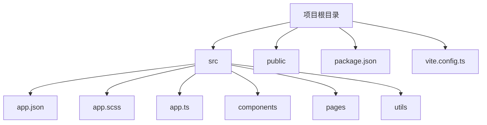
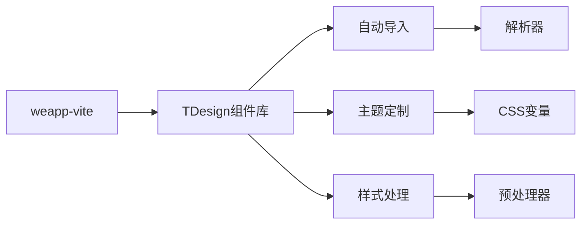
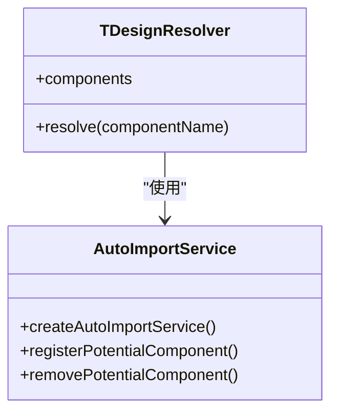
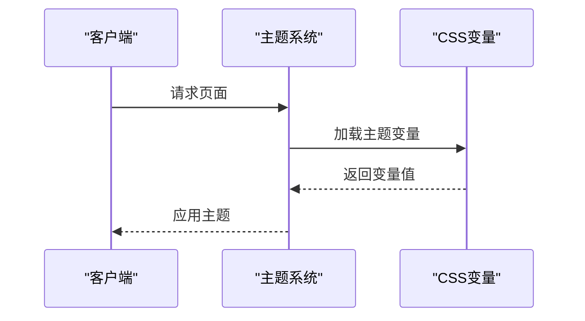
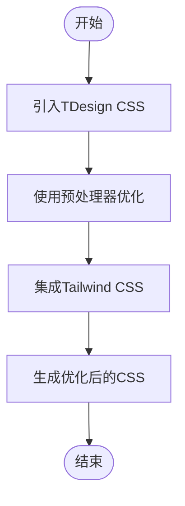
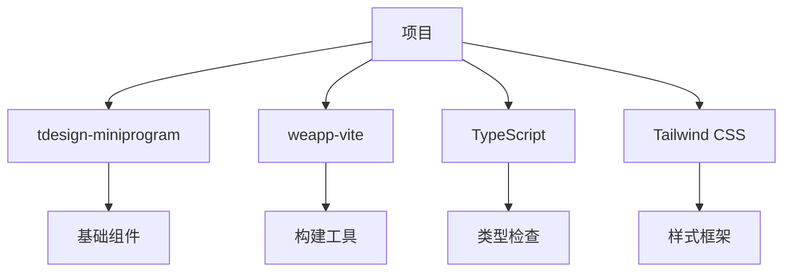

# TDesign集成

<cite>
**本文档中引用的文件**   
- [tdesign.ts](file://packages/weapp-vite/src/auto-import-components/resolvers/tdesign.ts)
- [tdesign.json](file://packages/weapp-vite/src/auto-import-components/resolvers/json/tdesign.json)
- [vite.config.ts](file://templates/weapp-vite-tailwindcss-tdesign-template/vite.config.ts)
- [tdesign.md](file://website/integration/tdesign.md)
- [_index.wxss](file://packages/weapp-vite/test/fixtures/mixjs/miniprogram_npm/tdesign-miniprogram/common/style/theme/_index.wxss)
- [package.json](file://templates/weapp-vite-tailwindcss-tdesign-template/package.json)
- [app.scss](file://templates/weapp-vite-tailwindcss-tdesign-template/src/app.scss)
</cite>

## 目录
1. [简介](#简介)
2. [项目结构](#项目结构)
3. [核心组件](#核心组件)
4. [架构概述](#架构概述)
5. [详细组件分析](#详细组件分析)
6. [依赖分析](#依赖分析)
7. [性能考虑](#性能考虑)
8. [故障排除指南](#故障排除指南)
9. [结论](#结论)

## 简介
本文档全面介绍了如何在weapp-vite项目中集成TDesign组件库。文档涵盖了自动导入功能的实现机制、主题定制方案、样式处理流程、配置示例、兼容性要求和版本管理策略，以及常见问题的解决方案和最佳实践建议。

## 项目结构
weapp-vite项目结构设计合理，便于集成TDesign组件库。项目模板提供了清晰的目录结构，包括源代码、组件、页面和配置文件。

**图表来源**
- [template-tree.txt](file://website/snippets/template-tree.txt)

**章节来源**
- [template-tree.txt](file://website/snippets/template-tree.txt)

## 核心组件
TDesign组件库提供了丰富的UI组件，如按钮、输入框、对话框等。这些组件通过解析器自动识别和注册，简化了开发流程。

**章节来源**
- [tdesign.json](file://packages/weapp-vite/src/auto-import-components/resolvers/json/tdesign.json)

## 架构概述
weapp-vite与TDesign的集成架构基于Vite的构建系统，利用解析器实现组件的自动导入。主题定制通过CSS变量实现，样式处理通过预处理器优化。

**图表来源**
- [tdesign.md](file://website/integration/tdesign.md)

## 详细组件分析

### 组件自动导入分析
weapp-vite通过解析器自动识别和注册TDesign组件。解析器配置在vite.config.ts文件中，通过TDesignResolver实现。

#### 对于对象导向的组件：

**图表来源**
- [tdesign.ts](file://packages/weapp-vite/src/auto-import-components/resolvers/tdesign.ts)
- [service.ts](file://packages/weapp-vite/src/runtime/autoImport/service.ts)

### 主题定制分析
TDesign的主题定制通过CSS变量实现，支持亮色和暗色模式。主题变量定义在_index.wxss文件中，通过media查询应用。

#### 对于API/服务组件：

**图表来源**
- [_index.wxss](file://packages/weapp-vite/test/fixtures/mixjs/miniprogram_npm/tdesign-miniprogram/common/style/theme/_index.wxss)

### 样式处理分析
样式处理流程包括引入TDesign的CSS文件、使用预处理器（如Sass）进行优化，以及通过Tailwind CSS进行响应式设计。

#### 对于复杂逻辑组件：

**图表来源**
- [app.scss](file://templates/weapp-vite-tailwindcss-tdesign-template/src/app.scss)

**章节来源**
- [app.scss](file://templates/weapp-vite-tailwindcss-tdesign-template/src/app.scss)

## 依赖分析
TDesign组件库的依赖关系通过package.json文件管理。主要依赖包括tdesign-miniprogram和weapp-vite，开发依赖包括TypeScript和Tailwind CSS。

**图表来源**
- [package.json](file://templates/weapp-vite-tailwindcss-tdesign-template/package.json)

**章节来源**
- [package.json](file://templates/weapp-vite-tailwindcss-tdesign-template/package.json)

## 性能考虑
为了确保TDesign组件在weapp-vite项目中高效稳定运行，建议采用按需加载、代码分割和懒加载等技术。此外，优化CSS和JavaScript文件的大小，减少网络请求，提高页面加载速度。

## 故障排除指南
### 组件样式冲突
如果遇到组件样式冲突，可以通过以下方式解决：
- 检查CSS优先级，确保自定义样式优先级高于TDesign默认样式。
- 使用CSS模块化，避免全局样式污染。

### 按需加载配置错误
按需加载配置错误可能导致组件无法正确加载。检查vite.config.ts中的解析器配置，确保路径和组件名称正确。

**章节来源**
- [tdesign.md](file://website/integration/tdesign.md)

## 结论
通过本文档的指导，开发者可以高效地将TDesign组件库集成到weapp-vite项目中。自动导入、主题定制和样式处理等功能大大简化了开发流程，提高了开发效率。遵循最佳实践建议，可以确保TDesign组件在项目中稳定运行。