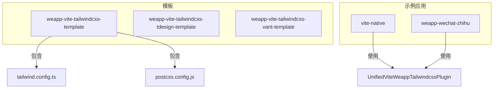
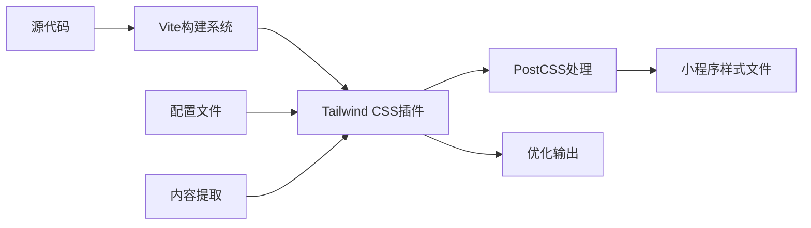
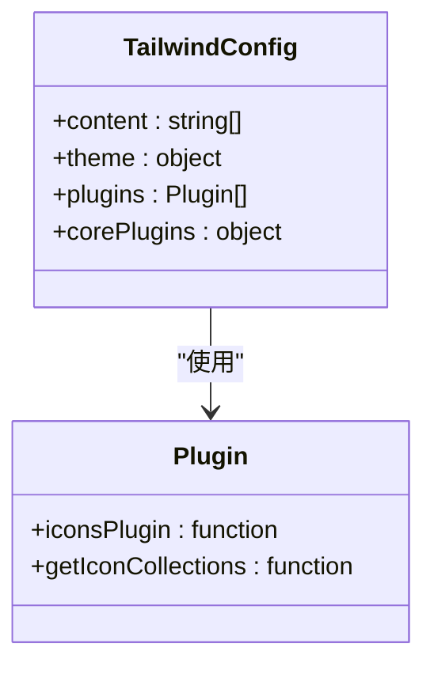
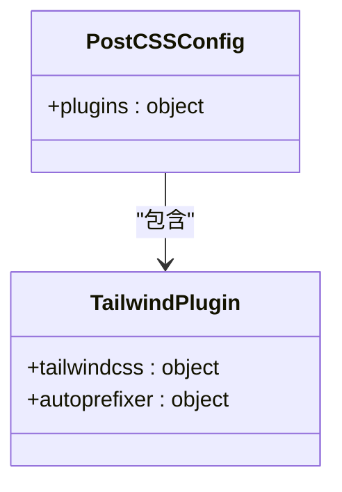
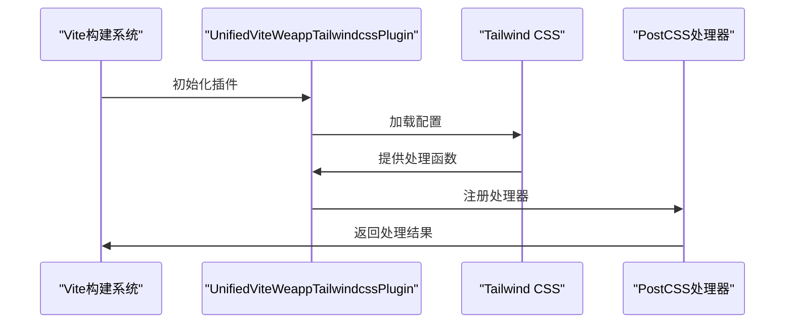
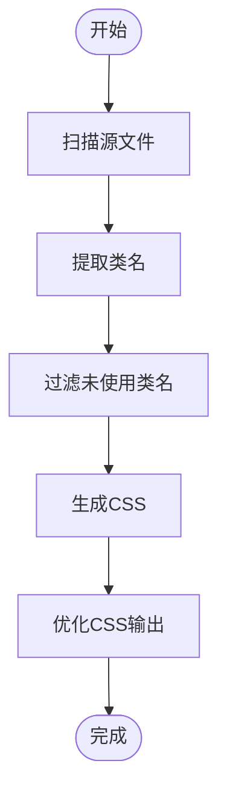
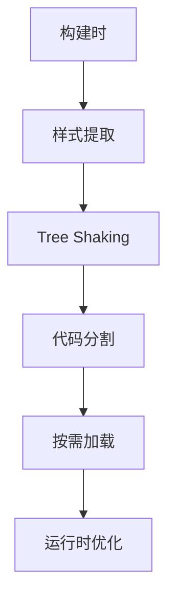

# Tailwind CSS集成

<cite>
**本文档中引用的文件**   
- [tailwind.config.ts](file://templates/weapp-vite-tailwindcss-template/tailwind.config.ts)
- [postcss.config.js](file://templates/weapp-vite-tailwindcss-template/postcss.config.js)
- [vite.config.mts](file://apps/weapp-wechat-zhihu/vite.config.mts)
- [vite.config.ts](file://apps/vite-native/vite.config.ts)
- [tailwind.config.js](file://apps/vite-native/tailwind.config.js)
- [postcss.config.js](file://apps/vite-native/postcss.config.js)
- [tailwind.config.ts](file://@weapp-core/init/templates/tailwindcss/tailwind.config.ts)
- [postcss.config.js](file://@weapp-core/init/templates/tailwindcss/postcss.config.js)
</cite>

## 目录
1. [简介](#简介)
2. [项目结构](#项目结构)
3. [核心组件](#核心组件)
4. [架构概述](#架构概述)
5. [详细组件分析](#详细组件分析)
6. [依赖分析](#依赖分析)
7. [性能考虑](#性能考虑)
8. [故障排除指南](#故障排除指南)
9. [结论](#结论)

## 简介
本文档详细介绍了在weapp-vite项目中集成Tailwind CSS的完整方案。文档涵盖了从项目初始化到生产构建的全过程，重点介绍了PostCSS配置、类名提取机制、运行时优化策略以及与小程序原生样式系统的兼容性处理。

## 项目结构
weapp-vite项目中的Tailwind CSS集成主要通过模板和配置文件实现。项目结构中包含了多个示例应用和模板，展示了Tailwind CSS在不同场景下的使用方式。



**Diagram sources**
- [tailwind.config.ts](file://templates/weapp-vite-tailwindcss-template/tailwind.config.ts)
- [postcss.config.js](file://templates/weapp-vite-tailwindcss-template/postcss.config.js)
- [vite.config.mts](file://apps/weapp-wechat-zhihu/vite.config.mts)

**Section sources**
- [tailwind.config.ts](file://templates/weapp-vite-tailwindcss-template/tailwind.config.ts)
- [postcss.config.js](file://templates/weapp-vite-tailwindcss-template/postcss.config.js)

## 核心组件
Tailwind CSS集成的核心组件包括配置文件、Vite插件和PostCSS处理流程。这些组件共同工作，实现了Tailwind在小程序环境中的高效使用。

**Section sources**
- [tailwind.config.ts](file://templates/weapp-vite-tailwindcss-template/tailwind.config.ts)
- [postcss.config.js](file://templates/weapp-vite-tailwindcss-template/postcss.config.js)
- [vite.config.mts](file://apps/weapp-wechat-zhihu/vite.config.mts)

## 架构概述
Tailwind CSS在weapp-vite中的集成架构基于Vite构建系统，通过专用插件和PostCSS配置实现。架构设计考虑了小程序的特殊性，优化了样式处理流程。



**Diagram sources**
- [vite.config.mts](file://apps/weapp-wechat-zhihu/vite.config.mts)
- [postcss.config.js](file://apps/vite-native/postcss.config.js)

## 详细组件分析

### 配置文件分析
Tailwind CSS的配置主要通过两个文件完成：tailwind.config.ts和postcss.config.js。这些配置文件定义了样式生成的规则和处理流程。

#### Tailwind配置


**Diagram sources**
- [tailwind.config.ts](file://templates/weapp-vite-tailwindcss-template/tailwind.config.ts)
- [tailwind.config.ts](file://@weapp-core/init/templates/tailwindcss/tailwind.config.ts)

#### PostCSS配置


**Diagram sources**
- [postcss.config.js](file://templates/weapp-vite-tailwindcss-template/postcss.config.js)
- [postcss.config.js](file://@weapp-core/init/templates/tailwindcss/postcss.config.js)

### Vite插件集成
Vite插件是Tailwind CSS集成的关键部分，它连接了构建系统和样式处理流程。



**Diagram sources**
- [vite.config.mts](file://apps/weapp-wechat-zhihu/vite.config.mts)
- [vite.config.ts](file://apps/vite-native/vite.config.ts)

**Section sources**
- [vite.config.mts](file://apps/weapp-wechat-zhihu/vite.config.mts)
- [vite.config.ts](file://apps/vite-native/vite.config.ts)

## 依赖分析
Tailwind CSS集成依赖于多个关键包，这些包共同提供了完整的样式处理能力。

```mermaid
graph LR
A[weapp-vite] --> B[weapp-tailwindcss]
B --> C[tailwindcss]
B --> D[autoprefixer]
B --> E[@egoist/tailwindcss-icons]
A --> F[vite]
F --> G[postcss]
```

**Diagram sources**
- [package.json](file://packages/weapp-vite/package.json)
- [package.json](file://apps/vite-native/package.json)

**Section sources**
- [vite.config.mts](file://apps/weapp-wechat-zhihu/vite.config.mts)
- [vite.config.ts](file://apps/vite-native/vite.config.ts)

## 性能考虑
Tailwind CSS集成考虑了多个性能优化方面，包括未使用样式的清除和按需加载机制。

### 类名提取机制


**Diagram sources**
- [tailwind.config.ts](file://templates/weapp-vite-tailwindcss-template/tailwind.config.ts)
- [vite.config.ts](file://apps/vite-native/vite.config.ts)

### 运行时优化


**Diagram sources**
- [vite.config.ts](file://apps/vite-native/vite.config.ts)
- [tailwind.config.js](file://apps/vite-native/tailwind.config.js)

## 故障排除指南
在集成Tailwind CSS时可能会遇到一些常见问题，本节提供了解决方案。

**Section sources**
- [website/integration/tailwindcss.md](file://website/integration/tailwindcss.md)
- [vite.config.mts](file://apps/weapp-wechat-zhihu/vite.config.mts)

## 结论
weapp-vite中的Tailwind CSS集成提供了一套完整的解决方案，通过合理的配置和优化，实现了在小程序环境中的高效样式开发。开发者可以根据项目需求选择合适的集成方式，充分利用Tailwind CSS的原子化CSS优势。