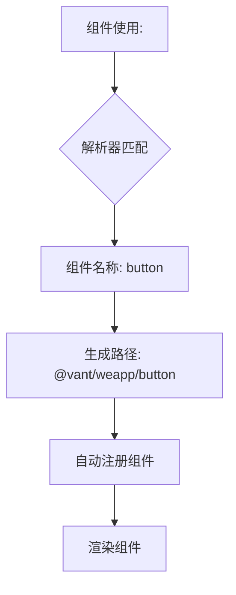

# Vant集成

<cite>
**本文档引用文件**  
- [vant.ts](file://packages/weapp-vite/src/auto-import-components/resolvers/vant.ts)
- [vant.json](file://packages/weapp-vite/src/auto-import-components/resolvers/json/vant.json)
- [vite.config.ts](file://templates/weapp-vite-tailwindcss-vant-template/vite.config.ts)
- [integration/vant.md](file://website/integration/vant.md)
- [extract.ts](file://apps/vite-native/scripts/extract.ts)
- [index.ts](file://templates/weapp-vite-tailwindcss-vant-template/src/pages/index/index.ts)
</cite>

## 目录
1. [简介](#简介)
2. [项目初始化与模板配置](#项目初始化与模板配置)
3. [自动导入功能配置](#自动导入功能配置)
4. [样式处理机制](#样式处理机制)
5. [Vant小程序版本兼容性](#vant小程序版本兼容性)
6. [完整配置示例](#完整配置示例)
7. [性能优化建议](#性能优化建议)
8. [常见问题解决方案](#常见问题解决方案)
9. [总结](#总结)

## 简介

Vant Weapp 是一套专为微信小程序设计的移动端 UI 组件库，提供了丰富的高质量组件，能够帮助开发者快速构建美观、功能完整的微信小程序界面。在 weapp-vite 项目中集成 Vant 组件库，可以通过自动导入解析器实现按需引入和自动注册，极大简化开发流程。

weapp-vite 提供了对 Vant 的深度集成支持，包括自动组件导入、样式处理、类型提示等功能，使得开发者可以专注于业务逻辑开发，而无需关心繁琐的配置细节。

## 项目初始化与模板配置

weapp-vite 提供了专门的 Vant 集成模板，可通过以下命令快速创建项目：

```bash
pnpm create weapp-vite my-project --template tailwindcss-vant
```

该模板预配置了 Vant 组件库的集成，包括自动导入、Tailwind CSS 支持等特性。项目初始化后，会自动安装 `@vant/weapp` 依赖并配置相关设置。

**Section sources**
- [vite.config.ts](file://templates/weapp-vite-tailwindcss-vant-template/vite.config.ts#L1-L42)
- [package.json](file://templates/weapp-vite-tailwindcss-vant-template/package.json#L1-L42)

## 自动导入功能配置

weapp-vite 通过解析器（resolver）机制实现 Vant 组件的按需引入和自动注册。核心配置如下：

```ts
import { VantResolver } from 'weapp-vite/auto-import-components/resolvers'
import { defineConfig } from 'weapp-vite/config'

export default defineConfig({
  weapp: {
    enhance: {
      autoImportComponents: {
        resolvers: [
          VantResolver(),
        ],
      },
    },
  },
})
```

`VantResolver` 解析器会自动处理所有 Vant 组件的导入，开发者无需在每个页面的 JSON 配置中手动声明组件引用。

### 解析器工作原理

`VantResolver` 的实现基于组件名称映射机制：

1. 读取 `vant.json` 文件中定义的所有 Vant 组件名称
2. 为每个组件生成对应的导入路径 `@vant/weapp/${componentName}`
3. 添加默认前缀 `van-`，如 `button` 组件对应 `van-button`
4. 在编译时自动将模板中使用的组件标签映射到正确的组件路径



**Diagram sources**
- [vant.ts](file://packages/weapp-vite/src/auto-import-components/resolvers/vant.ts#L1-L40)
- [vant.json](file://packages/weapp-vite/src/auto-import-components/resolvers/json/vant.json#L1-L72)

**Section sources**
- [vant.ts](file://packages/weapp-vite/src/auto-import-components/resolvers/vant.ts#L1-L40)
- [vite.config.ts](file://templates/weapp-vite-tailwindcss-vant-template/vite.config.ts#L1-L42)

## 样式处理机制

### 样式文件引入

Vant 组件的样式文件会随组件自动引入，无需额外配置。每个组件的样式都封装在其组件目录中，确保样式隔离。

### CSS变量与主题定制

Vant Weapp 支持通过 CSS 变量进行主题定制。可以在项目根目录的 `app.wxss` 中覆盖默认变量：

```css
/* app.wxss */
:root {
  --van-primary-color: #1890ff;
  --van-success-color: #52c41a;
  --van-danger-color: #f5222d;
  --van-warning-color: #faad14;
}
```

### 样式兼容性处理

需要注意的是，在使用 Vant 组件时，应从 `app.json` 中移除 `"style": "v2"` 配置，以避免样式冲突。

```json
{
  "window": {
    "backgroundTextStyle": "light",
    "navigationBarBackgroundColor": "#fff",
    "navigationBarTitleText": "WeChat",
    "navigationBarTextStyle": "black"
  }
}
```

**Section sources**
- [integration/vant.md](file://website/integration/vant.md#L13-L14)
- [subPackages-shared-styles.less](file://packages/weapp-vite/test/fixtures/subPackages-shared-styles/src/packageA/styles/components.less#L1-L52)

## Vant小程序版本兼容性

### 版本匹配

weapp-vite 集成的 Vant 版本为 `@vant/weapp@^1.11.7`，建议保持此版本范围以确保兼容性。

### API变更处理

Vant Weapp 的 API 设计遵循微信小程序规范，weapp-vite 的解析器会自动处理大部分 API 映射。对于特殊 API 调用，如 Dialog 组件：

```ts
import Dialog from '@vant/weapp/dialog/dialog'

// 使用 Dialog 组件
Dialog.alert({
  title: '提示',
  message: '这是一条消息',
})
```

### 类型支持

项目模板中已配置 TypeScript 路径映射，确保 Vant 组件的类型提示正常工作：

```json
{
  "compilerOptions": {
    "paths": {
      "@vant/weapp/*": ["node_modules/@vant/weapp/dist/*"]
    }
  }
}
```

**Section sources**
- [integration/vant.md](file://website/integration/vant.md#L19-L24)
- [index.ts](file://templates/weapp-vite-tailwindcss-vant-template/src/pages/index/index.ts#L1-L57)

## 完整配置示例

### vite.config.ts 配置

```ts
import { UnifiedViteWeappTailwindcssPlugin } from 'weapp-tailwindcss/vite'
import { VantResolver } from 'weapp-vite/auto-import-components/resolvers'
import { defineConfig } from 'weapp-vite/config'

export default defineConfig({
  weapp: {
    srcRoot: 'src',
    autoImportComponents: {
      resolvers: [VantResolver()],
    },
    generate: {
      extensions: {
        js: 'ts',
        wxss: 'scss',
      },
      dirs: {
        component: 'src/components',
        page: 'src/pages',
      },
    },
  },
  css: {
    preprocessorOptions: {
      scss: {
        silenceDeprecations: ['legacy-js-api', 'import'],
      },
    },
  },
  plugins: [
    UnifiedViteWeappTailwindcssPlugin({
      rem2rpx: true,
    }),
  ],
})
```

### 组件使用示例

```html
<!-- 页面模板 -->
<view class="container">
  <van-button type="primary" bind:click="showDialog">显示对话框</van-button>
  <van-toast id="van-toast" />
</view>
```

```ts
// 页面逻辑
import Dialog from '@vant/weapp/dialog/dialog'

Page({
  showDialog() {
    Dialog.alert({
      title: '提示',
      message: 'Vant 组件正常工作',
    })
  }
})
```

**Section sources**
- [vite.config.ts](file://templates/weapp-vite-tailwindcss-vant-template/vite.config.ts#L1-L42)
- [index.ts](file://templates/weapp-vite-tailwindcss-vant-template/src/pages/index/index.ts#L1-L57)

## 性能优化建议

### 按需引入

通过 `VantResolver` 实现的自动导入机制本身就是按需引入，只会打包项目中实际使用的组件，有效减少包体积。

### 组件懒加载

对于不常使用的复杂组件，可以考虑使用动态导入：

```ts
// 懒加载 Dialog 组件
async function showLazyDialog() {
  const Dialog = await import('@vant/weapp/dialog/dialog')
  Dialog.default.alert({
    message: '懒加载的对话框'
  })
}
```

### 样式优化

避免全局样式覆盖，尽量使用 Vant 提供的 CSS 变量进行主题定制，减少自定义样式代码。

### 构建优化

利用 weapp-vite 的构建分析功能，监控 Vant 组件的体积占比：

```bash
weapp-vite build --analyze
```

**Section sources**
- [vant.ts](file://packages/weapp-vite/src/auto-import-components/resolvers/vant.ts#L1-L40)
- [extract.ts](file://apps/vite-native/scripts/extract.ts#L1-L50)

## 常见问题解决方案

### 组件样式丢失

**问题原因**：`app.json` 中保留了 `"style": "v2"` 配置

**解决方案**：从 `app.json` 中移除 `"style": "v2"` 配置

### 按需加载失败

**问题原因**：VantResolver 未正确配置

**解决方案**：检查 `vite.config.ts` 中的解析器配置：

```ts
autoImportComponents: {
  resolvers: [VantResolver()]
}
```

### 类型提示缺失

**问题原因**：TypeScript 路径映射未配置

**解决方案**：在 `tsconfig.json` 中添加路径映射：

```json
{
  "compilerOptions": {
    "paths": {
      "@vant/weapp/*": ["node_modules/@vant/weapp/dist/*"]
    }
  }
}
```

### 组件前缀冲突

**问题原因**：自定义前缀与默认前缀冲突

**解决方案**：可以自定义组件前缀：

```ts
VantResolver({
  prefix: 'vant-' // 将使用 vant-button 而不是 van-button
})
```

**Section sources**
- [integration/vant.md](file://website/integration/vant.md#L13-L14)
- [vant.ts](file://packages/weapp-vite/src/auto-import-components/resolvers/vant.ts#L8-L17)

## 总结

weapp-vite 对 Vant 组件库的集成提供了完整的解决方案，通过自动导入解析器实现了组件的按需引入和自动注册，大大简化了开发流程。开发者只需进行简单的配置，即可在项目中无缝使用 Vant 的所有组件。

集成方案的主要优势包括：
- **零配置使用**：通过解析器自动处理组件导入
- **按需加载**：只打包使用的组件，优化包体积
- **类型安全**：完整的 TypeScript 支持
- **样式隔离**：组件样式自动引入，避免全局污染
- **主题定制**：支持 CSS 变量进行主题定制

通过遵循本文档的配置指南，开发者可以快速将 Vant 组件库集成到 weapp-vite 项目中，提升开发效率和用户体验。