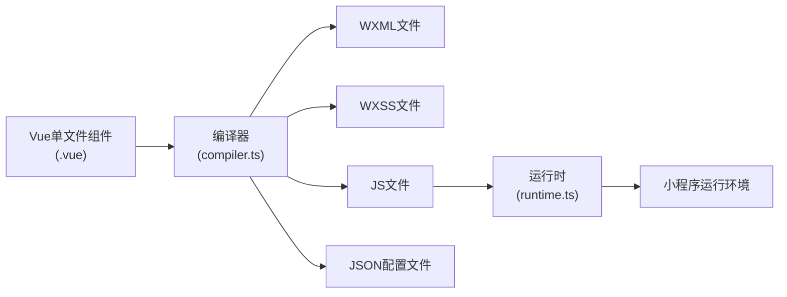
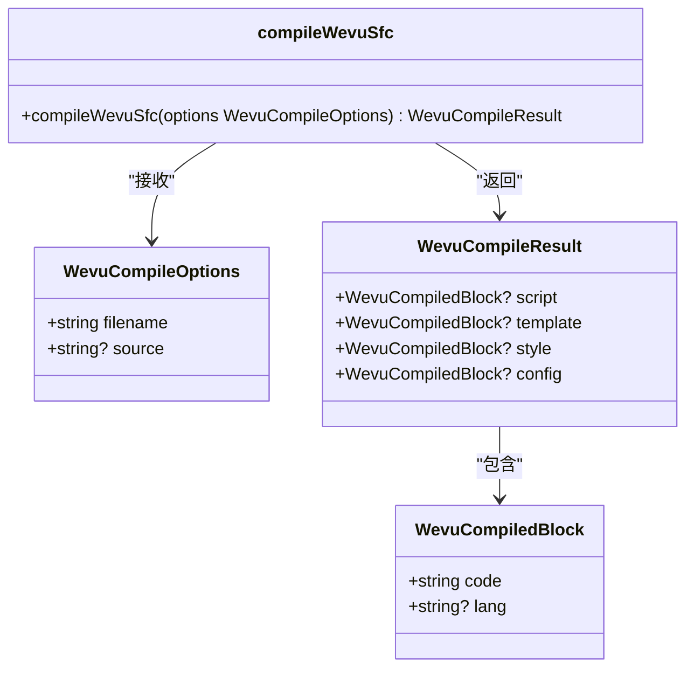
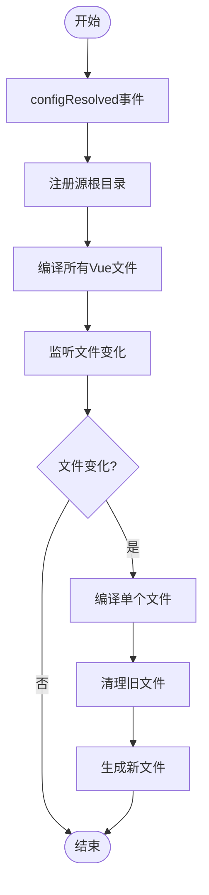
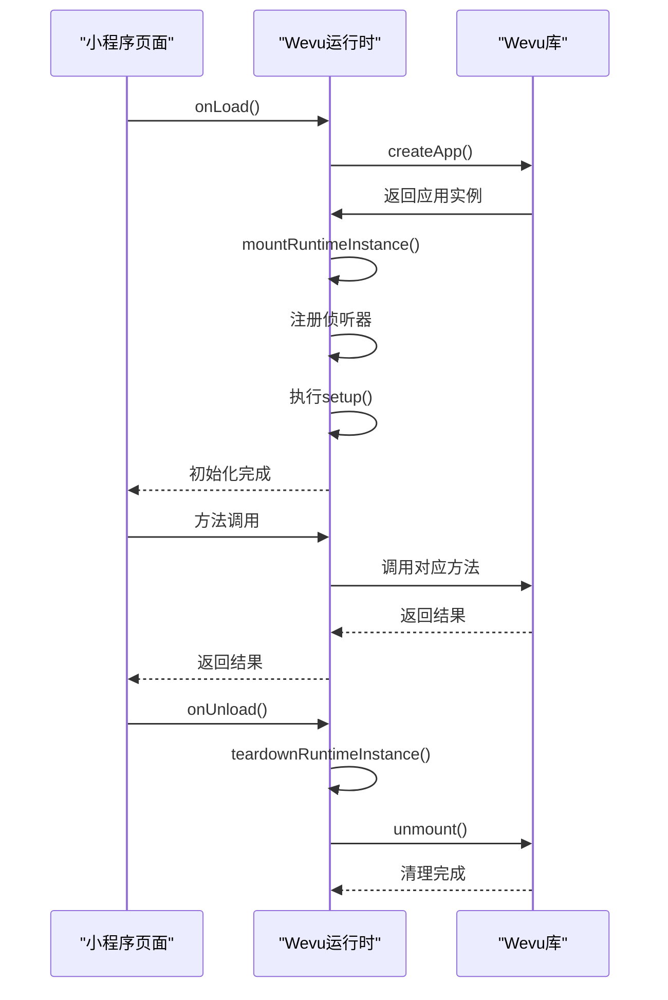
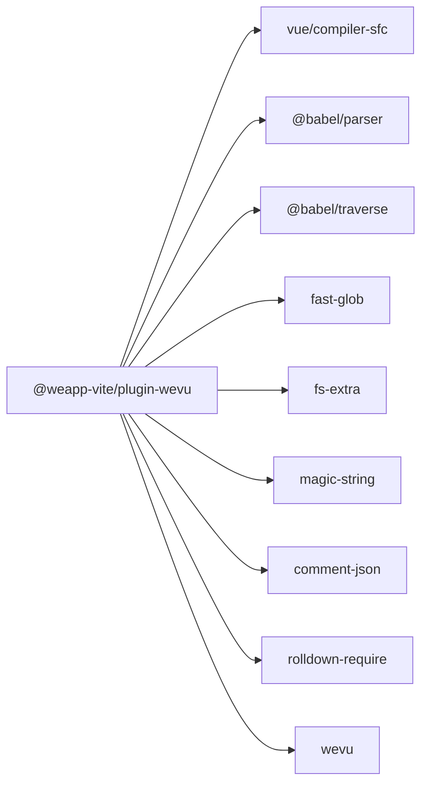

# Vue语法支持

<cite>
**本文档引用的文件**  
- [index.ts](file://packages/plugin-wevu/src/index.ts)
- [plugin.ts](file://packages/plugin-wevu/src/plugin.ts)
- [compiler.ts](file://packages/plugin-wevu/src/compiler.ts)
- [runtime.ts](file://packages/plugin-wevu/src/runtime.ts)
- [app.vue](file://apps/wevu-vue-demo/src/app.vue)
- [vite.config.ts](file://apps/wevu-vue-demo/vite.config.ts)
- [index.vue](file://apps/wevu-vue-demo/src/pages/wevu/index.vue)
- [config-ts/index.vue](file://apps/wevu-vue-demo/src/pages/config-ts/index.vue)
- [config-js/index.vue](file://apps/wevu-vue-demo/src/pages/config-js/index.vue)
- [case0.vue](file://packages/plugin-wevu/test/fixtures/case0.vue)
- [config-ts.vue](file://packages/plugin-wevu/test/fixtures/config-ts.vue)
</cite>

## 目录
1. [介绍](#介绍)
2. [项目结构](#项目结构)
3. [核心组件](#核心组件)
4. [架构概述](#架构概述)
5. [详细组件分析](#详细组件分析)
6. [依赖分析](#依赖分析)
7. [性能考虑](#性能考虑)
8. [故障排除指南](#故障排除指南)
9. [结论](#结论)

## 介绍
本文档深入解析`plugin-wevu`插件的实现原理和使用方法，为希望使用Vue语法开发小程序的开发者提供全面的技术指导。该插件允许开发者使用Vue风格的单文件组件（SFC）语法来开发微信小程序，将Vue语法转换为小程序原生语法。

## 项目结构
`plugin-wevu`插件位于`packages/plugin-wevu/`目录下，包含编译时和运行时两个主要部分。插件通过Vite构建系统集成，将Vue单文件组件转换为小程序原生代码。

```mermaid
graph TB
subgraph "plugin-wevu"
index["index.ts<br/>导出主要API"]
plugin["plugin.ts<br/>Vite插件实现"]
compiler["compiler.ts<br/>编译逻辑"]
runtime["runtime.ts<br/>运行时支持"]
end
index --> plugin
index --> compiler
index --> runtime
plugin --> compiler
runtime -.-> "小程序运行环境"
```

**图示来源**
- [index.ts](file://packages/plugin-wevu/src/index.ts)
- [plugin.ts](file://packages/plugin-wevu/src/plugin.ts)
- [compiler.ts](file://packages/plugin-wevu/src/compiler.ts)
- [runtime.ts](file://packages/plugin-wevu/src/runtime.ts)

**章节来源**
- [package.json](file://packages/plugin-wevu/package.json)

## 核心组件
`plugin-wevu`的核心功能由四个主要文件组成：`index.ts`提供公共API，`plugin.ts`实现Vite插件，`compiler.ts`处理编译逻辑，`runtime.ts`提供运行时支持。这些组件协同工作，将Vue语法转换为小程序可执行的代码。

**章节来源**
- [index.ts](file://packages/plugin-wevu/src/index.ts#L1-L5)
- [plugin.ts](file://packages/plugin-wevu/src/plugin.ts#L1-L313)
- [compiler.ts](file://packages/plugin-wevu/src/compiler.ts#L1-L284)
- [runtime.ts](file://packages/plugin-wevu/src/runtime.ts#L1-L344)

## 架构概述
`plugin-wevu`插件采用编译时转换和运行时支持相结合的架构。编译时，插件将Vue单文件组件转换为小程序原生文件（WXML、WXSS、JS、JSON）；运行时，通过`wevu`库提供Vue风格的响应式系统和组件生命周期管理。



**图示来源**
- [compiler.ts](file://packages/plugin-wevu/src/compiler.ts)
- [runtime.ts](file://packages/plugin-wevu/src/runtime.ts)

## 详细组件分析

### 编译器分析
`compiler.ts`文件实现了Vue单文件组件到小程序原生语法的转换逻辑。它解析Vue组件的各个部分（脚本、模板、样式、配置），并生成相应的小程序文件。

#### 编译器类图


**图示来源**
- [compiler.ts](file://packages/plugin-wevu/src/compiler.ts#L19-L34)

**章节来源**
- [compiler.ts](file://packages/plugin-wevu/src/compiler.ts#L1-L284)

### 插件分析
`plugin.ts`文件实现了Vite插件接口，负责在构建过程中调用编译器，并管理文件的生成和清理。

#### 插件工作流程


**图示来源**
- [plugin.ts](file://packages/plugin-wevu/src/plugin.ts)

**章节来源**
- [plugin.ts](file://packages/plugin-wevu/src/plugin.ts#L1-L313)

### 运行时分析
`runtime.ts`文件提供了运行时支持，实现了Vue风格的响应式系统、计算属性、侦听器和方法调用。

#### 运行时序列图


**图示来源**
- [runtime.ts](file://packages/plugin-wevu/src/runtime.ts)

**章节来源**
- [runtime.ts](file://packages/plugin-wevu/src/runtime.ts#L1-L344)

## 依赖分析
`plugin-wevu`依赖多个关键库来实现其功能，包括Vue编译器、Babel解析器、文件操作库等。



**图示来源**
- [package.json](file://packages/plugin-wevu/package.json#L63-L75)

**章节来源**
- [package.json](file://packages/plugin-wevu/package.json)

## 性能考虑
`plugin-wevu`在设计时考虑了性能优化，包括编译时缓存、增量编译和运行时优化。

- **编译时优化**：插件只在文件发生变化时重新编译，避免了全量编译的开销。
- **运行时开销**：通过`wevu`库的轻量级实现，最小化运行时的性能影响。
- **文件生成**：智能地清理旧文件，避免文件系统混乱。

## 故障排除指南
### 常见问题及解决方案

#### Vue语法兼容性问题
当使用不支持的Vue语法时，编译器会抛出错误。确保使用插件支持的Vue语法子集。

**章节来源**
- [compiler.ts](file://packages/plugin-wevu/src/compiler.ts#L263-L267)

#### 性能瓶颈
如果构建速度较慢，可以检查是否启用了不必要的文件监听或是否生成了过多的临时文件。

**章节来源**
- [plugin.ts](file://packages/plugin-wevu/src/plugin.ts#L274-L283)

#### 配置文件解析错误
当`<config>`块包含无效的JSON或JS代码时，编译器会抛出解析错误。确保配置语法正确。

**章节来源**
- [compiler.ts](file://packages/plugin-wevu/src/compiler.ts#L247-L250)

## 结论
`plugin-wevu`插件为使用Vue语法开发小程序提供了完整的解决方案。通过编译时转换和运行时支持，开发者可以享受Vue的开发体验，同时生成符合小程序规范的代码。该插件的设计考虑了性能、兼容性和易用性，是小程序开发的有力工具。